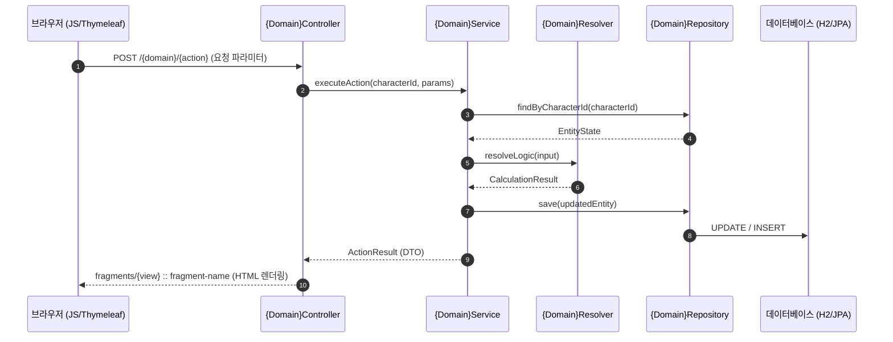

# Design Document: {기능명}

> **폴더 위치 가이드**: `.kiro/specs/{모듈명}/{3자리순번}-{기능명}/design.md`  
> **관련 규칙**: `rules/coding/code-style.md`, `rules/workflow/codegraph-first.md`

---

## 1. Overview (개요)

본 설계는 `{모듈명}` Web 모듈(`com.myapps.web.{모듈명}`)에 `{기능명}`을 구현하기 위한 상세 설계를 정의한다.

### 1.1. 핵심 설계 결정 및 트레이드오프
| 항목 / 대안 | 선택된 결정 | 근거 및 트레이드오프 | 관련 요구사항 |
|---|---|---|---|
| **{설계 이슈 1}** | {선택한 방식} | {선택 이유 및 고려한 대안} | Req 1.1, 1.2 |
| **{설계 이슈 2}** | {선택한 방식} | {선택 이유 및 성능/유지보수 이점} | Req 2.3 |
| **{영속화 방식}** | JPA Entity vs JSON | 변경되는 상태만 DB 저장, 고정 데이터는 JSON 관리 | Req 3.1 |

---

## 2. Architecture (시스템 아키텍처 및 계층 구조)

### 2.1. DDD 4계층 패키지 구조
```
{모듈명}/src/main/java/com/myapps/web/{모듈명}/
├── interfaces/
│   └── api/
│       ├── {Domain}Controller.java          # REST API 또는 Thymeleaf 컨트롤러
│       └── {Domain}ViewHelper.java          # 뷰 조립 및 가공 헬퍼
├── application/
│   ├── service/
│   │   ├── {Domain}Service.java             # 트랜잭션 오케스트레이션
│   │   └── {Catalog}CatalogService.java     # JSON 카탈로그 로더 및 검증
│   ├── dto/
│   │   ├── {Domain}View.java                # 뷰 렌더링용 불변 Record
│   │   └── {Action}Result.java              # 작업 결과 불변 Record (sealed)
│   └── exception/
│       └── {Domain}Exception.java           # 도메인 커스텀 예외
└── domain/
    ├── model/
    │   ├── {EntityName}.java                # JPA 엔티티 (@Entity, @Table)
    │   ├── {ValueObject}.java               # 불변 값 객체 (@Embeddable record)
    │   └── {EnumType}.java                  # 도메인 Enum
    ├── repository/
    │   └── {EntityName}Repository.java      # Spring Data JPA Repository
    └── service/
        ├── {Domain}Resolver.java            # 순수 도메인 계산 엔진
        └── {Domain}Policy.java              # 랭크/비용/성장 순수 정책
```

### 2.2. 요청 흐름 및 시퀀스 다이어그램


---

## 3. Components and Interfaces (세부 컴포넌트 설계)

### 3.1. Controller Layer (`interfaces/api`)
- **`{Domain}Controller.java`**:
  - `@Controller`, 생성자 주입 필수 (`@Autowired` 금지).
  - 엔드포인트 목록:
    - `GET /{domain}`: 메인 뷰 또는 프래그먼트 조회
    - `POST /{domain}/{action}`: 트랜잭션 요청 처리 및 부분 프래그먼트 반환

### 3.2. Application Layer (`application/service`, `application/dto`)
- **`{Domain}Service.java`**:
  - `@Service`, `@Transactional` 경계 설정.
  - 비즈니스 오케스트레이션(엔티티 로드 → 도메인 규칙 적용 → DB 영속화 → 뷰 모델 변환).

### 3.3. Domain Layer (`domain/model`, `domain/service`)
- **`{Domain}Resolver.java` / `{Domain}Policy.java`**:
  - 외부 의존성(I/O, DB)이 전혀 없는 **순수 함수(Pure Function)** 집합.
  - 입력값에 따른 결정론적 계산 또는 주입된 `Random` 기반 계산 수행 (PBT 프로퍼티 검증 대상).

### 3.4. Presentation Layer (`resources/templates`, `resources/static`)
- **`fragments/{view-name}.html`**:
  - Thymeleaf 프래그먼트 분리 (`th:fragment="..."`).
- **`static/js/{module}.js`**:
  - AJAX/fetch 호출 및 DOM 부분 교체 (`swapResponse`).
  - 불필요한 브라우저 `alert()` 지양, 하단 로그나 인게임 UI로 피드백 전달.
- **`static/css/{module}.css`**:
  - `:root` 디자인 토큰 활용, 색상 및 애니메이션 정의.

---

## 4. Data Models (데이터 모델 및 영속 스키마)

### 4.1. JPA 엔티티 (`@Entity`)
```java
@Entity
@Table(name = "{table_name}")
public class {EntityName} {

    @Id
    @GeneratedValue(strategy = GenerationType.IDENTITY)
    private Long id;

    @Column(name = "character_id", nullable = false)
    private long characterId;

    @Enumerated(EnumType.STRING)
    @Column(name = "status", nullable = false)
    private {StatusEnum} status;

    // Getter, Setter, Business Methods
}
```

### 4.2. DTO 및 Value Objects (`record`)
```java
public record {Domain}View(
        String name,
        int level,
        int currentHp,
        int maxHp,
        List<{SubItem}Dto> items,
        boolean isAvailable) {}
```

### 4.3. JSON 카탈로그 스키마 (`data/{catalog}.json`)
```json
[
  {
    "id": "example-id",
    "name": "예시 데이터",
    "multiplier": 100,
    "resourceCost": 10
  }
]
```

---

## 5. Correctness Properties (jqwik 검증용 불변 속성 명세)

*프로퍼티(Property)는 시스템의 모든 유효한 입력/상태에서 항상 참이어야 하는 보편적 불변식(Invariant)입니다.*

### Property 1: {프로퍼티 명칭 1}
*For any* 유효한 {입력 데이터}, {수행된 계산 결과}는 항상 {특정 제약 조건/범위} 내에 존재해야 한다.
- **Validates: Requirements X.Y, Z.W**

### Property 2: {프로퍼티 명칭 2 - 멱등성/가역성/단조성}
*For any* {초기 상태} 및 {작업 입력}, {상태 전이 규칙}은 {불변성}을 유지해야 한다.
- **Validates: Requirements A.B**

### Property 3: {예외 및 폴백 불변식}
*For any* {유효하지 않은 입력 또는 미지 식별자}에 대해, 시스템은 예외를 던지거나 안전한 기본값으로 폴백해야 하며 데이터 손상이 없어야 한다.
- **Validates: Requirements C.D**

---

## 6. Testing Strategy & Quality Guardrails (테스트 및 품질 검증 전략)

### 6.1. 테스트 계층
1. **단위 테스트 (Unit Tests)**: JUnit 5, Mockito 기반 서비스/엔티티 상태 검증.
2. **프로퍼티 기반 테스트 (PBT)**: jqwik (`@Property(tries = 100)`) 기반 순수 도메인 로직 및 경계값 검증.
3. **웹 슬라이스 테스트 (WebSlice Tests)**: `@WebMvcTest` 및 `MockMvc` 기반 엔드포인트/모델/HTML 응답 검증.

### 6.2. 5대 품질 가드레일 실행 명령어
```bash
mvn -B -q spotless:apply -pl {modulename} && (mvn -B clean install -pl {modulename} -am > /tmp/mvn.log 2>&1 || (tail -n 30 /tmp/mvn.log && exit 1)) && tail -n 12 /tmp/mvn.log && codegraph sync
```
