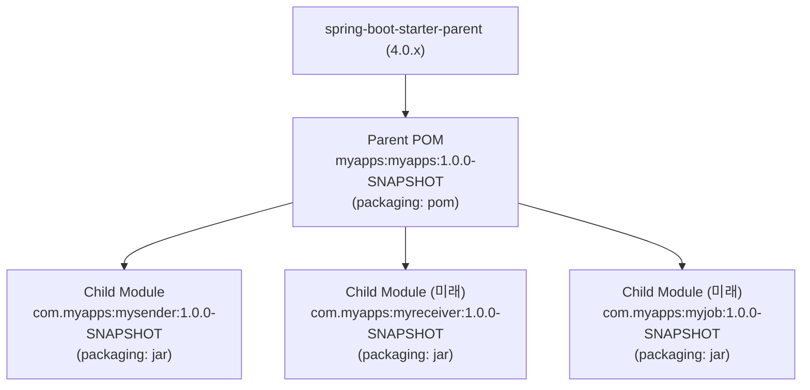
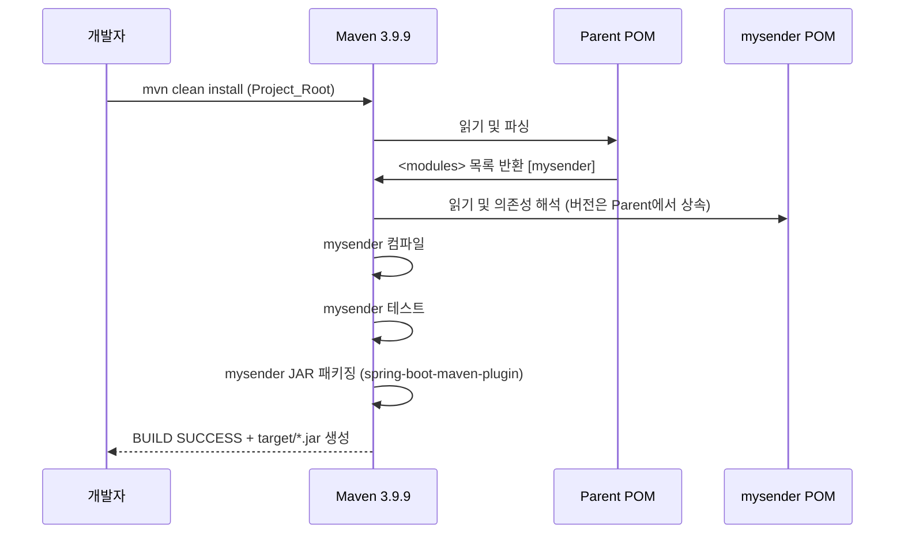

# Design Document: myapps-monorepo-setup

## Overview

이 문서는 단일 Git 레포지토리에서 Maven 멀티모듈 구조로 여러 Spring Boot 애플리케이션을 관리하기 위한 초기 프로젝트 설정의 기술 설계를 정의합니다.

### 목표

- **공통 설정 중앙화**: 버전, 플러그인, 의존성을 Parent POM 한 곳에서 관리
- **모듈 독립성**: 각 애플리케이션 모듈은 독립적으로 빌드·실행 가능
- **확장성**: 새 모듈 추가 시 기존 모듈에 영향 없이 Parent POM `<modules>`에만 추가
- **일관된 코드 컨벤션**: 모든 모듈이 동일한 Java 25 / Spring Boot 4.0.x 기준을 따름

### 기술 스택 요약

| 항목 | 값 |
|---|---|
| JDK | Java 25 |
| Build Tool | Apache Maven 3.9.9 |
| Framework | Spring Boot 4.0.x (Spring Framework 7.0.x) |
| 첫 번째 모듈 | `mysender` |
| groupId | `com.myapps` |

---

## Architecture

### 전체 디렉터리 구조

```
myapps/                            # Project_Root (Git 레포지토리 루트)
├── pom.xml                        # Parent POM (packaging: pom)
├── .gitignore                     # Git 추적 제외 설정
├── mysender/                      # 첫 번째 Child Module
│   ├── pom.xml                    # Child Module POM (Parent 상속)
│   └── src/
│       ├── main/
│       │   ├── java/
│       │   │   └── com/myapps/mysender/
│       │   │       └── MysenderApplication.java
│       │   └── resources/
│       │       └── application.yml
│       └── test/
│           └── java/
│               └── com/myapps/mysender/
│                   └── MysenderApplicationTest.java
└── .kiro/                         # Kiro 설정 디렉터리
```

### Maven 상속 관계



### 빌드 흐름



---

## Components and Interfaces

### 1. Parent POM (`pom.xml`)

모든 Child Module의 공통 설정을 중앙 관리하는 루트 POM 파일입니다.

**책임:**
- Spring Boot parent 상속 및 버전 관리
- Java 25 컴파일러 설정
- 공통 의존성 버전 중앙 관리 (`<dependencyManagement>`)
- 공통 플러그인 설정 (`<pluginManagement>`, `<build><plugins>`)
- Child Module 목록 선언 (`<modules>`)

**구조:**

```xml
<?xml version="1.0" encoding="UTF-8"?>
<project xmlns="http://maven.apache.org/POM/4.0.0"
         xmlns:xsi="http://www.w3.org/2001/XMLSchema-instance"
         xsi:schemaLocation="http://maven.apache.org/POM/4.0.0
         http://maven.apache.org/xsd/maven-4.0.0.xsd">
    <modelVersion>4.0.0</modelVersion>

    <parent>
        <groupId>org.springframework.boot</groupId>
        <artifactId>spring-boot-starter-parent</artifactId>
        <version>4.0.0</version>
        <relativePath/>
    </parent>

    <groupId>com.myapps</groupId>
    <artifactId>myapps</artifactId>
    <version>1.0.0-SNAPSHOT</version>
    <packaging>pom</packaging>

    <properties>
        <java.version>25</java.version>
    </properties>

    <modules>
        <module>mysender</module>
    </modules>

    <dependencyManagement>
        <dependencies>
            <!-- 공통 의존성 버전 중앙 관리 -->
            <!-- spring-boot-starter-parent가 BOM을 제공하므로
                 Spring Boot 관련 버전은 여기서 재선언 불필요 -->
        </dependencies>
    </dependencyManagement>

    <build>
        <pluginManagement>
            <plugins>
                <plugin>
                    <groupId>org.apache.maven.plugins</groupId>
                    <artifactId>maven-compiler-plugin</artifactId>
                    <configuration>
                        <source>${java.version}</source>
                        <target>${java.version}</target>
                    </configuration>
                </plugin>
            </plugins>
        </pluginManagement>
        <plugins>
            <plugin>
                <groupId>org.springframework.boot</groupId>
                <artifactId>spring-boot-maven-plugin</artifactId>
            </plugin>
        </plugins>
    </build>
</project>
```

**설계 결정 — `spring-boot-starter-parent` 사용 이유:**
`spring-boot-starter-parent`를 parent로 설정하면 Spring Boot BOM(Bill of Materials)을 상속받아 모든 Spring 관련 의존성 버전이 자동으로 정렬됩니다. 이로 인해 `<dependencyManagement>`에 Spring Boot 스타터 버전을 별도 선언하지 않아도 됩니다.

---

### 2. mysender Child Module POM (`mysender/pom.xml`)

`mysender` 애플리케이션 모듈의 Maven 설정 파일입니다.

**책임:**
- Parent POM 참조 선언
- 모듈 고유 artifactId 선언
- 모듈에 필요한 의존성 선언 (버전 없이)

**구조:**

```xml
<?xml version="1.0" encoding="UTF-8"?>
<project xmlns="http://maven.apache.org/POM/4.0.0"
         xmlns:xsi="http://www.w3.org/2001/XMLSchema-instance"
         xsi:schemaLocation="http://maven.apache.org/POM/4.0.0
         http://maven.apache.org/xsd/maven-4.0.0.xsd">
    <modelVersion>4.0.0</modelVersion>

    <parent>
        <groupId>com.myapps</groupId>
        <artifactId>myapps</artifactId>
        <version>1.0.0-SNAPSHOT</version>
    </parent>

    <artifactId>mysender</artifactId>
    <packaging>jar</packaging>

    <dependencies>
        <dependency>
            <groupId>org.springframework.boot</groupId>
            <artifactId>spring-boot-starter</artifactId>
        </dependency>
        <dependency>
            <groupId>org.springframework.boot</groupId>
            <artifactId>spring-boot-starter-test</artifactId>
            <scope>test</scope>
        </dependency>
    </dependencies>
</project>
```

**설계 결정 — `<groupId>`와 `<version>` 미선언:**
Child Module에서 `<groupId>`와 `<version>`은 Parent POM에서 상속되므로 재선언하지 않습니다. 이는 POM 컨벤션 가이드(`pom-conventions.md`)의 명시적 규칙이며, 중복 선언은 버전 드리프트(drift)를 유발할 수 있습니다.

---

### 3. MysenderApplication 메인 클래스

`mysender` 모듈의 Spring Boot 진입점 클래스입니다.

**위치:** `mysender/src/main/java/com/myapps/mysender/MysenderApplication.java`

```java
package com.myapps.mysender;

import org.springframework.boot.SpringApplication;
import org.springframework.boot.autoconfigure.SpringBootApplication;

@SpringBootApplication
public class MysenderApplication {

    public static void main(String[] args) {
        SpringApplication.run(MysenderApplication.class, args);
    }
}
```

**설계 결정 — 메인 클래스 패키지 위치:**
`@SpringBootApplication`은 해당 패키지(`com.myapps.mysender`) 이하를 컴포넌트 스캔 범위로 설정합니다. 따라서 모든 하위 패키지(`service`, `controller`, `repository` 등)의 빈이 자동으로 등록됩니다.

---

### 4. .gitignore

Maven 빌드 산출물 및 IDE 설정 파일을 Git 추적에서 제외하는 설정 파일입니다.

**위치:** `Project_Root/.gitignore`

**포함해야 할 패턴:**

| 카테고리 | 패턴 | 설명 |
|---|---|---|
| Maven 빌드 산출물 | `target/` | 컴파일 결과물, JAR 파일 등 |
| IntelliJ IDEA | `.idea/`, `*.iml` | IDE 프로젝트 설정 |
| Eclipse | `.classpath`, `.project`, `.settings/` | Eclipse 프로젝트 설정 |
| macOS | `.DS_Store` | macOS 메타데이터 파일 |
| Windows | `Thumbs.db` | Windows 썸네일 캐시 |

---

## Data Models

이 피처는 프로젝트 설정(파일 구조, POM 설정)을 다루는 것으로, 런타임 데이터 모델은 없습니다. 대신 Maven 멀티모듈 구조에서 사용하는 **POM 모델**을 정의합니다.

### POM 상속 모델

```
ParentPom {
    groupId:    "com.myapps"
    artifactId: "myapps"
    version:    "1.0.0-SNAPSHOT"
    packaging:  "pom"
    parent:     spring-boot-starter-parent:4.0.x
    properties: { java.version: "25" }
    modules:    ["mysender", ...]
    dependencyManagement: { ... }
    pluginManagement: { maven-compiler-plugin(source=25, target=25) }
    plugins:    { spring-boot-maven-plugin }
}

ChildModulePom {
    parent:     ParentPom
    artifactId: "{modulename}"   // 예: "mysender"
    packaging:  "jar"
    // groupId, version은 parent에서 상속 → 미선언
    dependencies: [
        spring-boot-starter (버전 없음),
        spring-boot-starter-test (버전 없음, scope=test)
    ]
}
```

### 모듈 확장 규칙

새 모듈 추가 시 변경되는 파일과 새로 생성되는 파일:

```
변경 대상:
  myapps/pom.xml  →  <modules>에 새 모듈명 추가만 허용

새로 생성:
  {modulename}/pom.xml
  {modulename}/src/main/java/com/myapps/{modulename}/{ModuleName}Application.java
  {modulename}/src/main/resources/application.yml
  {modulename}/src/test/java/com/myapps/{modulename}/{ModuleName}ApplicationTest.java

변경 금지:
  mysender/pom.xml  (기존 모듈 POM은 절대 수정하지 않음)
```

---

## Correctness Properties

이 피처는 **Maven 멀티모듈 프로젝트 설정(Infrastructure Configuration)** 에 해당합니다.

프리워크 분석 결과, 모든 수용 기준이 아래와 같이 분류되었습니다:

- **SMOKE**: 파일/디렉터리 존재 여부, POM packaging 타입, groupId 등 단일 설정 확인
- **EXAMPLE**: POM 구조 일관성(버전 재선언 금지, Parent 참조 정확성), compiler 설정 값 일치
- **INTEGRATION**: Maven 빌드 실행 결과(JAR 생성), Spring Boot 컨텍스트 로딩, git status 확인

**PBT 미적용 사유**: 이 피처의 모든 수용 기준은 선언적 설정(POM XML, .gitignore) 또는 외부 빌드 도구(Maven)의 동작을 검증합니다. 입력 변화에 따라 동작이 달라지는 순수 비즈니스 로직이 없으므로, 100회 반복 실행이 추가 버그를 발견하지 않습니다. 따라서 Property-Based Testing을 적용하지 않으며, 스모크 테스트·예시 기반 테스트·통합 테스트로 대체합니다.

### Property 0: 해당 없음 (PBT 미적용)

이 피처는 Maven 빌드 설정 및 파일 구조를 다루는 Infrastructure Configuration 성격으로, Property-Based Testing이 적용되지 않습니다. 입력 변화에 따라 동작이 달라지는 비즈니스 로직이 없으므로 스모크 테스트·예시 기반 테스트·통합 테스트로 대체합니다. 상세 테스트 전략은 Testing Strategy 섹션을 참고하세요.

**Validates: Requirements 1.1, 1.2, 1.3, 1.4, 1.5, 1.6, 1.7, 2.1, 2.2, 2.3, 2.4, 2.5, 2.6, 2.7, 3.1, 3.2, 3.3, 3.4, 4.1, 4.2, 4.3, 4.4, 4.5, 5.1, 5.2, 5.3, 5.4, 5.5, 6.1, 6.2, 6.3** (스모크/예시/통합 테스트로 대체)

---

## Error Handling

### 빌드 실패 시나리오

| 실패 원인 | Maven 동작 | 개발자 조치 |
|---|---|---|
| Child Module 컴파일 오류 | 오류 메시지 출력 후 전체 빌드 중단 (BUILD FAILURE) | 오류 클래스 수정 후 재빌드 |
| Child Module에 `<version>` 재선언 | 버전 충돌 경고 또는 오류 | Child POM에서 `<version>` 태그 제거 |
| Parent POM에 `<modules>`에 모듈 미등록 | 해당 모듈은 빌드에서 제외 | Parent POM `<modules>`에 모듈명 추가 |
| `spring-boot-maven-plugin` 미선언 | 실행 가능 JAR 미생성 (단순 JAR만 생성) | Parent POM `<build><plugins>`에 플러그인 추가 |
| Java 버전 불일치 | 컴파일 오류 또는 경고 | `JAVA_HOME` 환경변수 및 `java.version` 프로퍼티 확인 |

### Child Module 격리 원칙

새 모듈 추가 또는 기존 모듈 빌드 실패 시:
- **격리된 빌드**: `mvn clean install -pl {modulename}` 으로 해당 모듈만 단독 빌드 가능
- **다른 모듈 무영향**: 한 모듈의 빌드 실패가 다른 모듈의 소스코드에 영향을 주지 않음
- **Parent POM 단일 수정점**: 새 모듈 추가 시 Parent POM의 `<modules>` 섹션만 수정

---

## Testing Strategy

이 피처는 Maven 빌드 설정 및 프로젝트 파일 구조를 다루므로, 전통적인 단위 테스트보다는 **빌드 검증 테스트**와 **스모크 테스트**가 핵심입니다.

### 1. 스모크 테스트 (Smoke Tests)

설정의 유효성을 단일 실행으로 확인하는 테스트입니다.

| 테스트 항목 | 검증 명령/방법 | 기대 결과 |
|---|---|---|
| Parent POM 유효성 | `mvn validate` (루트) | BUILD SUCCESS |
| 전체 프로젝트 빌드 | `mvn clean install` (루트) | BUILD SUCCESS, 각 모듈 JAR 생성 |
| mysender 단독 빌드 | `mvn clean install -pl mysender` | BUILD SUCCESS |
| mysender JAR 실행 | `java -jar mysender/target/mysender-*.jar` | Spring Boot 애플리케이션 정상 기동 |
| .gitignore 동작 확인 | `git status` (target/ 존재 시) | target/ 미추적 확인 |

### 2. 구조 검증 테스트 (Structure Validation)

프로젝트 파일 구조가 요구사항에 맞게 생성되었는지 확인합니다.

**디렉터리 및 파일 존재 여부:**
- `pom.xml` (루트) 존재
- `mysender/pom.xml` 존재
- `mysender/src/main/java/com/myapps/mysender/MysenderApplication.java` 존재
- `mysender/src/main/resources/` 존재
- `mysender/src/test/java/` 존재
- `.gitignore` (루트) 존재

**POM XML 구조 검증:**
- Parent POM의 `<packaging>` = `pom`
- Parent POM의 `<java.version>` = `25`
- Parent POM에 `spring-boot-maven-plugin` 선언 여부
- Child POM에 `<groupId>`, `<version>` 미선언 여부
- Child POM에 의존성 `<version>` 태그 미포함 여부

### 3. Spring Boot 통합 테스트

`mysender` 모듈의 Spring Boot 컨텍스트 로딩을 검증하는 JUnit 5 테스트입니다.

**위치:** `mysender/src/test/java/com/myapps/mysender/MysenderApplicationTest.java`

```java
package com.myapps.mysender;

import org.junit.jupiter.api.Test;
import org.springframework.boot.test.context.SpringBootTest;

@SpringBootTest
class MysenderApplicationTest {

    @Test
    void contextLoads() {
        // Spring ApplicationContext가 오류 없이 로드되는지 검증
    }
}
```

이 테스트는 `mvn test` 시 자동 실행되며, Spring Boot 자동 설정 및 빈 초기화 오류를 조기에 감지합니다.

### 4. 새 모듈 추가 확장성 검증

새 모듈(`myreceiver` 등) 추가 후 다음을 수동 검증합니다:

1. `mvn clean install` (루트) → BUILD SUCCESS
2. 기존 `mysender/pom.xml` 파일 내용 변경 없음 확인 (`git diff mysender/pom.xml`)
3. `mvn clean install -pl myreceiver` → 새 모듈 단독 빌드 성공

### PBT 미적용 사유

이 피처는 다음 이유로 Property-Based Testing을 적용하지 않습니다:
- **설정 파일 구조**: POM XML, `.gitignore`는 선언적 설정이며, 입력 변화에 따른 동작 변화가 없음
- **외부 도구 의존**: 빌드 성공 여부는 Maven의 동작이며, 100회 반복이 새로운 버그를 발견하지 않음
- **일회성 검증**: 파일 존재 여부, packaging 타입 등은 단일 실행으로 충분히 검증됨
- 대신 스모크 테스트와 통합 테스트(`@SpringBootTest`)가 더 높은 가치를 제공함
