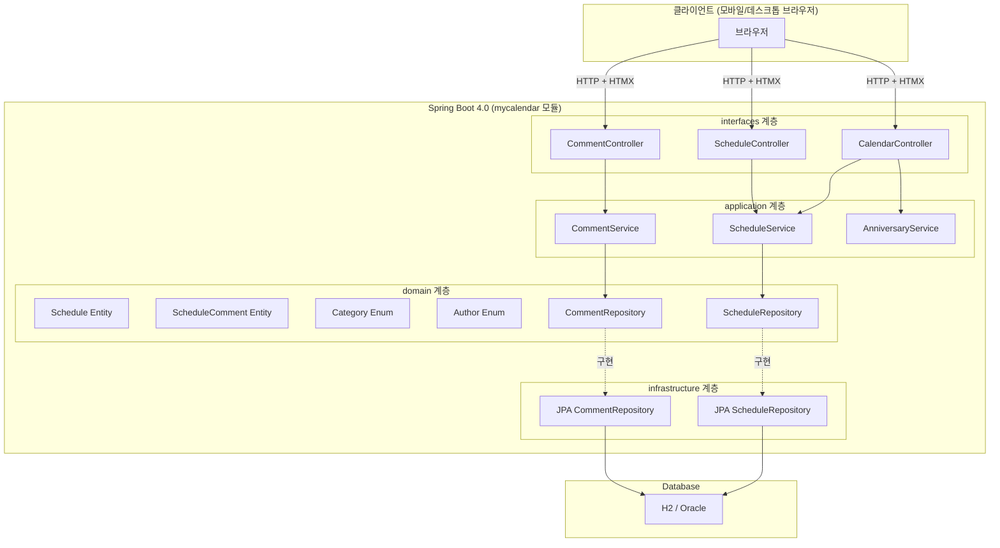
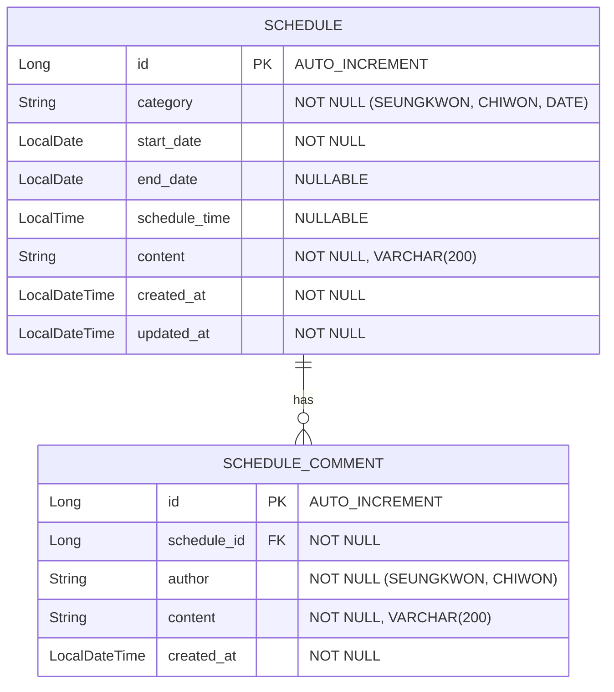

# Design Document

## Overview

커플 일정 관리 웹 애플리케이션(mycalendar)의 기술 설계를 정의합니다. 두 사용자(승권, 치원)가 인증 없이 접근하여 일정 CRUD, 댓글, D-Day/기념일 카운터 기능을 사용하는 모바일 우선 캘린더입니다.

### 설계 결정 요약

| 결정 항목 | 선택 | 근거 |
|---|---|---|
| 렌더링 방식 | Thymeleaf SSR + HTMX | 모바일 우선 빠른 초기 로드, SPA 복잡성 회피 |
| DB (개발) | H2 In-Memory | 빠른 로컬 개발 사이클, JPA DDL-Auto 활용 |
| DB (운영) | Oracle Cloud (기존 인프라) | Parent POM 공통 의존성 활용 |
| 기념일 계산 | 순수 도메인 서비스 | DB 조회 없이 Base_Date 상수 기반 런타임 계산 |
| 인증 | 없음 | 요구사항 명시 — 두 사람 전용 비공개 앱 |
| 스와이프 | Hammer.js 라이브러리 | 모바일 터치 제스처 지원 |

## Architecture

### 시스템 아키텍처



### DDD 계층 구조

```
com.myapps.web.mycalendar/
├── MycalendarApplication.java
├── domain/
│   ├── model/
│   │   ├── Schedule.java              (JPA Entity)
│   │   ├── ScheduleComment.java       (JPA Entity)
│   │   ├── Category.java              (Enum: SEUNGKWON, CHIWON, DATE)
│   │   └── Author.java                (Enum: SEUNGKWON, CHIWON)
│   ├── repository/
│   │   ├── ScheduleRepository.java    (인터페이스)
│   │   └── CommentRepository.java     (인터페이스)
│   └── service/
│       └── AnniversaryCalculator.java  (도메인 서비스 — 순수 계산)
├── application/
│   ├── service/
│   │   ├── ScheduleService.java       (일정 CRUD 유스케이스)
│   │   └── CommentService.java        (댓글 CRUD 유스케이스)
│   └── dto/
│       ├── ScheduleCreateCommand.java  (record)
│       ├── ScheduleUpdateCommand.java  (record)
│       ├── ScheduleResponse.java       (record)
│       ├── CommentCreateCommand.java   (record)
│       ├── CommentUpdateCommand.java   (record)
│       └── CommentResponse.java        (record)
├── infrastructure/
│   ├── persistence/
│   │   ├── JpaScheduleRepository.java (Spring Data JPA)
│   │   └── JpaCommentRepository.java  (Spring Data JPA)
│   └── config/
│       └── JpaConfig.java             (JPA 설정)
└── interfaces/
    ├── api/
    │   ├── CalendarController.java    (월별 뷰 + 기념일)
    │   ├── ScheduleController.java    (일정 CRUD)
    │   ├── CommentController.java     (댓글 CRUD)
    │   └── GlobalExceptionHandler.java
    └── dto/
        ├── ScheduleForm.java          (record — 폼 바인딩)
        └── CommentForm.java           (record — 폼 바인딩)
```

## Components and Interfaces

### Domain Layer

#### Schedule (JPA Entity)

일정을 나타내는 핵심 도메인 엔티티입니다.

```java
@Entity
@Table(name = "schedule")
public class Schedule {
    @Id @GeneratedValue(strategy = GenerationType.IDENTITY)
    private Long id;

    @Enumerated(EnumType.STRING)
    @Column(nullable = false)
    private Category category;

    @Column(name = "start_date", nullable = false)
    private LocalDate startDate;

    @Column(name = "end_date")
    private LocalDate endDate;

    @Column(name = "schedule_time")
    private LocalTime scheduleTime;

    @Column(nullable = false, length = 200)
    private String content;

    @Column(name = "created_at", nullable = false, updatable = false)
    private LocalDateTime createdAt;

    @Column(name = "updated_at", nullable = false)
    private LocalDateTime updatedAt;

    @OneToMany(mappedBy = "schedule", cascade = CascadeType.ALL, orphanRemoval = true)
    private List<ScheduleComment> comments = new ArrayList<>();
}
```

#### ScheduleComment (JPA Entity)

일정에 대한 댓글 엔티티입니다.

```java
@Entity
@Table(name = "schedule_comment")
public class ScheduleComment {
    @Id @GeneratedValue(strategy = GenerationType.IDENTITY)
    private Long id;

    @ManyToOne(fetch = FetchType.LAZY)
    @JoinColumn(name = "schedule_id", nullable = false)
    private Schedule schedule;

    @Enumerated(EnumType.STRING)
    @Column(nullable = false)
    private Author author;

    @Column(nullable = false, length = 200)
    private String content;

    @Column(name = "created_at", nullable = false, updatable = false)
    private LocalDateTime createdAt;
}
```

#### Category (Enum)

```java
public enum Category {
    SEUNGKWON, CHIWON, DATE
}
```

#### Author (Enum)

```java
public enum Author {
    SEUNGKWON, CHIWON
}
```

#### AnniversaryCalculator (도메인 서비스)

Base_Date를 기준으로 기념일과 D-Day를 계산하는 순수 도메인 서비스입니다. DB 조회 없이 상수만 사용합니다.

```java
@Service
public class AnniversaryCalculator {
    private static final LocalDate BASE_DATE = LocalDate.of(2026, 6, 17);

    /** 한국식 D-Day 계산 (Base_Date를 1일로 산정) */
    public long calculateDDay(final LocalDate today) { ... }

    /** 100일 단위 기념일 목록 (100일 ~ 1000일) */
    public List<Anniversary> calculateHundredDayAnniversaries() { ... }

    /** 연 단위 기념일 목록 (1주년 ~ 10주년) */
    public List<Anniversary> calculateYearlyAnniversaries() { ... }

    /** 특정 월에 포함되는 기념일 목록 */
    public List<Anniversary> getAnniversariesForMonth(final YearMonth yearMonth) { ... }
}
```

`Anniversary`는 기념일 날짜와 이름을 담는 record입니다:

```java
public record Anniversary(LocalDate date, String name) {}
```

### Application Layer

#### ScheduleService

일정 생성/조회/수정/삭제 유스케이스를 오케스트레이션합니다.

| 메서드 | 설명 |
|---|---|
| `create(ScheduleCreateCommand)` | 유효성 검증 후 일정 저장 |
| `findById(Long)` | ID로 일정 조회 |
| `findByMonth(YearMonth)` | 특정 월의 모든 일정 조회 (Multi_Day 포함) |
| `update(Long, ScheduleUpdateCommand)` | 유효성 검증 후 일정 수정 |
| `delete(Long)` | 일정 및 연관 댓글 삭제 |

#### CommentService

댓글 생성/수정/삭제 유스케이스를 오케스트레이션합니다.

| 메서드 | 설명 |
|---|---|
| `create(Long scheduleId, CommentCreateCommand)` | 유효성 검증 후 댓글 저장 |
| `findByScheduleId(Long)` | 일정의 모든 댓글 시간순 조회 |
| `update(Long commentId, CommentUpdateCommand)` | 유효성 검증 후 댓글 수정 |
| `delete(Long commentId)` | 댓글 삭제 |

### Interfaces Layer

#### CalendarController

월별 캘린더 뷰를 렌더링합니다. Thymeleaf 템플릿에 일정 + 기념일 데이터를 전달합니다.

| Endpoint | Method | 설명 |
|---|---|---|
| `/` | GET | 현재 월 캘린더 뷰 (리다이렉트) |
| `/calendar/{year}/{month}` | GET | 특정 월 캘린더 뷰 |

#### ScheduleController

일정 CRUD를 처리합니다. HTMX 부분 렌더링을 지원합니다.

| Endpoint | Method | 설명 |
|---|---|---|
| `/schedules/{id}` | GET | 일정 상세 조회 |
| `/schedules/new` | GET | 일정 생성 폼 |
| `/schedules` | POST | 일정 생성 처리 |
| `/schedules/{id}/edit` | GET | 일정 수정 폼 |
| `/schedules/{id}` | PUT | 일정 수정 처리 |
| `/schedules/{id}` | DELETE | 일정 삭제 처리 |

#### CommentController

댓글 CRUD를 처리합니다.

| Endpoint | Method | 설명 |
|---|---|---|
| `/schedules/{scheduleId}/comments` | POST | 댓글 생성 |
| `/comments/{id}/edit` | GET | 댓글 수정 폼 |
| `/comments/{id}` | PUT | 댓글 수정 처리 |
| `/comments/{id}` | DELETE | 댓글 삭제 |

### Infrastructure Layer

#### Repository 구현

Spring Data JPA 인터페이스를 사용합니다.

```java
public interface ScheduleRepository extends JpaRepository<Schedule, Long> {
    /** start_date 또는 end_date 범위가 해당 월과 겹치는 일정 조회 */
    @Query("SELECT s FROM Schedule s WHERE s.startDate <= :endOfMonth AND (s.endDate >= :startOfMonth OR (s.endDate IS NULL AND s.startDate >= :startOfMonth AND s.startDate <= :endOfMonth))")
    List<Schedule> findByMonth(@Param("startOfMonth") LocalDate startOfMonth,
                               @Param("endOfMonth") LocalDate endOfMonth);
}

public interface CommentRepository extends JpaRepository<ScheduleComment, Long> {
    List<ScheduleComment> findByScheduleIdOrderByCreatedAtAsc(Long scheduleId);
}
```

## Data Models

### ERD



### DTO Records

```java
/** 일정 생성 커맨드. */
public record ScheduleCreateCommand(
    Category category,
    LocalDate startDate,
    LocalDate endDate,
    LocalTime scheduleTime,
    String content
) {}

/** 일정 수정 커맨드. */
public record ScheduleUpdateCommand(
    Category category,
    LocalDate startDate,
    LocalDate endDate,
    LocalTime scheduleTime,
    String content
) {}

/** 일정 조회 응답. */
public record ScheduleResponse(
    Long id,
    Category category,
    LocalDate startDate,
    LocalDate endDate,
    LocalTime scheduleTime,
    String content,
    LocalDateTime createdAt,
    LocalDateTime updatedAt,
    List<CommentResponse> comments
) {}

/** 댓글 생성 커맨드. */
public record CommentCreateCommand(
    Author author,
    String content
) {}

/** 댓글 수정 커맨드. */
public record CommentUpdateCommand(
    String content
) {}

/** 댓글 조회 응답. */
public record CommentResponse(
    Long id,
    Author author,
    String content,
    LocalDateTime createdAt
) {}
```

### Anniversary (값 객체)

```java
/** 기념일 정보를 담는 값 객체. */
public record Anniversary(
    LocalDate date,
    String name
) {}
```


## Correctness Properties

*A property is a characteristic or behavior that should hold true across all valid executions of a system — essentially, a formal statement about what the system should do. Properties serve as the bridge between human-readable specifications and machine-verifiable correctness guarantees.*

### Property 1: Schedule creation round-trip

*For any* valid ScheduleCreateCommand (valid category, non-blank content ≤ 200자, valid startDate, endDate == null 또는 endDate >= startDate), 일정을 생성한 후 ID로 조회하면 모든 필드 값(category, startDate, endDate, scheduleTime, content)이 원본 커맨드와 동일해야 한다.

**Validates: Requirements 2.2, 2.3, 2.4, 3.1**

### Property 2: Content length validation

*For any* content 문자열의 길이가 200자를 초과하면, 일정 생성/수정 및 댓글 생성/수정 모두에서 해당 요청을 거부하고 유효성 검증 오류를 반환해야 한다.

**Validates: Requirements 2.5, 4.3, 6.4, 7.5**

### Property 3: Required field validation

*For any* 일정 생성 또는 수정 커맨드에서 필수 필드(category, startDate, content) 중 하나라도 null이거나 비어있으면, 해당 요청을 거부하고 유효성 검증 오류를 반환해야 한다.

**Validates: Requirements 2.6, 4.6**

### Property 4: Date range validation

*For any* endDate가 null이 아닌 일정 생성 또는 수정 커맨드에서 endDate가 startDate보다 이전(strictly before)이면, 해당 요청을 거부하고 날짜 범위 오류를 반환해야 한다.

**Validates: Requirements 2.7, 4.4**

### Property 5: Whitespace content rejection

*For any* 공백 문자(스페이스, 탭, 개행 등)로만 구성된 content 문자열에 대해, 일정 생성/수정 및 댓글 생성/수정 모두에서 해당 요청을 거부하고 유효성 검증 오류를 반환해야 한다.

**Validates: Requirements 2.9, 6.6, 7.6**

### Property 6: Monthly schedule query overlap

*For any* 일정 집합과 조회 대상 YearMonth에 대해, 월별 조회 결과는 startDate ≤ 월말 AND (endDate ≥ 월초 OR (endDate IS NULL AND startDate가 해당 월 범위 내))인 일정과 정확히 일치해야 한다.

**Validates: Requirements 3.2, 3.3**

### Property 7: Schedule cascade delete

*For any* N개의 댓글(N ≥ 0)을 가진 일정을 삭제하면, 해당 일정과 연관된 모든 N개의 댓글이 데이터베이스에서 완전히 제거되어야 한다.

**Validates: Requirements 5.2**

### Property 8: Comment ordering

*For any* 일정에 달린 댓글 목록을 조회하면, 결과는 createdAt 기준 오름차순으로 정렬되어야 한다. 즉, 목록의 각 연속된 두 댓글에 대해 앞선 댓글의 createdAt ≤ 뒤따르는 댓글의 createdAt이어야 한다.

**Validates: Requirements 6.3**

### Property 9: Anniversary date calculation

*For any* N ∈ {100, 200, 300, ..., 1000}에 대해, N일 기념일의 날짜는 BASE_DATE + (N - 1)일이어야 한다 (한국식 1일 산정). *For any* Y ∈ {1, 2, ..., 10}에 대해, Y주년 기념일의 날짜는 BASE_DATE.plusYears(Y)이어야 한다.

**Validates: Requirements 8.1, 8.5, 8.6**

### Property 10: Korean D-Day calculation

*For any* 날짜 D (D ≥ BASE_DATE)에 대해, D-Day 값은 ChronoUnit.DAYS.between(BASE_DATE, D) + 1과 같아야 한다 (BASE_DATE 자체가 1일).

**Validates: Requirements 8.2**

### Property 11: D-Day display format

*For any* 날짜 D (D ≥ BASE_DATE)에 대해, D-Day 카운터 표시 문자열은 "D+" 접두사에 정확한 경과 일수(한국식)를 붙인 형식이어야 한다.

**Validates: Requirements 8.4**

### Property 12: Anniversary month filtering

*For any* YearMonth에 대해, 해당 월의 기념일 목록은 전체 기념일 중 날짜가 해당 월 범위(1일 ~ 말일) 내에 포함되는 기념일과 정확히 일치해야 한다.

**Validates: Requirements 8.3**

### Property 13: Schedule update timestamp refresh

*For any* 유효한 수정 커맨드를 기존 일정에 적용하면, 수정 후 일정의 updatedAt은 수정 전 updatedAt보다 같거나 이후여야 한다.

**Validates: Requirements 4.2**

### Property 14: Calendar day cell display limit

*For any* 날짜에 N개의 일정이 있을 때, 캘린더 날짜 셀에 표시되는 일정 수는 min(N, 3)이어야 하고, N > 3이면 "+{N-3}" 형식의 초과 텍스트를 표시해야 한다.

**Validates: Requirements 1.4**

## Error Handling

### 예외 계층 구조

| 예외 클래스 | HTTP 상태 | 설명 |
|---|---|---|
| `ScheduleNotFoundException` | 404 | 일정 ID에 해당하는 일정이 없을 때 |
| `CommentNotFoundException` | 404 | 댓글 ID에 해당하는 댓글이 없을 때 |
| `InvalidScheduleException` | 400 | 일정 유효성 검증 실패 (필수 필드 누락, 글자 수 초과, 날짜 범위 오류 등) |
| `InvalidCommentException` | 400 | 댓글 유효성 검증 실패 (내용 누락, 글자 수 초과, 작성자 미선택 등) |

### 전역 예외 처리

`@ControllerAdvice`를 사용한 `GlobalExceptionHandler`에서 모든 비즈니스 예외를 처리합니다.

```java
@ControllerAdvice
public class GlobalExceptionHandler {

    @ExceptionHandler(ScheduleNotFoundException.class)
    public String handleScheduleNotFound(final ScheduleNotFoundException ex, final Model model) {
        model.addAttribute("errorMessage", ex.getMessage());
        return "error";
    }

    @ExceptionHandler(InvalidScheduleException.class)
    public String handleInvalidSchedule(final InvalidScheduleException ex, final Model model) {
        model.addAttribute("errorMessage", ex.getMessage());
        return "error";
    }

    // CommentNotFoundException, InvalidCommentException 동일 패턴
}
```

### 유효성 검증 규칙 요약

| 대상 | 검증 규칙 | 오류 메시지 |
|---|---|---|
| content | null/공백만 불가, 최대 200자 | "내용을 입력해주세요" / "200자를 초과할 수 없습니다" |
| category | SEUNGKWON, CHIWON, DATE 중 하나 | "유효하지 않은 카테고리입니다" |
| startDate | null 불가 | "시작 날짜를 입력해주세요" |
| endDate | null 허용, 입력 시 startDate 이후여야 함 | "종료 날짜는 시작 날짜 이후여야 합니다" |
| author (댓글) | SEUNGKWON, CHIWON 중 하나 | "작성자를 선택해주세요" |

## Testing Strategy

### 테스트 프레임워크

| 도구 | 용도 |
|---|---|
| JUnit 5 | 단위 테스트, 통합 테스트 |
| jqwik 1.9.3 | Property-Based Testing |
| Mockito | Mock 객체 생성 (`Mockito.mock()` 사용) |
| H2 Database | `@DataJpaTest` 슬라이스 테스트 |
| Spring Boot 4.0 WebMvcTest | 컨트롤러 슬라이스 테스트 |

### 테스트 계층 구분

| 계층 | 테스트 유형 | 대상 |
|---|---|---|
| Domain | Property-Based 테스트 | AnniversaryCalculator (Property 9, 10, 11, 12) |
| Application | Property-Based 테스트 + 단위 테스트 | ScheduleService (Property 1–7, 13), CommentService (Property 2, 5, 8) |
| Infrastructure | `@DataJpaTest` 슬라이스 테스트 | Repository 쿼리 검증 (Property 6) |
| Interfaces | `@WebMvcTest` 슬라이스 테스트 | 컨트롤러 요청/응답 + 폼 바인딩 (Property 14) |

### Property-Based Testing 설정

- 라이브러리: **jqwik 1.9.3** (Parent POM `<dependencyManagement>`에서 버전 관리)
- 최소 반복 횟수: `@Property(tries = 100)`
- Mock 사용: `Mockito.mock()` 직접 호출 (jqwik 엔진과 호환)
- 태그 형식: `// Feature: mycalendar/001-couple-calendar, Property {N}: {title}`

### Property 테스트 클래스 매핑

| 테스트 클래스 | 대상 Property |
|---|---|
| `AnniversaryCalculatorPropertyTest` | Property 9, 10, 11, 12 |
| `ScheduleServicePropertyTest` | Property 1, 2, 3, 4, 5, 6, 7, 13 |
| `CommentServicePropertyTest` | Property 2, 5, 8 |
| `CalendarViewPropertyTest` | Property 14 |

### 단위 테스트 (Example-Based)

| 테스트 클래스 | 검증 항목 |
|---|---|
| `ScheduleServiceTest` | 일정 CRUD 정상 동작, 삭제 확인, 존재하지 않는 ID 처리 |
| `CommentServiceTest` | 댓글 CRUD 정상 동작, 존재하지 않는 대상 처리 |
| `CalendarControllerTest` | 월별 뷰 모델 데이터, 월 이동, 폼 표시 |
| `ScheduleControllerTest` | 일정 생성/수정/삭제 HTTP 요청 처리 |
| `CommentControllerTest` | 댓글 생성/수정/삭제 HTTP 요청 처리 |

### 통합 테스트

| 테스트 클래스 | 검증 항목 |
|---|---|
| `ScheduleRepositoryTest` | 월별 조회 쿼리 (Multi_Day_Schedule 포함), cascade 삭제 |
| `MycalendarApplicationTest` | 애플리케이션 컨텍스트 로드 |
