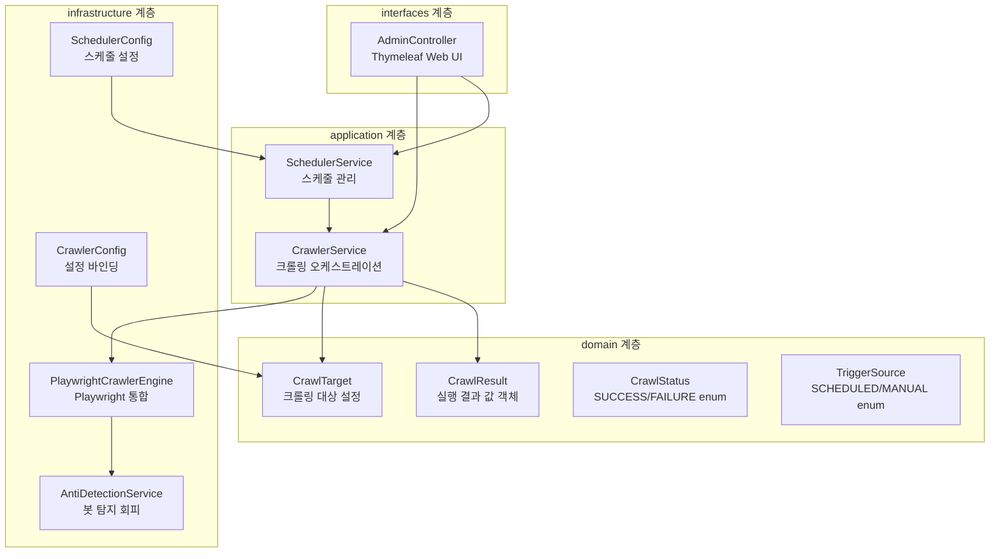

# Design Document

## Overview

mycrawler 모듈은 Playwright Java를 활용한 웹 크롤링 엔진을 핵심으로 하는 Spring Boot 웹 애플리케이션이다. DDD 계층 구조를 따르며, 스케줄 기반 자동 실행과 Thymeleaf 기반 Admin UI를 통한 수동 실행을 지원한다.

주요 설계 결정:
- **크롤링 엔진**: Playwright Java(`com.microsoft.playwright:playwright`)를 사용하여 headless Chromium으로 JavaScript 렌더링이 필요한 페이지를 크롤링
- **안티 디텍션**: User-Agent 랜덤화, 랜덤 딜레이, 마우스/스크롤 시뮬레이션, viewport 랜덤화, navigator.webdriver 제거 등 다층 방어 전략
- **스케줄링**: Spring의 `SchedulingConfigurer`를 통한 동적 cron 설정 (재시작 없이 다음 트리거부터 적용)
- **데이터 저장**: DB 영속화 없이 in-memory `ConcurrentLinkedDeque`로 최근 20건만 유지
- **포트**: 8081 (deployment.md 포트 규칙에 따라 mystudy:8080 다음)

## Architecture



### 계층별 책임

| 계층 | 책임 | 주요 컴포넌트 |
|------|------|--------------|
| interfaces | HTTP 요청 처리, 화면 렌더링 | AdminController |
| application | 유스케이스 오케스트레이션, 스케줄 관리 | CrawlerService, SchedulerService |
| domain | 핵심 도메인 모델 정의 | CrawlResult, CrawlTarget, CrawlStatus, TriggerSource |
| infrastructure | 외부 기술 통합 (Playwright, 설정) | PlaywrightCrawlerEngine, AntiDetectionService, CrawlerConfig, SchedulerConfig |

## Components and Interfaces

### 1. PlaywrightCrawlerEngine (infrastructure/crawler)

Playwright Java를 사용한 크롤링 실행 엔진. 애플리케이션 시작 시 Playwright 인스턴스를 초기화하고, 요청마다 브라우저 컨텍스트를 생성/폐기한다.

```java
public interface CrawlerEngine {
    CrawlResult crawl(CrawlTarget target);
}
```

**설계 결정**:
- Browser 인스턴스는 싱글톤으로 유지 (비용 절감), BrowserContext는 요청마다 새로 생성 (격리)
- 타임아웃 30초 (`page.navigate()` 옵션)
- 실패 시 예외를 catch하여 FAILURE CrawlResult 반환 (예외 전파 방지)
- `CrawlerConfig.browsersPath()`가 설정되어 있으면 Playwright 런치 전에 환경변수 `PLAYWRIGHT_BROWSERS_PATH`를 해당 값으로 설정하여 환경별 브라우저 바이너리 경로를 해소한다

### 2. AntiDetectionService (infrastructure/antidetect)

봇 탐지 회피를 위한 설정 및 행동 시뮬레이션 서비스.

```java
public class AntiDetectionService {
    String randomUserAgent();
    ViewportSize randomViewport();
    void simulateHumanBehavior(Page page);
    long randomPageDelay();
    long randomInterTargetDelay();
    void applyStealthSettings(BrowserContext context);
}
```

**설계 결정**:
- User-Agent 목록은 하드코딩된 실제 브라우저 UA 문자열 목록 (Chrome, Firefox, Edge 최신 버전)
- Viewport: 1280x720 ~ 1920x1080 범위 내 랜덤 width/height
- 스텔스 설정: `addInitScript()`로 `navigator.webdriver = undefined` 주입, `Object.defineProperty` 패치

### 3. CrawlerService (application/service)

크롤링 실행의 오케스트레이션. 설정된 모든 타겟에 대해 순차적으로 크롤링을 수행하고 결과를 저장한다.

```java
public class CrawlerService {
    List<CrawlResult> executeAll(TriggerSource triggerSource);
    CrawlResult executeSingle(String targetName, TriggerSource triggerSource);
    List<CrawlResult> getRecentResults();
    boolean isRunning();
}
```

**설계 결정**:
- `AtomicBoolean`으로 실행 중 상태 관리 → 중복 실행 방지
- 최근 결과 저장: `ConcurrentLinkedDeque<CrawlResult>` 최대 20건
- 다수 타겟 간 3~10초 랜덤 딜레이 적용

### 4. SchedulerService (application/service)

Spring `SchedulingConfigurer`를 구현하여 동적 cron 표현식 기반 스케줄링을 제공한다.

```java
public class SchedulerService implements SchedulingConfigurer {
    void configureTasks(ScheduledTaskRegistrar taskRegistrar);
    boolean isEnabled();
    String getNextExecutionTime();
    String getCronExpression();
}
```

**설계 결정**:
- `SchedulingConfigurer` + `CronTrigger` 조합으로 매 트리거 시점마다 cron 표현식을 재평가 (재시작 없이 변경 반영)
- cron이 누락/유효하지 않으면 스케줄링 비활성화 + 에러 로그, 애플리케이션은 정상 기동
- `CronExpression.isValidExpression()` 활용한 유효성 검증

### 5. AdminController (interfaces/api)

Thymeleaf 기반 웹 UI 컨트롤러. 수동 실행, 결과 조회, 스케줄러 상태 표시를 담당한다.

```java
@Controller
@RequestMapping("/admin")
public class AdminController {
    @GetMapping
    String dashboard(Model model);

    @PostMapping("/crawl")
    String triggerCrawl(Model model, RedirectAttributes redirectAttributes);
}
```

**설계 결정**:
- PRG(Post-Redirect-Get) 패턴으로 새로고침 시 중복 실행 방지
- 결과 본문은 처음 500자만 표시 (페이지 부하 방지)
- Bootstrap 등 외부 CSS 없이 간단한 인라인 스타일 사용 (관리용 UI)

### 6. CrawlerConfig (infrastructure/config)

`@ConfigurationProperties`를 사용하여 application.yml의 크롤링 설정을 바인딩한다.

```java
@ConfigurationProperties(prefix = "crawler")
public record CrawlerConfig(
    String cron,
    long timeoutSeconds,
    String browsersPath,
    List<TargetConfig> targets
) {
    public record TargetConfig(String name, String url) {}
}
```

## Data Models

### CrawlStatus (domain/model)

```java
public enum CrawlStatus {
    SUCCESS,
    FAILURE
}
```

### TriggerSource (domain/model)

크롤링 실행의 트리거 출처를 나타내는 enum.

```java
public enum TriggerSource {
    SCHEDULED,
    MANUAL
}
```

### CrawlTarget (domain/model)

크롤링 대상을 나타내는 불변 값 객체.

```java
public record CrawlTarget(
    String name,
    String url
) {}
```

### CrawlResult (domain/model)

크롤링 실행 결과를 나타내는 불변 값 객체.

```java
public record CrawlResult(
    String targetName,
    String targetUrl,
    CrawlStatus status,
    TriggerSource triggerSource,
    String content,
    String errorMessage,
    java.time.LocalDateTime startTime,
    java.time.LocalDateTime endTime
) {
    public long durationMillis() {
        return java.time.Duration.between(startTime, endTime).toMillis();
    }

    public String contentSummary(int maxLength) {
        if (content == null || content.length() <= maxLength) return content;
        return content.substring(0, maxLength);
    }
}
```

### application.yml 크롤러 설정 구조

```yaml
crawler:
  cron: "0 0 */6 * * *"
  timeout-seconds: 30
  browsers-path: ${PLAYWRIGHT_BROWSERS_PATH:}
  targets:
    - name: fmkorea-stock
      url: https://www.fmkorea.com/stock
```

### 프로필별 브라우저 경로 설정

Playwright Java는 `BrowserType.launchOptions().setExecutablePath()`로 명시적 경로를 지정하거나, `PLAYWRIGHT_BROWSERS_PATH` 환경변수를 통해 브라우저 캐시 디렉터리를 지정할 수 있다. 프로필별 설정으로 환경 차이를 관리한다.

**application-local.yml:**
```yaml
crawler:
  browsers-path: /Users/gony/Library/Caches/ms-playwright
```

**application-prod.yml:**
```yaml
crawler:
  browsers-path: /home/ubuntu/.cache/ms-playwright
```

**설계 결정**:
- `browsers-path`는 Playwright 브라우저 캐시 디렉터리의 루트 경로를 지정한다 (개별 바이너리 경로가 아닌 ms-playwright 디렉터리)
- Playwright Java는 이 경로를 `PLAYWRIGHT_BROWSERS_PATH` 환경변수로 설정하면 자동으로 올바른 바이너리를 찾는다
- 빈 문자열이면 Playwright 기본 경로(OS별 기본 캐시 디렉터리)를 사용한다

## Correctness Properties

*A property is a characteristic or behavior that should hold true across all valid executions of a system—essentially, a formal statement about what the system should do. Properties serve as the bridge between human-readable specifications and machine-verifiable correctness guarantees.*

### Property 1: CrawlResult 구조적 무결성 및 실패 매핑

*For any* CrawlResult 객체, status는 반드시 non-null이고, triggerSource는 반드시 non-null이고, startTime과 endTime은 non-null이며 endTime >= startTime이어야 한다. 또한, 크롤링 중 예외가 발생한 경우 status는 반드시 FAILURE이고 errorMessage는 non-empty여야 한다.

**Validates: Requirements 2.3, 2.4**

### Property 2: User-Agent 랜덤 선택 멤버십

*For any* randomUserAgent() 호출 결과, 반환값은 반드시 사전 정의된 User-Agent 문자열 목록의 원소 중 하나여야 한다.

**Validates: Requirements 6.1**

### Property 3: 랜덤 딜레이 범위 불변식

*For any* randomPageDelay() 호출 결과는 [1000, 5000]ms 범위 내에 있어야 하고, randomInterTargetDelay() 호출 결과는 [3000, 10000]ms 범위 내에 있어야 한다.

**Validates: Requirements 6.2, 6.6**

### Property 4: 랜덤 Viewport 범위 불변식

*For any* randomViewport() 호출 결과, width는 [1280, 1920] 범위 내, height는 [720, 1080] 범위 내에 있어야 한다.

**Validates: Requirements 6.4**

### Property 5: 중복 실행 방지

*For any* 상태에서 isRunning이 true일 때, executeAll() 호출은 새로운 크롤링을 시작하지 않고 빈 결과를 반환해야 한다.

**Validates: Requirements 3.2**

### Property 6: 유효하지 않은 Cron 표현식 시 스케줄러 비활성화

*For any* 유효하지 않은 cron 문자열(파싱 불가능한 문자열, null, 빈 문자열 포함)에 대해, SchedulerService는 isEnabled()가 false를 반환해야 한다.

**Validates: Requirements 3.5**

### Property 7: 최근 결과 목록 크기 제한 및 정렬 순서

*For any* N개의 CrawlResult가 추가된 후, getRecentResults()의 크기는 항상 min(N, 20) 이하이며, 목록은 시간 역순(최신이 먼저)으로 정렬되어야 한다.

**Validates: Requirements 4.4**

### Property 8: 크롤 타겟 유효성 검증

*For any* CrawlTarget 목록에서, 이름이 null/빈 문자열이거나 URL이 null/빈 문자열/유효하지 않은 형식이거나 이름이 중복된 항목은 유효한 타겟 목록에서 제외되어야 한다.

**Validates: Requirements 5.2, 5.5**

## Error Handling

### 크롤링 엔진 오류

| 오류 유형 | 처리 방식 |
|-----------|-----------|
| 페이지 로드 타임아웃 (30초 초과) | FAILURE CrawlResult 반환, 에러 메시지에 "Timeout" 포함 |
| 네트워크 오류 (DNS, 연결 거부 등) | FAILURE CrawlResult 반환, 원본 예외 메시지 기록 |
| 브라우저 크래시 | FAILURE CrawlResult 반환, Browser 재초기화 시도 |
| Playwright 초기화 실패 | 애플리케이션 시작 실패 (fatal) |

### 스케줄러 오류

| 오류 유형 | 처리 방식 |
|-----------|-----------|
| Cron 표현식 누락/유효하지 않음 | 에러 로그 출력, 스케줄링 비활성화, 앱 정상 기동 |
| 스케줄 실행 중 예외 발생 | 에러 로그 출력, 다음 스케줄까지 대기 (스케줄러 중단 방지) |

### 크롤 타겟 설정 오류

| 오류 유형 | 처리 방식 |
|-----------|-----------|
| 타겟 목록 비어있음 | 경고 로그 출력, 앱 정상 기동 (수동 실행 불가) |
| 개별 타겟 필드 누락/URL 무효 | 해당 항목 무시, 경고 로그 출력, 나머지 타겟 정상 로드 |
| 이름 중복 | 중복된 항목 중 첫 번째만 사용, 경고 로그 출력 |

### 전역 예외 처리

- 크롤링 엔진의 모든 예외는 `PlaywrightCrawlerEngine` 내부에서 catch하여 FAILURE CrawlResult로 변환 (예외 전파 방지)
- 스케줄러 실행 중 예외는 `CrawlerService.executeAll()` 내부에서 try-catch하여 개별 타겟 실패가 전체 배치를 중단하지 않도록 처리
- AdminController에서 발생 가능한 예외는 `@ControllerAdvice`로 처리하여 에러 페이지 표시

## Testing Strategy

### 테스트 프레임워크 및 도구

- **단위 테스트**: JUnit 5 + Mockito
- **Property-Based 테스트**: jqwik (Parent POM dependencyManagement에서 1.9.3 관리)
- **웹 슬라이스 테스트**: `@WebMvcTest` (Spring Boot 4.0, `spring-boot-starter-webmvc-test`)
- **통합 테스트**: `@SpringBootTest`

### 테스트 구성

#### Property-Based 테스트 (jqwik)

각 Correctness Property를 jqwik `@Property(tries = 100)` 테스트로 구현한다.

| Property | 테스트 클래스 | 검증 대상 |
|----------|--------------|-----------|
| Property 1 | `CrawlResultPropertyTest` | CrawlResult 생성 불변식 |
| Property 2 | `AntiDetectionPropertyTest` | User-Agent 멤버십 |
| Property 3 | `AntiDetectionPropertyTest` | 딜레이 범위 |
| Property 4 | `AntiDetectionPropertyTest` | Viewport 범위 |
| Property 5 | `CrawlerServicePropertyTest` | 중복 실행 방지 |
| Property 6 | `SchedulerServicePropertyTest` | 유효하지 않은 cron 처리 |
| Property 7 | `CrawlerServicePropertyTest` | 결과 목록 제한/정렬 |
| Property 8 | `CrawlerConfigPropertyTest` | 타겟 유효성 검증 |

**Property 테스트 태그 형식**: `Feature: mycrawler/001-crawler-setup, Property {N}: {title}`

#### 단위 테스트 (JUnit 5 + Mockito)

| 대상 클래스 | 테스트 클래스 | 주요 시나리오 |
|------------|-------------|-------------|
| CrawlerService | `CrawlerServiceTest` | executeAll 성공/실패, executeSingle, 결과 저장 |
| SchedulerService | `SchedulerServiceTest` | 유효 cron으로 활성화, 다음 실행 시간 계산 |
| AntiDetectionService | `AntiDetectionServiceTest` | 스텔스 스크립트 적용 확인 |

#### 웹 슬라이스 테스트 (@WebMvcTest)

| 대상 | 테스트 클래스 | 주요 시나리오 |
|------|-------------|-------------|
| AdminController | `AdminControllerTest` | 대시보드 표시, 수동 실행 트리거, 실행 중 중복 방지 메시지 |

#### 통합 테스트 (@SpringBootTest)

- 애플리케이션 컨텍스트 로드 테스트
- 설정 바인딩 검증 (CrawlerConfig가 application.yml에서 올바르게 로드되는지)

### PBT 적용 근거

이 모듈은 다음과 같은 pure function/로직이 존재하여 PBT가 적합하다:
- **AntiDetectionService**: 랜덤 값 생성 함수들의 범위/멤버십 불변식 검증
- **CrawlResult 생성**: 구조적 불변식 검증
- **CrawlerService 상태 관리**: 동시성/크기 제한 불변식 검증
- **타겟 유효성 검증**: 입력 공간이 넓고 (문자열 조합), 유효/무효 판별 로직이 명확

반면, Playwright 브라우저 조작, Spring 스케줄링 인프라, Thymeleaf 렌더링은 외부 의존성이므로 통합 테스트와 예제 기반 테스트로 커버한다.

