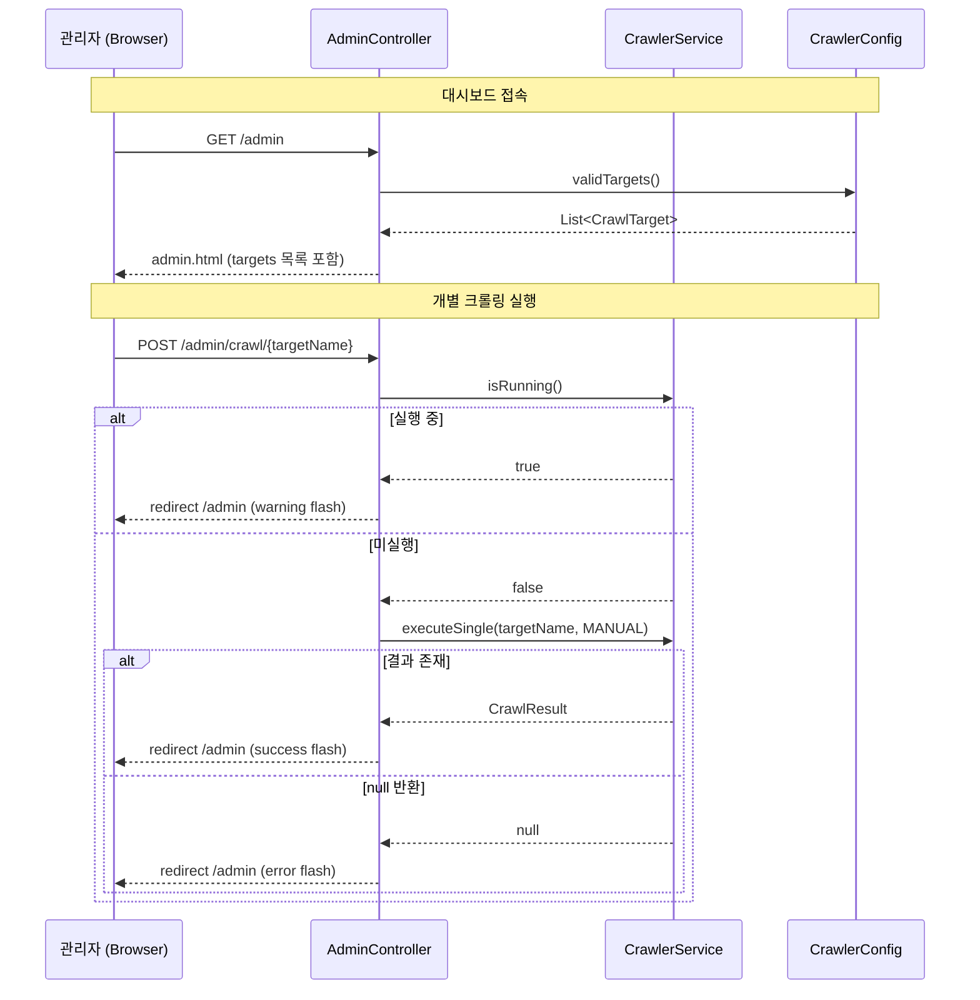
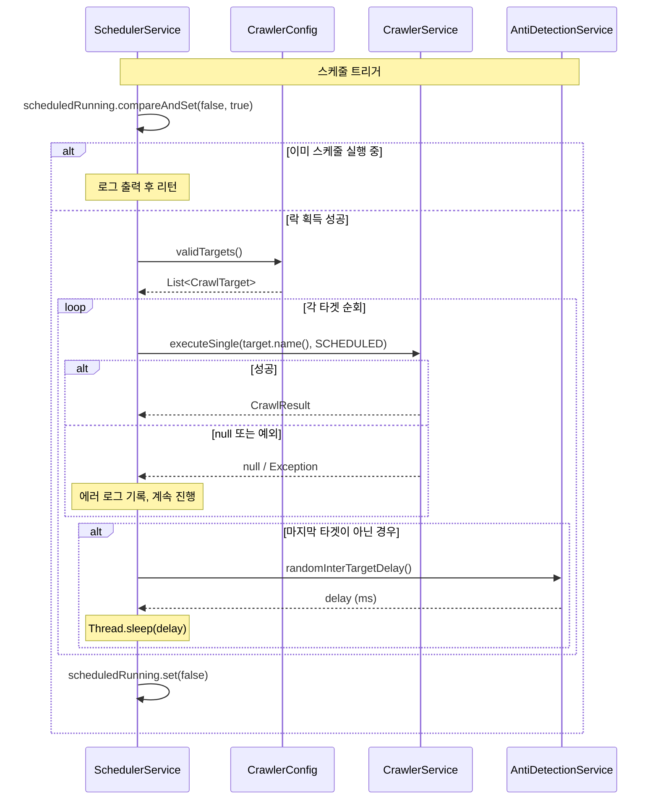

# Design Document: 개별 크롤러 실행

## Overview

mycrawler 모듈의 크롤링 실행 방식을 "전체 일괄 실행"에서 "개별 타겟 실행"으로 전환합니다. 기존 `POST /admin/crawl` 엔드포인트를 제거하고, `POST /admin/crawl/{targetName}` 엔드포인트를 추가하여 관리자가 특정 크롤러만 선택 실행할 수 있도록 합니다. 대시보드에 등록된 크롤러 목록을 표시하고, 각 크롤러에 개별 실행 버튼을 제공합니다. SchedulerService도 동일하게 개별 실행 방식으로 전환하며, 새로운 wepoll-stock 크롤러를 등록합니다.

### 설계 결정 근거

- **개별 실행 우선**: 불필요한 전체 크롤링 방지, 특정 대상만 즉시 재크롤링 가능
- **기존 executeSingle 활용**: CrawlerService에 이미 존재하는 `executeSingle` 메서드를 그대로 활용하여 변경 최소화
- **SchedulerService 개별 전환**: 일관된 실행 패턴을 유지하되, 타겟 간 딜레이와 fault tolerance를 직접 구현
- **SchedulerService 레벨 guard**: `executeSingle`은 호출마다 running 락을 획득/해제하므로, 타겟 간 딜레이 구간에서 수동 실행이 끼어들 수 있음. 이를 방지하기 위해 SchedulerService에서 `CrawlerService.isRunning()` 체크를 루프 진입 전에 수행하고, 스케줄러 자체의 실행 상태를 별도 AtomicBoolean으로 관리하여 스케줄 실행 중에는 수동 실행을 차단함
- **POST /admin/crawl 404 처리**: 엔드포인트 메서드를 제거하면 Spring MVC가 해당 경로에 매핑된 핸들러를 찾지 못하여 자동으로 404를 반환하므로, 별도 로직 불필요

## Architecture

### 변경 대상 컴포넌트

| 계층 | 컴포넌트 | 변경 유형 |
|------|----------|-----------|
| Interfaces | AdminController | 엔드포인트 교체 (triggerCrawl 제거 → triggerSingleCrawl 추가), 모델에 targets 추가 |
| Application | SchedulerService | executeCrawl 메서드를 개별 순회 방식으로 변경 |
| Infrastructure | CrawlerConfig | 변경 없음 (validTargets 그대로 활용) |
| Infrastructure | application.yml | wepoll-stock 타겟 추가 |
| View | admin.html | 수동 실행 섹션 제거, 크롤러 목록 + 개별 실행 버튼 섹션 추가 |

### 컴포넌트 상호작용 시퀀스





## Components and Interfaces

### AdminController 변경

```java
// 제거할 메서드
@PostMapping("/crawl")
public String triggerCrawl(RedirectAttributes redirectAttributes)

// 추가할 메서드
@PostMapping("/crawl/{targetName}")
public String triggerSingleCrawl(@PathVariable String targetName,
                                  RedirectAttributes redirectAttributes)

// dashboard 메서드 변경: 모델에 targets 추가
@GetMapping
public String dashboard(Model model)
```

**AdminController 의존성 추가:**
- `CrawlerConfig` — validTargets() 호출을 위해 주입

**triggerSingleCrawl 흐름:**
1. `crawlerService.isRunning()` 또는 `schedulerService.isScheduledRunning()` 확인 → 어느 하나라도 true면 경고 flash + redirect
2. `crawlerService.executeSingle(targetName, TriggerSource.MANUAL)` 호출
3. 결과가 null이면 오류 flash + redirect
4. 결과가 존재하면 성공 flash + redirect

**populateDashboardModel 변경:**
- `model.addAttribute("targets", crawlerConfig.validTargets())` 추가

### SchedulerService 변경

```java
// 새 필드 추가
private final AntiDetectionService antiDetectionService;
private final AtomicBoolean scheduledRunning = new AtomicBoolean(false);

// 기존 executeCrawl 메서드 내부 변경
private void executeCrawl() {
    // Before: crawlerService.executeAll(TriggerSource.SCHEDULED)
    // After: scheduledRunning guard + validTargets 순회하며 개별 executeSingle 호출
}

// 스케줄 실행 상태 조회 (AdminController에서 활용 가능)
public boolean isScheduledRunning() {
    return scheduledRunning.get();
}
```

**executeCrawl 새 흐름:**
1. `scheduledRunning.compareAndSet(false, true)` — 이미 스케줄 실행 중이면 로그 후 리턴
2. `crawlerConfig.validTargets()` 목록 조회 (빈 목록이면 로그 후 리턴)
3. 각 타겟에 대해 `crawlerService.executeSingle(target.name(), TriggerSource.SCHEDULED)` 호출
4. null 반환 또는 예외 발생 시 에러 로그 기록 후 다음 타겟 계속 진행
5. 마지막 타겟이 아닌 경우 `antiDetectionService.randomInterTargetDelay()` 후 sleep
6. finally 블록에서 `scheduledRunning.set(false)`

**AdminController의 isRunning 체크 확장:**
- `triggerSingleCrawl`에서 `crawlerService.isRunning()` 외에 추가로 `schedulerService.isScheduledRunning()`도 확인
- 둘 중 하나라도 true면 경고 flash + redirect (스케줄 실행 도중 수동 실행 끼어들기 방지)

**SchedulerService 의존성 추가:**
- `AntiDetectionService` — randomInterTargetDelay() 호출을 위해 주입

### admin.html 변경

**제거:**
- "수동 실행" 섹션 전체 (h2, form, button)

**추가: errorMessage 표시 영역**
- `warningMessage`, `successMessage`와 동일한 위치에 `errorMessage` flash attribute 표시 div 추가
- 스타일: 빨간 계열 배경 (예: `background-color: #f8d7da; border-color: #f5c6cb; color: #721c24`)

**추가: 등록된 크롤러 목록 섹션**
- 섹션 제목: "등록된 크롤러"
- 타겟 목록 테이블: 이름, URL, 실행 버튼
- 각 행에 form (POST /admin/crawl/{target.name})
- `th:disabled="${isRunning}"` 으로 전체 버튼 비활성화
- 빈 목록 시 안내 문구 표시

### application.yml 변경

```yaml
crawler:
  targets:
    - name: fmkorea-stock
      url: https://www.fmkorea.com/stock
    - name: wepoll-stock
      url: https://wepoll.kr/g2/bbs/board.php?bo_table=stock
```

## Data Models

기존 데이터 모델에 변경 없음. 모든 기존 모델을 그대로 활용합니다:

- **CrawlTarget** (record): `name`, `url` — 불변 값 객체
- **CrawlResult** (record): `targetName`, `targetUrl`, `status`, `triggerSource`, `content`, `errorMessage`, `startTime`, `endTime`
- **TriggerSource** (enum): `SCHEDULED`, `MANUAL`
- **CrawlStatus** (enum): `SUCCESS`, `FAILURE`

## Correctness Properties

*A property is a characteristic or behavior that should hold true across all valid executions of a system — essentially, a formal statement about what the system should do. Properties serve as the bridge between human-readable specifications and machine-verifiable correctness guarantees.*

### Property 1: 개별 실행 위임 및 성공 응답

*For any* target name string where `isRunning()` returns false and `executeSingle` returns a non-null CrawlResult, the AdminController SHALL call `executeSingle(targetName, TriggerSource.MANUAL)` and set a success flash attribute containing the target name, redirecting to /admin.

**Validates: Requirements 1.2, 1.3**

### Property 2: 실행 중 가드

*For any* target name string, when `crawlerService.isRunning()` returns true OR `schedulerService.isScheduledRunning()` returns true, the AdminController SHALL NOT call `executeSingle` and SHALL set a warning flash attribute, redirecting to /admin.

**Validates: Requirements 1.4**

### Property 3: 미등록 타겟 오류 처리

*For any* target name string where `executeSingle` returns null, the AdminController SHALL set an error flash attribute containing the target name, redirecting to /admin.

**Validates: Requirements 1.5**

### Property 4: 대시보드 모델 타겟 목록 포함

*For any* list of CrawlTargets returned by `CrawlerConfig.validTargets()`, the AdminController's dashboard method SHALL include that exact list as the "targets" model attribute.

**Validates: Requirements 3.1, 4.1, 4.2**

### Property 5: 스케줄러 개별 순회 실행

*For any* list of N valid CrawlTargets, the SchedulerService SHALL call `executeSingle(target.name(), TriggerSource.SCHEDULED)` exactly N times, once for each target in order.

**Validates: Requirements 6.1**

### Property 6: 스케줄러 장애 격리

*For any* list of CrawlTargets where some targets fail (executeSingle returns null or throws), the SchedulerService SHALL continue processing all remaining targets without interruption.

**Validates: Requirements 6.2**

### Property 7: 스케줄러 타겟 간 딜레이 적용

*For any* list of N CrawlTargets (N > 1), the SchedulerService SHALL apply `randomInterTargetDelay()` exactly N-1 times, between each consecutive target execution.

**Validates: Requirements 6.3**

### Property 8: 스케줄러 중복 실행 방지

*For any* concurrent invocation of `executeCrawl`, the SchedulerService SHALL execute the crawl loop at most once concurrently — if `scheduledRunning` is already true, subsequent invocations SHALL log and return immediately without processing any targets.

**Validates: Requirements 6.1**

## Error Handling

### AdminController 오류 시나리오

| 시나리오 | 처리 방식 |
|----------|-----------|
| isRunning == true 또는 isScheduledRunning == true | 경고 flash attribute 설정, /admin 리다이렉트 |
| executeSingle 반환 null (타겟 미존재) | 오류 flash attribute 설정, /admin 리다이렉트 |
| executeSingle 예외 발생 | GlobalExceptionHandler에서 처리 (기존 메커니즘) |

### SchedulerService 오류 시나리오

| 시나리오 | 처리 방식 |
|----------|-----------|
| scheduledRunning이 이미 true (중복 스케줄 트리거) | 로그 출력 후 즉시 리턴 |
| executeSingle 반환 null | 에러 로그 기록, 다음 타겟 계속 진행 |
| executeSingle 예외 발생 | try-catch로 에러 로그 기록, 다음 타겟 계속 진행 |
| validTargets 빈 목록 | 로그 출력 후 정상 종료 (크롤링 없이 리턴) |
| Thread.sleep 인터럽트 | Thread.currentThread().interrupt() 호출 후 경고 로그 |

### Flash Attribute 메시지 패턴

- **성공**: `"{targetName} 크롤링이 완료되었습니다"` → `successMessage`
- **경고 (실행 중)**: `"현재 크롤링이 진행 중입니다"` → `warningMessage`
- **오류 (미등록)**: `"크롤링 대상을 찾을 수 없습니다: {targetName}"` → `errorMessage`

## Testing Strategy

### Property-Based Testing (jqwik)

본 기능은 다양한 입력(target name strings, target lists)에 따라 동작이 달라지는 비즈니스 로직을 포함하므로, property-based testing이 적합합니다.

**라이브러리**: jqwik (기존 프로젝트에서 사용 중)
**최소 iterations**: 100회 per property

각 property test는 아래 태그 형식으로 주석 처리:
```
// Feature: 002-individual-execution, Property {N}: {property_text}
```

**대상 클래스별 property tests:**

1. **AdminControllerPropertyTest** (WebMvcTest 기반은 아님 — 컨트롤러 메서드 직접 호출)
   - Property 1: 성공 실행 위임 및 응답
   - Property 2: 실행 중 가드
   - Property 3: null 결과 오류 처리
   - Property 4: 모델 타겟 목록

2. **SchedulerServicePropertyTest** (기존 파일 확장)
   - Property 5: 개별 순회 실행
   - Property 6: 장애 격리
   - Property 7: 타겟 간 딜레이
   - Property 8: 스케줄러 중복 실행 방지

### Unit Tests (JUnit 5 + Mockito)

- **AdminControllerTest** (WebMvcTest): 구체적 시나리오 기반 슬라이스 테스트
  - POST /admin/crawl/{targetName} 성공 케이스
  - POST /admin/crawl/{targetName} 실행 중 케이스
  - POST /admin/crawl/{targetName} 미등록 타겟 케이스
  - POST /admin/crawl (기존 엔드포인트) 404 확인
  - GET /admin 모델에 targets 포함 확인

- **SchedulerServiceTest** (기존 파일 확장): 개별 실행 전환 검증
  - executeCrawl이 각 타겟별 executeSingle 호출
  - 실패 타겟 건너뛰기 확인
  - 타겟 간 딜레이 적용 확인

### Integration / Smoke Tests

- application.yml에 wepoll-stock 항목 포함 확인 (config binding test)
- admin.html 템플릿에 크롤러 목록 섹션 존재 확인
