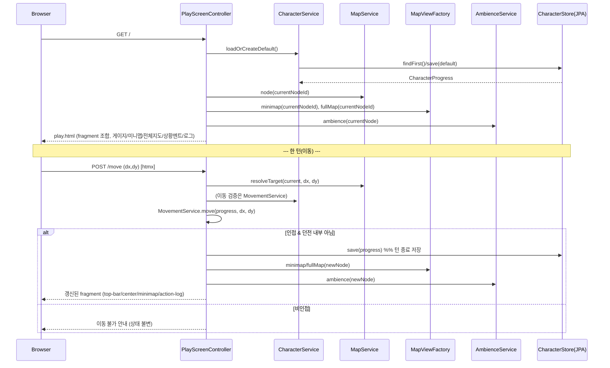

# Design Document

## Overview

본 설계는 `myrpg` Web 모듈(`com.myapps.web.myrpg`)의 첫 기능(001)인 **캐릭터 진행상황 영속화 + 맵 노드 이동 + 플레이 화면 서버사이드 렌더링**을 다룬다. 기존 `mycalendar` 모듈과 동일한 Spring Boot 4.0 / DDD 계층 구조를 따르며, 다음 세 축을 구현한다.

1. **플레이 화면 SSR** — `docs/myrpg-mockup.html`의 시각 디자인(CSS 디자인 토큰)과 상호작용(줌/팬, 팝업)을 1:1로 보존하되, 화면을 영역별 Thymeleaf fragment로 분리한다.
2. **턴제 맵 이동** — 마을/필드/던전 입구 노드 사이를 `links` 그래프를 따라 이동하며, 이동 1회 = 1턴이다. 각 턴 종료 시 캐릭터 진행상황을 DB에 저장한다.
3. **캐릭터 진행상황 영속화** — `spring-boot-starter-data-jpa`로 캐릭터 상태만 저장하고, 맵/상황 멘트 등 고정 데이터는 클래스패스 JSON 리소스에서 로드한다.

### 핵심 설계 결정 (Mockup 1:1 보존과 SSR/턴제의 조화)

목업은 브라우저에서 `map.json`/`ambience.json`을 `fetch`하여 미니맵·전체지도·상황 멘트·행동 로그를 **클라이언트에서** 렌더링한다. 그러나 본 스펙은 다음을 요구한다.

- Requirement 8: Map_Service가 미니맵/전체지도 렌더링 데이터를 **서버에서** 생성(격자 좌표 `grid-column=5+dx`, `grid-row=3+dy`, 노드 타입, 간선)한다.
- Requirement 3/5: 이동은 턴이며 **턴 종료 시 서버가 진행상황을 저장**한다.

따라서 아래와 같이 역할을 분리하되, **최종 DOM 구조·CSS·상호작용 동작은 목업과 동일하게 유지**한다.

| 목업 JS 요소 | 처리 방식 | 근거 |
|---|---|---|
| 줌/팬 제스처(`touch*`, `mouse*`, `wheel`, `zoomAt`, `applyMapTransform`, `resetMapView`) | **1:1 그대로 보존** (이미 렌더된 DOM 위에서 동작) | Req 1.3, 1.10 |
| 팝업 열기/닫기(`openPanel`/`closePanel`/`openMap`/`closeMap`) | **1:1 그대로 보존** | Req 1.3, 1.10 |
| 미니맵/전체지도 격자 렌더(`renderMinimap`/`renderFullMap`/`makeNode`) | 서버가 동일한 DOM(같은 class·`grid-column`/`grid-row` inline style)을 Thymeleaf로 출력 | Req 8 |
| 상황 멘트 선택(`pickAmbience`/`getSeason`/`getTimeOfDay`) | 서버 `Ambience_Service`가 수행 | Req 7 |
| 이동(`move`) / 로그(`addLog`) | `move-pad` 버튼이 서버로 턴 요청(htmx) → 서버가 노드 갱신·저장 후 갱신된 fragment 반환 | Req 3, 5, 9 |

결과적으로 **디자인 토큰·레이아웃·색상·간격·줌/팬/팝업 동작은 목업과 픽셀 단위로 동일**하고, 데이터 생성만 서버로 이동한다. 이 조화는 목업의 `.node.type-*`, `.node.current`, `.node.link-right`, `.node.link-down` 및 `grid-column/grid-row` 규칙을 서버 렌더링이 그대로 재현함으로써 성립한다.

## Architecture

### 모듈 위치 및 계층

`mycalendar`와 동일한 DDD 4계층(`interfaces` / `application` / `domain` + `resources`)을 사용한다.

```
myrpg/
├── pom.xml
└── src/
    ├── main/java/com/myapps/web/myrpg/
    │   ├── MyrpgApplication.java
    │   ├── interfaces/
    │   │   └── api/
    │   │       ├── PlayScreenController.java        # GET / (루트), POST /move
    │   │       ├── PlayScreenViewHelper.java         # 게이지 %/오버레이 등 뷰 계산
    │   │       └── GlobalExceptionHandler.java       # @ControllerAdvice
    │   ├── application/
    │   │   ├── service/
    │   │   │   ├── CharacterService.java
    │   │   │   ├── MovementService.java
    │   │   │   ├── MapService.java
    │   │   │   └── AmbienceService.java
    │   │   ├── dto/                                  # 뷰 모델 record
    │   │   │   ├── PlayScreenView.java
    │   │   │   ├── TopBarView.java
    │   │   │   ├── GaugeView.java
    │   │   │   ├── MinimapView.java / MinimapCell.java / MapEdge.java
    │   │   │   ├── FullMapView.java / FullMapCell.java
    │   │   │   └── MovementResult.java (sealed)
    │   │   └── exception/
    │   │       ├── CharacterCreationException.java
    │   │       ├── MapDataException.java
    │   │       ├── NodeNotFoundException.java
    │   │       └── MapViewGenerationException.java
    │   └── domain/
    │       ├── model/
    │       │   ├── CharacterProgress.java            # @Entity (유일한 영속 엔티티)
    │       │   ├── Stats.java                        # @Embeddable record
    │       │   ├── Vital.java                        # @Embeddable record
    │       │   ├── MapGraph.java                     # 고정 데이터(비영속)
    │       │   ├── MapNode.java (record)
    │       │   ├── NodeType.java (enum, 확장 가능)
    │       │   ├── Dungeon.java (record)
    │       │   ├── AmbienceData.java (record 계층)
    │       │   ├── ActionLog.java / ActionLogEntry.java (record)
    │       │   └── ExperiencePolicy.java             # 다음 레벨 필요 경험치 산출
    │       ├── repository/
    │       │   └── CharacterProgressRepository.java  # JpaRepository
    │       └── service/
    │           └── MapViewFactory.java               # 미니맵/전체지도 격자 생성(순수 로직)
    └── main/resources/
        ├── application.yml (+ local/prod)
        ├── data/
        │   ├── map.json                              # docs/map.json 이관
        │   └── ambience.json                         # docs/ambience.json 이관
        ├── static/
        │   ├── css/myrpg.css                         # 목업 <style> 1:1 이관
        │   └── js/myrpg.js                           # 줌/팬/팝업 JS 1:1 + htmx 이동
        └── templates/
            ├── play.html                             # fragment 조합 루트 (뷰 이름 `play`)
            ├── error.html
            └── fragments/
                ├── top-bar.html
                ├── left-sidebar.html
                ├── center.html
                ├── minimap.html
                ├── move-pad.html
                ├── action-log.html
                ├── panel-popup.html                  # 장비/인벤/스킬/정보 공용
                └── full-map.html                     # 전체지도 팝업
```

### 요청 흐름



### 고정 데이터 로딩

- `MapService`, `AmbienceService`는 애플리케이션 기동 시 `@PostConstruct`(또는 생성자)에서 `classpath:data/map.json`, `classpath:data/ambience.json`을 **Jackson 3(`tools.jackson.databind.ObjectMapper`)** 로 1회 파싱하여 불변 도메인 객체(`MapGraph`, `AmbienceData`)로 메모리에 보관한다.
- 로딩 시 `links` 양방향성(Req 4.5)을 검증하고, 위반 시 `MapDataException`을 던져 기동을 실패시킨다(고정 데이터 무결성 보장).
- 새 노드/던전/상황 멘트 추가는 코드 변경 없이 해당 JSON 리소스 수정만으로 반영된다(Req 4, 10.3).

## Components and Interfaces

### PlayScreenController (interfaces/api)

- `@Controller`. 생성자 주입만 사용(`@Autowired` 금지).
- `GET /` (루트) → `loadOrCreateDefault()` 결과와 맵/상황/로그 뷰 모델을 조합하여 `play` 뷰 렌더.
- `POST /move` (params `dx`, `dy`) → `MovementService.move(...)` 호출. 성공 시 턴 저장 후 갱신 fragment 반환, 실패 시 이동 불가/준비 중 안내 반환(htmx 부분 갱신).
- 게이지 %/오버레이 문자열 등 표현 계산은 `PlayScreenViewHelper`에 위임(`mycalendar`의 `CalendarViewHelper` 패턴).
- **루트 경로 서빙 근거**: `myrpg`는 단일 화면 독립 실행형 Spring Boot 웹 앱(myrpg 모듈)이므로 `/myrpg` 하위 경로 대신 루트(`/`)에서 서빙하는 것이 더 깔끔하다. 이동은 htmx로 호출되는 `POST /move`이므로 브라우저 주소창에 노출되지 않으며, 조작 안전성은 URL을 숨기는 것이 아니라 `MovementService`의 서버사이드 검증(비인접 → `Blocked`, 던전 내부 → `DungeonLocked`)으로 보장된다.

### CharacterService (application/service)

```java
CharacterProgress loadOrCreateDefault();   // Req 2, 3.2
CharacterProgress saveTurn(CharacterProgress progress);  // Req 3.3, 5.2 (턴 종료 저장)
```

- `@Transactional`. 저장소가 비어 있으면 `Default_Character`(닉네임 `고니`, Base_Stats, Lv1/누적1/EXP0, 시작 노드 `tir-chonaill`)를 **정확히 1개** 생성·저장한다.
- 저장 실패 시 트랜잭션 롤백 후 `CharacterCreationException` 반환(Req 2.7). 저장 연산 실패에 한해 오류를 반환(Req 2.8). 롤백 자체 실패 시 추가 복구를 시도하지 않는다(Req 2.9).

### MapService (application/service)

```java
MapNode node(String nodeId);              // Req 4.3, 없으면 NodeNotFoundException (4.4)
MapGraph graph();                          // Req 4.1, 4.2
List<Dungeon> dungeons();                  // Req 6.2, 10.2 (implemented:false, map:null 그대로)
MinimapView minimap(String currentNodeId); // Req 8.1~8.4, 8.6, 8.7 (MapViewFactory 위임)
FullMapView fullMap(String currentNodeId); // Req 8.5, 8.6, 8.7
```

### MapViewFactory (domain/service, 순수 로직)

- 미니맵/전체지도 격자 데이터 생성의 순수 함수 집합(외부 의존 없음 → PBT 대상).
- **미니맵**: 현재 노드를 중심(`grid-column=5`, `grid-row=3`)으로, 오프셋 `dx∈[-4,4]`, `dy∈[-2,2]`(가로 9 × 세로 5, 최대 45칸) 범위 노드만 포함. 각 셀에 `nodeId`, `gridColumn=5+dx`, `gridRow=3+dy`, `NodeType`, `current` 플래그 부여. 간선은 두 노드가 **모두 창 안**이고 `links`로 실제 연결일 때만 포함(오른쪽/아래 방향).
- **전체지도**: 모든 노드를 바운딩박스 기준 `gridColumn=x-minX+1`, `gridRow=y-minY+1`에 배치, `name` 라벨·`NodeType`·`links` 포함. 간선은 실제 좌표 이웃 + 연결 시 포함.
- 현재 노드 id가 좌표를 못 가지거나 그래프에서 확인 불가하면 `MapViewGenerationException`을 던지고 **어떤 셀·간선도 생성하지 않는다**(Req 8.6, 8.7 all-or-nothing).

### MovementService (application/service)

```java
MovementResult move(CharacterProgress progress, int dx, int dy);   // Req 5, 6
MovementResult enterDungeon(CharacterProgress progress, String dungeonId); // Req 6.3
```

- `MovementResult`는 sealed 결과 타입(정상 흐름은 예외를 던지지 않음 → 이동 불가/준비 중은 "정상적 거부").
  - `Moved(MapNode node, ActionLogEntry log)` — 인접 노드로 이동 성공(던전 입구 포함, Req 6.1). 현재 노드 id 갱신 + `이동` 타입 로그 생성(Req 5.1, 5.3).
  - `Blocked(String message)` — 비인접 노드 요청 거부, 상태 불변(Req 5.4).
  - `DungeonLocked(String message)` — 던전 내부 진입 거부, "준비 중" 안내(Req 6.3). 안내 문구 생성 실패와 무관하게 거부는 유지(Req 6.5).

### AmbienceService (application/service)

```java
String ambience(MapNode node);   // Req 7
```

- `Clock` 주입(테스트 시 고정 시각 주입 가능). 현재 시각 → `Season`(월 매핑)·`Time_Of_Day`(시 매핑) 산출(Req 7.1).
- Theme = `node.theme` 있으면 그 값, 없으면 `node.type`(Req 7.5).
- 후보 선택: `themes[theme][season][tod]` → (비면) 같은 theme·season의 다른 tod → (비면) theme 전체 → (비면) `"{맵이름} 주변을 둘러봅니다."`(Req 7.2~7.4). 후보가 있으면 주입된 `Random`으로 균등 무작위 선택.

### CharacterProgressRepository (domain/repository)

```java
public interface CharacterProgressRepository extends JpaRepository<CharacterProgress, Long> {
    Optional<CharacterProgress> findFirstByOrderByIdAsc();  // 기존 진행상황 로드
}
```

### 정적 리소스 / 템플릿

- `static/css/myrpg.css`: 목업 `<style>` 블록을 **무수정 이관**(`:root` 토큰 포함).
- `static/js/myrpg.js`: 줌/팬/팝업 함수 **1:1 이관**. `move(dx,dy)`는 htmx로 `POST /move` 호출 후 반환 fragment를 swap하도록 대체(디자인/동작 동일, 데이터만 서버 생성).
- `play.html`(뷰 이름 `play`)은 `th:replace`로 `fragments/` 하위 각 fragment를 조합(Req 1.8, 1.9, 1.10).

## Data Models

### 영속 모델 (DB에 저장되는 유일한 대상)

**CharacterProgress** (`@Entity`, table `character_progress`)

| 필드 | 타입 | 설명 |
|---|---|---|
| `id` | `Long` (`@Id @GeneratedValue IDENTITY`) | 안정적 기본 키 — 향후 인벤/장비/스킬 연관 엔티티 확장 지점(Req 10.1) |
| `nickname` | `String` | 닉네임(기본 `고니`) |
| `currentLevel` | `int` | 현재 레벨(신규 1) |
| `accumulatedLevel` | `int` | 누적 레벨(신규 1, 현재 레벨과 분리 보관) |
| `experience` | `long` | 경험치(신규 0) |
| `stats` | `Stats` (`@Embedded`) | STR/DEX/INT/Critical/DEF |
| `hp` / `mp` / `stamina` | `Vital` (`@Embedded`, `@AttributeOverrides`) | 각 `current`/`max` 정수 쌍 |
| `currentNodeId` | `String` | 현재 맵 노드 id(신규 `tir-chonaill`) |

**Stats** (`@Embeddable record`): `int str, int dex, int intelligence, int critical, int defense`
- 신규 기본값: STR 10, DEX 10, INT 10, Critical 5, DEF 5 (Req 2.2)

**Vital** (`@Embeddable record`): `int current, int max`
- 신규 기본값: `100/100` (HP/MP/Stamina 동일). 현재값이 0이어도 보정하지 않음(Req 1.11).
- 표시·저장 모두 정수. `Vital`은 `record`로 불변 값 객체(코드 스타일: VO는 record). Hibernate 7 embeddable record 매핑 사용.

> DB에는 위 진행상황만 저장한다. 맵/몬스터/아이템/상황 멘트 등 고정 데이터는 저장하지 않는다(Req 3.5, 10.3).

### 고정 데이터 모델 (비영속, JSON 로드)

**NodeType** (enum, 확장 가능 — Req 10.4)
- 알려진 값: `TOWN`, `FIELD`, `DUNGEON`.
- `MapNode`는 원본 `type` 문자열도 보존한다. 로직은 알려진 타입만 특수 처리(던전만 진입 제약)하고, **알 수 없는 타입은 일반 통행 노드로 취급**한다. 렌더링은 원본 타입 문자열로 `type-{type}` CSS class를 생성하므로 새 유형 추가 시 CSS `.type-{name}` 규칙만 늘리면 되고 기존 로직은 깨지지 않는다.

**MapNode** (record): `String id, String name, String type, NodeType nodeType, int x, int y, String dungeonId, String theme, List<String> links`

**Dungeon** (record): `String id, String name, String entranceNodeId, boolean implemented, Object map`
- `implemented:false`, `map:null`을 그대로 노출(Req 6.2). `entranceNodeId`/`dungeonId`로 입구↔던전 참조 유지(Req 10.2).

**MapGraph** (도메인 집계): `List<MapNode> nodes`, `Map<String,MapNode> byId`, `Map<String,MapNode> byCoord("x,y")`, `List<Dungeon> dungeons`, `String startNodeId`. 조회/좌표 이웃 탐색 헬퍼 제공.

**AmbienceData** (record 계층): `Map<String,List<Integer>> season`, `Map<String,TimeBucket> timeOfDay`(`from`,`to`), `Map<String, Map<String, Map<String, List<String>>>> themes`(theme→season→tod→멘트 목록).

### 뷰 모델 (record, 컨트롤러→Thymeleaf)

- **GaugeView**: `int current, int max, int percent, String overlay` — `percent = max>0 ? clamp(round(current*100/max),0,100) : 0`, `overlay = current + " / " + max`. EXP 게이지는 `current=현재경험치`, `max=ExperiencePolicy.requiredForNext(level)`, overlay `"현재 / 다음 필요"`(Req 1.4~1.6, 1.11).
- **TopBarView**: `String nickname, int level, GaugeView exp, GaugeView hp, GaugeView mp, GaugeView stamina`.
- **MinimapCell**: `String nodeId, int gridColumn, int gridRow, String type, boolean current, boolean linkRight, boolean linkDown`.
- **MapEdge**: `String fromNodeId, String toNodeId` (범위·연결 조건을 만족한 쌍만).
- **MinimapView**: `String mapName, List<MinimapCell> cells`.
- **FullMapCell**: `String nodeId, String name, int gridColumn, int gridRow, String type, boolean current, boolean linkRight, boolean linkDown, List<String> links`.
- **FullMapView**: `List<FullMapCell> cells, int columns, int rows`.
- **ActionLogEntry** (record): `String timestamp("yyyy-MM-dd HH:mm:ss"), String message, String type`.
- **ActionLog** (도메인): 최대 10개 유지(초과 시 가장 오래된 것부터 제거), 표시 시 타임스탬프 오름차순, type 미지정 시 `move`(Req 9). 진행상황이 아니므로 DB 미저장 — HTTP 세션에 보관.

**ExperiencePolicy** (domain): `long requiredForNext(int level)`. 요구사항에 경험치 곡선이 명시되지 않아, 기본 정책(예: `level * 100L`)을 문서화된 확장 지점으로 둔다(정책 교체 가능). — *설계 보완 항목(요구사항 미명시)*.

## Correctness Properties

*프로퍼티(property)는 시스템의 모든 유효한 실행에서 참이어야 하는 특성/동작으로, 시스템이 무엇을 해야 하는지에 대한 형식적 진술이다. 프로퍼티는 사람이 읽는 명세와 기계가 검증 가능한 정확성 보장 사이의 다리 역할을 한다.*

아래 프로퍼티는 위 prework 분석에서 PROPERTY/EDGE_CASE로 분류된 순수 로직(맵 좌표 계산, 링크 양방향성, 이동 검증, 상황 멘트 선택, 행동 로그, 게이지 계산, 영속 라운드트립)을 대상으로 하며, 중복은 병합했다. UI 시각/JS 보존(SMOKE), 인프라 구성(SMOKE), 고정 초기값 검증(EXAMPLE)은 프로퍼티에서 제외하고 단위/통합/스냅샷 테스트로 다룬다.

### Property 1: 맵 파싱 라운드트립

*For any* 유효한 맵 그래프 구조에 대해, 이를 JSON으로 직렬화한 뒤 `MapService`로 파싱하면 모든 노드의 `id`/`name`/`type`/좌표(`x`,`y`)/`links`가 원본과 동일하게 보존되고, 각 노드의 `NodeType`은 원본 `type` 문자열에 대응한다.

**Validates: Requirements 4.1, 4.2**

### Property 2: 노드 조회와 부재 오류

*For any* 로드된 맵 그래프와 그 안의 임의 노드 id에 대해 `node(id)`는 해당 노드의 `name`/`type`/좌표/`links`를 반환하고, *for any* 그래프에 존재하지 않는 임의 문자열 id에 대해서는 `NodeNotFoundException`을 던진다.

**Validates: Requirements 4.3, 4.4**

### Property 3: 링크 양방향 불변식

*For any* 로드에 성공한 맵 그래프에 대해, 임의의 두 노드 A, B에 대해 A의 `links`가 B를 포함하면 B의 `links`도 A를 포함한다(양방향).

**Validates: Requirements 4.5**

### Property 4: 미니맵 셀 구성

*For any* 맵 그래프와 좌표를 가진 임의의 현재 노드에 대해, 생성된 미니맵 셀 집합은 오프셋 `dx∈[-4,4]`, `dy∈[-2,2]` 범위 안의 노드와 정확히 일치하며(최대 45개), 현재 노드를 항상 포함하고, 각 셀은 `gridColumn=5+dx`, `gridRow=3+dy`, 원본 타입 문자열(던전 노드는 `dungeon`)을 가지며, `current=true`인 셀은 현재 노드 하나뿐이다.

**Validates: Requirements 8.1, 8.2, 8.4, 6.4, 1.7**

### Property 5: 뷰 간선 정합성

*For any* 미니맵 또는 전체지도 뷰에 대해, 두 노드 id 쌍의 간선이 결과에 포함되는 것은 두 노드가 **모두 표시 범위 안에 있고** `links`로 실제 연결된 경우와 **정확히 동치**이다(조건을 만족하는 이웃 쌍은 모두 포함되고, 그렇지 않은 쌍은 포함되지 않는다).

**Validates: Requirements 8.3, 8.7**

### Property 6: 전체지도 완전성

*For any* 맵 그래프와 좌표를 가진 임의의 현재 노드에 대해, 전체지도 셀의 `nodeId` 집합은 그래프의 모든 노드 집합과 같고, 각 셀은 노드의 이름 라벨/타입/`links`를 보존하며 `gridColumn=x-minX+1`, `gridRow=y-minY+1`에 배치된다.

**Validates: Requirements 8.5**

### Property 7: 뷰 생성 실패 시 무생성(all-or-nothing)

*For any* 그래프에서 좌표를 갖지 않거나 확인되지 않는 현재 노드 id에 대해, 미니맵/전체지도 생성은 `MapViewGenerationException`을 던지고 어떤 셀도 간선도 생성하지 않는다(부분 결과 없음).

**Validates: Requirements 8.6, 8.7**

### Property 8: 인접 이동 성공

*For any* 맵 그래프와 임의의 현재 노드, 그리고 그와 좌표상 이웃이면서 `links`로 연결된 대상(마을/필드/던전 입구 포함)에 대해, 해당 방향 이동은 성공하여 현재 노드 id가 대상으로 바뀌고 `move` 타입이며 메시지에 대상 맵 이름을 포함하는 `ActionLogEntry`를 생성한다.

**Validates: Requirements 5.1, 5.3, 6.1**

### Property 9: 비인접 이동 거부

*For any* 맵 그래프와 임의의 현재 노드, 그리고 그와 연결되지 않은(또는 좌표 이웃이 없는) 방향 요청에 대해, 이동은 거부되고(`Blocked`) 현재 노드 id는 변하지 않는다.

**Validates: Requirements 5.4**

### Property 10: 던전 내부 진입 거부

*For any* 던전 id에 대한 내부 진입(입장) 요청은 항상 거부되어 `DungeonLocked`(준비 중 안내)를 반환하고 캐릭터의 현재 노드 id는 변하지 않는다.

**Validates: Requirements 6.3**

### Property 11: 턴 종료 저장 반영

*For any* 성공적인 인접 이동(턴 종료)에 대해, `Character_Store`에 저장되는 `Character_Progress`는 변경된 현재 맵 노드 id를 담고 있다.

**Validates: Requirements 3.3, 5.2**

### Property 12: 진행상황 영속 라운드트립

*For any* 유효한 `Character_Progress`(닉네임, 현재/누적 레벨, 경험치, STR/DEX/INT/Critical/DEF, HP/MP/Stamina의 현재·최대, 현재 노드 id)에 대해, 저장 후 조회하면 모든 필드가 동일하게 보존된다.

**Validates: Requirements 3.1**

### Property 13: 빈 저장소 시 기본 캐릭터 단일 생성

*For any* 비어 있는 `Character_Store` 상태에서 `loadOrCreateDefault()`를 호출하면, 닉네임 `고니`의 기본 캐릭터가 **정확히 한 번** 저장(생성)된다.

**Validates: Requirements 2.1, 2.5**

### Property 14: 기존 진행상황 로드(재생성 없음)

*For any* 1개 이상의 `Character_Progress`를 가진 `Character_Store` 상태에서 `loadOrCreateDefault()`를 호출하면, 새 캐릭터를 생성/저장하지 않고 기존 진행상황을 반환한다.

**Validates: Requirements 2.6**

### Property 15: 게이지 계산과 수치 오버레이

*For any* 현재값 `current`(0 이상 최대값 이하)와 최대값 `max`(1 이상)에 대해, 게이지 채움 비율은 `percent = clamp(round(current*100/max), 0, 100)`이고 수치 오버레이는 `"current / max"` 형식이다. 특히 `current=0`이면 `percent=0`이며 오버레이는 `"0 / max"`이다. 경험치 게이지의 `max`는 다음 레벨 필요 경험치이다.

**Validates: Requirements 1.4, 1.5, 1.6, 1.11**

### Property 16: 계절/시간대 매핑

*For any* 월(1~12)에 대해 `Ambience_Service`는 `ambience.json`의 `season` 정의에 부합하는 계절 키를 산출하고, *for any* 시(0~23)에 대해 자정을 넘는 구간(`late-night`)을 포함하여 `timeOfDay` 정의에 부합하는 시간대 키를 산출한다.

**Validates: Requirements 7.1**

### Property 17: 상황 멘트 선택은 항상 유효 후보

*For any* 노드와 현재 시각에 대해, 상황 멘트 선택 결과는 (a) 해당 Theme·Season·Time_Of_Day 후보가 있으면 그 후보 목록의 원소, (b) 비어 있으면 동일 Theme 내 폴백 후보 목록의 원소, (c) Theme 후보가 전혀 없으면 정확히 `"{맵이름} 주변을 둘러봅니다."` 중 하나이다.

**Validates: Requirements 7.2, 7.3, 7.4**

### Property 18: Theme 결정 규칙

*For any* 노드에 대해, 상황 멘트에 사용되는 Theme는 노드에 `theme` 값이 있으면 그 값이고, 없으면 노드의 `type` 값이다.

**Validates: Requirements 7.5**

### Property 19: 행동 로그 항목 구성과 기본 타입

*For any* 메시지와 타입(널 허용)으로 로그 항목을 추가하면, 그 항목은 `yyyy-MM-dd HH:mm:ss` 형식 타임스탬프, 해당 메시지, 그리고 타입(널이면 `move`)을 가진다.

**Validates: Requirements 9.1, 9.3**

### Property 20: 행동 로그 최대 10개 유지(FIFO)

*For any* 순서로 추가된 임의 개수 N의 로그 항목에 대해, 로그 크기는 `min(N, 10)`이며 보존되는 항목은 가장 최근에 추가된 최대 10개이다(가장 오래된 것부터 제거).

**Validates: Requirements 9.2**

### Property 21: 행동 로그 오름차순 표시

*For any* 행동 로그에 대해, 표시 목록은 항상 타임스탬프(추가 순서) 오름차순 — 가장 오래된 항목이 먼저, 가장 최신 항목이 마지막 — 으로 정렬된다.

**Validates: Requirements 9.4**

### Property 22: NodeType 확장성

*For any* `town`/`field`/`dungeon`이 아닌 미지의 `type` 문자열을 가진 노드를 포함하는 유효 그래프에 대해, 노드 조회·일반 인접 이동·미니맵/전체지도 생성은 예외 없이 정상 동작하며 해당 노드는 일반 통행 노드로 취급되고 `type-{type}` 렌더링 정보를 그대로 보존한다.

**Validates: Requirements 10.4**

## Error Handling

### 예외 유형 (커스텀 예외, `RuntimeException` 직접 사용 금지)

| 예외 | 발생 지점 | 처리 |
|---|---|---|
| `MapDataException` | 맵 JSON 파싱 실패 또는 양방향 링크 위반(Req 4.5) | 애플리케이션 기동 실패(고정 데이터 무결성) |
| `NodeNotFoundException` | 존재하지 않는 노드 id 조회(Req 4.4) | `@ControllerAdvice` → 404 error 뷰 |
| `MapViewGenerationException` | 현재 노드 좌표 부재/그래프 미확인(Req 8.6, 8.7) | 뷰 미생성, 500 error 뷰 |
| `CharacterCreationException` | 기본 캐릭터 저장 실패(Req 2.7) | 롤백 후 오류 반환, error 뷰 |

### 정상 흐름의 "거부"는 예외가 아님

이동 불가(Req 5.4)와 던전 내부 진입 거부(Req 6.3)는 오류가 아니라 정상적 결과다. `MovementService`는 예외 대신 sealed `MovementResult`(`Moved`/`Blocked`/`DungeonLocked`)를 반환하고, 컨트롤러는 이를 안내 메시지로 렌더한다.

- **비인접 이동**(Req 5.4): `Blocked` — 상태 불변, "그곳으로는 갈 수 없습니다" 류 안내.
- **던전 내부 진입**(Req 6.3): `DungeonLocked` — "아직 준비 중입니다" 안내. 안내 문구 생성이 실패하더라도(Req 6.5) 결과는 진입 허용으로 바뀌지 않는다(거부 유지). 컨트롤러/서비스는 문구 생성 실패를 삼키되 기본 안내로 대체한다.

### 캐릭터 생성 실패/롤백 (Req 2.7~2.9)

- `@Transactional` 경계에서 `save` 실패 시 트랜잭션이 롤백되어 부분 생성 상태를 남기지 않고 `CharacterCreationException`을 던진다(Req 2.7).
- 생성 실패 오류는 **저장 연산 실패에 한해서만** 반환한다(Req 2.8).
- 롤백 자체가 실패하면 오류를 전파하되 추가 복구를 시도하지 않는다(Req 2.9) — catch 블록에서 재복구 로직을 넣지 않음(빈 catch 금지 규칙에 따라 최소 로깅 후 재throw).

### 맵/상황 로드 관련

- 목업은 로컬 서버 미실행 시 상황 멘트에 오류 문구를 표시했으나, SSR에서는 서버가 클래스패스 리소스를 항상 로드하므로 런타임 fetch 실패가 없다. 기동 시 리소스 부재/파싱 실패는 `MapDataException`으로 조기 실패시킨다.

## Testing Strategy

### 이중 테스트 접근

- **단위/예시 테스트**: 고정 초기값(Base_Stats, Lv1/누적1/EXP0, 시작 노드), 던전 노출(`implemented:false`/`map:null`), 렌더링 존재 확인 등 구체 사례·경계·오류 상황.
- **프로퍼티 테스트(jqwik)**: 위 Correctness Properties 22개의 보편 속성. 무작위 입력으로 광범위 커버.
- 두 방식은 상보적이다(예시 테스트는 구체 버그, 프로퍼티 테스트는 일반 정확성).

### 프로퍼티 기반 테스트 (jqwik) 규칙

- 라이브러리: **jqwik**(직접 구현 금지). 각 `@Property`는 최소 **100회** 반복(`@Property(tries = 100)`).
- jqwik은 `@ExtendWith(MockitoExtension.class)`와 비호환 → **`@Mock` 금지**, `Mockito.mock()` 직접 호출로 리포지토리 mock 생성(예: `CharacterService`/`MovementService` 프로퍼티 테스트).
- 각 프로퍼티 테스트는 대응 설계 프로퍼티를 주석 태그로 참조한다.
  - 태그 형식: **Feature: 001-character-progress-and-map-movement, Property {번호}: {프로퍼티 텍스트}**
- 각 Correctness Property는 **단 하나의** 프로퍼티 테스트로 구현한다.
- 생성기(Arbitraries) 설계 포인트:
  - **맵 그래프 생성기**: 격자 좌표에 노드를 배치하고 인접 좌표 간 양방향 `links`를 부여하는 유효 그래프 생성. `town`/`field`/`dungeon` 및 **미지 타입**(Property 22)과 `theme` 유무를 포함. 좌표 없는 노드/미확인 현재 노드 케이스(Property 7)도 생성.
  - **미니맵/전체지도**(Property 4~7): 현재 노드를 그래프에서 무작위 선택, 창 범위 경계(±4/±2)와 45칸 상한을 커버.
  - **게이지 값 생성기**(Property 15): `max≥1`, `0≤current≤max`, `current=0` 경계 포함.
  - **시각 생성기**(Property 16): 월 1~12, 시 0~23 전 구간(자정 넘김 포함).
  - **상황 멘트**(Property 17): 후보가 채워진/비워진/전무한 `AmbienceData`를 생성하여 폴백 3단계 모두 커버. 무작위성은 시드 고정 `Random` 주입으로 결정화.
  - **행동 로그**(Property 19~21): 임의 개수(0~50+) 항목 추가로 10개 상한/정렬/기본 타입 커버. 결정적 타임스탬프를 위해 `Clock` 주입.
  - **캐릭터 진행상황 생성기**(Property 12): 전 필드 무작위(경계 포함).

### 슬라이스/통합 테스트 (Spring Boot 4.0)

- **컨트롤러**(Req 1.1, 1.7~1.10, 5.5): `@WebMvcTest(PlayScreenController.class)` + `@MockitoBean`(서비스). import `org.springframework.boot.webmvc.test.autoconfigure.WebMvcTest`, `org.springframework.test.context.bean.override.mockito.MockitoBean`. GET/POST 응답에 상단바·미니맵·로그 fragment와 갱신 결과가 포함되는지 확인.
- **리포지토리/영속 라운드트립**(Property 12, Req 3.1): `@DataJpaTest` + `@TestConstructor(autowireMode = ALL)`. import `org.springframework.boot.data.jpa.test.autoconfigure.DataJpaTest`, `org.springframework.boot.jpa.test.autoconfigure.TestEntityManager`. `CharacterProgress` 저장→조회 필드 보존, embeddable(`Stats`/`Vital`) 매핑 확인.
- **JSON 로딩**: Jackson 3 `tools.jackson.databind.ObjectMapper`로 `classpath:data/map.json`/`ambience.json` 역직렬화 및 양방향 링크 검증(Req 4.5) 통합 테스트.
- **컨텍스트 로드 스모크**: `@SpringBootTest`로 기동 및 맵/상황 리소스 로딩 성공.

### 스냅샷/시각 보존 (SMOKE, Req 1.2, 1.3, 1.8~1.10)

- `myrpg.css`가 목업 `:root` 디자인 토큰과 스타일을 담고 있는지, `myrpg.js`가 줌/팬/팝업 함수를 보존하는지, fragment 파일이 존재하고 `play.html`이 `th:replace`로 조합하는지 확인. 픽셀 단위 시각 회귀는 수동/도구 검증 영역으로 남긴다.

### 빌드 검증

- 각 구현 Task 완료 전 `mvn test -pl myrpg` 및 `mvn clean install -pl myrpg -am`로 테스트 통과 + `BUILD SUCCESS`를 확인한다(steering `task-build-validation.md`).
