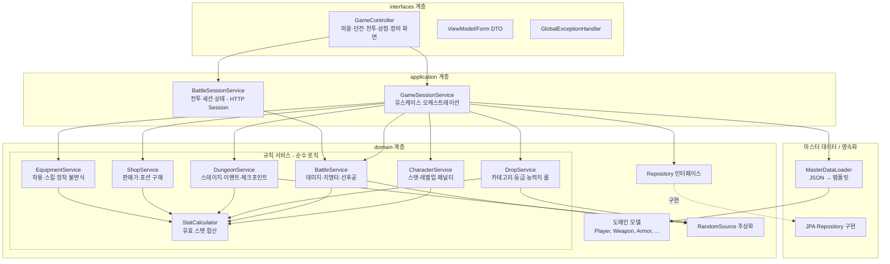

# Design Document

## Overview

`myrpg`는 Spring Boot 4.0 + Thymeleaf 기반의 텍스트 턴제 모바일 웹 RPG 모듈이다. 본 설계는 **세대 1(레벨 밴드 1~10) MVP** 범위(요구사항 1~28)를 구현하기 위한 기술 설계를 정의한다.

핵심 설계 원칙은 다음과 같다.

- **콘텐츠(JSON) / 상태(DB) 분리**: 몬스터·무기·방어구·스킬·던전·소모품 등 변하지 않는 게임 콘텐츠는 `resources/data/*.json` 마스터 데이터로 로딩하고, 플레이하며 변하는 플레이어 상태는 `rpg_` 접두사 DB 테이블에 영속화한다. (Requirement 25)
- **결정 로직의 순수성**: 데미지·치명타·레벨업·드랍 롤·판매가·유효 스탯 등 게임 규칙 계산은 부수효과 없는 순수 도메인 서비스로 분리한다. 난수는 `RandomSource` 추상화를 통해 주입하여 결정론적 테스트(PBT)를 가능하게 한다.
- **DDD 계층 구조**: `domain`(모델·규칙·리포지터리 인터페이스) / `application`(유스케이스 오케스트레이션) / `interfaces`(웹 컨트롤러·뷰) 3계층으로 나눈다.
- **애플리케이션 레벨 참조 무결성**: JSON ID는 DB FK 제약 대신 `template_id`/`item_ref_id`로 참조하고 매핑은 애플리케이션이 담당한다. (Requirement 25.3)

본 설계의 근거 문서는 `docs/systems/*`, `docs/generations/gen1/*`, `docs/tech/module-structure.md`이며 각 컴포넌트는 해당 문서와 요구사항을 기준으로 작성되었다.

### Technology Stack

| 항목 | 선택 | 비고 |
|------|------|------|
| 언어 | Java 25 | record, sealed, switch pattern 적극 활용 |
| 프레임워크 | Spring Boot 4.0.0 | Parent POM에서 버전 관리 |
| 뷰 | Thymeleaf | 서버사이드 렌더링, 모바일 텍스트 UI |
| 영속화 | Spring Data JPA | `rpg_` 테이블 매핑 |
| DB | H2 (로컬 런타임) | 기존 모듈 관례와 동일 |
| JSON 파싱 | Jackson 3 (`tools.jackson`) | 마스터 데이터 로딩 |
| 단위/슬라이스 테스트 | JUnit 5 | `@WebMvcTest`, `@DataJpaTest` |
| 속성 기반 테스트 | jqwik | 규칙 계산 불변식 검증 |

## Architecture

### Layered Architecture



### Package Structure

기본 패키지는 `com.myapps.web.myrpg`이며 DDD 계층을 따른다.

```
myrpg/
├── pom.xml
└── src/
    ├── main/java/com/myapps/web/myrpg/
    │   ├── MyrpgApplication.java
    │   ├── domain/
    │   │   ├── model/
    │   │   │   ├── Player.java                 # @Entity rpg_player
    │   │   │   ├── PlayerWeapon.java            # @Entity rpg_player_weapon
    │   │   │   ├── PlayerWeaponStat.java        # @Entity rpg_player_weapon_stat
    │   │   │   ├── PlayerWeaponSkill.java       # @Entity rpg_player_weapon_skill
    │   │   │   ├── PlayerArmor.java             # @Entity rpg_player_armor
    │   │   │   ├── PlayerArmorStat.java         # @Entity rpg_player_armor_stat
    │   │   │   ├── PlayerInventory.java         # @Entity rpg_player_inventory
    │   │   │   ├── PlayerDungeonProgress.java   # @Entity rpg_player_dungeon_progress
    │   │   │   ├── PlayerActiveRun.java         # @Entity rpg_player_active_run
    │   │   │   ├── Grade.java                   # enum COMMON..LEGENDARY
    │   │   │   ├── WeaponType.java              # enum SWORD..BOW
    │   │   │   ├── ArmorSlot.java               # enum HELMET..BOOTS
    │   │   │   ├── StatType.java                # enum ATTACK..CRITICAL
    │   │   │   ├── DamageType.java              # enum PHYSICAL, MAGICAL
    │   │   │   ├── DropCategory.java            # enum NONE, ARMOR, WEAPON, SKILL_BOOK
    │   │   │   ├── StageEventType.java          # enum BATTLE, REST, MERCHANT, TRAP, TREASURE
    │   │   │   └── vo/                          # EffectiveStats, DamageResult, DropResult 등 record
    │   │   ├── template/                        # JSON 마스터 데이터 record
    │   │   │   ├── MonsterTemplate.java
    │   │   │   ├── WeaponTemplate.java
    │   │   │   ├── ArmorTemplate.java
    │   │   │   ├── SkillTemplate.java
    │   │   │   ├── ItemTemplate.java
    │   │   │   └── DungeonTemplate.java
    │   │   ├── repository/                       # Spring Data JPA 인터페이스
    │   │   │   ├── PlayerRepository.java
    │   │   │   ├── PlayerWeaponRepository.java
    │   │   │   ├── PlayerArmorRepository.java
    │   │   │   ├── PlayerInventoryRepository.java
    │   │   │   ├── PlayerDungeonProgressRepository.java
    │   │   │   └── PlayerActiveRunRepository.java
    │   │   ├── random/
    │   │   │   ├── RandomSource.java             # 난수 추상화 (interface)
    │   │   │   └── ThreadLocalRandomSource.java  # 운영 구현
    │   │   └── service/
    │   │       ├── StatCalculator.java
    │   │       ├── CharacterService.java
    │   │       ├── BattleService.java
    │   │       ├── DropService.java
    │   │       ├── DungeonService.java
    │   │       ├── ShopService.java
    │   │       └── EquipmentService.java
    │   ├── application/
    │   │   ├── dto/                              # 커맨드/결과 record
    │   │   └── service/
    │   │       ├── GameSessionService.java
    │   │       └── MasterDataLoader.java
    │   └── interfaces/
    │       ├── api/
    │       │   ├── GameController.java
    │       │   └── GlobalExceptionHandler.java
    │       └── dto/                              # 뷰 모델/폼 record
    └── main/resources/
        ├── data/                                # 마스터 데이터 JSON (gen1 사본)
        │   ├── monsters.json  skills.json  weapons.json
        │   ├── armors.json    items.json    dungeons.json
        ├── templates/                           # Thymeleaf 화면 8종
        └── application.yml
```

### Randomness Strategy

게임 규칙의 대부분이 확률·랜덤 편차를 포함하므로 결정론적 테스트를 위해 난수를 인터페이스로 추상화한다.

```java
public interface RandomSource {
    /** [0.0, 1.0) 균등 실수 */
    double nextDouble();
    /** [0, boundExclusive) 균등 정수 */
    int nextInt(int boundExclusive);
    /** [minInclusive, maxInclusive] 균등 정수 */
    int nextIntInclusive(int minInclusive, int maxInclusive);
    /** [minInclusive, maxInclusive] 균등 실수 (랜덤 편차 0.9~1.1 등) */
    double nextDoubleInRange(double minInclusive, double maxInclusive);
}
```

- 운영 구현 `ThreadLocalRandomSource`는 `ThreadLocalRandom`을 위임한다.
- 테스트에서는 고정 시드 `Random` 위임 구현 또는 스텁을 주입하여 특정 경로(치명타 발생/미발생, 특정 등급 롤 등)를 재현한다.
- 규칙 서비스는 `RandomSource`를 생성자 주입받으며, 난수 소비 외의 부수효과가 없다.

## Components and Interfaces

### Master Data Loading (`MasterDataLoader`)

- 애플리케이션 기동 시 `resources/data/*.json`을 Jackson 3 `ObjectMapper`(`tools.jackson.databind.ObjectMapper`)로 읽어 불변 템플릿 record 리스트로 로딩하고 `id → 템플릿` 맵으로 인덱싱한다. (Requirement 25.1)
- 제공 조회 메서드: `findMonster(long id)`, `findWeaponTemplate(long id)`, `findArmorTemplate(long id)`, `findSkill(long id)`, `findItem(long id)`, `findDungeon(long id)`, `allDungeons()`, `skillsForWeaponType(WeaponType)`.
- 존재하지 않는 id 조회 시 `MasterDataNotFoundException`을 던진다.

### `StatCalculator` (유효 스탯 합산)

착용 무기·방어구를 캐릭터 기본 스탯에 합산하여 전투용 `EffectiveStats`를 산출한다. (Requirement 5)

```java
public EffectiveStats compute(Player player,
                              PlayerWeapon equippedWeapon,   // nullable
                              List<PlayerArmor> equippedArmors);
```

- 유효 공격력 = 캐릭터 공격력 + 무기 base_attack + 장비 랜덤 ATTACK 합
- 유효 속도 = 캐릭터 속도 + 무기 base_speed + 장비 랜덤 SPEED 합
- 유효 치명타 = 캐릭터 치명타 + 무기 base_critical + 장비 랜덤 CRITICAL 합
- 유효 방어력 = 캐릭터 방어력 + 착용 방어구 base_defense 합 + 장비 랜덤 DEFENSE 합
- 유효 최대 HP = 캐릭터 최대 HP + 장비 랜덤 HP 합
- 데미지 타입: 착용 무기 타입이 STAFF면 MAGICAL, 그 외 PHYSICAL. (Requirement 5.6, 5.7, 12.3)

### `CharacterService` (스탯·레벨업·페널티)

- `int requiredExp(int level)`: `반올림(100 × level^1.5)` (HALF_UP). (Requirement 3.1)
- `LevelUpResult gainExp(Player, int amount)`: 음수 경험치는 거부(무변경). 누적 후 필요 경험치 이상인 동안 반복 레벨업(레벨 +1, 필요치 차감, 스탯 증가, HP/MP 최대치로 세팅). (Requirement 2.2, 3.2~3.7)
- `int applyExpPenalty(Player, double ratio)`: 현재 레벨 진행분에만 `floor(currentExp × ratio)` 감소. 현재 경험치 0이면 0 감소, 결과는 0 미만 불가, 레벨 불변. (Requirement 4.1, 4.2, 4.4, 4.5)
- `void restoreToTown(Player)`: HP/MP를 최대치로 회복. (Requirement 4.6)
- 초기 캐릭터 생성 팩토리: Lv1, HP100/MP50/공10/방5/속5/치0/exp0/gold0. (Requirement 1.1)

### `BattleService` (데미지·치명타·선후공·턴)

- `int criticalChance(EffectiveStats)`: `5 + (속도 × 0.2) + 치명타%`, [5, 100] 클램프. (Requirement 7.1)
- `DamageResult computeDamage(int attackPower, double skillMultiplier, DamageType, int targetDefense, EffectiveStats attackerStats)`:
  1. 기본 데미지 = `attackPower × skillMultiplier - targetDefense × defenseCoefficient` (물리 0.5 / 마법 0.2). (Requirement 6.1, 6.2)
  2. × 랜덤 편차(0.9~1.1). (Requirement 6.3)
  3. 치명타 판정(`nextDoubleInRange`/`nextInt` 기반, 난수 < 확률이면 발생) 시 × 1.5. (Requirement 7.2, 7.3)
  4. 최종 결과 < 1이면 1로 고정. (Requirement 6.4, 7.4)
- `TurnOrder decideTurnOrder(int playerSpeed, int monsterSpeed)`: 속도 비교, 동률 시 50%. (Requirement 8)
- `int monsterDamage(int monsterAttack, DamageType monsterType, int playerDefense)`: 스킬배율 1.0, 몬스터 타입별 방어 계수, 동일 데미지 파이프라인(치명타 없음). (Requirement 10)
- `boolean attemptFlee()`: 50% 고정. (Requirement 9.1)
- MP 관리: 스킬 mpCost 검증/차감, 전투 종료 시 MP 100% 회복. (Requirement 11.1~11.3)

### `DropService` (드랍 롤 — PBT 핵심)

- `DropResult rollDrop(MonsterTemplate, DungeonTemplate)`: 상호 배타적 카테고리 단일 롤(일반 방어구5%/무획득95%, 보스 무기15%/스킬북15%/무획득70%) 후 아이템 세부 롤. (Requirement 17)
- `Grade rollGrade(DungeonTemplate)`: 던전 gradeChance 누적 분포로 등급 선택. (Requirement 18)
- `int slotCount(Grade)`: COMMON1..LEGENDARY5. (Requirement 14.2)
- `int rollStatCount(Grade)`: 등급별 동시 부여 확률. (Requirement 14.3)
- `int effectivePowerLevel(int itemLevel, Grade)`: `itemLevel + 등급 레벨 보너스`. (Requirement 15.2)
- `int rollBaseAttack(int templateBaseAttack, int P)`: `반올림(base × (1 + 0.15P))`. (Requirement 15.3)
- `List<StatRoll> rollStats(Grade, int P)`: StatType 5종 중 중복 없이 개수만큼 선택, 각 수치 `[max(1, round(P×0.4)) ~ round(P×0.8)]`. (Requirement 15.4, 16)
- `RolledWeapon buildWeaponInstance(...)` / `RolledArmor buildArmorInstance(...)`: 인스턴스 조립, 표시명 `[등급] 템플릿명`. (Requirement 14.5, 1.3)

### `DungeonService` (스테이지·이벤트·체크포인트·포기)

- `StageEventType rollStageEvent(int stage)`: 5스테이지는 항상 BATTLE(보스). 1~4는 전투75/휴식8/상인7/함정5/보물5. (Requirement 19.3, 20.1)
- `long pickMonster(DungeonTemplate, int stage)`: 1~4는 spawnWeight 가중 선택, 5는 bossId. (Requirement 19.4)
- `int applyRest(int currentHp, int maxHp)` / `int applyTrap(int currentHp)`: 휴식 +최대10%(초과 없음), 함정 -현재10%(최소1). (Requirement 20.2, 20.3)
- `TreasureReward rollTreasure(DungeonTemplate)`: 골드50/포션40/장비10, 골드 `반올림(base × (1+0.05×itemLevel))`. (Requirement 20.5~20.8)
- 체크포인트: 스테이지 클리어 시 `PlayerActiveRun` 갱신(`cleared_stage`, hp/mp), 전투 중 미저장, 보스 클리어 시 이력 갱신+run 삭제, 재개는 `cleared_stage+1`부터. (Requirement 21)
- `abandonRun(...)`: 전투 중 아닐 때만 run 삭제, 페널티 없음. (Requirement 22)

### `ShopService` (판매·구매)

- `int sellPrice(int baseValue, Grade, int itemLevel)`: `반올림(baseValue × 등급배수 × (1+0.05×itemLevel))`, 등급배수 COMMON1.0..LEGENDARY12.0. (Requirement 23.1, 23.2)
- `sell(...)`: 착용 중/스킬북/포션 판매 거부, 정상 판매 시 인스턴스 삭제 + 골드 지급. (Requirement 23.3~23.5)
- `buyPotion(...)`: 골드 부족 시 거부, 정상 시 골드 차감 + 인벤토리 누적. (Requirement 24)

### `EquipmentService` (착용·스킬 장착 불변식)

- `equipWeapon(...)`: 착용 무기 최대 1개 유지(기존 해제 후 착용). (Requirement 26.1, 26.2)
- `equipArmor(...)`: 부위별 최대 1개(같은 부위 자동 해제). (Requirement 26.3, 26.4)
- `attachSkillBook(...)`: weaponType 불일치/중복/빈 슬롯 없음 규칙, 장착 시 스킬북 소모, 덮어쓰기 시 기존 스킬 영구 소멸, 무기 간 이동 불가. (Requirement 13)
- 던전 진입 이후 장비 변경 금지. (Requirement 26.6)

### `GameSessionService` (application 오케스트레이션)

도메인 규칙 서비스와 리포지터리, 마스터 데이터를 조합하여 유스케이스(캐릭터 생성, 던전 입장/진행, 전투 1턴 처리, 드랍 저장, 상점 거래, 장비 변경)를 트랜잭션 단위로 실행한다. 전투 진행 중 상태(현재 HP/MP, 몬스터 상태, 턴)는 DB에 저장하지 않고 HTTP 세션(`BattleSessionService`)에 유지한다. (Requirement 21.2)

### `GameController` + Thymeleaf 화면

요구사항 28의 8개 화면(마을, 장비 방어구/무기 탭, 던전 선택, 던전 탐색, 전투, 전투 승리/드랍, 상점 판매/구매)을 서버사이드 렌더링으로 제공한다. 스테이지 사이 화면은 `다음 스테이지로`/`포기하고 마을로`를 제공하되 보스 승리 화면은 포기 버튼 없이 자동 마을 복귀를 처리한다. (Requirement 28)

## Data Models

### Enums

```java
public enum Grade { COMMON, UNCOMMON, RARE, EPIC, LEGENDARY }
public enum WeaponType { SWORD, AXE, SPEAR, DAGGER, STAFF, BOW }
public enum ArmorSlot { HELMET, CHEST, GLOVES, BOOTS }
public enum StatType { ATTACK, DEFENSE, HP, SPEED, CRITICAL }
public enum DamageType { PHYSICAL, MAGICAL }
public enum DropCategory { NONE, ARMOR, WEAPON, SKILL_BOOK }
public enum StageEventType { BATTLE, REST, MERCHANT, TRAP, TREASURE }
public enum ItemType { POTION, SKILL_BOOK }
public enum EffectType { HEAL_HP, HEAL_MP }
```

`Grade`는 등급 레벨 보너스(0/2/5/8/10)와 판매가 배수(1.0/1.6/3.0/6.0/12.0), 스킬슬롯 수(1~5)를 자신의 필드/메서드로 노출한다.

### Master Data Records (JSON)

Jackson 3로 역직렬화되는 불변 record. (`docs/generations/gen1/data/*.json` 스키마 기준)

```java
public record WeaponTemplate(long id, String name, WeaponType weaponType,
                             int baseAttack, int baseSpeed, int baseCritical, int baseValue) {}

public record ArmorTemplate(long id, String name, ArmorSlot slot,
                            int baseDefense, int baseValue) {}

public record SkillTemplate(long id, String name, WeaponType weaponType,
                            DamageType damageType, double damageMultiplier, int mpCost) {}

public record ItemTemplate(long id, String name, ItemType itemType,
                           EffectType effectType, int effectAmount, int buyPrice) {}

public record MonsterTemplate(long id, String name, int hp, int attack, int defense,
                              int speed, DamageType damageType, int expReward, int goldReward,
                              boolean boss) {}

public record DungeonSpawn(long monsterId, int minFloor, int maxFloor, int spawnWeight) {}

public record DungeonTemplate(long id, String name, int difficulty, int floorCount,
                              int requiredLevel, long bossId, int generation,
                              List<WeaponType> weaponTypes, List<ArmorSlot> armorSlots,
                              Map<Grade, Double> gradeChance, int treasureBaseGold,
                              List<DungeonSpawn> monsters) {}
```

### Value Objects (record)

```java
public record EffectiveStats(int attack, int defense, int speed, int critical,
                             int maxHp, DamageType damageType) {}

public record DamageResult(int damage, boolean critical) {}

public record StatRoll(StatType statType, int value) {}

public record RolledWeapon(long templateId, WeaponType weaponType, Grade grade, int itemLevel,
                           int baseAttack, int baseSpeed, int baseCritical, int skillSlots,
                           List<StatRoll> stats, String displayName) {}

public record RolledArmor(long templateId, ArmorSlot slot, Grade grade, int itemLevel,
                          List<StatRoll> stats, String displayName) {}

public record DropResult(DropCategory category, RolledWeapon weapon,   // nullable
                         RolledArmor armor, Long skillId) {}           // nullable

public record TreasureReward(TreasureKind kind, int gold, Long itemId, DropResult equipment) {}

public record LevelUpResult(int newLevel, int levelsGained, int remainingExp) {}

public enum TurnOrder { PLAYER_FIRST, MONSTER_FIRST }
public enum TreasureKind { GOLD, POTION, EQUIPMENT }
```

### JPA Entities

`docs/systems/persistence.md`의 테이블 스키마를 그대로 매핑한다. 엔티티 클래스명은 접두사 없이, `@Table(name = "rpg_...")`로 접두사를 부여한다. Lombok 미사용, 명시적 getter 및 상태 변경 메서드 작성, JPA 전용 `protected` 기본 생성자 포함.

주요 엔티티와 매핑:

| 엔티티 | 테이블 | 핵심 컬럼 |
|--------|--------|-----------|
| `Player` | `rpg_player` | level, exp, hp/max_hp, mp/max_mp, attack, defense, speed, critical, gold |
| `PlayerWeapon` | `rpg_player_weapon` | weapon_template_id, grade, item_level, base_attack, base_speed, base_critical, skill_slots, is_equipped |
| `PlayerWeaponStat` | `rpg_player_weapon_stat` | player_weapon_id, stat_type, stat_value |
| `PlayerWeaponSkill` | `rpg_player_weapon_skill` | player_weapon_id, skill_id, slot_index |
| `PlayerArmor` | `rpg_player_armor` | armor_template_id, grade, item_level, base_defense, is_equipped |
| `PlayerArmorStat` | `rpg_player_armor_stat` | player_armor_id, stat_type, stat_value |
| `PlayerInventory` | `rpg_player_inventory` | item_type, item_ref_id, quantity |
| `PlayerDungeonProgress` | `rpg_player_dungeon_progress` | dungeon_id, is_cleared, best_stage |
| `PlayerActiveRun` | `rpg_player_active_run` | player_id(UNIQUE), dungeon_id, cleared_stage, checkpoint_hp, checkpoint_mp, updated_at |

- 관계는 애플리케이션 레벨 매핑을 사용하므로 JPA 연관관계 대신 `player_id` 등 식별자 컬럼을 직접 보유한다. (Requirement 25.3)
- `is_equipped`, 부위별 유일성 등 착용 불변식은 DB 제약이 아닌 `EquipmentService`가 강제한다. (Requirement 26)
- 동일 템플릿이 여러 번 드랍되면 매번 독립 인스턴스 행을 생성한다(랜덤 능력치 독립). (Requirement 25.4)

### Enum ↔ JSON 매핑 규칙

- `gradeChance`의 JSON 키(`COMMON` 등)는 `Grade` enum 이름과 일치하므로 Jackson이 직접 `Map<Grade, Double>`로 역직렬화한다.
- 확률 분포의 합은 1.0이어야 하며, 로더는 로딩 시 합 검증을 수행하고 편차가 허용오차(1e-6)를 넘으면 `MasterDataValidationException`을 던진다. (Requirement 18.4)

## Correctness Properties

*A property is a characteristic or behavior that should hold true across all valid executions of a system — essentially, a formal statement about what the system should do. Properties serve as the bridge between human-readable specifications and machine-verifiable correctness guarantees.*

이 모듈의 규칙 계산(데미지·레벨업·드랍 롤·판매가·유효 스탯·착용 불변식)은 부수효과 없는 순수 로직이고 입력 공간이 넓어 property-based testing에 적합하다. 반면 UI 렌더링(Requirement 28), 마스터 데이터 로딩/DB 매핑(25.1, 25.2), 특정 콘텐츠 값 정의(18.1~18.3, 27.1~27.4)는 슬라이스/예시 테스트로 다룬다.

**Property Reflection**: prework에서 도출한 testable 항목 중 다음을 통합·정리했다. (a) 유효 스탯 5개 항목(5.1~5.5)은 하나의 합산 property로, (b) 물리/마법·플레이어/몬스터 데미지 공식(6.x, 7.3~7.4, 10.2~10.6)은 데미지 파이프라인 계열 property로, (c) 랜덤 능력치 관련(14.4, 15.4, 16.1~16.4)은 단일 "능력치 롤 불변식"으로, (d) 착용 관련(26.1~26.5)은 단일 "착용 불변식"으로, (e) 페널티 계산(4.1·4.2·4.4·4.5)은 단일 "경험치 페널티 불변식"으로 병합했다. 상태전이·게이팅 항목(9.2·9.3·21.x·22.x 등)은 예시/통합 테스트로 이관하여 property 중복을 제거했다.

### Property 1: 전투 보상 지급 정확성

*For any* 몬스터 템플릿과 플레이어 상태에 대해, 몬스터 처치 보상을 지급하면 플레이어의 경험치는 정확히 `expReward`만큼, 골드는 정확히 `goldReward`만큼 증가한다(레벨업으로 인한 경험치 소비는 별도 판정 이후 반영).

**Validates: Requirements 2.1**

### Property 2: 비전투 이벤트는 보상을 주지 않는다

*For any* 플레이어 상태와 임의의 비전투 이벤트(휴식·상인·함정·보물상자)에 대해, 이벤트 처리 전후로 획득 경험치와 골드 지급은 발생하지 않는다(보물상자 골드 보상 제외 — 이는 전투 보상이 아닌 이벤트 보상이며 별도 property로 검증).

**Validates: Requirements 2.3, 20.9**

### Property 3: 필요 경험치 공식

*For any* 정수 레벨 N ≥ 1에 대해, `requiredExp(N)`은 `100 × N^1.5`를 소수점 첫째 자리에서 반올림(HALF_UP)한 값과 같으며 항상 0 이상의 정수다.

**Validates: Requirements 3.1**

### Property 4: 레벨업 종료 불변식

*For any* 플레이어 상태와 0 이상의 획득 경험치에 대해, `gainExp` 종료 후 현재 경험치는 0 이상이며 현재 레벨의 필요 경험치 미만이다(`0 ≤ exp < requiredExp(level)`). 즉 필요치를 만족하는 한 반복 레벨업하고, 미만이 되면 멈춘다.

**Validates: Requirements 2.2, 3.2, 3.5, 3.7**

### Property 5: 레벨업 시 스탯 증가 및 HP/MP 완충

*For any* 플레이어 상태와 획득 경험치에 대해, `gainExp` 결과 레벨이 k만큼 증가했다면 기본 HP/MP/공격/방어/속도/치명타는 각각 `k×(20/10/3/2/1/1)`만큼 증가하고, k ≥ 1이면 종료 시 현재 HP = 최대 HP, 현재 MP = 최대 MP이다.

**Validates: Requirements 3.3, 3.4**

### Property 6: 음수 경험치 거부

*For any* 플레이어 상태와 0 미만의 경험치 입력에 대해, `gainExp`는 경험치와 레벨을 변경하지 않는다.

**Validates: Requirements 3.6**

### Property 7: 경험치 페널티 불변식

*For any* 플레이어 상태와 페널티 비율 r(0 ≤ r ≤ 1)에 대해, `applyExpPenalty`는 현재 경험치를 정확히 `floor(currentExp × r)`만큼 감소시키고, 결과 경험치는 `0 ≤ 결과 ≤ 원래 경험치`이며, 레벨은 변경되지 않고, 원래 경험치가 0이면 감소량은 0이다.

**Validates: Requirements 4.1, 4.2, 4.4, 4.5**

### Property 8: 마을 복귀 시 완전 회복과 아이템 보존

*For any* 플레이어 상태와 보유 아이템 목록에 대해, 마을 복귀 처리 후 현재 HP = 최대 HP, 현재 MP = 최대 MP이며, 보유 아이템(무기·방어구·소모품·스킬북) 집합은 복귀 전후로 동일하다.

**Validates: Requirements 4.6, 4.7**

### Property 9: 유효 스탯 합산

*For any* 캐릭터 기본 스탯, 착용 무기(없을 수 있음), 착용 방어구 목록에 대해, 유효 공격력/속도/치명타는 `캐릭터값 + 무기 base값 + 장비 랜덤 해당스탯 합`, 유효 방어력은 `캐릭터값 + 착용 방어구 base_defense 합 + 장비 랜덤 해당스탯 합`, 유효 최대 HP는 `캐릭터값 + 장비 랜덤 해당스탯 합`과 같다.

**Validates: Requirements 5.1, 5.2, 5.3, 5.4, 5.5, 12.2**

### Property 10: 무기 타입에 따른 데미지 타입

*For any* 착용 무기 타입에 대해, 데미지 타입은 STAFF일 때 MAGICAL, 그 외 모든 타입일 때 PHYSICAL이다.

**Validates: Requirements 5.6, 5.7, 12.3**

### Property 11: 데미지 최소값과 산출 순서 보장

*For any* 공격력·스킬배율·데미지 타입·대상 방어력과 주입된 난수에 대해, `computeDamage` 결과는 항상 1 이상의 정수이며, `기본데미지 → 랜덤편차 → (치명타 시)×1.5 → max(1)` 순서로 계산한 값과 일치한다. 몬스터 데미지도 동일 파이프라인(스킬배율 1.0, 치명타 없음)을 따른다.

**Validates: Requirements 6.4, 7.4, 10.2, 10.6**

### Property 12: 데미지 방어 계수와 배율 단조성

*For any* 공격력·대상 방어력에 대해, 편차·치명타를 고정하면 물리 기본 데미지는 `공격력×배율 - 방어력×0.5`, 마법은 `공격력×배율 - 방어력×0.2`와 일치하고, 스킬배율이 클수록 기본 데미지는 감소하지 않는다(단조 비감소).

**Validates: Requirements 6.1, 6.2, 6.6, 10.3, 10.4**

### Property 13: 랜덤 편차 범위

*For any* 기본 데미지와 주입된 편차 계수에 대해, 편차 적용 값은 `기본데미지 × 0.9`와 `기본데미지 × 1.1` 사이(경계 포함)에 있다. 플레이어·몬스터 데미지 모두 동일하다.

**Validates: Requirements 6.3, 10.5**

### Property 14: 치명타 배율

*For any* 편차 적용 데미지에 대해, 치명타가 발생하면 최종 데미지는 `편차값 × 1.5`에 최소값 보정을 적용한 값과 같다.

**Validates: Requirements 7.3**

### Property 15: 치명타 확률 클램프

*For any* 유효 스탯에 대해, 치명타 확률은 `5 + 속도×0.2 + 치명타%`를 [5, 100] 범위로 제한한 값이며 항상 5 이상 100 이하다.

**Validates: Requirements 7.1**

### Property 16: 치명타 판정 규칙

*For any* 치명타 확률 p와 주입된 난수 x(0 이상 100 미만)에 대해, `x < p`이면 치명타 발생, 그렇지 않으면 비치명타로 판정한다.

**Validates: Requirements 7.2**

### Property 17: 선후공 판정

*For any* 플레이어 유효 속도와 몬스터 속도에 대해, 유저 속도가 크면 플레이어 선공, 작으면 몬스터 선공, 같으면 주입된 난수가 0.5 미만일 때 플레이어 선공이다.

**Validates: Requirements 8.1, 8.2, 8.3**

### Property 18: 전투 종료 보장

*For any* 플레이어와 몬스터의 유한한 시작 스탯에 대해, 전투 루프는 유한 턴 내에 종료하며 종료 시점에 플레이어 또는 몬스터 중 적어도 한쪽의 HP가 0 이하다.

**Validates: Requirements 8.4**

### Property 19: 도망 성공 판정

*For any* 주입된 난수 x에 대해, 도망 판정은 `x < 0.5`일 때만 성공한다(50% 고정).

**Validates: Requirements 9.1**

### Property 20: 전투 종료 시 MP 완전 회복

*For any* 전투 종료 시점의 플레이어 MP 값에 대해, 회복 처리 후 현재 MP는 최대 MP와 같다.

**Validates: Requirements 11.1**

### Property 21: 스킬 MP 소비와 부족 시 거부

*For any* 플레이어 MP와 스킬 mpCost에 대해, `MP ≥ mpCost`이면 스킬 사용 후 MP는 정확히 `mpCost`만큼 감소하고, `MP < mpCost`이면 스킬 사용은 거부되며 MP는 변하지 않는다.

**Validates: Requirements 11.2, 11.3**

### Property 22: 포션 회복 상한

*For any* 현재/최대 HP(또는 MP)와 포션 회복량에 대해, 포션 사용 후 값은 `min(현재 + 회복량, 최대)`와 같고 최대치를 초과하지 않는다.

**Validates: Requirements 11.4, 11.5**

### Property 23: 소모품 사용 시 수량 감소

*For any* 1 이상의 소모품 수량에 대해, 전투 중 해당 소모품을 사용하면 수량은 정확히 1 감소한다.

**Validates: Requirements 11.6**

### Property 24: 등급별 무기 스킬슬롯 수

*For any* 등급에 대해, 무기 인스턴스의 스킬슬롯 수는 COMMON 1 / UNCOMMON 2 / RARE 3 / EPIC 4 / LEGENDARY 5이다.

**Validates: Requirements 14.2**

### Property 25: 등급별 능력치 개수 범위

*For any* 등급에 대해, 부여되는 랜덤 능력치 개수는 등급별 허용 개수 집합(COMMON {1}, UNCOMMON {1,2}, RARE {2,3}, EPIC {3,4}, LEGENDARY {4,5}) 안에 있다.

**Validates: Requirements 14.3, 16.3**

### Property 26: 인스턴스 표시명 형식

*For any* 등급과 템플릿명에 대해, 생성된 인스턴스의 표시명은 `[등급라벨] 템플릿명` 형식과 정확히 일치한다.

**Validates: Requirements 14.5**

### Property 27: 유효 파워 레벨 산출

*For any* itemLevel과 등급에 대해, 유효 파워 레벨 P는 `itemLevel + 등급 레벨 보너스`(COMMON +0 / UNCOMMON +2 / RARE +5 / EPIC +8 / LEGENDARY +10)와 같다.

**Validates: Requirements 15.2**

### Property 28: 무기 기본공격력 스케일

*For any* 템플릿 기준 공격력과 유효 파워 레벨 P에 대해, 롤된 기본공격력은 `반올림(기준공격력 × (1 + 0.15 × P))`(HALF_UP)와 같다.

**Validates: Requirements 15.3**

### Property 29: 타입 고유 스탯은 스케일에서 제외

*For any* 무기 템플릿과 유효 파워 레벨 P에 대해, 무기 인스턴스의 base_speed와 base_critical은 P와 무관하게 항상 템플릿 고정값과 같다.

**Validates: Requirements 15.5**

### Property 30: 랜덤 능력치 롤 불변식

*For any* 등급과 유효 파워 레벨 P에 대해, `rollStats` 결과는 (a) 모든 statType이 {ATTACK, DEFENSE, HP, SPEED, CRITICAL} 5종 안에 있고, (b) statType이 서로 중복되지 않으며, (c) 각 수치가 `[max(1, 반올림(P×0.4)) ~ 반올림(P×0.8)]` 범위 내이고 항상 1 이상이다. 방어구 인스턴스에는 스킬슬롯이 부여되지 않는다.

**Validates: Requirements 14.4, 15.4, 16.1, 16.2, 16.4**

### Property 31: 드랍은 상호 배타적 단일 롤

*For any* 몬스터와 던전에 대해, `rollDrop` 결과의 무기·방어구·스킬북 중 비어있지 않은 항목은 최대 1개다(무획득이면 0개). 두 개 이상 동시 드랍은 발생하지 않는다.

**Validates: Requirements 17.1, 17.7**

### Property 32: 몬스터 종류별 카테고리 제약

*For any* 던전에 대해, 일반 몬스터 처치 드랍 카테고리는 {NONE, ARMOR}에만 속하고, 보스 몬스터 처치 드랍 카테고리는 {NONE, WEAPON, SKILL_BOOK}에만 속한다.

**Validates: Requirements 17.2, 17.3**

### Property 33: 드랍 세부 롤은 던전 풀 내에서 선택

*For any* 던전에 대해, 무기 드랍의 weaponType은 던전 `weaponTypes` 안에, 방어구 드랍의 slot은 던전 `armorSlots` 안에, 스킬북 드랍의 스킬 weaponType은 던전 `weaponTypes`에 대응하는 값 안에 있으며 스킬북에는 등급이 부여되지 않는다.

**Validates: Requirements 17.4, 17.5, 17.6**

### Property 34: 등급 분포 정합성

*For any* 던전에 대해, `gradeChance` 확률의 합은 허용오차(1e-6) 내에서 1.0이고, `rollGrade`는 임의의 난수에 대해 항상 유효한 등급(COMMON~LEGENDARY) 중 하나를 반환한다.

**Validates: Requirements 18.4**

### Property 35: 5스테이지는 항상 보스 전투

*For any* 던전과 임의의 난수에 대해, 스테이지 5의 이벤트는 항상 BATTLE(보스)로 결정된다.

**Validates: Requirements 19.3**

### Property 36: 몬스터 선택은 스테이지 풀 안에서

*For any* 던전과 스테이지 1~4에 대해, 선택된 몬스터는 해당 스테이지 범위(minFloor~maxFloor)를 포함하는 몬스터 풀 안에 있으며, spawnWeight가 0인 몬스터는 선택되지 않는다.

**Validates: Requirements 19.4**

### Property 37: 스테이지 이벤트 분포 집합

*For any* 스테이지 1~4와 임의의 난수에 대해, 결정된 이벤트는 {BATTLE, REST, MERCHANT, TRAP, TREASURE} 중 하나이며, 누적 분포 경계(0.75/0.83/0.90/0.95/1.0)에 따라 매핑된다.

**Validates: Requirements 20.1**

### Property 38: 휴식 회복 상한

*For any* 현재 HP와 최대 HP에 대해, 휴식 이벤트 처리 후 HP는 `min(현재 + 반올림(최대×0.1), 최대)`와 같고 최대치를 초과하지 않는다.

**Validates: Requirements 20.2**

### Property 39: 함정 감소와 최소 HP 보장

*For any* 1 이상의 현재 HP에 대해, 함정 이벤트 처리 후 HP는 1 이상이며 `현재 - 반올림(현재×0.1)`을 1로 하한 처리한 값과 같다(함정으로 사망하지 않음).

**Validates: Requirements 20.3**

### Property 40: 보물상자 보상 종류

*For any* 임의의 난수에 대해, 보물상자 보상 종류는 {GOLD, POTION, EQUIPMENT} 중 하나이며 누적 분포(0.5/0.9/1.0)에 따라 매핑된다. 포션 보상은 HP 포션 또는 MP 포션 중 하나이고, 장비 보상은 던전 gradeChance와 일반 드랍 능력치 롤 규칙을 따른다.

**Validates: Requirements 20.5, 20.7, 20.8**

### Property 41: 보물상자 골드 공식

*For any* 던전 treasureBaseGold와 itemLevel에 대해, 보물상자 골드 보상은 `반올림(treasureBaseGold × (1 + 0.05 × itemLevel))`(HALF_UP)과 같다.

**Validates: Requirements 20.6**

### Property 42: 재개 스테이지 규칙

*For any* 마지막 완료 스테이지 c(0 ≤ c ≤ 4)에 대해, 던전 재개 시작 스테이지는 `c + 1`이다.

**Validates: Requirements 21.3**

### Property 43: 플레이어당 진행 중 던전 최대 1개

*For any* 던전 입장·클리어·삭제 연산의 임의 시퀀스에 대해, 처리 후 한 플레이어의 `rpg_player_active_run` 행 수는 항상 1 이하다.

**Validates: Requirements 21.5**

### Property 44: 판매가 공식

*For any* baseValue, 등급, itemLevel에 대해, 판매가는 `반올림(baseValue × 등급배수 × (1 + 0.05 × itemLevel))`(HALF_UP)이며 등급배수는 COMMON 1.0 / UNCOMMON 1.6 / RARE 3.0 / EPIC 6.0 / LEGENDARY 12.0이다.

**Validates: Requirements 23.1, 23.2**

### Property 45: 판매 거부 규칙

*For any* 판매 대상 인스턴스에 대해, 대상이 착용 중이거나 스킬북/포션이면 판매는 거부되고 플레이어 상태(인벤토리·골드)는 변하지 않는다.

**Validates: Requirements 23.4, 23.5**

### Property 46: 포션 구매

*For any* 플레이어 골드, 포션 구매가, 구매 수량 q에 대해, `골드 ≥ 구매가 × q`이면 구매 후 골드는 `구매가 × q`만큼 감소하고 인벤토리 해당 포션 수량은 q만큼 증가하며, `골드 < 구매가 × q`이면 구매는 거부되고 상태는 변하지 않는다.

**Validates: Requirements 24.2, 24.3**

### Property 47: 드랍마다 독립 인스턴스

*For any* 동일 템플릿의 2회 이상 드랍에 대해, 생성된 각 인스턴스는 서로 독립적인 별개 레코드이며, 한 인스턴스의 랜덤 능력치를 변경해도 다른 인스턴스에 영향을 주지 않는다.

**Validates: Requirements 25.4**

### Property 48: 착용 불변식

*For any* 무기·방어구 착용/해제/교체 연산의 임의 시퀀스에 대해, 처리 후 착용 중(is_equipped=true) 무기는 최대 1개이고, 각 방어구 부위(HELMET/CHEST/GLOVES/BOOTS)별 착용 방어구는 최대 1개다.

**Validates: Requirements 26.1, 26.2, 26.3, 26.4, 26.5**

### Property 49: 스킬북 장착 규칙

*For any* 무기 인스턴스와 스킬북에 대해, (a) 스킬 weaponType이 무기 타입과 다르면 거부, (b) 동일 스킬이 이미 장착되어 있으면 거부, (c) 정상 장착 시 스킬북 수량이 1 감소하고 선택 무기 인스턴스의 슬롯에 스킬이 귀속되며, (d) 기존 스킬이 있는 슬롯을 덮어쓰면 해당 슬롯은 새 스킬이 되고 기존 스킬은 사라진다. 거부되는 모든 경우 상태는 변하지 않는다.

**Validates: Requirements 13.1, 13.2, 13.3, 13.4, 13.6**

### Property 50: 모든 세대1 던전은 전체 장비를 드랍

*For any* 세대1 던전에 대해, `weaponTypes`는 무기 6종 전체를, `armorSlots`는 방어구 4부위 전체를 포함한다(던전 간 차이는 gradeChance와 itemLevel로만 존재).

**Validates: Requirements 27.5**

## Error Handling

### 예외 계층

`RuntimeException`을 직접 사용하지 않고 도메인/애플리케이션 커스텀 예외로 명시 처리한다. (code-style 규칙)

| 예외 | 계층 | 발생 상황 |
|------|------|-----------|
| `MasterDataNotFoundException` | domain | 존재하지 않는 템플릿 id 조회 |
| `MasterDataValidationException` | application | JSON 로딩 시 gradeChance 합 불일치 등 검증 실패 |
| `InsufficientMpException` | domain | MP 부족 상태에서 스킬 사용 시도 (11.3) |
| `InsufficientGoldException` | domain | 골드 부족 상태에서 포션 구매 시도 (24.3) |
| `IllegalEquipmentException` | domain | weaponType 불일치·중복 스킬 장착·착용 중 장비 판매(13.3, 13.4, 23.4) |
| `IllegalActionException` | domain | 전투 중 포기 시도, 던전 진입 후 장비 변경(22.4, 26.6) |
| `PlayerNotFoundException` | application | 존재하지 않는 플레이어 접근 |

### 처리 전략

- **거부(reject) 규칙**: 요구사항의 "거부한다"(음수 경험치, MP/골드 부족, 잘못된 장착, 착용 중 판매 등)는 예외를 던지거나 실패 결과를 반환하되 **어떤 상태도 변경하지 않는다**(no-op). 이는 Property 6, 21, 45, 46, 49로 검증한다.
- **전역 처리**: `@ControllerAdvice` 기반 `GlobalExceptionHandler`가 도메인 예외를 사용자 친화적 화면/메시지로 변환한다.
- **경계값 보정**: 데미지 최소 1(6.4), 함정 HP 최소 1(20.3), 회복 상한(11.4/11.5/20.2), 치명타 확률 클램프(7.1)는 예외가 아닌 값 보정으로 처리한다.
- **빈 catch 금지**: 모든 예외는 로깅 또는 재throw 한다.

## Testing Strategy

### 이중 테스트 접근

- **속성 기반 테스트(jqwik)**: 위 Correctness Properties 1~50을 검증한다. 규칙 계산의 불변식을 넓은 입력 공간에서 확인한다.
- **단위/슬라이스 테스트(JUnit 5)**: 구체 예시, 경계, 상태전이, UI 렌더링을 검증한다.

### 속성 기반 테스트 규칙 (code-style 준수)

- 라이브러리는 **jqwik**을 사용하며 직접 구현하지 않는다.
- 각 property 테스트는 최소 **100회 반복**(`@Property(tries = 100)`)으로 실행한다.
- 난수 의존 로직은 `RandomSource` 스텁/고정 시드 구현을 주입하여 결정론적으로 검증한다(치명타 발생/미발생 경계, 등급 롤 경계 등).
- 서비스 property 테스트에서 리포지터리가 필요하면 `Mockito.mock()`을 직접 호출한다(`@Mock`/`@ExtendWith(MockitoExtension.class)` 미사용 — jqwik 비호환).
- 각 테스트에 설계 property를 주석으로 태깅한다.
  - 태그 형식: `// Feature: myrpg-gen1-mvp, Property {번호}: {property 텍스트}`

```java
// Feature: myrpg-gen1-mvp, Property 11: 데미지 최소값과 산출 순서 보장
@Property(tries = 100)
void damage_is_at_least_one(@ForAll("attackParams") final DamageInput input) {
    final RandomSource fixed = new FixedRandomSource(input.deviation(), input.critRoll());
    final BattleService service = new BattleService(fixed);
    final DamageResult result = service.computeDamage(input.attack(), input.multiplier(),
            input.damageType(), input.defense(), input.attackerStats());
    assertThat(result.damage()).isGreaterThanOrEqualTo(1);
}
```

### 예시/슬라이스 테스트 매핑

| 대상 | 테스트 유형 | 어노테이션 | 검증 요구사항(예) |
|------|-------------|-----------|-------------------|
| 규칙 서비스(Battle/Drop/Character/Shop/Dungeon/Equipment/Stat) | 단위 + PBT | `Mockito.mock()` + jqwik `@Property` | Property 1~50 |
| 초기 캐릭터/시작 무기 | 단위 | 순수 JUnit | 1.1, 1.2, 1.3 |
| 콘텐츠 값(등급 분포·볼륨) | 단위 | 순수 JUnit | 18.1~18.3, 27.1~27.4 |
| 상태전이(체크포인트·재개·포기·보스클리어) | 통합 | `@DataJpaTest` / `@SpringBootTest` | 21.1·21.2·21.4·21.6·21.7·22.x |
| 마스터 데이터 로딩 | 스모크/통합 | `@SpringBootTest` | 25.1, 25.2, 27.6 |
| 컨트롤러/화면 | 슬라이스 | `@WebMvcTest` + `@MockitoBean` | 28.1~28.6 |
| 리포지터리 매핑(rpg_ 테이블) | 슬라이스 | `@DataJpaTest` | 25.2, 25.3 |

### 단위 테스트 균형

- property 테스트가 넓은 입력을 담당하므로 단위 테스트는 대표 예시·경계·에러 조건·통합 지점에 집중하고 과다 작성하지 않는다.
- Spring Boot 4.0 테스트 인프라 규칙(`@MockitoBean`, `org.springframework.boot.webmvc.test.autoconfigure.WebMvcTest`, `org.springframework.boot.data.jpa.test.autoconfigure.DataJpaTest`, Jackson 3 `tools.jackson.databind.ObjectMapper`)을 따른다.
