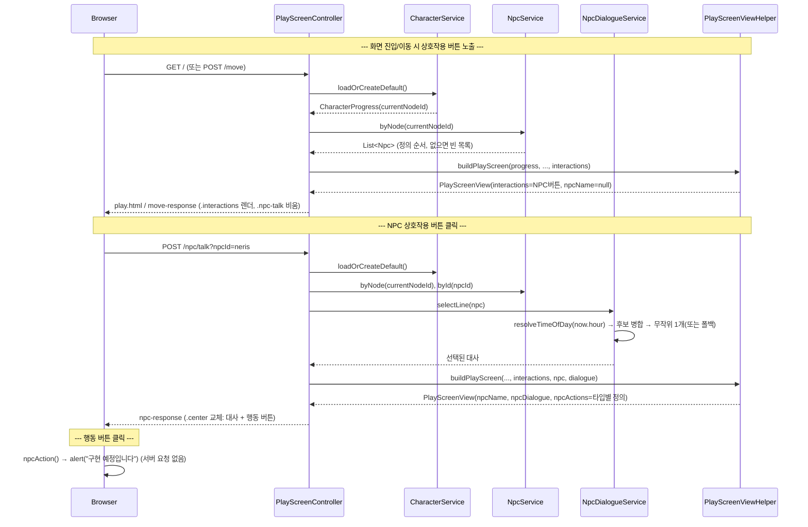

# Design Document

## Overview

본 설계는 `myrpg` Web 모듈(`com.myapps.web.myrpg`)의 두 번째 기능(002)인 **NPC 시스템**을 다룬다. 스펙 001에서 구축한 플레이 화면(서버사이드 렌더링) · 맵 노드 이동 · 캐릭터 진행상황 영속화 위에서 동작하며, 001과 동일한 Spring Boot 4.0 / DDD 계층 구조와 고정 데이터 로딩 방침(고정 데이터는 클래스패스 JSON, 진행상황만 DB)을 그대로 따른다.

이번 스펙은 다음 네 가지를 구현한다.

1. **NPC 고정 데이터 로드** — 티르코네일/던바튼에 배치되는 NPC 10명을 `classpath:data/npc.json`(원본 `docs/npc-dialogue.json` 이관)에서 로드한다. `Npc_Service`가 필수 필드·id 중복·유효 `Npc_Type`을 검증하고, 하나라도 위반하면 기동을 실패시킨다(fail hard, all-or-nothing). DB에는 저장하지 않는다.
2. **NPC 맵 배치 및 상호작용 버튼** — 각 NPC는 `nodeId`로 맵 노드에 배치된다. `PlayScreen_Controller`(001)가 `Current_Node`에 배치된 NPC를 상호작용 버튼 영역(`.interactions`)에 `{name} ({Npc_Type_Label})` 라벨과 `npc` CSS 클래스로 노출한다.
3. **NPC 멘트 선택 및 출력** — NPC 버튼 클릭 시 `Npc_Dialogue_Service`가 현재 실제 시각의 시(0~23)를 반열린 구간으로 `Time_Of_Day`에 매핑하고, `lines.default`와 `lines.byTime[현재 시간대]`를 병합한 후보 풀에서 균등 무작위 1개를 선택한다. 후보가 없으면 성격 기반 폴백 문구를 반환한다. **계절은 사용하지 않는다.** 선택된 대사는 `Npc_Talk_Area`(`.npc-talk`)에 출력된다.
4. **NPC 타입별 행동 버튼** — 멘트 칸 하단에 해당 NPC 타입의 `Npc_Action_Definition`에 대응하는 행동 버튼을 가로로 배치한다. 1차 구현에서는 클릭 시 `alert`로 "구현 예정입니다"만 표시한다.

### 핵심 설계 결정

#### 결정 1: 001의 NPC 렌더링 훅 재사용

001 구현은 이미 NPC 시스템을 위한 확장 지점을 마련해 두었다.

| 001에서 마련된 훅 | 002에서의 활용 |
|---|---|
| `InteractionItem(name, npc)` DTO | NPC 상호작용 버튼 항목. **NPC 식별을 위해 `id` 필드 추가** |
| `PlayScreenView`의 `npcName`, `npcDialogue`, `interactions` 필드 | NPC 대사/이름/버튼 목록 채움. **행동 버튼용 `npcActions` 필드 추가** |
| `center.html`의 `.npc-talk`, `.npc-name`, `.interactions` 마크업 | 대사·이름·상호작용 버튼 렌더링에 그대로 사용. **`.npc-actions` 영역 추가** |
| `Clock` / `Random` 빈 (`ApplicationServiceConfiguration`) | `Npc_Dialogue_Service`의 시각 산출·무작위 선택에 주입(001 `AmbienceService`와 동일 패턴) |

따라서 002는 신규 도메인/서비스 추가와 기존 뷰 모델·템플릿·JS의 **점진적 확장**으로 성립하며, 001의 레이아웃·상호작용을 깨지 않는다.

#### 결정 2: 대사 선택은 서버사이드 (001 `AmbienceService`와 동형)

상호작용 버튼 클릭 → 대사 출력은 `move`와 동일하게 **서버 라운드트립**으로 처리한다. 시각 기반 매핑·무작위 선택은 서버(`Npc_Dialogue_Service`)가 수행해야 하므로(Req 3.1, 3.4), 클라이언트는 NPC id로 서버에 요청하고, 서버가 대사를 선택하여 갱신된 `.center` 프래그먼트를 반환한다. JS는 001의 `move()`와 동일한 방식으로 `.center`를 교체한다. 이로써 계절·시간대 로직이 001 `AmbienceService`와 같은 위치(애플리케이션 서비스)에 놓이고, 무작위성은 주입된 `Random`으로 테스트 가능해진다.

#### 결정 3: `Npc_Type`을 라벨·행동 정의의 단일 소스로

`Npc_Type_Label`(Req 5.2)과 `Npc_Action_Definition`(Req 5.3)은 각각 정확히 한 곳에서 관리되어야 한다. 두 매핑을 **`NpcType` enum 상수에 함께 내장**하여 단일 소스로 삼는다. 신규 타입 추가 = enum 상수 1개 추가(라벨·행동 라벨을 상수 정의에서 강제)이며, 라벨·행동 정의 누락은 **컴파일 에러**가 되므로 Req 5.5(매핑 부재 방지)를 구조적으로 보장한다. `Time_Of_Day` 경계 역시 `TimeOfDay` enum에 단일 소스로 둔다.

> **마이그레이션 방침**: `docs/npc-dialogue.json`을 `myrpg/src/main/resources/data/npc.json`으로 이관할 때 `npcs` 배열만 권위 데이터로 유지한다. 원본의 `typeLabels`·`timeOfDay` 메타데이터는 코드(enum)로 단일화되므로 리소스에서는 제거하여 매핑이 두 곳에 존재하지 않도록 한다.

## Architecture

### 모듈 위치 및 계층 (002 추가분)

001과 동일한 DDD 4계층에 아래 파일을 추가/확장한다. **[신규]**는 새로 만드는 파일, **[확장]**은 001 산출물 수정이다.

```
myrpg/src/
├── main/java/com/myapps/web/myrpg/
│   ├── interfaces/api/
│   │   ├── PlayScreenController.java      # [확장] POST /npc/talk 추가, interactions 채움
│   │   └── PlayScreenViewHelper.java      # [확장] interactions·NPC 대사·행동 버튼 조립
│   ├── application/
│   │   ├── service/
│   │   │   ├── NpcService.java            # [신규] npc.json 로드/검증, 노드별 조회
│   │   │   └── NpcDialogueService.java    # [신규] 시간대 매핑 + 후보 병합 + 무작위 선택
│   │   ├── dto/
│   │   │   ├── InteractionItem.java       # [확장] id 필드 추가
│   │   │   ├── PlayScreenView.java        # [확장] npcActions 필드 추가
│   │   │   └── NpcActionButton.java       # [신규] 행동 버튼 뷰 모델(record)
│   │   └── exception/
│   │       └── NpcDataException.java      # [신규] NPC 데이터 로드/검증 실패
│   └── domain/
│       └── model/
│           ├── Npc.java                   # [신규] NPC 도메인 record
│           ├── NpcLines.java              # [신규] 대사 풀 record (default, byTime)
│           ├── NpcType.java               # [신규] enum: typeString + label + actionLabels
│           └── TimeOfDay.java             # [신규] enum: 반열린 구간 경계 단일 소스
└── main/resources/
    ├── data/
    │   └── npc.json                       # [신규] docs/npc-dialogue.json 이관(npcs만)
    ├── static/
    │   └── js/myrpg.js                    # [확장] talkToNpc(id), npcAction() alert 추가
    └── templates/fragments/
        ├── center.html                    # [확장] .npc-actions 영역 추가
        └── npc-response.html              # [신규] .center 교체용 프래그먼트 래퍼
```

### 요청 흐름



### 고정 데이터 로딩 (001 `MapService`/`AmbienceService`와 동형)

- `NpcService`는 기동 시 `@PostConstruct`에서 `classpath:data/npc.json`을 **Jackson 3(`tools.jackson.databind.ObjectMapper`)** 로 1회 파싱하여 불변 `List<Npc>`로 메모리에 보관한다.
- 파싱 실패, 필수 필드(`id`/`name`/`type`/`nodeId`) 누락, `id` 중복, 미지의 `type`(=`Npc_Type` 분류 불가) 중 하나라도 발생하면 `NpcDataException`을 던져 기동을 실패시킨다(Req 1.5, 1.7). 부분 목록은 절대 제공하지 않는다.
- 신규 NPC 추가/대사 수정은 코드 변경 없이 `npc.json` 수정만으로 반영된다(Req 1.1, 5.1).

## Components and Interfaces

### NpcService (application/service) [신규]

```java
List<Npc> all();                    // Req 1.1 전체 NPC 목록(정의 순서, 불변)
List<Npc> byNode(String nodeId);    // Req 2.1, 2.2 해당 노드 NPC(정의 순서), 없으면 빈 목록
Npc byId(String npcId);             // 대사 선택용 단건 조회
```

- `@Service`. 생성자 주입만 사용(`ObjectMapper` 주입, `@Autowired` 금지).
- `@PostConstruct`에서 `npc.json`을 파싱하고 **검증 후** 불변 목록을 구성한다. 검증 항목:
  1. 각 항목의 `id`/`name`/`type`/`nodeId` 존재 및 비어있지 않음(Req 1.5).
  2. `id` 전역 유일성(Req 1.5).
  3. `type`이 `NpcType.fromType(...)`으로 분류 가능(Req 1.4, 1.7).
- 위반 시 `NpcDataException`(기동 실패). `byNode`는 알 수 없는/미일치 노드 id에 대해 오류 없이 빈 목록을 반환한다(Req 2.2).
- DB 접근 없음(Req 1.6, 5.1).

### NpcDialogueService (application/service) [신규]

```java
String selectLine(Npc npc);          // Req 3.1~3.5 현재 시각 기준 대사 1개 선택
String selectLine(Npc npc, int hour); // 테스트용 오버로드(시각 주입)
```

- `@Service`. `Clock`·`Random` 주입(001 `AmbienceService`와 동일 빈 재사용, 테스트 시 고정 시각·시드 주입 가능).
- 절차:
  1. `TimeOfDay tod = TimeOfDay.fromHour(LocalDateTime.now(clock).getHour())` (Req 3.1).
  2. `Dialogue_Candidate_Pool = npc.lines().default() ++ npc.lines().byTime().getOrDefault(tod.key(), [])` — 순서 보존, 누락·중복 제거 없음(Req 3.2). `byTime`에 키가 없거나 빈 목록이면 `default`만 사용(Req 3.3).
  3. 풀이 비어 있지 않으면 `pool.get(random.nextInt(pool.size()))`로 균등 무작위 선택(Req 3.4).
  4. 풀이 비어 있으면 `personalityFallback(npc)`을 반환(비어 있지 않은 단일 문자열, Req 3.5).
- **계절 정보를 입력·사용하지 않는다**(Req 3.8) — 메서드 시그니처와 내부 로직에 season 개념이 존재하지 않는다.
- `personalityFallback(npc)`: 요구사항이 정확한 문구를 명시하지 않으므로, npc의 `name`을 사용하는 결정적 비어있지 않은 기본 문구(예: `"%s은(는) 말없이 고개를 끄덕인다.".formatted(npc.name())`)를 문서화된 확장 지점으로 둔다. — *설계 보완 항목(요구사항 미명시)*.

### PlayScreenController (interfaces/api) [확장]

001의 컨트롤러에 다음을 추가한다.

- **`GET /`, `POST /move`**: 뷰 조립 시 `npcService.byNode(currentNodeId)` 결과를 `InteractionItem` 목록으로 변환하여 `.interactions`에 노출한다(Req 2.3, 2.7). 대사·행동 버튼은 비운다(`npcName=null` → Req 4.7).
- **`POST /npc/talk` (param `npcId`)** [신규 엔드포인트]:
  1. `characterService.loadOrCreateDefault()`로 현재 노드 확인 → `byNode`로 상호작용 버튼 재구성(전환 가능하도록 유지).
  2. `npcService.byId(npcId)`로 대상 NPC 조회 → `npcDialogueService.selectLine(npc)`로 대사 선택.
  3. `PlayScreenViewHelper`로 `npcName`·`npcDialogue`·`npcActions`(NPC 타입 행동 정의) 채운 뷰 조립.
  4. `.center`만 교체하는 `fragments/npc-response`를 반환. 이전 이름·대사·행동 버튼은 새 값으로 완전히 교체된다(Req 3.7, 4.6).
- 라벨 조립: `InteractionItem`의 라벨은 `npc.name() + " (" + npc.type().label() + ")"`(Req 2.4). NPC 항목은 `npc=true`로 `.npc` 클래스가 적용된다(Req 2.5).

### PlayScreenViewHelper (interfaces/api) [확장]

001의 `buildPlayScreen(progress, minimap, fullMap, ambience, logs)`를 상호작용/NPC 대사 인자를 받도록 확장한다.

```java
PlayScreenView buildPlayScreen(CharacterProgress progress,
                               MinimapView minimap,
                               FullMapView fullMap,
                               String ambience,
                               List<InteractionItem> interactions,  // NPC 버튼(정의 순서)
                               Npc talkingNpc,                      // 대사 대상(없으면 null)
                               String dialogue,                     // 선택된 대사(없으면 null)
                               List<ActionLogEntry> logs);
```

- `talkingNpc == null`이면 `npcName`/`npcDialogue`/`npcActions`를 모두 비운다(Req 4.7: 대사 없으면 행동 버튼 없음).
- `talkingNpc != null`이면 `npcName=talkingNpc.name()`, `npcDialogue=dialogue`, `npcActions`는 `talkingNpc.type().actionLabels()`를 정의 순서대로 `NpcActionButton`으로 변환(Req 4.1~4.3).
- `interactionItem` 라벨 조립(`{name} ({label})`)을 이 헬퍼에서 수행한다(Req 2.4).

### 정적 리소스 / 템플릿 [확장]

- **`center.html`**: 기존 `.npc-talk` 블록 하단에 `.npc-actions` 영역을 추가하여 `view.npcActions`를 `th:each`로 렌더링. 각 버튼은 `onclick="npcAction()"`(alert만). `.interactions`의 NPC 버튼은 `onclick="talkToNpc(item.id)"`로 연결.
- **`npc-response.html`** [신규]: `move-response.html`과 동형이나 `.center`만 교체하는 래퍼(`th:replace="~{fragments/center :: center}"`).
- **`myrpg.js`** [확장]: 001의 `move()`와 동일 패턴의 `talkToNpc(npcId)`(POST `/npc/talk` → `.center` swap)와 `npcAction()`(단순 `alert("구현 예정입니다")`, 서버 요청·DOM 변경 없음 — Req 4.4) 추가.
- **`myrpg.css`**: 목업의 `.npc-talk`, `.interactions button.npc` 스타일은 이미 001에서 이관됨. 행동 버튼용 `.npc-actions`(가로 flex, 작은 버튼) 규칙만 목업 디자인 토큰에 맞춰 추가.

## Data Models

### NPC 고정 데이터 모델 (비영속, JSON 로드)

**Npc** (record)

| 필드 | 타입 | 설명 |
|---|---|---|
| `id` | `String` | 인물 식별자(유일) |
| `name` | `String` | 표시 이름 |
| `type` | `NpcType` | 기능 분류(enum) |
| `nodeId` | `String` | 배치된 맵 노드 id |
| `personality` | `String` | 성격 서술(폴백 문구 생성에 활용 가능) |
| `lines` | `NpcLines` | 대사 풀 |

**NpcLines** (record): `List<String> defaultLines, Map<String, List<String>> byTime`
- `defaultLines`는 JSON의 `lines.default`에 매핑(`default`는 Java 예약어이므로 필드명은 `defaultLines`, `@JsonProperty("default")` 또는 파서에서 명시 매핑).
- `byTime` 키는 `Time_Of_Day` 키 문자열(`dawn`/`morning`/...).

**NpcType** (enum — 라벨·행동 정의의 단일 소스, Req 5.2, 5.3)

| 상수 | typeString | label(`Npc_Type_Label`) | actionLabels(`Npc_Action_Definition`) |
|---|---|---|---|
| `CHIEF` | `chief` | `촌장` | [`퀘스트`] |
| `BLACKSMITH` | `blacksmith` | `대장간` | [`상점`, `수리`] |
| `MAGIC_SCHOOL` | `magic-school` | `마법학교` | [`상점`] |
| `SCHOOL` | `school` | `학교` | [`상점`] |
| `HEALER` | `healer` | `힐러집` | [`상점`, `치료받기`] |
| `BANK` | `bank` | `은행` | [`아이템 보관`, `골드 입/출금`] |

```java
public enum NpcType {
    CHIEF("chief", "촌장", List.of("퀘스트")),
    BLACKSMITH("blacksmith", "대장간", List.of("상점", "수리")),
    MAGIC_SCHOOL("magic-school", "마법학교", List.of("상점")),
    SCHOOL("school", "학교", List.of("상점")),
    HEALER("healer", "힐러집", List.of("상점", "치료받기")),
    BANK("bank", "은행", List.of("아이템 보관", "골드 입/출금"));
    // typeString, label, actionLabels 필드 + fromType(String) -> Optional<NpcType>
}
```
- `fromType`은 미지 타입에 빈 `Optional`을 반환(001 `NodeType.fromType`과 동일 패턴). `NpcService`는 이를 사용해 유효성 검증(Req 1.4, 1.7).
- 신규 타입 추가 시 상수 1개 추가로 라벨·행동 정의가 함께 정의되며(Req 5.2, 5.3), 기존 6개 상수의 분류·라벨·행동은 불변(Req 5.4). 라벨·행동 누락은 컴파일 불가(Req 5.5).

**TimeOfDay** (enum — 반열린 구간 경계 단일 소스, Req 3.1)

| 상수 | key | 구간(반열림) |
|---|---|---|
| `LATE_NIGHT` | `late-night` | `[0, 5)` |
| `DAWN` | `dawn` | `[5, 8)` |
| `MORNING` | `morning` | `[8, 12)` |
| `AFTERNOON` | `afternoon` | `[12, 16)` |
| `LATE_AFTERNOON` | `late-afternoon` | `[16, 19)` |
| `NIGHT` | `night` | `[19, 24)` |

- `fromHour(int hour)`는 `from <= hour < to`인 상수를 정확히 하나 반환한다. 6개 구간이 `[0,24)`를 빈틈·중복 없이 분할하므로 0~23의 모든 시각에 유일한 결과가 대응한다.

### 뷰 모델 (record, 컨트롤러→Thymeleaf)

**InteractionItem** [확장 — `id` 추가]

```java
public record InteractionItem(String id, String name, boolean npc) {}
```
- NPC 항목: `id=npc.id()`, `name="{name} ({label})"`, `npc=true`. 몬스터(향후): `id=null`, `npc=false`.

**NpcActionButton** [신규]

```java
public record NpcActionButton(String label) {}
```
- 향후 실제 기능 연결 시 타입/액션 키 확장 지점. 1차 구현은 라벨만 사용.

**PlayScreenView** [확장 — `npcActions` 추가]

```java
public record PlayScreenView(
        TopBarView topBar, MinimapView minimap, FullMapView fullMap,
        String ambience, String npcName, String npcDialogue,
        List<InteractionItem> interactions,
        List<NpcActionButton> npcActions,   // [추가] 없으면 null/빈 목록
        List<ActionLogEntry> logs) {}
```
- `npcName == null`이면 `.npc-talk`·`.npc-actions` 모두 비운다(Req 4.7).

> NPC 데이터는 DB에 저장하지 않는다(Req 1.6, 5.1). 진행상황(001 `CharacterProgress`)만 영속한다.


## Correctness Properties

*프로퍼티(property)는 시스템의 모든 유효한 실행에서 참이어야 하는 특성/동작으로, 시스템이 무엇을 해야 하는지에 대한 형식적 진술이다. 프로퍼티는 사람이 읽는 명세와 기계가 검증 가능한 정확성 보장 사이의 다리 역할을 한다.*

아래 프로퍼티는 위 prework 분석에서 PROPERTY/EDGE_CASE로 분류된 순수 로직(NPC 데이터 파싱·검증, 노드별 조회, 시간대 매핑, 후보 풀 병합, 대사 선택, 타입→라벨/행동 매핑)을 대상으로 하며, 중복은 병합했다. Thymeleaf 렌더링(EXAMPLE)·클라이언트 JS 동작(EXAMPLE)·아키텍처 제약(SMOKE)·고정 데이터 수치(EXAMPLE)는 프로퍼티에서 제외하고 슬라이스/통합/스모크 테스트로 다룬다.

프로퍼티 반영(중복 제거): 1.2/1.4는 파싱 라운드트립(P1)에 흡수, 1.7은 오류 조건(P2)에 병합, 2.2는 노드 조회(P3)의 엣지, 3.3은 후보 풀(P5)의 엣지, 3.5는 대사 선택(P6)에 병합, 4.1/4.2/4.3은 행동 버튼 매핑(P7)으로 통합, 5.2/5.3은 타입 매핑 완전성(P8)으로 통합했다.

### Property 1: NPC 데이터 파싱 라운드트립

*For any* 유효한 NPC 데이터셋(각 항목이 `id`/`name`/`type`(6개 유효값 중 하나)/`nodeId`/`personality`/`lines`를 가지며 `id`가 유일)에 대해, 이를 JSON으로 직렬화한 뒤 `Npc_Service`로 로드하면 모든 Npc의 `id`/`name`/`nodeId`/`personality` 및 `lines.default`·`lines.byTime`의 모든 원소가 순서까지 원본과 동일하게 보존되고, 각 Npc의 `type`은 원본 `type` 문자열에 대응하는 `NpcType`으로 분류된다.

**Validates: Requirements 1.1, 1.2, 1.4**

### Property 2: NPC 데이터 로드 실패 및 무생성(all-or-nothing)

*For any* 유효 데이터셋에 (a) 필수 필드(`id`/`name`/`type`/`nodeId`) 누락, (b) `id` 중복, (c) 6개 중 어느 것도 아닌 `type` 값 중 하나 이상을 주입한 무효 데이터셋에 대해, `Npc_Service` 로드는 `NpcDataException`을 발생시키고 어떤 Npc 목록(부분 목록 포함)도 제공하지 않는다.

**Validates: Requirements 1.5, 1.7**

### Property 3: 노드별 NPC 조회 필터 및 순서

*For any* NPC 목록과 임의의 노드 id(그래프에 존재하지 않는 임의 문자열 포함)에 대해, `byNode(nodeId)`는 `nodeId`가 일치하는 Npc만을 원본(정의) 순서 그대로 반환하며, 일치 항목이 없으면 오류 없이 빈 목록을 반환한다.

**Validates: Requirements 2.1, 2.2**

### Property 4: 상호작용 버튼 라벨 형식

*For any* Npc에 대해, 생성된 `Npc_Interaction_Button`의 라벨은 정확히 `name + " (" + type.label() + ")"` 형식이다(예: `네리스 (대장간)`).

**Validates: Requirements 2.4**

### Property 5: 시각→Time_Of_Day 매핑

*For any* 시각 `hour ∈ [0, 23]`에 대해, `TimeOfDay.fromHour(hour)`는 `from <= hour < to`(반열림)를 만족하는 `Time_Of_Day` 상수를 **정확히 하나** 반환한다. 6개 구간(`late-night`[0,5), `dawn`[5,8), `morning`[8,12), `afternoon`[12,16), `late-afternoon`[16,19), `night`[19,24))이 `[0,24)`를 빈틈·중복 없이 분할하므로 자정을 넘는 구간을 포함하여 모든 시각에 유일한 결과가 대응한다.

**Validates: Requirements 3.1**

### Property 6: 후보 풀 구성

*For any* Npc와 임의의 `Time_Of_Day` `tod`에 대해, `Dialogue_Candidate_Pool`은 `lines.default` 전체 뒤에 `lines.byTime[tod]` 전체를 이어 붙인 목록과 정확히 일치하며(순서·개수 보존, 누락·중복 제거 없음), `byTime`에 `tod` 키가 없거나 그 값이 빈 목록이면 `lines.default`만으로 구성된다.

**Validates: Requirements 3.2, 3.3**

### Property 7: 대사 선택은 항상 유효 결과

*For any* Npc와 임의의 `Time_Of_Day`에 대해, `Npc_Dialogue_Service`의 대사 선택 결과는 (a) `Dialogue_Candidate_Pool`이 비어 있지 않으면 그 풀의 원소이고, (b) 풀이 비어 있으면 비어 있지 않은 단일 문자열인 `Personality_Fallback_Line`이다.

**Validates: Requirements 3.4, 3.5**

### Property 8: 행동 버튼 목록은 타입 정의와 일치

*For any* Npc에 대해, 대사 출력 시 생성되는 `Npc_Action_Button` 라벨 목록은 해당 Npc의 `NpcType.actionLabels()`(=`Npc_Action_Definition`)와 개수·순서·라벨이 정확히 동일하다.

**Validates: Requirements 4.1, 4.2, 4.3**

### Property 9: Npc_Type 매핑 완전성(단일 소스)

*For any* `NpcType` 상수에 대해, `Npc_Type_Label`(`label()`)은 비어 있지 않은 문자열이고 `Npc_Action_Definition`(`actionLabels()`)은 비어 있지 않은 목록이다. 즉 모든 타입이 라벨과 행동 정의를 빠짐없이 보유한다.

**Validates: Requirements 5.2, 5.3, 5.5**

## Error Handling

### 예외 유형 (커스텀 예외, `RuntimeException` 직접 사용 금지)

| 예외 | 발생 지점 | 처리 |
|---|---|---|
| `NpcDataException` | `npc.json` 파싱 실패, 필수 필드 누락, `id` 중복, 미지 `type`(Req 1.5, 1.7) | 애플리케이션 기동 실패(고정 데이터 무결성, all-or-nothing) |

- `NpcDataException`은 001의 `MapDataException`과 동일한 성격(고정 데이터 로드 실패 → 기동 실패)이다. `@PostConstruct` 검증 단계에서 던지며, 부분 로드 상태를 남기지 않는다.
- **미지 `Npc_Type`**: `NpcType.fromType(type)`이 빈 `Optional`을 반환하면 로드 실패로 처리한다(Req 1.7). 데이터 로드 시점에 검증하므로, 이후 렌더링 단계에서는 모든 `Npc.type()`이 유효한 enum 값임이 보장된다.
- **매핑 부재 방지(Req 5.5)**: `Npc_Type_Label`·`Npc_Action_Definition`을 `NpcType` enum 상수에 내장하므로, 신규 타입이 라벨/행동 정의 없이 추가되는 것은 **컴파일 에러**로 차단된다. 런타임에서 매핑이 없는 알려진 타입은 존재할 수 없다(Property 9가 완전성 보증).

### 정상 흐름은 예외가 아님

- **`byNode`의 빈 결과**(Req 2.2): 미일치/미지 노드 id는 오류가 아니라 빈 목록 반환(정상). 렌더링 시 상호작용 버튼이 노출되지 않는다(Req 2.6).
- **대사 후보 부재**(Req 3.5): 후보 풀이 비어도 오류가 아니라 성격 기반 폴백 문구를 반환한다.
- **행동 버튼 클릭**(Req 4.4): 서버 요청 없이 클라이언트 `alert`만 표시하며, 대사·버튼 상태를 변경하지 않는다.

## Testing Strategy

### 이중 테스트 접근

- **단위/예시 테스트**: 고정 데이터 수치(총 10명, 마을별 5명), 실제 라벨·행동 매핑값, 컨트롤러 렌더링(버튼 노출/클래스/교체), JS 동작(alert)은 구체 사례·경계로 검증한다.
- **프로퍼티 테스트(jqwik)**: 위 Correctness Properties 9개의 보편 속성을 무작위 입력으로 광범위 검증한다.
- 두 방식은 상보적이다(예시 테스트는 구체 버그, 프로퍼티 테스트는 일반 정확성).

### 프로퍼티 기반 테스트 (jqwik) 규칙

- 라이브러리: **jqwik**(직접 구현 금지). 각 `@Property`는 최소 **100회** 반복(`@Property(tries = 100)`).
- jqwik은 `@ExtendWith(MockitoExtension.class)`와 비호환 → **`@Mock` 금지**. 필요 시 `Mockito.mock()` 직접 호출.
- 각 프로퍼티 테스트는 대응 설계 프로퍼티를 주석 태그로 참조한다.
  - 태그 형식: **Feature: 002-npc-system, Property {번호}: {프로퍼티 텍스트}**
- 각 Correctness Property는 **단 하나의** 프로퍼티 테스트로 구현한다.
- 생성기(Arbitraries) 설계 포인트:
  - **Npc/데이터셋 생성기**(P1, P2): 유효 `type`(6개 enum) · 임의 `id`/`name`/`nodeId`/`personality` · `lines.default`(0~N개) · `lines.byTime`(임의 `Time_Of_Day` 키 부분집합, 일부 빈 목록/키 부재 포함) 생성. `id` 유일 데이터셋과, 필수 필드 누락·`id` 중복·미지 `type`을 주입한 무효 데이터셋을 각각 생성.
  - **노드 id 생성기**(P3): 데이터셋에 실제 존재하는 `nodeId`와 그래프에 없는 임의 문자열을 모두 포함.
  - **시각 생성기**(P5): 0~23 전 구간(자정 넘김 경계 0/4/5/7/8/11/12/... 포함).
  - **후보 풀 생성기**(P6, P7): `default`·`byTime[tod]`가 채워진/한쪽만/양쪽 모두 빈 케이스로 3.3·3.5 폴백을 커버. 무작위 선택은 시드 고정 `Random` 주입으로 결정화하여 멤버십을 검증.
  - **NpcType 생성기**(P8, P9): `Arbitraries.of(NpcType.values())`로 전 상수 커버.
- **JSON 직렬화**(P1, P2): Jackson 3 `tools.jackson.databind.ObjectMapper`로 생성 데이터셋을 직렬화하여 `NpcService` 로드 경로(`readTree`/`readValue`)에 투입. 파일 시스템 대신 인메모리 문자열/스트림으로 로드 로직을 검증할 수 있도록 파싱 로직을 리소스 로딩과 분리하는 것을 권장한다.

### 슬라이스/통합 테스트 (Spring Boot 4.0)

- **컨트롤러**(Req 2.3, 2.5, 2.6, 2.7, 3.6, 3.7, 4.4, 4.6, 4.7): `@WebMvcTest(PlayScreenController.class)` + `@MockitoBean`(서비스). import `org.springframework.boot.webmvc.test.autoconfigure.WebMvcTest`, `org.springframework.test.context.bean.override.mockito.MockitoBean`.
  - NPC 있는 노드 GET → `.interactions`에 `{name} ({label})` 버튼과 `npc` 클래스 노출, `.npc-talk` 비움 확인.
  - `POST /npc/talk?npcId=` → `.npc-name`·`<p>` 대사·`.npc-actions` 버튼(타입 정의) 노출, 이전 내용 미포함(교체) 확인.
  - `POST /move`로 노드 변경 시 `.interactions`가 새 노드 기준으로 재구성되는지 확인.
- **NPC JSON 로딩**(Req 1.3): 실제 `data/npc.json` 로드 후 총 10명, `tir-chonaill` 5명, `dunbarton` 5명, 각 `type`이 유효 `NpcType`으로 분류되는지 통합 테스트.
- **컨텍스트 로드 스모크**(Req 1.6, 5.1): `@SpringBootTest`로 기동 및 NPC 리소스 로딩 성공, `NpcService`가 DB(Repository) 의존 없이 동작함을 확인.

### 예시/스모크 테스트 (SMOKE/EXAMPLE)

- **실제 매핑값**(Req 4.3, 5.4): 6개 `NpcType`의 `typeString`→`label`·`actionLabels`가 요구사항 표(`chief`→`촌장`/[`퀘스트`] 등)와 정확히 일치하는지 예시 테스트로 고정. 기존 6개 타입의 분류·라벨·행동 안정성 회귀 방지.
- **계절 미사용**(Req 3.8): `NpcDialogueService.selectLine` 시그니처·로직에 season 입력이 없음을 코드 리뷰/설계로 보장(테스트 대상 아님).
- **JS 동작**(Req 4.4, 4.5): `myrpg.js`의 `npcAction()`이 `alert`만 수행하고 서버 호출·DOM 변경이 없음을, `talkToNpc()`가 001 `move()`와 동일하게 `.center`만 교체함을 확인.

### 빌드 검증

- 각 구현 Task 완료 전 `mvn test -pl myrpg` 및 `mvn clean install -pl myrpg -am`로 테스트 통과 + `BUILD SUCCESS`를 확인한다(steering `task-build-validation.md`).
