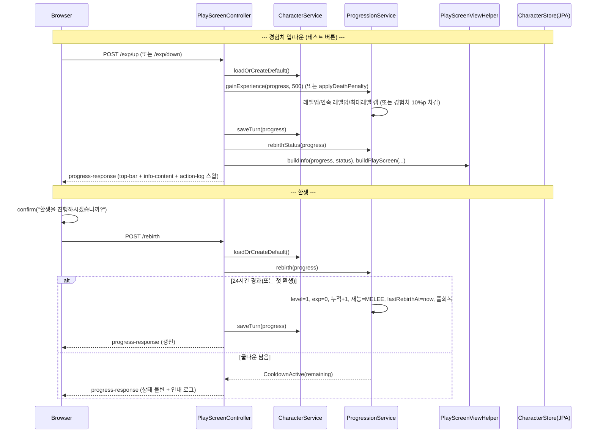

# Design Document

## Overview

본 설계는 `myrpg` Web 모듈(`com.myapps.web.myrpg`)의 세 번째 기능(003)인 **기본 시스템 행동**(경험치·레벨업·스탯 성장·사망 패널티·환생·재능·정보 팝업)을 다룬다. 스펙 001에서 구축한 캐릭터 진행상황 영속화·플레이 화면 SSR·턴제, 002의 NPC 렌더링 훅 위에서 동작하며, 동일한 Spring Boot 4.0 / DDD 4계층 구조를 따른다.

핵심 설계 방향은 다음과 같다.

1. **스탯·최대 바이탈은 저장하지 않고 레벨에서 계산한다.** 요구사항 4(및 `docs/basic-system.md` §3.1)에 따라 `표시 스탯 = 기본값 + 레벨 파생분 + 스킬 랭크업분`으로 계산한다. 레벨 파생분은 `현재레벨`로부터 계산하므로 환생 시 `현재레벨=1`로 되돌리는 것만으로 자동 초기화된다. 스킬 랭크업분의 산출 주체(3순위 스킬 시스템)는 아직 없으므로 본 스펙에서는 **상수 0**으로 취급한다(저장 필드 도입은 스킬 시스템 스펙으로 이연).
2. **진행 규칙은 애플리케이션 서비스(`ProgressionService`)로 캡슐화한다.** 001의 `MovementService`와 동일하게, 서비스가 `CharacterProgress`를 변경하고 결과를 반환하면 컨트롤러가 `CharacterService.saveTurn(...)`으로 저장한다.
3. **경험치 획득/사망은 전투 도입 전까지 임시 테스트 버튼으로 트리거한다.** 경험치 획득/레벨업/사망 패널티는 도메인 규칙으로 구현하고, 좌측 사이드바의 `[경험치 업]`/`[경험치 다운]` 버튼(및 향후 전투)이 이를 호출한다.
4. **환생·캐릭터 정보는 정보 팝업(상/중/하 3구역)으로 제공한다.** 001의 `panel-popup`(장비/인벤/스킬 공용 placeholder)과 별도로, 서버 렌더링 데이터를 담은 정보 팝업 fragment를 신규 도입한다. 환생은 클라이언트 `confirm` 후 `POST /rebirth`로 처리하며, 서버가 24시간 조건을 재검증한다.

### 001 모델 리팩터링이 필요한 이유

001의 `CharacterProgress`는 스탯(`Stats` `@Embeddable`)과 HP/MP/Stamina(`Vital(current, max)` `@Embeddable`)의 **총량을 직접 저장**한다. 그러나 본 스펙은 "레벨 파생 스탯을 저장하지 않고 계산"(Req 4.2)하고 "환생 시 레벨 스탯만 초기화, 스킬 스탯 유지"(Req 8.4)를 요구한다. 따라서 저장 총량을 계산 방식으로 전환한다.

| 항목 | 001(현재) | 003(변경) |
|---|---|---|
| 스탯(STR/DEX/INT/Critical/DEF) | `Stats` 총량 저장 | **저장 안 함** — 레벨에서 계산(`StatProgression`) |
| Critical 표현 | `int`(5) | 0.1% 단위 정수 계산(기본 50 = 5.0%) |
| HP/MP/Stamina 최대치 | `Vital.max` 저장 | **저장 안 함** — 레벨에서 계산 |
| HP/MP/Stamina 현재치 | `Vital.current` 저장 | 현재치만 정수로 저장 |
| 재능 | 없음 | `TalentType talent` 저장(기본 `MELEE`) |
| 마지막 환생 시각 | 없음 | `LocalDateTime lastRebirthAt` 저장(nullable) |
| 경험치 곡선 | `level × 100` | `100 × level²` |

> 개발/로컬은 H2 + `ddl-auto`(create/update) 환경이며 싱글 플레이어(레코드 1개)이므로 스키마 재생성 비용은 무시할 수 있다. 본 변경으로 영향받는 001 산출물/테스트는 아래 "Migration 영향 범위"에 정리한다.

## Architecture

### 모듈 추가/변경 (003)

001/002와 동일한 DDD 4계층에 아래 파일을 추가/확장한다. **[신규]**는 새 파일, **[확장]**은 기존 산출물 수정이다.

```
myrpg/src/
├── main/java/com/myapps/web/myrpg/
│   ├── interfaces/api/
│   │   ├── PlayScreenController.java          # [확장] GET / 뷰에 info 포함, POST /exp/up, /exp/down, /rebirth 추가
│   │   └── PlayScreenViewHelper.java          # [확장] buildInfo(), 최대레벨 EXP MAX 처리, critical 포맷
│   ├── application/
│   │   ├── service/
│   │   │   └── ProgressionService.java        # [신규] 경험치/레벨업/사망/환생 규칙 + 쿨다운 판정
│   │   └── dto/
│   │       ├── InfoPopupView.java             # [신규] 정보 팝업 뷰 모델(상/중/하)
│   │       ├── StatLine.java                  # [신규] 스탯 한 줄(label, value, bonus)
│   │       ├── RebirthStatus.java             # [신규] 환생 가능 여부/경과/잔여
│   │       ├── LevelUpResult.java             # [신규] 레벨업 결과(획득 레벨 수, 최종 레벨)
│   │       ├── DeathResult.java               # [신규] 사망 패널티 결과(차감 경험치)
│   │       ├── RebirthResult.java             # [신규] sealed: Reborn / CooldownActive
│   │       └── PlayScreenView.java            # [확장] info 필드 추가
│   └── domain/
│       ├── model/
│       │   ├── CharacterProgress.java         # [확장] talent/lastRebirthAt/현재 바이탈 정수, 스탯·최대 저장 제거
│       │   ├── Stats.java                     # [확장] @Embeddable 제거(순수 VO), critical=0.1% 단위 의미
│       │   ├── Vital.java                     # [확장] @Embeddable 제거(표시 VO: current/max)
│       │   ├── TalentType.java                # [신규] enum(MELEE/ARCHERY/MAGIC + 한글 라벨)
│       │   ├── StatProgression.java           # [신규] 레벨→스탯/최대바이탈 계산(순수)
│       │   └── ExperiencePolicy.java          # [확장] requiredForNext = 100 × level²
│       └── service/
│           └── DomainServiceConfiguration.java # [확장] StatProgression 빈 등록
└── main/resources/
    ├── static/
    │   ├── js/myrpg.js                        # [확장] openInfo/closeInfo, expUp/expDown, rebirth(confirm)
    │   └── css/myrpg.css                      # [확장] 정보 팝업 상/중/하 스타일(디자인 토큰 재사용)
    └── templates/
        ├── play.html                          # [확장] info-popup fragment include
        └── fragments/
            ├── left-sidebar.html              # [확장] 정보 버튼 아래 [경험치 업]/[경험치 다운]
            ├── info-popup.html                # [신규] 정보 팝업(overlay + info-content)
            └── progress-response.html         # [신규] top-bar + info-content + action-log 스왑 응답
```

### 요청 흐름



### 스탯 계산 방식 (핵심)

```
Level_Stat(레벨 L)  = 기본값 + 레벨파생(L)              # 정보 팝업 본체 수치
  레벨파생(L) = 레벨업당증가 × (L - 1)
Skill_Rankup_Bonus  = 0 (현 시점; 스킬 시스템에서 산출)  # 정보 팝업 괄호 수치
실효 스탯           = Level_Stat + Skill_Rankup_Bonus

STR/DEX/INT (Level_Stat) = 10 + 3 × (L-1)
Critical(0.1%단위)       = 50 + 3 × (L-1)      # 표시 = 값/10 → "X.X%"
DEF                      = 5 + 1 × (L-1)
HP/MP/Stamina 최대치      = 100 + 10 × (L-1) (+ 스킬 바이탈 보너스=0)
현재 바이탈 = 저장(정수). 레벨업·환생 시 최대치로 풀회복.
```

- **정보 팝업 중앙은 각 스탯을 `Level_Stat (+Skill_Rankup_Bonus)` 형식으로 분리 표기**한다(예: `STR 23 (+11)`). 본체(`23`)는 스킬 보너스를 제외한 값이고, 괄호(`+11`)는 스킬 랭크업분이다. 현 시점 스킬 보너스는 0이므로 괄호는 `+0`(Critical은 `+0.0%`)로 표시된다.
- 레벨 파생분을 저장하지 않으므로 환생(L→1) 시 Level_Stat이 기본값으로 자동 복귀한다.
- Skill_Rankup_Bonus는 현재 상수 0이며 환생에 영향받지 않는다. 스킬 시스템(3순위) 도입 시 이 별도 항에 값이 채워지고 저장 필드가 추가된다.

## Components and Interfaces

### CharacterProgress (domain/model) [확장]

`@Entity`. 저장 필드를 아래로 재정의한다.

| 필드 | 타입 | 설명 |
|---|---|---|
| `id` | `Long` | 식별자(기존) |
| `nickname` | `String` | 닉네임(기존) |
| `currentLevel` | `int` | 현재 레벨 1~100 |
| `accumulatedLevel` | `int` | 누적 레벨(신규 1) |
| `experience` | `long` | 현재 레벨 경험치 |
| `talent` | `TalentType` | 재능(`@Enumerated(STRING)`, 신규 `MELEE`) |
| `lastRebirthAt` | `LocalDateTime` | 마지막 환생 시각(nullable) |
| `hpCurrent` / `mpCurrent` / `staminaCurrent` | `int` | 현재 바이탈(최대치는 계산) |
| `currentNodeId` | `String` | 현재 노드 id(기존) |

- 저장에서 **제거**: `Stats stats`, `Vital hp/mp/stamina`(총량/최대).
- `createDefault()`: 닉네임 `고니`, Lv1/누적1/EXP0, 재능 `MELEE`, `lastRebirthAt=null`, 현재 바이탈 100/100/100, 노드 `tir-chonaill`.
- 의도를 드러내는 mutator만 노출(setter 남용 금지): `setCurrentLevel(int)`, `increaseAccumulatedLevel(int)`, `setExperience(long)`, `setTalent(TalentType)`, `setLastRebirthAt(LocalDateTime)`, `fullRecover(int max)`(hp/mp/stamina 현재치를 max로), 기존 `updateCurrentNodeId`.

### StatProgression (domain/model) [신규, 순수]

레벨로부터 스탯과 최대 바이탈을 계산하는 순수 정책. `DomainServiceConfiguration`에 빈 등록(001 `ExperiencePolicy` 패턴).

```java
Stats levelStatsFor(int level);     // Level_Stat: 기본값 + 레벨파생 (critical 0.1%단위, 스킬 보너스 제외)
int   vitalMaxFor(int level);       // 100 + 10 × (level-1) (스킬 바이탈 보너스=0)
```

- `levelStatsFor`는 **스킬 보너스를 포함하지 않는다**(정보 팝업 본체 수치 = Level_Stat).
- 스킬 랭크업분은 별도 소스에서 온다. 현 시점에는 `Stats.ZERO`(모든 값 0) 상수를 사용하며, 스킬 시스템(3순위) 도입 시 캐릭터별 산출로 대체된다.
- 기본값·레벨업당 증가는 `private static final` 상수로 관리(매직 넘버 금지).

### ExperiencePolicy (domain/model) [확장]

```java
long requiredForNext(int level);    // 100L × level × level
```

- `level=100`(최대) 이상은 사용하지 않는다(호출 측에서 최대레벨 캡 처리).

### Stats / Vital (domain/model) [확장]

- `Stats(int str, int dex, int intelligence, int critical, int defense)` — `@Embeddable` 제거, 순수 표시 VO. `critical`은 0.1% 단위 정수.
- `Vital(int current, int max)` — `@Embeddable` 제거, 표시 VO. `current`는 엔티티가 저장, `max`는 계산값을 담아 조립.

### TalentType (domain/model) [신규]

```java
public enum TalentType {
    MELEE("근접전투"), ARCHERY("활"), MAGIC("마법");
    // label 필드 + label() 접근자
}
```

- 본 스펙에서 실제 사용 값은 `MELEE`. `ARCHERY`/`MAGIC`은 재능 시스템(2순위)을 위해 정의만 유지(Req 9.1).
- 라벨은 정보 팝업의 재능 표시(`Talent_Label`)에 사용.

### ProgressionService (application/service) [신규]

`@Service`. 생성자 주입(`ExperiencePolicy`, `StatProgression`, `Clock`). 001 `MovementService`처럼 `CharacterProgress`를 변경하고 결과를 반환하며, 저장은 컨트롤러가 `CharacterService.saveTurn`으로 수행한다.

```java
LevelUpResult gainExperience(CharacterProgress p, long amount);   // Req 2, 3, 1.2
DeathResult   applyDeathPenalty(CharacterProgress p);             // Req 6
RebirthStatus rebirthStatus(CharacterProgress p);                 // Req 7, 10.5~10.7
RebirthResult rebirth(CharacterProgress p);                       // Req 7, 8, 9.3
```

- `gainExperience`:
  1. `currentLevel == MAX(100)`이면 아무 변경 없이 `LevelUpResult(0, MAX)` 반환(경험치 미누적, Req 2.4).
  2. `exp += amount`. `while (level < MAX && exp >= requiredForNext(level)) { exp -= requiredForNext(level); level++; gained++; }` (연속 레벨업, Req 2.2/2.3).
  3. `level == MAX`가 되면 잔여 `exp = 0`(초과분 폐기, Req 2.4).
  4. 변경 반영: `setExperience(exp)`, `gained>0`이면 `setCurrentLevel(level)` + `increaseAccumulatedLevel(gained)`(Req 1.2) + `fullRecover(vitalMaxFor(level))`(Req 3.3/3.4).
- `applyDeathPenalty`:
  - `level == MAX`면 변화 없음(`DeathResult(0)`, Req 6.4).
  - `loss = floor(requiredForNext(level) × 0.10)`; `newExp = max(0, exp - loss)`; `setExperience(newExp)`; 레벨/누적/재능 불변(Req 6.1~6.3). 반환은 실제 차감량 `exp - newExp`.
- `rebirthStatus`:
  - `now = LocalDateTime.now(clock)`. `lastRebirthAt == null`이면 `available=true, everRebirthed=false`(Req 7.1). 아니면 `elapsed = Duration(lastRebirthAt→now)`, `available = elapsed >= 24h`, `remaining = 24h - elapsed`(Req 7.2/7.3).
- `rebirth`:
  - `rebirthStatus(p).available == false`면 `CooldownActive(remaining)` 반환(상태 불변, Req 7.3, 10.9/10.11).
  - 아니면 `setCurrentLevel(1)`, `setExperience(0)`, `increaseAccumulatedLevel(1)`(Req 8.2), `setTalent(MELEE)`(Req 8.6/9.3), `setLastRebirthAt(now)`, `fullRecover(vitalMaxFor(1))`(Req 8.5); `Reborn` 반환. 레벨 파생 스탯은 `level=1`로 자동 초기화(Req 8.3), 스킬 랭크업분(0)은 그대로(Req 8.4).

### 결과/상태 타입 (application/dto) [신규]

- `LevelUpResult(int levelsGained, int newLevel)`
- `DeathResult(long experienceLost)`
- `RebirthStatus(boolean available, boolean everRebirthed, Duration elapsed, Duration remaining)` — `elapsed`/`remaining`은 상황에 따라 null 가능.
- `RebirthResult` **sealed**: `Reborn` / `CooldownActive(Duration remaining)` (정상 흐름의 거부는 예외가 아님, 001 `MovementResult` 패턴).

### PlayScreenController (interfaces/api) [확장]

- **`GET /`**: 기존 조립에 `info`(InfoPopupView)를 포함한다. `rebirthStatus`를 조회해 헬퍼에 전달.
- **`POST /exp/up`**: `loadOrCreateDefault()` → `progressionService.gainExperience(p, 500)` → `saveTurn` → 피드백 로그 추가(예: `경험치 500 획득`, 레벨업 시 `레벨업! Lv.N`) → `progress-response` 반환.
- **`POST /exp/down`**: `applyDeathPenalty(p)` → `saveTurn` → 피드백 로그(예: `사망 패널티: 경험치 -X`) → `progress-response`.
- **`POST /rebirth`**: `rebirth(p)` → `Reborn`이면 `saveTurn` + 로그(`환생했습니다`), `CooldownActive`면 저장 없이 로그(`환생까지 N시간 M분 남았습니다`) → `progress-response`.
- 테스트 버튼의 고정 획득량 500은 컨트롤러 상수(`private static final long TEST_EXP_AMOUNT = 500L;`)로 둔다(Req 12.3).
- 피드백 로그는 001 `ActionLog`(세션 스코프, 최대 10개)를 재사용한다(UX 피드백 목적의 설계 선택).

### PlayScreenViewHelper (interfaces/api) [확장]

- 생성자에 `StatProgression` 추가 주입(스탯/최대바이탈 계산).
- `buildTopBar`: 최대레벨(100)이면 EXP 게이지를 `percent=100`, `overlay="MAX"`로 구성(Req 2.5). 미만이면 기존대로 `experience / requiredForNext(level)`(Req 2.6). HP/MP/Stamina 게이지는 `현재치(저장) / vitalMaxFor(level)`로 조립.
- `buildInfo(CharacterProgress p, RebirthStatus status)` → `InfoPopupView`:
  - 상단: nickname, currentLevel, accumulatedLevel, `talent.label()`, HP/MP/Stamina `GaugeView`(현재/최대).
  - 중앙: `levelStatsFor(level)`(본체)와 스킬 보너스(`Stats.ZERO`)로 `StatLine` 목록(STR/DEX/INT/CRIT/DEF)을 구성. 정수 스탯은 본체 `"23"`·괄호 `"+11"`, Critical은 본체 `formatCritical(v)`(`"34.7%"`)·괄호 `formatCriticalDelta(b)`(`"+0.0%"`).
  - 하단: `rebirthAvailable = status.available`, `rebirthElapsedText`(everRebirthed면 `"환생 후 {H}시간 {M}분 경과"`, 아니면 `"환생 기록 없음"`).
- `formatCritical(int tenths)`: `tenths/10 + "." + tenths%10 + "%"`(Req 5.4). `formatCriticalDelta(int tenths)`: `"+" + formatCritical(tenths)`. 정수 스탯 괄호는 `"+" + bonus`. 매직 넘버 상수화.
- `buildPlayScreen(...)`에 `InfoPopupView info` 인자 추가(모든 호출 경로에서 info 조립).

### 정적 리소스 / 템플릿 [확장/신규]

- **`left-sidebar.html`** [확장]: 정보 버튼을 `onclick="openInfo()"`로 바꾸고, 그 아래에 `[경험치 업] onclick="expUp()"`, `[경험치 다운] onclick="expDown()"` 버튼 추가(Req 12.1). 장비/인벤/스킬은 기존 `openPanel(...)` 유지.
- **`info-popup.html`** [신규]: `th:fragment="info-popup"` 오버레이(`id="infoOverlay"`) 안에 `th:fragment="info-content"`(`id="infoContent"`)를 두어 상/중/하 3구역을 `view.info`로 렌더링.
  - 하단 [환생하기] 버튼: `th:attr="disabled=${view.info.rebirthAvailable} ? null : 'disabled'"`, `onclick="rebirth()"`(Req 10.5/10.6). 경과시간 텍스트 `th:text="${view.info.rebirthElapsedText}"`.
- **`progress-response.html`** [신규]: `top-bar`, `info-content`, `action-log`를 담는 스왑 응답. `POST /exp/up`, `/exp/down`, `/rebirth`가 반환.
- **`play.html`** [확장]: `panel-popup`(장비/인벤/스킬 공용) 옆에 `info-popup` fragment include 추가.
- **`myrpg.js`** [확장]:
  - `openInfo()/closeInfo()`: `#infoOverlay` open 토글(기존 `openPanel/closePanel` 패턴).
  - `expUp()/expDown()`: `POST /exp/up`·`/exp/down` → 응답에서 `.top-bar` replace, `#infoContent` innerHTML 교체, `.action-log` replace(001 `move()` 스왑 패턴 재사용).
  - `rebirth()`: `if (confirm("환생을 진행하시겠습니까?")) { POST /rebirth → 동일 스왑 }`(Req 10.8).
  - `#infoContent`만 교체하여 오버레이 open 상태를 보존한다.
- **`myrpg.css`** [확장]: 정보 팝업 상/중/하 레이아웃과 비활성 버튼 스타일을 기존 `:root` 디자인 토큰으로 추가(Req 10.13).

## Data Models

### 영속 모델 변경 (CharacterProgress)

위 "Components" 표 참조. 저장 필드는 nickname, currentLevel, accumulatedLevel, experience, talent, lastRebirthAt, hpCurrent, mpCurrent, staminaCurrent, currentNodeId. **스탯·최대 바이탈은 저장하지 않는다.**

### 뷰 모델 (record)

- **StatLine**: `String label, String value, String bonus` — 스탯 한 줄. 예: `("STR", "23", "+11")`, `("CRIT", "34.7%", "+0.0%")`. `value`는 Level_Stat, `bonus`는 Skill_Rankup_Bonus(현재 `+0`/`+0.0%`).
- **InfoPopupView**:
  ```java
  record InfoPopupView(
      String nickname, int currentLevel, int accumulatedLevel, String talentLabel,
      GaugeView hp, GaugeView mp, GaugeView stamina,   // 상단
      List<StatLine> stats,                            // 중앙 (STR/DEX/INT/CRIT/DEF 순서)
      boolean rebirthAvailable, String rebirthElapsedText) {}   // 하단
  ```
- **PlayScreenView** [확장]: `InfoPopupView info` 필드 추가(기존 필드 뒤).
- 기존 `GaugeView(current, max, percent, overlay)` 재사용. EXP 최대레벨은 `overlay="MAX"`.

## Correctness Properties

*프로퍼티는 시스템의 모든 유효한 실행에서 참이어야 하는 특성으로, 명세와 기계 검증 사이의 다리 역할을 한다.*

아래 프로퍼티는 순수/결정적 로직(경험치 곡선, 레벨업, 스탯 계산, 사망 패널티, 환생, 쿨다운, 게이지/포맷, 영속 라운드트립)을 대상으로 한다. 템플릿 렌더링·JS 동작·CSS(SMOKE)와 고정 초기값(EXAMPLE)은 프로퍼티에서 제외한다.

### Property 1: 경험치 곡선

*For any* 레벨 `L`(1 이상)에 대해 `requiredForNext(L) = 100 × L²`이며 `L`에 대해 단조 증가한다.

**Validates: Requirements 2.1, 11.5**

### Property 2: 레벨업과 경험치 보존

*For any* 최대레벨 미만의 진행상황과 임의의 획득량 `amount ≥ 0`에 대해, `gainExperience` 후 (최대레벨에 도달하지 않았다면) `experience < requiredForNext(currentLevel)`이고, `획득 레벨 수 = 증가한 currentLevel`이며, `초기 experience + amount = (레벨업으로 소비된 필요치 합) + 최종 experience`가 성립한다.

**Validates: Requirements 2.2, 2.3**

### Property 3: 최대레벨 캡

*For any* 진행상황과 임의의 획득량에 대해, `gainExperience`는 `currentLevel`을 100 이하로만 만들고, `currentLevel == 100`이면 레벨/경험치를 변경하지 않으며(경험치 미누적), 레벨업으로 100에 도달하면 잔여 경험치를 0으로 만든다.

**Validates: Requirements 1.1, 1.5, 2.4**

### Property 4: 누적레벨 불변식

*For any* 레벨업(연속 포함)과 환생의 임의 시퀀스에 대해, `accumulatedLevel`은 레벨업 1회당 +1, 환생 1회당 +1 증가하며 감소하지 않는다. 즉 `accumulatedLevel = currentLevel + (과거 생애에서 도달한 레벨의 합)`을 항상 만족한다.

**Validates: Requirements 1.2, 1.4, 8.2**

### Property 5: 레벨 파생 스탯 계산

*For any* 레벨 `L`(1~100)에 대해 `levelStatsFor(L)`(Level_Stat, 스킬 보너스 제외)는 `STR/DEX/INT = 10 + 3(L-1)`, `Critical(0.1%단위) = 50 + 3(L-1)`, `DEF = 5 + (L-1)`이고, `vitalMaxFor(L) = 100 + 10(L-1)`이다.

**Validates: Requirements 3.1, 3.2, 4.1, 4.2, 4.3, 5.1, 5.2, 5.3**

### Property 6: 레벨업 시 풀회복

*For any* 레벨업이 1회 이상 발생한 `gainExperience` 실행에 대해, 최종 HP/MP/Stamina 현재치는 각각 `vitalMaxFor(최종 레벨)`과 같다(풀회복 1회 적용).

**Validates: Requirements 3.3, 3.4**

### Property 7: 사망 패널티

*For any* 최대레벨 미만의 진행상황에 대해, `applyDeathPenalty` 후 `experience = max(0, 이전 experience - floor(requiredForNext(level) × 0.10))`이고 `currentLevel`·`accumulatedLevel`·재능은 변하지 않는다. 최대레벨에서는 경험치가 변하지 않는다.

**Validates: Requirements 6.1, 6.2, 6.3, 6.4**

### Property 8: 환생 효과

*For any* 환생 가능한 진행상황에 대해, `rebirth` 후 `currentLevel = 1`, `experience = 0`, `accumulatedLevel`은 이전 대비 +1, 재능 = `MELEE`, `lastRebirthAt = now`, HP/MP/Stamina 현재치 = `vitalMaxFor(1)`이며, 표시 스탯은 기본값(레벨 파생 0)으로 복귀한다.

**Validates: Requirements 8.1, 8.2, 8.3, 8.5, 8.6, 9.3**

### Property 9: 환생 쿨다운 판정

*For any* `lastRebirthAt`와 현재 시각에 대해, `rebirthStatus.available`은 (a) `lastRebirthAt == null`이면 참, (b) `now - lastRebirthAt ≥ 24h`이면 참, (c) 그 외 거짓이다. 그리고 `available == false`일 때 `rebirth`는 `CooldownActive`를 반환하고 상태를 변경하지 않는다.

**Validates: Requirements 7.1, 7.2, 7.3, 7.4, 10.9**

### Property 10: 진행상황 영속 라운드트립

*For any* 유효한 `CharacterProgress`(닉네임, 현재/누적 레벨, 경험치, 재능, lastRebirthAt(nullable), 현재 HP/MP/Stamina, 현재 노드 id)에 대해, 저장 후 조회하면 모든 필드가 보존된다.

**Validates: Requirements 11.1, 11.2, 11.4**

### Property 11: Critical 표시 포맷

*For any* 0.1% 단위 정수 `t ≥ 0`에 대해, `formatCritical(t)`는 `"{t/10}.{t%10}%"` 형식이다(예: 50 → `"5.0%"`, 347 → `"34.7%"`).

**Validates: Requirements 5.4**

### Property 12: EXP 게이지와 최대레벨 표기

*For any* 진행상황에 대해, `currentLevel < 100`이면 EXP 게이지 `percent = clamp(round(experience×100/requiredForNext(level)), 0, 100)`이고 오버레이는 `"experience / requiredForNext(level)"`이며, `currentLevel == 100`이면 `percent = 100`이고 오버레이는 `"MAX"`이다.

**Validates: Requirements 2.5, 2.6**

## Error Handling

| 상황 | 처리 |
|---|---|
| 환생 쿨다운 미충족(Req 7.3) | 예외가 아님 — `RebirthResult.CooldownActive(remaining)` 반환, 상태 불변, 안내 로그 |
| 저장 실패(Req 11) | 기존 `CharacterService.saveTurn`이 `CharacterCreationException` 던짐 → `GlobalExceptionHandler` |
| 비활성 조건 우회 환생 요청(Req 10.9) | `POST /rebirth`가 서버에서 `rebirthStatus` 재검증하여 거부 |
| 잘못된 파라미터(예: 음수 amount) | 테스트 버튼은 고정 500만 전송. `gainExperience`는 `amount < 0`을 무시(0 취급) |

- 정상 흐름의 "거부"(쿨다운)는 001의 `MovementResult` 정신에 따라 sealed 결과로 표현하고 예외를 쓰지 않는다.
- 신규 커스텀 예외는 도입하지 않는다(본 스펙의 실패 경로는 저장 실패뿐이며 기존 예외 재사용).

## Testing Strategy

### 이중 테스트 접근

- **프로퍼티 테스트(jqwik)**: 위 Correctness Properties 12개. `@Property(tries = 100)`, `@Mock` 금지(`Mockito.mock()` 직접), 태그 주석 `Feature: 003-character-progression-and-rebirth, Property {번호}: {텍스트}`.
- **단위/예시 테스트**: 신규 캐릭터 기본값(재능 MELEE, 바이탈 100, Critical 5.0%), 곡선 샘플값(L=1→100, 2→400, 10→10000), 사망 패널티 예시(`23/100`→`13/100`, `5/100`→`0/100`), 재능 라벨 매핑, **정보 팝업 StatLine 분리 표기**(예: `StatLine("STR","23","+0")`, `StatLine("CRIT","34.7%","+0.0%")` — 본체=Level_Stat, 괄호=스킬 보너스).

### 생성기(Arbitraries) 설계 포인트

- **진행상황 생성기**: `currentLevel ∈ [1,100]`(경계 1/99/100 포함), `experience ∈ [0, requiredForNext(level))` 및 초과 케이스, `accumulatedLevel ≥ currentLevel`, `lastRebirthAt` null/과거/근접 24h 경계.
- **획득량 생성기**(P2/P3): 작은 값·다중 레벨업 유발 대량 값·0 포함.
- **시각 생성기**(P9): `lastRebirthAt` 대비 `now`가 24h 직전/정각/직후.
- **Critical 포맷**(P11): `t ∈ {0, 5, 50, 53, 347, ...}`.

### 슬라이스/통합 테스트 (Spring Boot 4.0)

- **컨트롤러**(`@WebMvcTest(PlayScreenController.class)` + `@MockitoBean`):
  - `GET /` → info-popup에 상/중/하(닉네임·레벨·누적·재능, STR~DEF, 환생 버튼) 렌더, 최대레벨 시 EXP `MAX`.
  - `POST /exp/up` → 상단바/정보 갱신(레벨/경험치 변화), `POST /exp/down` → 경험치 차감.
  - `POST /rebirth` → 가능 시 레벨 1/재능 MELEE/누적 +1 반영, 쿨다운 시 상태 불변·안내.
  - 좌측 사이드바에 `[경험치 업]/[경험치 다운]` 노출, 정보 버튼 `openInfo()`.
- **영속 라운드트립**(`@DataJpaTest` + `@TestConstructor(ALL)`, Spring Boot 4.0 import): `CharacterProgress` 신규 필드(talent/lastRebirthAt/현재 바이탈) 저장→조회 보존(P10).
- **컨텍스트 로드 스모크**(`@SpringBootTest`): 기동 및 신규 빈(`StatProgression`, `ProgressionService`) 로딩.

### 빌드 검증

- 각 구현 Task 완료 전 `mvn test -pl myrpg` 통과 + `mvn clean install -pl myrpg -am` `BUILD SUCCESS` 확인(steering `task-build-validation.md`).

## Migration 영향 범위 (001 산출물)

본 스펙의 모델 변경으로 아래 001 산출물/테스트를 수정해야 한다(tasks에서 구체화).

- **`CharacterProgress`**: 필드 재정의(스탯·최대바이탈 저장 제거, talent/lastRebirthAt/현재바이탈 추가), `createDefault` 수정, mutator 추가.
- **`Stats` / `Vital`**: `@Embeddable` 제거(순수 VO화), Critical 의미(0.1%단위).
- **`ExperiencePolicy`**: 곡선 교체(`100 × L²`).
- **`PlayScreenViewHelper`**: `StatProgression` 주입, 최대레벨 EXP 처리, HP/MP/Stamina 게이지를 계산 최대치로 조립.
- **영향 테스트**: `CharacterProgressRepositoryTest`, `CharacterServiceDefaultValuesTest`, `CharacterServiceDefaultCreationPropertyTest`, `CharacterServiceLoadExistingPropertyTest`, `CharacterServiceTurnSavePropertyTest`, `PlayScreenViewHelperTest`, `PlayScreenViewHelperGaugePropertyTest` 등 — 신규 모델/곡선/기본값에 맞게 갱신. `MovementService`/맵/NPC 관련 테스트는 영향 없음(현재 노드 id·이동 로직 불변).
