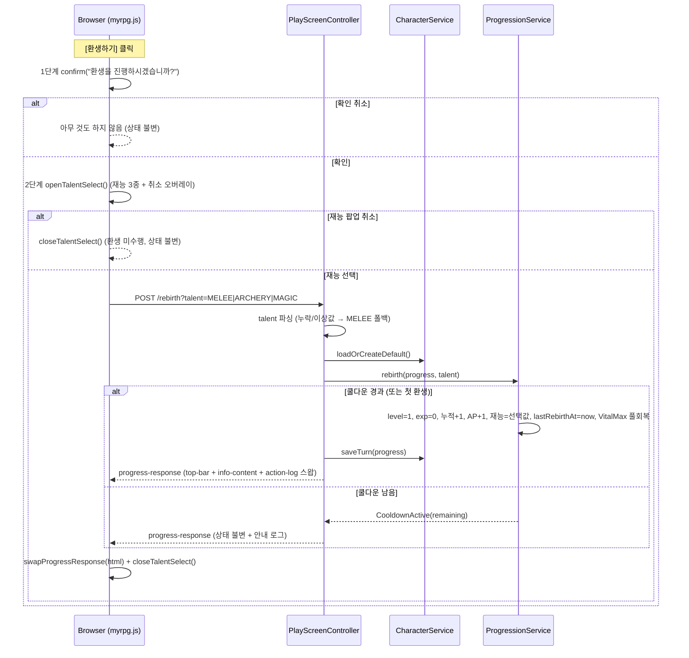

# Design Document

## Overview

본 설계는 `myrpg` Web 모듈(`com.myapps.web.myrpg`)의 네 번째 기능(004)인 **AP(어빌리티 포인트) & 재능 시스템**을 다룬다. 스펙 003(`character-progression-and-rebirth`)이 구축한 레벨/경험치/스탯 계산(`StatProgression`)/사망 패널티/환생(`ProgressionService`)/정보 팝업(`InfoPopupView`) 위에서 동작하며, 동일한 Spring Boot 4.0 / DDD 4계층 구조를 따른다. 상세 설계 배경과 확정 사항은 `docs/talent-system.md`를 근거로 한다.

핵심 설계 방향은 다음과 같다(003 원칙의 확장).

1. **성장은 저장하지 않고 레벨·재능에서 계산한다.** 003이 스탯·바이탈 최대치를 `기본값 + 레벨파생(레벨)`으로 계산하던 것을, 이미 영속 저장되고 한 생애 동안 불변인 `talent`를 인자로 받아 `기본값 + 레벨파생(레벨, 재능)`으로 확장한다. 새 스탯 저장 필드 없이 재능별 성장이 구현되고, 환생(레벨 1 복귀) 시 재능 보너스도 자동 초기화된다.
2. **AP는 잔량을 직접 저장한다.** AP는 소모(스킬 랭크업) 때문에 레벨에서 순수 계산할 수 없으므로 `CharacterProgress`에 `abilityPoints` 컬럼 1개를 추가해 잔량을 저장한다. 지급은 `accumulatedLevel` 증가 시점과 정확히 동기화되어 불변식 `abilityPoints == accumulatedLevel - 1`(소모 전)을 만족한다.
3. **재능 데이터는 `TalentType` enum이 자체 보유한다.** 003에서 라벨만 갖던 `TalentType`을 `NpcType` 선례처럼 라벨·주/보조 보너스·데미지%·효과 요약을 상수에 담는 형태로 확장하고, `MELEE`/`ARCHERY`/`MAGIC` 3종을 모두 실사용으로 승격한다. 별도 JSON 파일을 두지 않는다.
4. **재능 선택은 환생 흐름에 2단계로 통합한다.** 003이 환생 시 재능을 `MELEE`로 고정하던 정책을, `환생 확인 → 재능 택1`의 2단계로 대체한다. 첫 캐릭터는 `MELEE`로 고정하고 최초 선택 UI는 두지 않는다.
5. **전투(7순위)·스킬(3순위) 연계는 훅/시그니처 정의로만 둔다.** 데미지 보너스(+10%)는 `talent.damageBonusPercent()` 접근자만, AP 소모는 `spendAbilityPoints(int)` mutator만 정의하고 실제 적용은 이후 스펙으로 이연한다.

### 003 대비 변경이 필요한 이유 (바이탈별 최대치)

003의 `StatProgression.vitalMaxFor(level)`는 HP/MP/Stamina가 공유하는 **단일 최대치**(`int`)를 반환하고, `CharacterProgress.fullRecover(int max)`도 세 바이탈을 동일 최대치로 회복한다. 그러나 004는 근접(HP)·마법(MP)이 **특정 바이탈만** 올리도록 요구하므로(Req 7·8), 단일 최대치를 **바이탈별 최대치**(`VitalMax(hp, mp, stamina)`)로 분리하는 소규모 리팩터가 필요하다. 이 변경은 도메인 계층 내에 격리되며, 영향받는 003 산출물은 아래 "Migration 영향 범위"에 정리한다.

| 항목 | 003(현재) | 004(변경) |
|---|---|---|
| 최대 바이탈 계산 | `vitalMaxFor(int level) → int` (단일) | `vitalMaxFor(int level, TalentType) → VitalMax` (바이탈별) |
| 스탯 계산 | `levelStatsFor(int level) → Stats` | `levelStatsFor(int level, TalentType) → Stats` 오버로드 추가 |
| 풀회복 | `fullRecover(int max)` | `fullRecover(VitalMax)` |
| 재능 | `MELEE`만 실사용, 라벨만 보유 | 3종 실사용, 보너스/데미지%/요약 보유 |
| 환생 | `rebirth(p)` → `MELEE` 고정 | `rebirth(p, TalentType)` → 선택 재능 |
| AP | 없음 | `abilityPoints` 컬럼 + 지급/소모 mutator |

> 로컬은 H2 파일(`ddl-auto: update`), 프로덕션은 `ddl-auto: create`, 싱글 플레이어(레코드 1개)이므로 스키마 재생성 비용은 무시할 수 있다. 로컬 기존 세이브는 DB 파일 삭제로 초기화한다(Req 14, 아래 "Migration").

## Architecture

### 모듈 추가/변경 (004)

003과 동일한 DDD 4계층에 아래 파일을 추가/확장한다. **[신규]**는 새 파일, **[확장]**은 기존 산출물 수정이다.

```
myrpg/src/
├── main/java/com/myapps/web/myrpg/
│   ├── interfaces/api/
│   │   ├── PlayScreenController.java          # [확장] POST /rebirth 에 talent 파라미터 + 폴백
│   │   └── PlayScreenViewHelper.java          # [확장] 재능 반영 스탯/바이탈 게이지, AP·효과 요약 매핑
│   ├── application/
│   │   ├── service/
│   │   │   └── ProgressionService.java        # [확장] 레벨업/환생 AP 지급, rebirth(p, talent), 풀회복 VitalMax화
│   │   └── dto/
│   │       └── InfoPopupView.java             # [확장] abilityPoints, talentEffectSummary 추가
│   └── domain/
│       └── model/
│           ├── CharacterProgress.java         # [확장] abilityPoints 컬럼/생성자/mutator, fullRecover(VitalMax)
│           ├── StatProgression.java           # [확장] levelStatsFor(int,Talent) / vitalMaxFor(int,Talent)→VitalMax
│           ├── TalentType.java                # [확장] 주/보조 보너스·데미지%·효과 요약 보유, 폴백 파서, 3종 실사용
│           ├── Stats.java                      # [확장] withStrDelta/withDexDelta/withIntDelta/withCriticalDelta
│           ├── VitalMax.java                   # [신규] record VitalMax(int hp, int mp, int stamina) + 델타 헬퍼
│           ├── BonusTarget.java                # [신규] enum(STR/DEX/INT/CRITICAL/HP/MP/STAMINA) + kind()
│           ├── BonusKind.java                  # [신규] enum(STAT/VITAL) — 스탯/바이탈 적용 분기 단일 소스
│           └── TalentBonus.java                # [신규] record TalentBonus(BonusTarget target, int perLevel)
└── main/resources/
    ├── static/
    │   ├── js/myrpg.js                        # [확장] rebirth()=재능 팝업 오픈, confirmRebirth(talent), open/closeTalentSelect
    │   └── css/myrpg.css                      # [확장] 재능 선택 팝업 + AP/효과 행 스타일(디자인 토큰 재사용)
    └── templates/
        ├── play.html                          # [확장] talent-select fragment include
        └── fragments/
            ├── info-popup.html                # [확장] 재능 행 아래 보유 AP·재능 효과 행 추가
            └── talent-select.html             # [신규] 환생 재능 선택 팝업(3종 버튼 + 취소)
```

> 새 영속 테이블/엔티티는 없다(AP는 단일 컬럼 추가). 재능 효과 수치는 `TalentType` enum이 보유하며, 재능별 성장은 전부 레벨 계산으로 해결한다(Req 13.3). 구조 변경은 "단일 최대치 → 바이탈별 최대치(`VitalMax`)"뿐이며 도메인 계층 내에 격리된다.

### 환생 재능 선택 흐름 (2단계)



- 서버는 재능과 무관하게 24시간 쿨다운을 **재검증**하고, 쿨다운이 남으면 환생을 거부하며 상태를 변경하지 않는다(Req 5.9). AP·경험치 획득(테스트 버튼 `[경험치 업]`/`[경험치 다운]`)은 003 경로를 그대로 재사용한다.

### 성장 계산 방식 (핵심)

003의 "공통 레벨 성장"에 선택 재능의 주/보조 보너스를 **대상 종류(`BonusKind`)에 따라 자동 가산**한다.

```
공통(재능 무관, 003 유지)
  STR/DEX/INT (Level_Stat) = 10 + 3 × (L-1)
  Critical(0.1%단위)       = 50 + 3 × (L-1)
  DEF                      = 5 + 1 × (L-1)
  HP/MP/Stamina 공통 최대치 = 100 + 10 × (L-1)

재능 보너스(선택 재능 talent, 각 보너스 b = (target, perLevel))
  가산량 = perLevel × (L - 1)
  b.target().kind() == STAT  → 해당 스탯(STR/DEX/INT/CRITICAL)에만 가산
  b.target().kind() == VITAL → 해당 바이탈(HP/MP/STAMINA)에만 가산

재능별 정의 (TalentType 상수)
  MELEE  : primary=(STR,+2), secondary=(HP,+5),        damage=10
  ARCHERY: primary=(DEX,+2), secondary=(CRITICAL,+1),  damage=10   # +1 = +0.1%/Lv
  MAGIC  : primary=(INT,+2), secondary=(MP,+5),        damage=10
```

- 예: `MAGIC` Lv.10 → INT = `10 + 3·9 + 2·9 = 55`, MP 최대치 = `100 + 10·9 + 5·9 = 235`(HP/Stamina는 `190`).
- 예: `ARCHERY` Lv.10 → Critical = `50 + 3·9 + 1·9 = 86`(8.6%), 세 바이탈 모두 공통 `190`.
- 정보 팝업 중앙은 003과 동일하게 `Level_Stat (+Skill_Rankup_Bonus)`로 표기하며, 본체(`Level_Stat`)에 재능 보너스가 녹아든다. 스킬 보너스 괄호는 현 시점 `+0`(Critical은 `+0.0%`).
- 레벨 파생분·재능 보너스 모두 저장하지 않으므로 환생(L→1) 시 `기본값`으로 자동 복귀한다(Req 12.4).

## Components and Interfaces

### BonusKind (domain/model) [신규]

```java
public enum BonusKind { STAT, VITAL }
```

스탯 계열/바이탈 계열 적용 분기의 단일 소스. `StatProgression`이 이 값으로 스탯/바이탈 가산을 분기한다.

### BonusTarget (domain/model) [신규]

```java
public enum BonusTarget {
    STR(BonusKind.STAT), DEX(BonusKind.STAT), INT(BonusKind.STAT), CRITICAL(BonusKind.STAT),
    HP(BonusKind.VITAL), MP(BonusKind.VITAL), STAMINA(BonusKind.VITAL);
    BonusKind kind();   // 대상 분류
}
```

- 스탯 계열(`STR`/`DEX`/`INT`/`CRITICAL`)과 바이탈 계열(`HP`/`MP`/`STAMINA`)을 하나의 어휘로 통합하고 `kind()`로 분류한다.

### TalentBonus (domain/model) [신규]

```java
public record TalentBonus(BonusTarget target, int perLevel) {}
```

- 재능의 주/보조 성장을 `(대상, 레벨당 증가치)` 쌍으로 표현한다. `CRITICAL`의 `perLevel`은 0.1% 단위 정수(값 `1` = +0.1%/Lv), 바이탈 `perLevel`은 최대치 증가량.

### VitalMax (domain/model) [신규]

```java
public record VitalMax(int hp, int mp, int stamina) {
    VitalMax withHpDelta(int delta);
    VitalMax withMpDelta(int delta);
    VitalMax withStaminaDelta(int delta);
}
```

- 바이탈별 최대치 VO. 003의 단일 `int` 최대치를 대체한다. 델타 헬퍼는 불변 방식으로 새 인스턴스를 반환한다.

### TalentType (domain/model) [확장]

003의 라벨만 갖던 enum을 `NpcType` 패턴으로 확장한다.

```java
public enum TalentType {
    MELEE("근접전투",
          new TalentBonus(BonusTarget.STR, 2),
          new TalentBonus(BonusTarget.HP, 5),
          10, "근접 데미지 +10%, STR +2/Lv, HP +5/Lv"),
    ARCHERY("활",
          new TalentBonus(BonusTarget.DEX, 2),
          new TalentBonus(BonusTarget.CRITICAL, 1),
          10, "원거리 데미지 +10%, DEX +2/Lv, 치명 +0.1%/Lv"),
    MAGIC("마법",
          new TalentBonus(BonusTarget.INT, 2),
          new TalentBonus(BonusTarget.MP, 5),
          10, "마법 데미지 +10%, INT +2/Lv, MP +5/Lv");

    String label();               // 재능 한글 라벨 (003 유지)
    TalentBonus primary();        // 주 스탯 보너스
    TalentBonus secondary();      // 보조 성장 보너스
    int damageBonusPercent();     // 데미지 보너스 % (전투 7순위 소비 훅)
    String effectSummary();       // 재능 효과 요약 문자열

    // 환생 파라미터 폴백 파서
    static TalentType fromNameOrFallback(String name, TalentType fallback);
}
```

- `fromNameOrFallback(name, fallback)`: `name`이 null/공백/유효하지 않은 상수명이면 `fallback`을 반환한다. 컨트롤러의 재능 파라미터 폴백(Req 5.8)에 사용한다. `MELEE`/`ARCHERY`/`MAGIC` 정의 누락 시 컴파일 오류(Req 11.5).
- 성장 상수(`+2`/`+5`/`+1`/데미지 `10`)는 상수 정의부에서 조정하는 밸런스 노브다.

### Stats (domain/model) [확장]

003의 표시 VO에 불변 델타 헬퍼를 추가한다(record, 신규 인스턴스 반환).

```java
Stats withStrDelta(int delta);
Stats withDexDelta(int delta);
Stats withIntDelta(int delta);
Stats withCriticalDelta(int delta);
```

- `StatProgression`이 재능의 스탯 계열 보너스를 합산할 때 사용한다. 기존 필드/기본값/`ZERO`/`createDefault`는 유지.

### StatProgression (domain/model) [확장, 순수]

재능 보너스 수치는 `TalentType`이 보유하므로 `StatProgression`은 순수 정책을 유지한다(카탈로그·주입 불필요).

```java
Stats   levelStatsFor(int level);                    // 003 공통 계산 (유지, 재능 오버로드가 재사용)
Stats   levelStatsFor(int level, TalentType talent); // 공통 + 재능 스탯 계열 보너스
VitalMax vitalMaxFor(int level, TalentType talent);  // 바이탈별 최대치 + 재능 바이탈 계열 보너스
```

- `levelStatsFor(level, talent)`: `levelStatsFor(level)` 결과에 `applyStatBonus(primary)`·`applyStatBonus(secondary)`를 적용(대상이 `STAT`일 때만 반영).
- `vitalMaxFor(level, talent)`: 공통값 `100 + 10×(level-1)`을 세 바이탈에 채운 뒤 `applyVitalBonus(primary)`·`applyVitalBonus(secondary)` 적용(대상이 `VITAL`일 때만 반영).
- `applyStatBonus`/`applyVitalBonus`: `bonus.target().kind()`로 분기 후 `perLevel × (level-1)`을 대상 필드에만 가산. 대상 종류가 다르면 무변경(예: 스탯 보너스는 `vitalMaxFor`에서 무시).
- **003 단일 `vitalMaxFor(int level)`는 제거**하고 호출부(뷰헬퍼)를 재능 오버로드로 교체한다.

### CharacterProgress (domain/model) [확장]

003 엔티티에 AP 컬럼 1개를 추가하고 풀회복 시그니처를 바이탈별로 바꾼다.

| 필드 | 타입 | 변경 | 설명 |
|---|---|---|---|
| `abilityPoints` | `int` | **신규** | `@Column(name = "ability_points", nullable = false)`, 보유 AP 잔량 |

- 생성자에 `abilityPoints` 인자 추가. `createDefault()`는 `abilityPoints = 0`으로 생성(Req 1.1, 5.1, 14.3).
- 신규 mutator(의도 드러내기):
  - `increaseAbilityPoints(int amount)` — 레벨업/환생 지급(Req 1.2, 1.4).
  - `spendAbilityPoints(int amount)` — 스킬 랭크업 소모 진입점(Req 2.3). `amount > abilityPoints`이면 `IllegalArgumentException`으로 선행조건 위반 처리(Req 2.4). 구체적 비즈니스 예외 타입·소모 트리거는 3순위 스킬 시스템으로 이연(Req 2.5). 본 스펙에서는 정의와 가드 검증까지만 다룬다.
- `fullRecover(int max)` → `fullRecover(VitalMax vitalMax)`로 변경: `hpCurrent = vitalMax.hp()`, `mpCurrent = vitalMax.mp()`, `staminaCurrent = vitalMax.stamina()`.
- `getAbilityPoints()` getter 추가. 기존 필드/mutator(`setTalent` 등)는 재사용.

### ProgressionService (application/service) [확장]

003 서비스에 AP 지급을 추가하고 환생이 선택 재능을 받도록 시그니처를 변경한다. 풀회복은 `VitalMax` 기준으로 교체한다.

```java
LevelUpResult gainExperience(CharacterProgress p, long amount);   // + AP 지급, VitalMax 풀회복
DeathResult   applyDeathPenalty(CharacterProgress p);             // 003 유지 (AP 불변)
RebirthStatus rebirthStatus(CharacterProgress p);                 // 003 유지
RebirthResult rebirth(CharacterProgress p, TalentType talent);    // 시그니처 변경 + AP 지급 + 선택 재능
```

- `gainExperience`: 연속 레벨업 처리 후 `gained > 0`이면 `p.increaseAbilityPoints(gained)`(레벨 1당 +1, Req 1.2/1.3) 추가, 풀회복을 `p.fullRecover(statProgression.vitalMaxFor(level, p.getTalent()))`로 교체(Req 8.3). 최대레벨(100)에서는 레벨업이 없으므로 AP 미증가(Req 1.6). 사망 패널티는 003 그대로 AP 불변(Req 1.5).
- `rebirth(p, talent)`: 쿨다운 활성이면 `CooldownActive` 반환(상태 불변, Req 5.9). 가능하면 `setCurrentLevel(1)`, `setExperience(0)`, `increaseAccumulatedLevel(1)`, `increaseAbilityPoints(1)`(Req 1.4/3.3), `setTalent(talent)`(003 `MELEE` 고정 대체, Req 12.1), `setLastRebirthAt(now)`, `fullRecover(vitalMaxFor(1, talent))`(Req 12.3), `Reborn` 반환. 레벨 파생·재능 보너스는 `level=1`로 자동 0 복귀(Req 12.4), 스킬 랭크업분(0) 유지(Req 12.5).

### InfoPopupView (application/dto) [확장]

003 뷰 모델에 AP와 재능 효과 요약을 추가한다.

```java
record InfoPopupView(
    String nickname, int currentLevel, int accumulatedLevel, String talentLabel,
    int abilityPoints,            // [신규] 보유 AP (Req 4)
    String talentEffectSummary,   // [신규] 재능 효과 요약 (Req 10)
    GaugeView hp, GaugeView mp, GaugeView stamina,
    List<StatLine> stats,
    boolean rebirthAvailable, String rebirthElapsedText) {}
```

### PlayScreenViewHelper (interfaces/api) [확장]

- `buildTopBar`: HP/MP/Stamina 게이지를 `vitalMaxFor(level, talent)`의 각 대응 필드로 조립(단일 최대치 → 바이탈별, Req 8.4/8.5). EXP 게이지·최대레벨 처리는 003 유지.
- `buildInfo(progress, rebirthStatus)`:
  - 중앙 스탯을 `levelStatsFor(level, progress.getTalent())` 본체 + `Stats.ZERO`(스킬 보너스)로 구성(Req 6.5).
  - HP/MP/Stamina 게이지를 `vitalMaxFor(level, talent)` 각 필드로 조립.
  - `abilityPoints = progress.getAbilityPoints()`(Req 4.1/4.3), `talentEffectSummary = progress.getTalent().effectSummary()`(Req 10.2) 매핑.
- 기존 `formatCritical`/`formatCriticalDelta`/`rebirthElapsedText`/`buildGauge`는 재사용. `vitalMaxFor(int)` 호출부는 `VitalMax` 기반으로 전면 교체.

### PlayScreenController (interfaces/api) [확장]

- **`POST /rebirth`**: `@RequestParam(name = "talent", required = false) String talentParam`를 받아 `TalentType talent = TalentType.fromNameOrFallback(talentParam, TalentType.MELEE)`로 폴백 처리(Req 5.8) 후 `progressionService.rebirth(progress, talent)` 호출. 성공 시 `saveTurn` + 로그(예: `환생했습니다 (재능: 마법)`), 쿨다운 시 저장 없이 잔여 시간 안내 로그. 응답은 003 `progress-response` 스왑 그대로.
- `GET /`·`/exp/up`·`/exp/down`·`/move`·`/npc/talk`은 003 유지(내부 `buildViewFromProgress`가 재능 반영 `buildInfo`·`buildTopBar`를 통해 자동으로 AP·재능 효과·바이탈별 게이지를 반영).

### 정적 리소스 / 템플릿 [확장/신규]

- **`info-popup.html`** [확장]: 재능 행 바로 아래에 보유 AP 행과 재능 효과 행을 추가.
  ```html
  <div class="info-row">
      <span class="info-label">보유 AP</span>
      <span th:text="${view.info.abilityPoints}">0</span>
  </div>
  <div class="info-row">
      <span class="info-label">재능 효과</span>
      <span th:text="${view.info.talentEffectSummary}">근접 데미지 +10%, STR +2/Lv, HP +5/Lv</span>
  </div>
  ```
  하단 [환생하기] 버튼과 `onclick="rebirth()"`는 그대로 유지(Req 5.2 진입점).
- **`talent-select.html`** [신규]: `th:fragment="talent-select"` 작은 오버레이(`id="talentSelectOverlay"`). `TalentType.values()` 3종을 각 `label()` 버튼(`onclick="confirmRebirth('MELEE')"` 등)으로 노출하고 취소 버튼을 둔다(Req 5.3/5.4/5.6). 버튼 라벨/코드는 서버 렌더링 시 재능 enum에서 생성.
- **`play.html`** [확장]: `info-popup` 아래에 `talent-select` fragment include.
- **`myrpg.js`** [확장]:
  - `rebirth()`: 003의 즉시 `POST`를 → 1단계 `confirm` 통과 시 `openTalentSelect()`만 수행하도록 변경(Req 5.2/5.3).
  - `confirmRebirth(talent)`: `POST /rebirth?talent=…` → `swapProgressResponse(html)` → `closeTalentSelect()`(Req 5.5).
  - `openTalentSelect()`/`closeTalentSelect()`: `#talentSelectOverlay` open 토글(기존 오버레이 패턴 재사용). 취소는 `closeTalentSelect()`만 호출(Req 5.6).
  - `swapProgressResponse`는 003 그대로 재사용(팝업 open 상태 보존, Req 4.2/10.4).
- **`myrpg.css`** [확장]: 재능 선택 오버레이·3종 버튼·AP/효과 행 스타일을 기존 `:root` 디자인 토큰으로 추가.

## Data Models

### 영속 모델 변경 (CharacterProgress)

003 저장 필드(nickname, currentLevel, accumulatedLevel, experience, talent, lastRebirthAt, hpCurrent, mpCurrent, staminaCurrent, currentNodeId)에 **`abilityPoints`(`ability_points`, not null, 기본 0) 컬럼 1개만 추가**한다(Req 13.1). 스탯·바이탈 최대치는 003과 동일하게 저장하지 않고 레벨·재능에서 계산한다(Req 13.2). 재능 효과 수치를 위한 새 테이블/엔티티는 도입하지 않는다(Req 13.3).

### 값/뷰 모델 (record·enum)

- **BonusKind**(enum): `STAT`, `VITAL`.
- **BonusTarget**(enum): `STR/DEX/INT/CRITICAL`(→STAT), `HP/MP/STAMINA`(→VITAL), `kind()` 접근자.
- **TalentBonus**(record): `(BonusTarget target, int perLevel)`.
- **VitalMax**(record): `(int hp, int mp, int stamina)` + 델타 헬퍼.
- **TalentType**(enum): 라벨·`primary`·`secondary`·`damageBonusPercent`·`effectSummary` 보유(Req 11.1).
- **InfoPopupView**(record): 003 필드 + `abilityPoints`·`talentEffectSummary`.
- 기존 `Stats`/`GaugeView`/`StatLine`/`RebirthResult`/`RebirthStatus`/`LevelUpResult`/`DeathResult`는 재사용(`Stats`는 델타 헬퍼만 추가).

## Correctness Properties

*프로퍼티는 시스템의 모든 유효한 실행에서 참이어야 하는 특성으로, 명세와 기계 검증 사이의 다리 역할을 한다.*

아래 프로퍼티는 순수/결정적 로직(AP 지급·불변식, 재능별 스탯/바이탈 계산, 환생 리셋·반영, 재능 데이터 완비, 폴백, 영속 라운드트립)을 대상으로 한다. 템플릿 렌더링·JS 동작·CSS(SMOKE)와 고정 초기값(EXAMPLE)은 프로퍼티에서 제외한다.

### Property 1: AP 지급과 누적레벨 동기

*For any* 레벨업(연속 포함)과 환생의 임의 시퀀스에 대해, `abilityPoints`의 증가량은 `accumulatedLevel`의 증가량과 항상 같다(레벨업 1회당 +1, 환생 1회당 +1). 최대레벨(100)에서는 둘 다 증가하지 않는다.

**Validates: Requirements 1.2, 1.3, 1.4, 1.6, 3.2, 3.3**

### Property 2: AP 정합성 불변식

*For any* 소모(`spendAbilityPoints`)가 한 번도 발생하지 않은 진행상황에 대해, `abilityPoints == accumulatedLevel - 1`(AP_Invariant)이 항상 성립한다. 신규 생성 직후에는 `0 == 1 - 1`을 만족한다.

**Validates: Requirements 1.1, 3.1, 14.3**

### Property 3: 사망 패널티 AP 불변

*For any* 진행상황에 대해, `applyDeathPenalty` 후 `abilityPoints`는 변하지 않는다.

**Validates: Requirements 1.5**

### Property 4: AP 소모 가드

*For any* 진행상황과 소모량 `c`에 대해, `c <= abilityPoints`이면 `spendAbilityPoints(c)` 후 `abilityPoints`가 `c`만큼 감소하고, `c > abilityPoints`이면 예외가 발생하며 `abilityPoints`는 음수가 되지 않는다.

**Validates: Requirements 2.3, 2.4**

### Property 5: 재능별 주 스탯 성장

*For any* 레벨 `L`(1~100)과 재능 `T`에 대해, `levelStatsFor(L, T)`의 주 스탯(`MELEE`→STR, `ARCHERY`→DEX, `MAGIC`→INT)은 `공통값(L) + 2×(L-1)`이고, 재능의 주 스탯이 아닌 스탯은 공통값(재능 무관)과 같다.

**Validates: Requirements 6.1, 6.2, 6.3, 6.4, 11.2**

### Property 6: 재능별 보조 바이탈 성장 (근접/마법)

*For any* 레벨 `L`에 대해, `vitalMaxFor(L, MELEE)`는 HP만 `공통(L) + 5×(L-1)`이고 MP/Stamina는 공통 `100 + 10×(L-1)`이며, `vitalMaxFor(L, MAGIC)`는 MP만 `공통(L) + 5×(L-1)`이다. `vitalMaxFor(L, ARCHERY)`의 세 바이탈은 모두 공통값과 같다.

**Validates: Requirements 7.1, 7.2, 7.4, 7.6, 8.1, 8.2**

### Property 7: 재능별 보조 치명 성장 (활)

*For any* 레벨 `L`에 대해, `levelStatsFor(L, ARCHERY)`의 Critical(0.1% 단위)은 `공통 Critical(L) + 1×(L-1)`이고, `MELEE`/`MAGIC`의 Critical은 공통값과 같다.

**Validates: Requirements 7.3, 7.5**

### Property 8: 대상 종류 분류

*For any* `BonusTarget` 값에 대해, `STR`/`DEX`/`INT`/`CRITICAL`의 `kind()`는 `STAT`, `HP`/`MP`/`STAMINA`의 `kind()`는 `VITAL`이다. `StatProgression`은 `STAT` 보너스를 바이탈에, `VITAL` 보너스를 스탯에 가산하지 않는다.

**Validates: Requirements 7.6, 11.2**

### Property 9: 환생 재능 반영과 AP 지급

*For any* 환생 가능한 진행상황과 재능 `T`에 대해, `rebirth(p, T)` 후 `talent == T`, `currentLevel == 1`, `experience == 0`, `accumulatedLevel`은 +1, `abilityPoints`는 +1이고, HP/MP/Stamina 현재값은 `vitalMaxFor(1, T)`의 각 대응 필드와 같다.

**Validates: Requirements 12.1, 12.2, 12.3, 3.3, 1.4**

### Property 10: 환생 시 재능 보너스 초기화

*For any* 재능 `T`에 대해, `currentLevel == 1`이면 `levelStatsFor(1, T)`는 공통 기본값과 같고 `vitalMaxFor(1, T)`는 세 바이탈 모두 공통 기본값(100)과 같다(재능 보너스분 = 0).

**Validates: Requirements 12.4**

### Property 11: 레벨업/환생 풀회복 (바이탈별)

*For any* 레벨업이 1회 이상 발생한 `gainExperience` 또는 환생 실행에 대해, 최종 HP/MP/Stamina 현재값은 각각 `vitalMaxFor(최종 레벨, talent)`의 대응 필드와 같다.

**Validates: Requirements 8.3, 8.4, 8.5**

### Property 12: 환생 쿨다운 재검증

*For any* `lastRebirthAt`와 현재 시각, 재능 `T`에 대해, `rebirthStatus.available == false`이면 `rebirth(p, T)`는 `CooldownActive`를 반환하고 재능을 포함한 모든 상태를 변경하지 않는다.

**Validates: Requirements 5.9**

### Property 13: 재능 데이터 완비

*For any* `TalentType` 상수에 대해, 비어 있지 않은 `label`·`effectSummary`, 유효한 `BonusTarget`과 비음수 `perLevel`을 갖는 `primary`·`secondary`, 0 이상의 `damageBonusPercent`를 보유한다. 3종(`MELEE`/`ARCHERY`/`MAGIC`)이 모두 정의되어 있다.

**Validates: Requirements 9.1, 9.2, 9.3, 10.1, 10.3, 11.1, 11.3, 11.5**

### Property 14: 재능 파라미터 폴백

*For any* 문자열 `s`에 대해, `TalentType.fromNameOrFallback(s, MELEE)`는 `s`가 유효한 상수명이면 해당 재능을, null·공백·미지값이면 `MELEE`를 반환한다.

**Validates: Requirements 5.8**

### Property 15: 진행상황 영속 라운드트립

*For any* 유효한 `CharacterProgress`(003 필드 + `abilityPoints`)에 대해, 저장 후 조회하면 `abilityPoints`와 `talent`를 포함한 모든 필드가 보존된다.

**Validates: Requirements 2.1, 2.2, 13.4**

## Error Handling

| 상황 | 처리 |
|---|---|
| 환생 쿨다운 미충족(Req 5.9) | 예외가 아님 — `RebirthResult.CooldownActive(remaining)` 반환, 재능 포함 상태 불변, 안내 로그(003 패턴) |
| 재능 파라미터 누락/이상값(Req 5.8) | `TalentType.fromNameOrFallback(param, MELEE)`로 폴백. 예외 없음 |
| AP 초과 소모(Req 2.4) | `spendAbilityPoints`가 선행조건 위반으로 `IllegalArgumentException`. 구체 비즈니스 예외/트리거는 3순위 이연(Req 2.5) |
| 저장 실패(Req 13.4) | 기존 `CharacterService.saveTurn`이 `CharacterCreationException` → `GlobalExceptionHandler` |
| 재능 선택 팝업 취소(Req 5.6/5.7) | 클라이언트에서 팝업만 닫음, 서버 요청·상태 변경 없음 |

- 재능 파라미터를 `String`으로 받아 폴백 파싱하는 이유: `@RequestParam TalentType`은 미지 문자열에 바인딩 예외를 던지므로, 견고한 폴백(Req 5.8)을 위해 문자열 수신 후 `fromNameOrFallback`으로 안전 변환한다.
- 신규 커스텀 예외는 도입하지 않는다. AP 소모 가드는 표준 선행조건 예외(`IllegalArgumentException`)로 최소 구현하고, 정식 예외 체계는 스킬 시스템 스펙에서 확정한다.

## Testing Strategy

### 이중 테스트 접근

- **프로퍼티 테스트(jqwik)**: 위 Correctness Properties 15개. `@Property(tries = 100)`, `@Mock` 금지(`Mockito.mock()` 직접 사용), 태그 주석 `Feature: 004-talent-and-ability-points, Property {번호}: {텍스트}`.
- **단위/예시 테스트**:
  - 신규 생성 `abilityPoints == 0`, 재능 `MELEE`, AP_Invariant `0 == 1-1`.
  - 레벨업 3회 시 AP == 3, 환생 후 AP +1·재능 반영.
  - 재능별 `levelStatsFor` 샘플: `MAGIC` Lv.10 → INT 55, `ARCHERY` Lv.10 → Critical 86(8.6%).
  - 재능별 `vitalMaxFor` 샘플: `MELEE` Lv.10 → HP 235 / MP·Stamina 190, `ARCHERY` Lv.10 → 세 바이탈 190.
  - `TalentType` 3종의 `label`/`primary`/`secondary`/`damageBonusPercent`/`effectSummary` 값 검증(`TalentTypeTest`, `NpcTypeCompletenessPropertyTest`류).
  - `fromNameOrFallback` 예시(`"ARCHERY"`→ARCHERY, `null`/`""`/`"XXX"`→MELEE).

### 생성기(Arbitraries) 설계 포인트

- **진행상황 생성기**: `currentLevel ∈ [1,100]`(경계 1/99/100), `accumulatedLevel ≥ currentLevel`, `abilityPoints`(소모 전 불변식 케이스는 `accumulatedLevel-1`), `talent` 3종, `lastRebirthAt` null/과거/24h 경계.
- **레벨/재능 조합 생성기**(P5~P8, P10): `level ∈ [1,100]` × `TalentType` 3종.
- **소모량 생성기**(P4): `c ∈ [0, abilityPoints]` 및 초과 케이스.
- **재능 문자열 생성기**(P14): 유효 상수명 + null/공백/미지 문자열.

### 슬라이스/통합 테스트 (Spring Boot 4.0)

- **컨트롤러**(`@WebMvcTest(PlayScreenController.class)` + `@MockitoBean`):
  - `GET /` → 정보 팝업에 보유 AP·재능 효과 요약 노출(Req 4/10).
  - `POST /rebirth?talent=ARCHERY` → 재능 반영·AP +1·누적 +1(가능 시), 쿨다운 시 상태 불변.
  - `POST /rebirth`(talent 누락) → `MELEE` 폴백(Req 5.8).
  - `POST /exp/up` → AP 갱신 반영(레벨업 시).
- **영속 라운드트립**(`@DataJpaTest` + `@TestConstructor(ALL)`, Spring Boot 4.0 import): `abilityPoints`·`talent` 라운드트립 보존(P15).
- **컨텍스트 로드 스모크**(`@SpringBootTest`): 기동 및 확장 빈(`StatProgression`, `ProgressionService`) 로딩.
- **뷰헬퍼**(`PlayScreenViewHelperInfoTest`/`...GaugePropertyTest`): 바이탈별 게이지 max가 `vitalMaxFor(level, talent)` 각 필드와 일치, 중앙 스탯이 재능 반영 `levelStatsFor(level, talent)` 본체와 일치.

### 빌드 검증

- 각 구현 Task 완료 전 `mvn test -pl myrpg` 통과 + `mvn clean install -pl myrpg -am` `BUILD SUCCESS` 확인(steering `task-build-validation.md`).

## Migration 영향 범위 (003 산출물)

본 스펙의 모델 변경으로 아래 003 산출물/테스트를 수정해야 한다(tasks에서 구체화).

- **`CharacterProgress`**: `abilityPoints` 컬럼/생성자/`createDefault` 추가, `fullRecover(int)` → `fullRecover(VitalMax)` → `CharacterProgressRepositoryTest`, `CharacterProgress*PropertyTest`, `CharacterServiceDefault*Test`, `LevelUpFullRecoveryPropertyTest` 갱신.
- **`StatProgression`**: 재능 오버로드 추가(`levelStatsFor`/`vitalMaxFor→VitalMax`), 단일 `vitalMaxFor(int)` 제거 후 호출부 전수 교체 → `StatProgressionPropertyTest` 보강.
- **`ProgressionService`**: `rebirth(p, talent)` 시그니처 변경, AP 지급 추가, 풀회복 `VitalMax`화 → `RebirthEffectPropertyTest`, `RebirthCooldownPropertyTest`, `ProgressionServiceTest`, `GainExperienceLevelUpPropertyTest`, `AccumulatedLevelInvariantPropertyTest`, `MaxLevelCapPropertyTest`, `LevelUpFullRecoveryPropertyTest`, `DeathPenaltyPropertyTest` 영향.
- **`TalentType`**: 라벨 유지 + 주/보조 보너스·데미지%·효과 요약·폴백 파서 추가 → `TalentTypeTest`를 값 검증으로 보강.
- **`PlayScreenViewHelper` / `InfoPopupView`**: 재능 반영 스탯·바이탈별 게이지·AP·효과 요약 매핑 → `PlayScreenViewHelperInfoTest`, `PlayScreenViewHelperGaugePropertyTest` 갱신.
- **`PlayScreenController`**: `/rebirth` 파라미터·폴백·로그 → `PlayScreenControllerProgressionTest` 갱신.
- **신규 산출물**: `BonusKind`/`BonusTarget`/`TalentBonus`/`VitalMax` 값 타입 테스트, `Stats` 델타 헬퍼 테스트 추가.
- **로컬 세이브 초기화**(Req 14): 로컬 H2 파일 `myrpg/data/myrpg*` 삭제 후 새 캐릭터로 시작하여 AP_Invariant를 깨끗이 맞춘다. 프로덕션(`ddl-auto: create`)은 기동 시 자동 초기화.
- 맵/이동/NPC/상황멘트 관련 산출물은 영향 없음.
