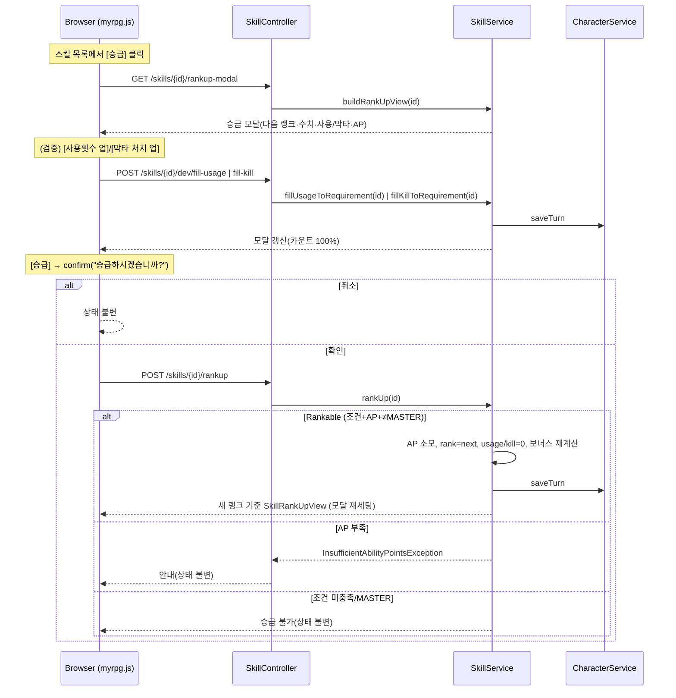

# Design Document

## Overview

본 설계는 `myrpg` Web 모듈(`com.myapps.web.myrpg`)의 다섯 번째 기능(005)인 **스킬 시스템**을 다룬다. 스펙 004(`talent-and-ability-points`)가 구축한 AP·재능(`TalentType`)·스탯 계산(`StatProgression`)/정보 팝업(`InfoPopupView`, `PlayScreenViewHelper`) 위에서 동작하며, 동일한 Spring Boot 4.0 / Java 25 / DDD 4계층 구조를 따른다. 상세 설계 배경과 확정 사항(D1~D9)은 `docs/skill-system.md`를 근거로 한다.

핵심 설계 방향(004 원칙의 확장):

1. **계산형/저장형 분리.** 스킬의 랭크·사용 횟수·처치 수는 계산 복원이 불가하므로 신규 엔티티 `CharacterSkill`에 저장한다. 반면 랭크업 영구 스탯 보너스와 랭크별 수치는 랭크·카탈로그에서 매번 계산하며 저장하지 않는다.
2. **데이터 저장 방식 하이브리드(D9).** 계속 늘어나는 스킬 카탈로그는 `data/skill.json`으로 두고 `SkillCatalogService`가 기동 시 로드·검증한다(`NpcService`/`npc.json` 선례). 타입/랭크/재능/정책은 로직 결합이라 enum/순수 정책(코드)으로 둔다.
3. **004 훅 채우기.** AP 소모(`spendAbilityPoints`)의 실제 트리거(스킬 랭크업)를 구현하고, 정보 팝업의 스킬 보너스 자리(현재 `Stats.ZERO`)를 계산된 값으로 대체한다. 재능 매칭(+10%)은 정의만 제공한다.
4. **전투 연계는 훅/데이터로만.** 데미지 배율·경감/반격·자원 소모는 데이터와 순수 정책으로 제공하고, 실제 적용(데미지 계산·자원 차감·사용/막타 이벤트)은 전투(7순위)로 이연한다. 전투 부재를 메우기 위해 승급 모달에 임시 드라이버를 둔다.

### 004 대비 변경 요약

| 항목 | 004(현재) | 005(변경/추가) |
|---|---|---|
| AP 소모 | `spendAbilityPoints`(임시 `IllegalArgumentException` 가드) | 스킬 랭크업이 소모 트리거, 서비스단 `InsufficientAbilityPointsException` 정식 처리 |
| 정보 팝업 스킬 보너스 | `Stats.ZERO` 고정 | 보유 스킬 랭크업 누적 보너스(`Stats`)로 대체 |
| 재능 매칭 | `damageBonusPercent()`만 정의 | `SkillTalent.matchingTalent()`로 스킬↔재능 매칭 판정 제공(적용은 이연) |
| 영속 | `character_progress` 1테이블 | `character_skill` 테이블 신규 추가(연관 `characterId`) |
| 데이터 | enum(`NpcType`/`TalentType`) + JSON(`npc/map/ambience`) | `skill.json` 카탈로그 추가 |

> 로컬 H2(`ddl-auto: update`)는 신규 테이블 자동 생성, 프로덕션(`ddl-auto: create`)은 재생성. 신규 테이블 추가뿐이라 004 스키마는 무변경(Req 15).

## Architecture

### 모듈 추가/변경 (005)

004와 동일한 DDD 4계층에 아래를 추가/확장한다. **[신규]**는 새 파일, **[확장]**은 기존 산출물 수정이다.

```
myrpg/src/
├── main/java/com/myapps/web/myrpg/
│   ├── interfaces/api/
│   │   ├── SkillController.java               # [신규] 스킬 목록/승급/임시 드라이버 엔드포인트
│   │   ├── PlayScreenViewHelper.java          # [확장] buildInfo의 skillBonus를 SkillService 계산값으로 주입
│   │   └── GlobalExceptionHandler.java        # [확장] InsufficientAbilityPointsException 처리
│   ├── application/
│   │   ├── service/
│   │   │   ├── SkillCatalogService.java       # [신규] skill.json 로드·검증·조회 (NpcService 선례)
│   │   │   ├── SkillService.java              # [신규] 목록/모달 뷰 조립, 랭크업, learnSkill, 임시 드라이버, 보너스 합산
│   │   │   ├── CharacterService.java          # [확장] 신규 캐릭터 생성 시 windmill 시드
│   │   │   └── ApplicationServiceConfiguration.java # [확장] 신규 순수 정책 빈 등록(필요 시)
│   │   ├── dto/
│   │   │   ├── SkillListView.java             # [신규] 탭 + 행 목록
│   │   │   ├── SkillRowView.java              # [신규] 행(스킬명·랭크·진행바·rankable)
│   │   │   └── SkillRankUpView.java           # [신규] 승급 모달 뷰
│   │   └── exception/
│   │       ├── SkillDataException.java        # [신규] 카탈로그 로드/검증 실패 (NpcDataException 선례)
│   │       └── InsufficientAbilityPointsException.java # [신규] AP 부족 랭크업 거부
│   └── domain/
│       ├── model/
│       │   ├── SkillType.java                 # [신규] enum NORMAL/HEAVY/DEFENSE
│       │   ├── SkillTalent.java               # [신규] enum MELEE/ARCHERY/MAGIC/COMMON + matchingTalent/resourceKind
│       │   ├── SkillRank.java                 # [신규] enum F..MASTER(16) + label/order/next/isMax
│       │   ├── ResourceKind.java              # [신규] enum STAMINA/MP (자원 종류)
│       │   ├── Skill.java                     # [신규] sealed interface (카탈로그 항목 공통)
│       │   ├── DamageSkill.java               # [신규] record: multiplierByRank
│       │   ├── DefenseSkill.java              # [신규] record: blockRateByRank/counterMultiplierByRank
│       │   ├── RankUpRequirement.java         # [신규] record(int usage, int kills)
│       │   ├── SkillRankPolicy.java           # [신규] 순수 정책: requirement/apCost
│       │   ├── SkillDamagePolicy.java         # [신규] 순수 정책: 랭크별 수치 맵 조회
│       │   ├── SkillRankupBonus.java          # [신규] 순수 계산: 보유 스킬 → Stats 합산
│       │   └── CharacterSkill.java            # [신규] JPA 엔티티
│       └── repository/
│           └── CharacterSkillRepository.java  # [신규]
└── main/resources/
    ├── data/skill.json                        # [신규] 스킬 카탈로그(초안 docs/skills.json 이식)
    ├── templates/
    │   ├── play.html                          # [확장] skill-popup fragment include
    │   └── fragments/skill-popup.html         # [신규] 목록 팝업 + 승급 모달 fragment
    └── static/
        ├── js/myrpg.js                        # [확장] 팝업 열기/탭/승급 confirm+스왑/임시 드라이버
        └── css/myrpg.css                      # [확장] 스킬 팝업/모달/진행바/승급버튼 스타일
```

> `CharacterProgress`는 **무변경**한다. AP 부족 판정은 `SkillService`가 사전 검증하여 `InsufficientAbilityPointsException`을 던지고, 기존 `spendAbilityPoints`의 선행조건 가드는 방어선으로 남긴다.

### 스킬 랭크업 흐름 (승급 모달)



## Components and Interfaces

### SkillType (domain/model) [신규]

```java
public enum SkillType { NORMAL, HEAVY, DEFENSE;
    String label();                     // "일반"/"강"/"방어"
    static Optional<SkillType> fromString(String s);  // 카탈로그 파싱용(미지 → empty)
}
```

### SkillTalent (domain/model) [신규]

```java
public enum SkillTalent {
    MELEE(TalentType.MELEE), ARCHERY(TalentType.ARCHERY), MAGIC(TalentType.MAGIC), COMMON(null);
    Optional<TalentType> matchingTalent();  // COMMON → empty
    ResourceKind resourceKind();            // MAGIC → MP, else STAMINA
    BonusTarget rankupStatTarget();         // MELEE→STR, ARCHERY→DEX, MAGIC→INT, COMMON→DEF (Req 8)
    static Optional<SkillTalent> fromString(String s);
}
```

- `matchingTalent()`: 재능 일치 +10%(전투 7순위 소비) 판정의 소스(Req 3). `COMMON`은 매칭 없음.
- `rankupStatTarget()`: 랭크업 영구 스탯 대상(Req 8). MELEE/ARCHERY/MAGIC는 `TalentType.primary().target()`과 동일.

### ResourceKind (domain/model) [신규]

```java
public enum ResourceKind { STAMINA, MP; String label(); }  // "스태미나"/"MP"
```

### SkillRank (domain/model) [신규]

```java
public enum SkillRank {
    F, E, D, C, B, A, R9, R8, R7, R6, R5, R4, R3, R2, R1, MASTER;
    String label();               // "F".."A","9".."1","Master"
    int order();                  // F=0 … MASTER=15
    boolean isMax();              // MASTER
    Optional<SkillRank> next();   // MASTER → empty
    static SkillRank first();     // F (신규 스킬 시드)
}
```

### Skill / DamageSkill / DefenseSkill (domain/model) [신규]

카탈로그 항목을 타입별 변형(sealed)으로 표현한다(§4 "타입별 필드 차이").

```java
public sealed interface Skill permits DamageSkill, DefenseSkill {
    String id(); String label(); SkillType type(); SkillTalent talent();
    int resourceCost(); String effectSummary();
}

public record DamageSkill(String id, String label, SkillType type, SkillTalent talent,
                          int resourceCost, Map<SkillRank, Integer> multiplierByRank,
                          String effectSummary) implements Skill {}

public record DefenseSkill(String id, String label, SkillType type, SkillTalent talent,
                           int resourceCost, Map<SkillRank, Integer> blockRateByRank,
                           Map<SkillRank, Integer> counterMultiplierByRank,
                           String effectSummary) implements Skill {}
```

- 로더가 `type == DEFENSE`이면 `DefenseSkill`, 아니면 `DamageSkill`로 파싱한다. 각 맵은 16개 랭크를 모두 가져야 한다(Req 1.6).

### RankUpRequirement (domain/model) [신규]

```java
public record RankUpRequirement(int requiredUsage, int requiredKills) {}
```

### SkillRankPolicy (domain/model, 순수) [신규]

`docs/skill-system.md` §6/§9 확정 테이블을 상수로 보유하는 순수 정책(`ExperiencePolicy` 선례).

```java
public class SkillRankPolicy {
    Optional<RankUpRequirement> requirement(SkillRank current); // MASTER → empty
    OptionalInt apCost(SkillRank current);                      // MASTER → empty
}
```

요구치·AP 표(현재 랭크 → 다음 랭크). 인덱스는 `order()`.

| current | reqUsage | reqKills | apCost |
|---|---|---|---|
| F | 5 | 1 | 1 |
| E | 10 | 3 | 2 |
| D | 20 | 6 | 3 |
| C | 35 | 10 | 4 |
| B | 60 | 18 | 5 |
| A | 100 | 30 | 7 |
| 9 | 160 | 48 | 9 |
| 8 | 240 | 72 | 11 |
| 7 | 350 | 105 | 13 |
| 6 | 520 | 155 | 15 |
| 5 | 760 | 230 | 18 |
| 4 | 1100 | 340 | 22 |
| 3 | 1600 | 500 | 26 |
| 2 | 2500 | 750 | 30 |
| 1 | 5000 | 1500 | 34 |
| Master | — | — | — |

- apCost 합계 = 200(F→Master). requirement/apCost 모두 랭크 오름차순 단조 증가.

### SkillDamagePolicy (domain/model, 순수) [신규]

```java
public class SkillDamagePolicy {
    int multiplier(DamageSkill skill, SkillRank rank);      // multiplierByRank.get(rank)
    int blockRate(DefenseSkill skill, SkillRank rank);
    int counterMultiplier(DefenseSkill skill, SkillRank rank);
}
```

- 보간 아님. 맵 조회. (전투 7순위가 소비, 본 스펙은 조회 정책·표시용까지.)

### SkillRankupBonus (domain/model, 순수) [신규]

```java
public class SkillRankupBonus {
    // 보유 스킬 목록 + 카탈로그로 스탯 계열 누적 보너스 계산 (Req 8)
    Stats sum(List<CharacterSkill> owned, SkillCatalog catalog);
    // 규칙: Σ (skill.rank.order() × delta(talent.rankupStatTarget()))
    // STR/DEX/INT/DEF에만 가산, HP/MP/STAMINA는 0(스탯 계열만)
}
```

### CharacterSkill (domain/model) [신규 엔티티]

```java
@Entity @Table(name = "character_skill")
public class CharacterSkill {
    @Id @GeneratedValue(strategy = IDENTITY) Long id;
    @Column(name="character_id", nullable=false) Long characterId;
    @Column(name="skill_id", nullable=false) String skillId;          // skill.json id (FK, 문자열)
    @Enumerated(EnumType.STRING) @Column(nullable=false) SkillRank rank;
    @Column(name="usage_count", nullable=false) int usageCount;
    @Column(name="kill_count", nullable=false) int killCount;
    // 생성자: static newSkill(characterId, skillId) → rank=F, counts=0
    // mutators: increaseUsage/increaseKill, setUsage/setKill(임시 드라이버), rankUpTo(next)(카운트 0 리셋)
}
```

- `rankUpTo(SkillRank next)`: `rank=next; usageCount=0; killCount=0`(트랜잭션 c·d 단계, Req 7).

### CharacterSkillRepository (domain/repository) [신규]

```java
public interface CharacterSkillRepository extends JpaRepository<CharacterSkill, Long> {
    List<CharacterSkill> findByCharacterId(Long characterId);
    Optional<CharacterSkill> findByCharacterIdAndSkillId(Long characterId, String skillId);
}
```

### SkillCatalogService (application/service) [신규]

`NpcService`를 그대로 본뜬다: `@PostConstruct` 로드, `loadFromStream` 분리, 무결성 위반 시 `SkillDataException`.

```java
@Service
public class SkillCatalogService {
    SkillCatalogService(ObjectMapper objectMapper);   // 생성자 주입 (Jackson 3: tools.jackson)
    void init();                                       // @PostConstruct: classpath:data/skill.json
    List<Skill> loadFromStream(InputStream in);        // 파싱·검증(테스트 주입점)
    List<Skill> all();
    Optional<Skill> byId(String skillId);
}
```

검증(로드 시): 최상위 배열, 필수 필드, `type`/`talent` enum 변환(실패 시 예외), id 중복 금지, 랭크 맵 16개 완비.

### SkillService (application/service) [신규]

애플리케이션 오케스트레이션. 카탈로그 + `CharacterSkillRepository` + `SkillRankPolicy`/`SkillDamagePolicy`/`SkillRankupBonus` + `CharacterProgress`(AP)를 조합한다.

```java
@Service
public class SkillService {
    // 조회/뷰
    SkillListView buildListView(Long characterId, String activeTab);
    SkillRankUpView buildRankUpView(Long characterId, String skillId);
    Stats rankupBonus(Long characterId);                 // PlayScreenViewHelper가 사용 (Req 8.5)

    // 진행
    RankUpResult rankUp(CharacterProgress progress, String skillId);  // Req 6·7
    void learnSkill(Long characterId, String skillId);   // Req 11 (F 추가, 중복/미지 방지)
    void seedDefault(Long characterId);                  // Req 10.3 (windmill F)

    // 임시 드라이버 (Req 14, 전투 7순위에서 제거)
    void fillUsageToRequirement(Long characterId, String skillId);
    void fillKillToRequirement(Long characterId, String skillId);

    // 카운팅 훅 (전투 7순위가 호출; 본 스펙은 정의만) (Req 5 카운팅)
    void onSkillUsed(Long characterId, String skillId);
    void onSkillKill(Long characterId, String skillId);
}
```

- `rankUp`: `rankable` 판정 → AP 사전검증(부족 시 `InsufficientAbilityPointsException`) → `progress.spendAbilityPoints(apCost)` → `characterSkill.rankUpTo(next)` → 저장. MASTER/조건 미충족이면 거부(상태 불변).
- `rankupBonus`: `SkillRankupBonus.sum(owned, catalog)`. `PlayScreenViewHelper.buildInfo`가 `Stats.ZERO` 대신 사용.
- `onSkillUsed`/`onSkillKill`: 카운터 +1 진입점. **JavaDoc에 "전투(7순위)가 호출, 임시 드라이버가 대체 역할" 명시**(§14.4).

### PlayScreenViewHelper (interfaces/api) [확장]

- `buildInfo`: `final Stats skillBonus = Stats.ZERO;` → `final Stats skillBonus = skillService.rankupBonus(progress.getId());`로 교체(Req 8.5). 그 외 로직·표시 구조 무변경.
- `StatProgression.vitalMaxFor`·게이지 조립은 무변경(Req 8.6).

### SkillController (interfaces/api) [신규]

```
GET  /skills                         → 목록 팝업(전체 탭)
GET  /skills?tab=melee|archery|magic|common  → 탭 필터
GET  /skills/{id}/rankup-modal       → 승급 모달 뷰
POST /skills/{id}/rankup             → 랭크업(confirm은 클라이언트) → 새 랭크 모달 스왑
POST /skills/{id}/dev/fill-usage     → 임시: 사용 100% 충전
POST /skills/{id}/dev/fill-kill      → 임시: 막타 100% 충전
```

- 응답은 003/004식 fragment 스왑. `dev/*` 엔드포인트는 JavaDoc에 임시·제거 예정 명시.

### GlobalExceptionHandler (interfaces/api) [확장]

- `InsufficientAbilityPointsException` → 승급 거부 안내(상태 불변, 사용자 메시지). `SkillDataException`은 기동 실패(핸들러 대상 아님).

### CharacterService (application/service) [확장]

- 신규 캐릭터 생성 경로(`loadOrCreateDefault`)에서 `skillService.seedDefault(progress.getId())` 호출로 windmill F 시드(Req 10.3). 저장 순서상 `CharacterProgress` 저장 후 id 확보 → 시드.

## Data Models

### skill.json 스키마 (최상위 배열)

```
공통: id(string), label(string), type("NORMAL"|"HEAVY"|"DEFENSE"),
      talent("MELEE"|"ARCHERY"|"MAGIC"|"COMMON"), resourceCost(int), effectSummary(string)
딜(NORMAL/HEAVY): multiplierByRank { "F":int, ..., "MASTER":int }   // 16키
방어(DEFENSE):    blockRateByRank {16키}, counterMultiplierByRank {16키}
```

랭크 키는 `SkillRank` 상수명(`F/E/D/C/B/A/R9..R1/MASTER`). 초안·값은 `docs/skills.json`을 이식한다(스킬 7종: smash/windmill/magnum_shot/arrow_revolver/firebolt/icebolt/defense).

### 영속 모델 (character_skill)

| 컬럼 | 타입 | 설명 |
|---|---|---|
| id | bigint (IDENTITY) | PK |
| character_id | bigint, not null | `CharacterProgress.id` 연관 |
| skill_id | varchar, not null | `skill.json` id (문자열 FK) |
| rank | varchar, not null | `SkillRank`(EnumType.STRING), 기본 F |
| usage_count | int, not null | 현재 랭크 사용 횟수(랭크업 시 0) |
| kill_count | int, not null | 현재 랭크 막타 처치(랭크업 시 0) |

- 스탯 보너스·랭크별 수치는 저장하지 않는다(Req 10.2). `(character_id, skill_id)`는 논리적 유일.

### 뷰 모델 (record)

```java
record SkillListView(String activeTab, List<SkillRowView> rows) {}

record SkillRowView(String id, String label, String talentLabel, String rankLabel,
                    int progressPercent, boolean rankable, boolean maxed) {}

record SkillRankUpView(String id, String label,
                       String currentRankLabel, String nextRankLabel,   // MASTER → null
                       String primaryStatLabel,                         // 표시용(예: "보너스 데미지"/"피해 경감")
                       int currentValue, int nextValue,                 // 딜: 배율% / 디펜스: 경감%
                       Integer currentCounterValue, Integer nextCounterValue, // 디펜스 반격%(딜은 null)
                       String resourceKindLabel, int resourceCost,
                       int usageCurrent, int usageRequired,
                       int killCurrent, int killRequired,
                       int apCost, int apOwned,
                       boolean rankable, boolean maxed) {}
```

- `progressPercent = (min(usageCurrent/usageRequired,1) + min(killCurrent/killRequired,1)) / 2 × 100`(Req 12.3). MASTER면 100.
- `rankable`(Req 12.4/13.7) = 조건 충족 && AP 충족 && ≠MASTER.

## Correctness Properties

*프로퍼티는 시스템의 모든 유효한 실행에서 참이어야 하는 특성이다.* 순수/결정적 로직(enum·정책·계산·카탈로그 검증·영속 라운드트립)을 대상으로 하며, 템플릿·JS·CSS(SMOKE)와 고정 초기값(EXAMPLE)은 제외한다.

### Property 1: 랭크 사다리 정합

*For any* `SkillRank`에 대해, `order()`는 0~15로 정의 순서와 일치하고, `next()`는 `MASTER`에서만 empty이며 그 외에는 `order()+1`인 랭크를 반환하고, `isMax()`는 `MASTER`에서만 참이다.

**Validates: Requirements 2.3**

### Property 2: 랭크업 요구치 양수·단조 증가

*For any* MASTER가 아닌 `SkillRank`에 대해 `requirement(r)`는 존재하며 `requiredUsage>0`, `requiredKills>0`이고, `order`가 증가하면 두 요구치가 단조 증가한다. MASTER는 empty.

**Validates: Requirements 5.1, 5.2**

### Property 3: AP 소모 곡선 양수·단조·합 200

*For any* MASTER가 아닌 `SkillRank`에 대해 `apCost(r)>0`이고 `order` 증가 시 단조 증가하며, `F..1`의 apCost 합계는 200이다. MASTER는 empty.

**Validates: Requirements 6.1, 6.2**

### Property 4: 재능 매칭

*For any* `SkillTalent`에 대해, `MELEE`/`ARCHERY`/`MAGIC`의 `matchingTalent()`는 각각 대응 `TalentType`이고 `COMMON`은 empty이다.

**Validates: Requirements 2.2, 3.1, 3.2**

### Property 5: 자원 종류 파생

*For any* `SkillTalent`에 대해, `MAGIC`의 `resourceKind()`는 `MP`, 그 외(`MELEE`/`ARCHERY`/`COMMON`)는 `STAMINA`이다.

**Validates: Requirements 9.1**

### Property 6: 랭크별 수치 단조 + 조회 정확

*For any* 카탈로그의 딜스킬과 임의 랭크에 대해, `SkillDamagePolicy.multiplier`는 `multiplierByRank[rank]`와 같고 랭크 오름차순으로 단조 증가한다. 디펜스의 `blockRate`/`counterMultiplier`도 동일 성질을 만족한다.

**Validates: Requirements 4.1, 4.2, 4.3, 4.4**

### Property 7: 카탈로그 검증

*For any* (a) 미지 `type`/`talent`, (b) 중복 `id`, (c) 필수 필드 누락, (d) 랭크 맵 16키 미만을 포함하는 입력에 대해, `loadFromStream`은 `SkillDataException`을 던진다. 유효 입력은 스킬 수만큼의 불변 목록을 반환한다.

**Validates: Requirements 1.2, 1.4, 1.5, 1.6**

### Property 8: 랭크업 게이트

*For any* 캐릭터·스킬·AP 상태에 대해, `rankUp`은 `usageCount ≥ 요구 && killCount ≥ 요구 && abilityPoints ≥ apCost && rank ≠ MASTER`일 때만 성공하고, 그 외에는 랭크·카운트·AP를 변경하지 않는다.

**Validates: Requirements 5.3, 5.4, 5.5, 7.3**

### Property 9: 랭크업 트랜잭션 효과

*For any* Rankable 상태의 랭크업에 대해, 실행 후 `rank == 이전.next()`, `usageCount == 0`, `killCount == 0`, `abilityPoints == 이전 - apCost(이전 랭크)`이다.

**Validates: Requirements 7.1, 7.2, 6.3**

### Property 10: AP 소모 가드

*For any* `abilityPoints < apCost`인 랭크업 시도에 대해, `InsufficientAbilityPointsException`이 발생하고 `abilityPoints`는 음수가 되지 않으며 스킬 상태가 변하지 않는다.

**Validates: Requirements 6.4, 6.5**

### Property 11: AP 정합성 불변식(확장)

*For any* 레벨업·환생·스킬 랭크업의 임의 시퀀스에 대해, `abilityPoints == (accumulatedLevel - 1) - Σ(보유 스킬, F→현재 랭크 apCost 합)`이 항상 성립한다.

**Validates: Requirements 6.6**

### Property 12: 랭크업 영구 보너스 합산

*For any* 보유 스킬 집합에 대해, `SkillRankupBonus.sum`은 `Σ(skill.rank.order() × 재능 주 스탯 +1)`을 대상 스탯(STR/DEX/INT/DEF)에만 가산하고 HP/MP/Stamina·Critical에는 0을 부여한다. 랭크 F(order 0)는 0 기여, MASTER는 15배 기여한다.

**Validates: Requirements 8.1, 8.2, 8.3, 8.4**

### Property 13: 스킬 습득

*For any* `skillId`에 대해, `learnSkill`은 (a) 카탈로그에 있고 미보유면 F랭크·카운트0으로 추가, (b) 이미 보유면 변경 없음, (c) 카탈로그에 없으면 추가하지 않는다.

**Validates: Requirements 11.1, 11.2, 11.3**

### Property 14: 신규 캐릭터 시드

*For any* 신규 캐릭터에 대해, 시드 후 보유 스킬은 `windmill` 하나뿐이며 rank=F, usageCount=0, killCount=0이다.

**Validates: Requirements 10.3, 15.4**

### Property 15: 환생 시 스킬 유지

*For any* 보유 스킬 집합과 환생 실행에 대해, 환생 후 보유 스킬 목록과 각 스킬의 rank·usageCount·killCount가 변하지 않는다.

**Validates: Requirements 10.6**

### Property 16: 영속 라운드트립

*For any* 유효한 `CharacterSkill`에 대해, 저장 후 조회하면 `skillId`·`rank`·`usageCount`·`killCount`가 모두 보존된다.

**Validates: Requirements 10.1, 10.5**

### Property 17: 진행바 동일가중 평균

*For any* `usageCurrent`/`killCurrent`와 요구치에 대해, `progressPercent`는 `(min(usage/req,1)+min(kill/req,1))/2×100`이고 `[0,100]` 범위이며, 두 조건이 모두 충족될 때만 100이다.

**Validates: Requirements 12.3**

### Property 18: 임시 드라이버 100% 충전

*For any* MASTER가 아닌 스킬에 대해, `fillUsageToRequirement` 후 `usageCount == 현재 랭크 requiredUsage`, `fillKillToRequirement` 후 `killCount == 현재 랭크 requiredKills`이다.

**Validates: Requirements 14.2, 14.3**

## Error Handling

| 상황 | 처리 |
|---|---|
| 카탈로그 로드/검증 실패(Req 1.4~1.6) | `SkillDataException` → 기동 실패(`NpcDataException` 선례). 사용자 요청 핸들러 대상 아님 |
| AP 부족 랭크업(Req 6.4) | `SkillService`가 사전 검증 → `InsufficientAbilityPointsException` → `GlobalExceptionHandler`가 안내 응답(상태 불변) |
| 조건 미충족/MASTER 랭크업(Req 5.4/5.5) | 예외 아님 — `rankUp`이 승급 불가 결과 반환(상태 불변), UI는 버튼 비활성 |
| 미지/미보유 `skillId` 요청 | 조회는 빈/안내 응답, `learnSkill`은 무시(Req 11.2/11.3) |
| 승급 confirm 취소(Req 13.4) | 클라이언트에서 요청 미전송, 상태 불변 |

- 커스텀 예외는 `RuntimeException`을 직접 던지지 않고 명시적 예외 클래스(`SkillDataException`, `InsufficientAbilityPointsException`)로 처리한다(code-style). 004의 임시 `IllegalArgumentException` 가드는 `spendAbilityPoints` 내부 방어선으로 유지하되, 정상 경로 검증은 서비스단 비즈니스 예외로 승격한다.

## Testing Strategy

### 이중 테스트 접근

- **프로퍼티 테스트(jqwik)**: 위 Correctness Property 18개. `@Property(tries = 100)`, `@Mock` 금지(`Mockito.mock()` 직접), 태그 주석 `Feature: 005-skill-system, Property {번호}: {텍스트}`.
- **단위/예시 테스트**:
  - `SkillRank` 라벨·order·next 예시(F→E, A→9(R9), 1→Master, MASTER.next empty).
  - `SkillRankPolicy` 샘플(F→E: usage5/kill1/ap1, 1→Master: usage5000/kill1500/ap34, 합계 200).
  - `SkillTalent.rankupStatTarget`/`resourceKind`/`matchingTalent` 각 상수 값.
  - `SkillDamagePolicy` 샘플(smash A랭크=170, defense F 경감50/반격30).
  - 랭크업 예시(F 스킬 usage/kill 충전 → 승급 → rank=E, 카운트0, AP-1, STR/DEX/… +1).
  - `SkillRankupBonus` 예시(windmill A(order5)→STR+5; 전부 마스터→STR/DEX/INT+30, DEF+15).
  - 진행바 예시(사용 100%·막타 0% → 50; 둘 다 100% → 100).

### 생성기(Arbitraries)

- 카탈로그 입력 생성기(P6/P7): 유효 스킬 + 결함 주입(미지 type/talent, 중복 id, 필드 누락, 랭크 맵 15키).
- 캐릭터·스킬 상태 생성기(P8~P12): rank 16종 × usage/kill(요구 미만/이상 경계) × abilityPoints(cost 미만/이상).
- 레벨업·환생·랭크업 시퀀스 생성기(P11): AP 지급/소모 임의 조합.
- 보유 스킬 집합 생성기(P12): 재능·랭크 조합.

### 슬라이스/통합 (Spring Boot 4.0)

- **컨트롤러**(`@WebMvcTest(SkillController.class)` + `@MockitoBean SkillService`): 목록/탭/모달 렌더, `POST /rankup` 성공·AP부족(예외 핸들링), `dev/*` 충전 후 갱신.
- **영속 라운드트립**(`@DataJpaTest` + `@TestConstructor(ALL)`, `org.springframework.boot.data.jpa.test.autoconfigure.DataJpaTest`): `CharacterSkill` 저장/조회(P16), `findByCharacterId(AndSkillId)`.
- **카탈로그 로드 통합**(`@SpringBootTest` 또는 파싱 단위): `classpath:data/skill.json` 실제 로드·검증(스킬 7종·랭크 16키 완비).
- **컨텍스트 로드 스모크**(`@SpringBootTest`): `SkillCatalogService`/`SkillService` 빈 로딩, 정보 팝업 스킬 보너스 경로.
- **뷰헬퍼**(`PlayScreenViewHelperInfoTest` 확장): `buildInfo`의 스킬 보너스가 `SkillService.rankupBonus`와 일치(중앙 스탯 `(+X)` 반영).

### 빌드 검증

- 각 구현 Task 완료 전 `mvn test -pl myrpg` 통과 + `mvn clean install -pl myrpg -am` `BUILD SUCCESS` 확인(steering `task-build-validation.md`).

## Migration 영향 범위 (004 산출물)

- **`PlayScreenViewHelper`**: `buildInfo`의 `skillBonus`를 `Stats.ZERO` → `skillService.rankupBonus(...)`로 교체. `SkillService` 의존 주입 추가 → `PlayScreenViewHelperInfoTest` 갱신(스킬 보너스 0인 신규 캐릭터에서 기존 값 보존, 랭크업 후 반영).
- **`CharacterService`**: 신규 캐릭터 생성 시 windmill 시드 추가 → `CharacterServiceDefault*Test` 보강(신규 캐릭터 스킬 1개).
- **`GlobalExceptionHandler`**: `InsufficientAbilityPointsException` 처리 추가.
- **`CharacterProgress`**: **무변경**(AP 검증은 서비스단). 기존 `spendAbilityPoints` 가드 유지.
- **신규 산출물**: 스킬 도메인/정책/엔티티/서비스/컨트롤러/뷰/템플릿/정적 리소스, `data/skill.json`.
- **로컬 세이브**: 신규 테이블 추가뿐 → 004보다 가벼움. 필요 시 로컬 H2 파일 삭제로 초기화(Req 15.2).
- 맵/이동/NPC/상황멘트/환생 핵심 로직은 영향 없음(환생은 스킬 미변경 유지 특성만 검증).

### 전투(7순위) 이관 항목 (본 스펙은 정의·데이터·훅까지)

- `onSkillUsed`/`onSkillKill`(카운팅), `SkillDamagePolicy`(배율/경감/반격), `SkillTalent.matchingTalent()`(+10%), `resourceKind()`+`resourceCost`(자원 차감), 무기 재능 기반 스킬 필터링. 임시 드라이버(`dev/fill-*`)는 전투 이벤트 연결 시 제거. 각 seam은 JavaDoc에 담당 순위·제거 조건을 명시한다(`docs/skill-system.md` §14.4).
