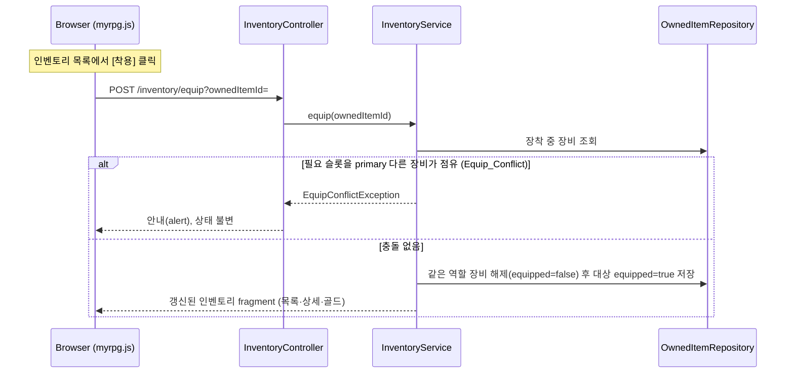
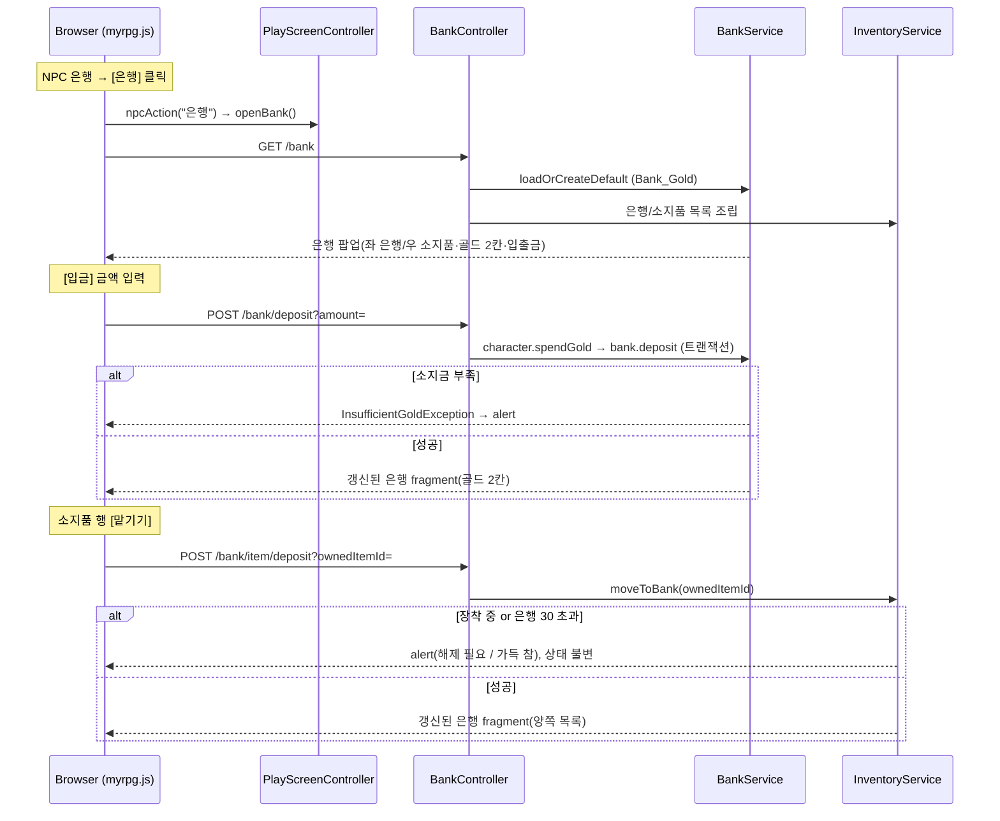

# Design Document

## Overview

본 설계는 `myrpg` Web 모듈(`com.myapps.web.myrpg`)에 **골드·아이템·인벤토리·장비 시스템**을 추가한다(스펙 006). 004·005의 "계산형/저장형/카탈로그형 구분" 원칙을 그대로 따른다.

- **저장형(영속)**: 소지금(`CharacterProgress.gold` 컬럼), 은행 통합 금고(`Bank`), 보유 아이템 인스턴스(`OwnedItem`: 수량·저장위치·장착여부·내구도).
- **카탈로그형(JSON)**: 아이템 정의(`item.json` → `ItemCatalogService`, `SkillCatalogService` 선례).
- **코드형(enum/순수정책)**: 타입(`ItemType`), 장비 슬롯(`EquipSlot`)·종류(`EquipmentKind`), 착용 규칙·보너스 합산·상세 생성.

005가 정보 팝업 스탯의 보너스 자리를 스킬 랭크업 보너스로 채웠고, 006은 그 위에 **장비 STAT 보너스**를 더하고 **장비 VITAL 보너스**를 최대 바이탈에 합산한다. 은행 NPC 행동은 단일 "은행"으로 통합되어 골드·아이템을 한 팝업에서 다룬다.

### 이번 스펙에서 구현 vs 이연

- **구현**: 골드/은행/임시 골드 버튼, 아이템 카탈로그·보유 영속, 착용 규칙·보너스 합산, 포션 사용, 상세보기(임베드), 인벤토리/은행 팝업(리스트·정렬), 내구도 **필드·초기화·표시**, 가격 **모델·`buyPrice` 필드 파싱**, 캐릭터 생성 기본 지급.
- **이연**: 내구도 턴당 감소(6순위 전투) / 대장간 수리·상점 구매·판매가 실제 값(7순위) / 내구도 0 파손 처리·인챈트(`ENCHANT`)(추후).

## Architecture

### 모듈 추가/변경 (006)

004·005와 동일한 DDD 4계층에 아래를 추가/확장한다. **[신규]**는 새 파일, **[확장]**은 기존 산출물 수정이다.

```
myrpg/src/
├── main/java/com/myapps/web/myrpg/
│   ├── interfaces/api/
│   │   ├── InventoryController.java           # [신규] 인벤토리 목록/사용/착용/해제
│   │   ├── BankController.java                # [신규] 은행 팝업/골드 입출금/아이템 이동
│   │   ├── PlayScreenController.java          # [확장] /gold/gain·/gold/spend 임시 버튼
│   │   ├── PlayScreenViewHelper.java          # [확장] buildStatLines에 장비 STAT 보너스 합산, vitalMax에 VITAL 합산
│   │   └── GlobalExceptionHandler.java        # [확장] Insufficient_Gold/EquipConflict/InventoryFull 처리
│   ├── application/
│   │   ├── service/
│   │   │   ├── ItemCatalogService.java        # [신규] item.json 로드·검증·조회 (SkillCatalogService 선례)
│   │   │   ├── InventoryService.java          # [신규] 목록/사용/착용/해제/이동/시드/보너스합산/상세생성
│   │   │   ├── BankService.java               # [신규] Bank loadOrCreateDefault/deposit/withdraw
│   │   │   └── CharacterService.java          # [확장] 신규 캐릭터 기본 아이템 시드
│   │   ├── dto/
│   │   │   ├── InventoryView.java             # [신규] 보유 골드 + 행 목록
│   │   │   ├── BankView.java                  # [신규] 은행/보유 골드 + 은행/소지품 목록
│   │   │   └── OwnedItemView.java             # [신규] 행(이름·타입·수량·장착·사용/착용가능·내구도·상세)
│   │   └── exception/
│   │       ├── InsufficientGoldException.java # [신규]
│   │       ├── ItemDataException.java         # [신규] 카탈로그 로드/검증 실패 (SkillDataException 선례)
│   │       ├── InventoryFullException.java    # [신규] 용량 30 초과
│   │       └── EquipConflictException.java    # [신규] 착용 슬롯 충돌
│   └── domain/
│       ├── model/
│       │   ├── ItemType.java                  # [신규] enum POTION/WEAPON/ARMOR + isEquipment/fromString
│       │   ├── EquipSlot.java                 # [신규] enum MAIN_HAND/OFF_HAND/BODY
│       │   ├── EquipmentKind.java             # [신규] enum 한손검/양손검/방패/갑옷 + primarySlot/requiredSlots
│       │   ├── StorageKind.java               # [신규] enum INVENTORY/BANK
│       │   ├── Item.java                      # [신규] sealed interface (카탈로그 공통: id/name/type/buyPrice)
│       │   ├── PotionItem.java                # [신규] record: healHp
│       │   ├── EquipmentItem.java             # [신규] record: kind/bonuses/maxDurability
│       │   ├── EquipBonus.java                # [신규] record: (BonusTarget, int)
│       │   ├── Bank.java                      # [신규] JPA 엔티티 (통합 금고)
│       │   └── OwnedItem.java                 # [신규] JPA 엔티티 (보유 인스턴스)
│       └── repository/
│           ├── BankRepository.java            # [신규]
│           └── OwnedItemRepository.java       # [신규]
├── main/java/.../domain/model/NpcType.java    # [확장] BANK 행동 라벨 ["은행"] 통합
└── main/resources/
    ├── data/item.json                         # [신규] 아이템 카탈로그(5종)
    ├── templates/
    │   ├── play.html                          # [확장] inventory/bank/item-detail fragment include
    │   └── fragments/
    │       ├── inventory-popup.html           # [신규] 인벤토리 리스트 팝업
    │       ├── bank-popup.html                # [신규] 은행 리스트 팝업(좌/우 목록·골드·입출금)
    │       ├── item-detail.html               # [신규] 공용 상세 모달
    │       ├── left-sidebar.html              # [확장] 인벤토리 버튼 openInventory + 임시 골드 버튼
    │       └── center.html                    # [확장] NPC 은행 버튼 npcAction(label) 분기
    └── static/
        ├── js/myrpg.js                        # [확장] 인벤토리/은행 팝업·상세 모달·정렬·골드/아이템 동작
        └── css/myrpg.css                      # [확장] 리스트 팝업·상세 모달·배지 스타일
```

> `CharacterProgress`는 `gold` 컬럼만 추가한다. 상단바(`TopBarView`/`top-bar.html`)는 골드 미표시로 **무변경**.

### 장비 착용 흐름



### 은행 입금/아이템 맡기기 흐름



## Components and Interfaces

### ItemType (domain/model) [신규]

```java
public enum ItemType {
    POTION("potion", "포션"), WEAPON("weapon", "무기"), ARMOR("armor", "방어구");
    String code(); String label();
    boolean isEquipment();                 // WEAPON || ARMOR
    static Optional<ItemType> fromString(String code);   // 미지 → empty
}
```

### EquipSlot (domain/model) [신규]

```java
public enum EquipSlot { MAIN_HAND, OFF_HAND, BODY }
```

### EquipmentKind (domain/model) [신규]

```java
public enum EquipmentKind {
    ONE_HANDED_SWORD("한손검", EquipSlot.MAIN_HAND, Set.of(EquipSlot.MAIN_HAND)),
    TWO_HANDED_SWORD("양손검", EquipSlot.MAIN_HAND, Set.of(EquipSlot.MAIN_HAND, EquipSlot.OFF_HAND)),
    SHIELD("방패", EquipSlot.OFF_HAND, Set.of(EquipSlot.OFF_HAND)),
    ARMOR_BODY("갑옷", EquipSlot.BODY, Set.of(EquipSlot.BODY));
    String label(); EquipSlot primarySlot(); Set<EquipSlot> requiredSlots();  // 불변
    static Optional<EquipmentKind> fromString(String code);
}
```

- `requiredSlots`는 착용 시 점유하는 슬롯 집합. 양손검은 주무기 슬롯을 쓰면서 보조손까지 점유하여 방패와 배타적이다.

### StorageKind (domain/model) [신규]

```java
public enum StorageKind { INVENTORY, BANK }
```

### Item / PotionItem / EquipmentItem / EquipBonus (domain/model) [신규]

```java
public sealed interface Item permits PotionItem, EquipmentItem {
    String id(); String name(); ItemType type();
    Integer buyPrice();                    // optional 상점 구매가 (없으면 null)
}

public record PotionItem(String id, String name, int healHp, Integer buyPrice) implements Item {
    public ItemType type() { return ItemType.POTION; }
}

public record EquipmentItem(String id, String name, ItemType type,
                            EquipmentKind kind, List<EquipBonus> bonuses,
                            Integer buyPrice, int maxDurability) implements Item {
    // type 은 WEAPON 또는 ARMOR
}

public record EquipBonus(BonusTarget target, int amount) {}  // BonusTarget.kind()로 STAT/VITAL 분기
```

### Bank (domain/model) [신규 엔티티]

```java
@Entity @Table(name = "bank")
public class Bank {
    @Id @GeneratedValue(strategy = GenerationType.IDENTITY) private Long id;
    @Column(nullable = false) private long gold;
    public static Bank createDefault();    // gold = 0
    public void deposit(long amount);      // gold += amount (음수/0 방지)
    public void withdraw(long amount);     // amount>gold → InsufficientGoldException
}
```

### OwnedItem (domain/model) [신규 엔티티]

```java
@Entity @Table(name = "owned_item")
public class OwnedItem {
    @Id @GeneratedValue(strategy = GenerationType.IDENTITY) private Long id;
    @Column(name = "item_id", nullable = false) private String itemId;
    @Column(nullable = false) private int quantity;
    @Enumerated(EnumType.STRING) @Column(nullable = false) private StorageKind storage;
    @Column(nullable = false) private boolean equipped;
    @Column(name = "current_durability", nullable = false) private double currentDurability;

    public void increaseQuantity(int n);
    public void decreaseQuantity(int n);   // 0 미만 방지
    public void moveTo(StorageKind s);     // 저장위치 변경(맡기기/찾기)
    public void equip();                   // equipped = true
    public void unequip();                 // equipped = false
    public void reduceDurability(double d);// 0 미만 방지 (전투 6순위가 호출)
    public void repairToMax(double max);   // 대장간 7순위가 호출
}
```

### BankRepository / OwnedItemRepository (domain/repository) [신규]

```java
public interface BankRepository extends JpaRepository<Bank, Long> {
    Optional<Bank> findFirstByOrderByIdAsc();
}
public interface OwnedItemRepository extends JpaRepository<OwnedItem, Long> {
    List<OwnedItem> findByStorageOrderById(StorageKind storage);
    Optional<OwnedItem> findByStorageAndItemId(StorageKind storage, String itemId);
    long countByStorage(StorageKind storage);
    List<OwnedItem> findByStorageAndEquippedTrue(StorageKind storage);
}
```

### ItemCatalogService (application/service) [신규]

```java
@Service
public class ItemCatalogService {   // SkillCatalogService 선례
    @PostConstruct void init();                    // classpath:data/item.json 1회 로드
    public List<Item> loadFromStream(InputStream); // 파싱·검증 분리(테스트 주입)
    public List<Item> all();
    public Optional<Item> byId(String itemId);
}
```

- 파싱: `type`으로 분기(potion→PotionItem, weapon/armor→EquipmentItem). `kind`(`EquipmentKind.fromString`)·`bonuses[].target`(`BonusTarget.valueOf`) 검증, 장비 `maxDurability` 필수, `buyPrice` optional. 무결성 위반 시 `ItemDataException`으로 기동 실패.

### BankService (application/service) [신규]

```java
@Service
public class BankService {
    @Transactional public Bank loadOrCreateDefault();  // 없으면 gold=0 행 생성
    @Transactional public void deposit(CharacterProgress ch, long amount);   // spendGold→deposit
    @Transactional public void withdraw(CharacterProgress ch, long amount);  // withdraw→gainGold
}
```

### InventoryService (application/service) [신규]

```java
@Service
public class InventoryService {
    public InventoryView buildInventoryView(long gold, InventorySort sort);
    public BankView buildBankView(long gold, long bankGold);
    @Transactional public void usePotion(long ownedItemId);          // HP 회복·수량-1
    @Transactional public void equip(long ownedItemId);              // 착용 규칙(Equip_Conflict)
    @Transactional public void unequip(long ownedItemId);
    @Transactional public void moveToBank(long ownedItemId);         // 맡기기(장착/용량 검사)
    @Transactional public void moveToInventory(long ownedItemId);    // 찾기(용량 검사)
    public Bonuses equippedBonus();      // {Stats statBonus, VitalMax vitalBonus} (STAT/VITAL 분기)
    public void seedDefault();           // 기본 지급 + 한손검·방패·갑옷 장착
    List<String> describe(Item item, OwnedItem owned);  // 상세 자동 생성(임베드용)
}
```

- `equip`: 대상 `kind.requiredSlots` 중 하나라도 primary 다른 장착 장비가 점유하면 `EquipConflictException`. 아니면 같은 primary 장비 해제 후 착용.
- `moveToBank`: 장착 중이면 거부(해제 후 가능), 은행 30 초과면 `InventoryFullException`. 소비형은 은행 동일 itemId 스택 누적.
- `equippedBonus`: `storage=INVENTORY && equipped` 장비 `bonuses`를 `BonusTarget.kind()`로 STAT→Stats, VITAL→VitalMax 합산.

### NpcType (domain/model) [확장]

- `BANK`의 `actionLabels`를 `["아이템 보관","골드 입/출금"]` → **`["은행"]`** 으로 변경. 다른 타입 무변경.

### PlayScreenViewHelper (interfaces/api) [확장]

- `buildStatLines`: 기존 `skillBonus`(STAT)에 `InventoryService.equippedBonus().statBonus()`를 합산하여 보너스 표기.
- 최대 바이탈 계산 경로에 `equippedBonus().vitalBonus()`를 합산(게이지 최대값). `InventoryService` 의존 주입.

### InventoryController / BankController (interfaces/api) [신규]

```java
// InventoryController
GET  /inventory                          // 목록 + 보유골드 fragment
POST /inventory/use?ownedItemId=
POST /inventory/equip?ownedItemId=
POST /inventory/unequip?ownedItemId=
// BankController
GET  /bank                               // 은행 팝업 fragment
POST /bank/deposit?amount=
POST /bank/withdraw?amount=
POST /bank/item/deposit?ownedItemId=     // 맡기기
POST /bank/item/withdraw?ownedItemId=    // 찾기
```

- 모든 변경 엔드포인트는 갱신된 fragment(목록·상세·골드)를 반환하여 화면을 재렌더. 상세는 별도 엔드포인트 없이 임베드.

### PlayScreenController (interfaces/api) [확장]

- 임시 골드 버튼: `POST /gold/gain`(`gainGold(100)`), `POST /gold/spend`(`spendGold(100)`; 부족 시 미차감·안내). `TEST_GOLD_AMOUNT = 100L`. 반환은 `progress-response` fragment. 실제 경로 구현 시 제거(JavaDoc 명시).

### GlobalExceptionHandler (interfaces/api) [확장]

- `InsufficientGoldException`/`EquipConflictException`/`InventoryFullException`을 안내 응답(상태 불변)으로 처리하여 클라이언트 alert로 노출.

### CharacterService (application/service) [확장]

- `createAndSaveDefault`에서 `skillService.seedDefault(id)` 옆에 `inventoryService.seedDefault()` 호출. `BankService`는 최초 은행 조회 시 기본 행 생성.

## Data Models

### item.json 스키마 (최상위 배열)

```
공통: id(string), name(string), type("potion"|"weapon"|"armor"), buyPrice(int, optional)
포션(potion): healHp(int)
장비(weapon/armor): kind("one_handed_sword"|"two_handed_sword"|"shield"|"armor_body"),
                    bonuses[ { target(BonusTarget 상수명), amount(int) } ] (optional, 기본 []),
                    maxDurability(int, 필수)
```

초기 5종: `hp_potion_50`(healHp 50, buyPrice 30) / `beginner_one_hand_sword`(STR+5) / `beginner_two_hand_sword`(STR+10) / `beginner_shield`(DEF+5) / `beginner_armor`(DEF+10). 장비 4종 `maxDurability=20`, `buyPrice` 생략(상점 미판매).

### 영속 모델 (bank)

| 컬럼 | 타입 | 설명 |
|---|---|---|
| id | bigint (IDENTITY) | PK |
| gold | bigint, not null | 통합 보관 골드. 행 1개만 유지 |

### 영속 모델 (owned_item)

| 컬럼 | 타입 | 설명 |
|---|---|---|
| id | bigint (IDENTITY) | PK. 획득 순서(= 기본 정렬) 기준 |
| item_id | varchar, not null | `item.json` id (문자열 참조) |
| quantity | int, not null | 소비형 스택 수량(장비는 1) |
| storage | varchar, not null | `StorageKind`(EnumType.STRING): INVENTORY/BANK |
| equipped | boolean, not null | 장착 여부(INVENTORY 장비만 true) |
| current_durability | double, not null | 현재 내구도(장비만 의미, 포션은 0) |

- `CharacterProgress`에 `gold`(bigint, not null) 컬럼 추가. 그 외 004/005 스키마 무변경.
- 소유자 식별자 없음(단일 캐릭터). 은행(BANK)은 통합.

### 뷰 모델 (record)

```java
record InventoryView(long gold, List<OwnedItemView> items) {}

record BankView(long bankGold, long playerGold,
                List<OwnedItemView> bankItems, List<OwnedItemView> inventoryItems) {}

record OwnedItemView(long ownedItemId, String name, String typeLabel, ItemType type,
                     int quantity, boolean equipped, boolean usable, boolean equippable,
                     Double currentDurability, Integer maxDurability,   // 장비만, 포션 null
                     List<String> detailLines) {}                        // 상세 모달용(임베드)
```

- `detailLines`는 `InventoryService.describe(item, owned)`로 렌더 시 생성되어 🔍 data 속성/숨김 블록에 실린다(서버 왕복 없음).
- 정렬 기본은 서버가 `id` 오름차순(획득순)으로 내려주고, 이름순/타입순은 클라이언트에서 재정렬한다.

## Correctness Properties

*프로퍼티는 시스템의 모든 유효한 실행에서 참이어야 하는 특성이다.* 순수/결정적 로직(enum·도메인 메서드·착용 규칙·보너스 합산·카탈로그 검증·영속 라운드트립·상세 생성·정렬)을 대상으로 하며, 템플릿·JS·CSS(SMOKE)와 고정 초기값(EXAMPLE)은 제외한다.

### Property 1: 골드 증감 불변식

*For any* 초기 `gold`와 금액 시퀀스에 대해, `gainGold`/`spendGold` 후 `gold ≥ 0`이며, `spendGold(amount)`는 `amount > gold`일 때 `InsufficientGoldException`을 던지고 소지금을 변경하지 않는다.

**Validates: Requirements 1.3, 1.4, 1.5**

### Property 2: 은행 입출금 총량 보존

*For any* `gold`·`bankGold`와 입출금 시퀀스에 대해, 성공한 입금/출금 후 `gold + bankGold` 총합이 보존되고, 소지금 초과 입금·잔액 초과 출금은 `InsufficientGoldException`으로 거부되어 두 값이 모두 불변이다.

**Validates: Requirements 3.1, 3.2, 3.3**

### Property 3: 골드 사망/환생 불변

*For any* 사망 패널티·환생 실행 시퀀스에 대해, 실행 전후 `gold`·`bankGold`가 변하지 않는다.

**Validates: Requirements 1.6**

### Property 4: 아이템 카탈로그 검증

*For any* (a) 미지 `type`/`kind`/`bonuses.target`, (b) 중복 `id`, (c) 필수 필드(`id`/`name`/`type`) 누락, (d) 장비 `maxDurability` 누락을 포함하는 입력에 대해, `loadFromStream`은 `ItemDataException`을 던진다. 유효 입력은 아이템 수만큼의 불변 목록을 반환하고 `buyPrice` 미기재는 null, `bonuses` 미기재는 빈 목록이 된다.

**Validates: Requirements 5.2, 5.4, 5.5, 5.6, 5.7, 5.8**

### Property 5: 아이템 타입 분류 및 파싱

*For any* `ItemType`에 대해, `fromString(code)`는 정의된 코드에만 대응하고 미지 코드는 empty이며, `isEquipment()`는 `WEAPON`/`ARMOR`에서만 참이다.

**Validates: Requirements 6.1**

### Property 6: 장비 슬롯 정의 정합

*For any* `EquipmentKind`에 대해, `requiredSlots`는 `primarySlot`을 포함하고, 양손검만 `{MAIN_HAND, OFF_HAND}`(두 슬롯)이며 나머지는 단일 슬롯이다. `primarySlot`은 한손검/양손검=MAIN_HAND, 방패=OFF_HAND, 갑옷=BODY이다.

**Validates: Requirements 6.3**

### Property 7: 장비 착용 충돌/스왑 규칙

*For any* 장착 상태와 착용 대상에 대해, 착용은 대상 `requiredSlots`의 어느 슬롯을 **primary가 다른** 장착 장비가 점유하면 `EquipConflictException`으로 거부되고(상태 불변), 그렇지 않으면 그 슬롯을 점유하던 **같은 primary** 장비를 해제한 뒤 대상을 착용한다. 결과적으로 한손검+방패는 병용, 양손검↔방패는 상호 배타, 같은 슬롯 무기·갑옷은 스왑된다.

**Validates: Requirements 9.1, 9.2, 9.3, 9.4, 9.5, 9.6, 9.7**

### Property 8: 슬롯 점유 유일성 불변식

*For any* 착용/해제 시퀀스에 대해, 어느 시점에도 각 `EquipSlot`을 점유한 장착 장비는 최대 1개이며(양손검은 MAIN_HAND·OFF_HAND를 동시 점유), 장착 장비는 모두 `storage=INVENTORY`이다.

**Validates: Requirements 9.8, 9.9**

### Property 9: 스택 규칙

*For any* 아이템 획득/이동에 대해, 소비형(POTION)은 같은 `itemId`+`storage`가 한 행으로 누적(`quantity` 증가)되고, 장비(WEAPON/ARMOR)는 항상 개별 행으로 저장되어 스택되지 않는다.

**Validates: Requirements 7.3, 7.4**

### Property 10: 저장소 용량 가드

*For any* 대상 저장소 상태와 이동/획득에 대해, 신규 스택이 추가되어 항목 수가 30을 초과하면 `InventoryFullException`으로 거부되고(상태 불변), 기존 스택에 누적되는 소비형 이동은 용량 검사를 통과한다.

**Validates: Requirements 8.1, 8.2, 8.3, 8.4**

### Property 11: 맡기기/찾기 저장위치 전환

*For any* 아이템 이동에 대해, `moveToBank`는 `storage`를 INVENTORY→BANK로, `moveToInventory`는 BANK→INVENTORY로 전환하고, 장착 중(`equipped=true`) 장비의 맡기기는 거부되어 상태가 불변이다.

**Validates: Requirements 15.5, 15.6, 15.7**

### Property 12: 장비 보너스 합산 STAT/VITAL 분기

*For any* 보유 아이템 집합에 대해, `equippedBonus`는 `storage=INVENTORY && equipped` 장비의 `EquipBonus`만 합산하며, STAT 계열(STR/DEX/INT/CRITICAL/DEF)은 `Stats`에, VITAL 계열(HP/MP/Stamina)은 `VitalMax`에 가산하고 서로 섞지 않는다. 미장착·은행·포션은 기여하지 않는다.

**Validates: Requirements 10.1, 10.2, 10.4**

### Property 13: 포션 사용 회복·수량

*For any* HP 상태와 포션에 대해, `usePotion`은 `hpCurrent`를 `min(hpCurrent+healHp, hpMax)`로 올리고 `quantity`를 1 감소시키며, 0이 되면 행을 제거한다. HP는 hpMax를 초과하지 않는다.

**Validates: Requirements 11.2, 11.3**

### Property 14: 내구도 초기화·감소·수리

*For any* 장비 인스턴스에 대해, 지급 시 `currentDurability == maxDurability`이고, `reduceDurability(d)`는 0 미만으로 내려가지 않으며, `repairToMax(max)`는 `currentDurability == max`로 복구한다.

**Validates: Requirements 17.2, 17.3, 17.4**

### Property 15: 상세 자동 생성

*For any* 아이템에 대해, `describe`는 포션이면 "생명력을 {healHp} 회복한다."를 포함하고, 장비이면 각 `EquipBonus`(대상 라벨 + 부호 수치) 한 줄씩과 내구도(`현재/최대`)를 포함하며, 양손검이면 방패 배타 안내를 포함한다.

**Validates: Requirements 12.3, 12.4, 12.5**

### Property 16: 인벤토리 정렬 결정성

*For any* 아이템 목록에 대해, 획득순은 `id` 오름차순, 이름순은 이름 사전순, 타입순은 타입 그룹 후 이름 보조순으로 정렬되며 동일 입력에 대해 결정적이다.

**Validates: Requirements 14.1, 14.4**

### Property 17: 영속 라운드트립

*For any* 유효한 `OwnedItem`에 대해, 저장 후 조회하면 `itemId`·`quantity`·`storage`·`equipped`·`currentDurability`가 모두 보존되고, `Bank`의 `gold`도 보존된다.

**Validates: Requirements 7.1, 7.6**

### Property 18: 기본 지급 결과

*For any* 신규 캐릭터 시드에 대해, INVENTORY에 초보자 장비 4종 + 포션 1스택(수량 5)이 생성되고, 한손검·방패·갑옷만 `equipped=true`(양손검 false)이며, 모든 지급 장비의 `currentDurability == maxDurability(20)`이고, `equippedBonus`의 STAT 합이 STR+5·DEF+15이다.

**Validates: Requirements 18.2, 18.3, 18.4, 18.5**

## Error Handling

| 상황 | 처리 |
|---|---|
| 카탈로그 로드/검증 실패(Req 5.4~5.7) | `ItemDataException` → 기동 실패(`SkillDataException` 선례). 요청 핸들러 대상 아님 |
| 소지금/은행 잔액 부족(Req 1.4, 3.3) | `InsufficientGoldException` → `GlobalExceptionHandler` 안내(상태 불변) → 클라이언트 alert |
| 착용 슬롯 충돌(Req 9.2) | `EquipConflictException` → 안내("착용 할 수 없습니다"), 상태 불변 |
| 저장소 용량 초과(Req 8.3, 15.8) | `InventoryFullException` → 안내(가득 참), 상태 불변 |
| 장착 중 장비 맡기기(Req 15.6) | 거부 + 안내("해제 후 가능"), 상태 불변 |
| 입출금 금액 1 미만/비숫자(Req 3.5) | 클라이언트 검증 alert + 서버 거부 |
| 미지 `itemId`/`ownedItemId` 요청 | 조회는 빈/안내 응답, 이동/사용은 무시(상태 불변) |

- 커스텀 예외는 `RuntimeException`을 직접 던지지 않고 명시적 예외 클래스(`InsufficientGoldException`/`ItemDataException`/`InventoryFullException`/`EquipConflictException`)로 처리한다(code-style).

## Testing Strategy

### 이중 테스트 접근

- **프로퍼티 테스트(jqwik)**: 위 Correctness Property 18개. `@Property(tries = 100)`, `@Mock` 금지(`Mockito.mock()` 직접), 태그 주석 `Feature: 006-gold-item-inventory, Property {번호}: {텍스트}`.
- **단위/예시 테스트**:
  - `ItemType`/`EquipmentKind`/`EquipSlot` 라벨·`fromString`·슬롯 상수값.
  - `Bank.deposit/withdraw`, `CharacterProgress.gainGold/spendGold` 경계(0, 부족).
  - 착용 규칙 예시: 한손검+방패 병용 성공, 양손검+방패 각 방향 거부, 한손검→한손검 스왑, 갑옷 스왑.
  - `equippedBonus` 예시(기본 장착 → STR+5, DEF+15; 미장착·은행 제외).
  - `usePotion` 예시(HP 상한 클램프, 수량 0 삭제).
  - `describe` 예시(포션 회복 문구, 한손검 "STR +5"+내구도, 양손검 배타 안내).
  - 정렬 예시(획득순/이름순/타입순).
  - `seedDefault` 예시(5행·장착 3종·내구도 20).

### 생성기(Arbitraries)

- 카탈로그 입력 생성기(P4): 유효 아이템 + 결함 주입(미지 type/kind/target, 중복 id, 필드 누락, 장비 maxDurability 누락).
- 장착 상태·착용 대상 생성기(P7/P8): kind 4종 × 장착 조합(무기/방패/갑옷 유무).
- 보유 아이템 집합 생성기(P9~P12): 소비형/장비 × storage × equipped × quantity.
- 골드·금액 시퀀스 생성기(P1/P2): 임의 gain/spend/deposit/withdraw 조합.

### 슬라이스/통합 (Spring Boot 4.0)

- **컨트롤러**(`@WebMvcTest` + `@MockitoBean`): `InventoryController`(목록·사용·착용·해제, 충돌 시 안내), `BankController`(팝업·입출금·맡기기/찾기, 부족/가득 안내). `org.springframework.boot.webmvc.test.autoconfigure.WebMvcTest`.
- **영속 라운드트립**(`@DataJpaTest` + `@TestConstructor(ALL)`, `org.springframework.boot.data.jpa.test.autoconfigure.DataJpaTest`): `OwnedItem`·`Bank` 저장/조회(P17), 리포지토리 쿼리.
- **카탈로그 로드 통합**: `classpath:data/item.json` 실제 로드·검증(5종, 장비 maxDurability 완비, id 유일).
- **컨텍스트 로드 스모크**(`@SpringBootTest`): `ItemCatalogService`/`InventoryService`/`BankService` 빈 로딩, 정보 팝업 장비 보너스 경로, 인벤토리/은행 팝업 렌더.
- **뷰헬퍼**(`PlayScreenViewHelperInfoTest` 확장): 장비 STAT 보너스가 정보 팝업 스탯에 합산되고 VITAL 보너스가 게이지 최대값에 반영됨.

### 빌드 검증

- 각 구현 Task 완료 전 `mvn test -pl myrpg` 통과 + `mvn clean install -pl myrpg -am` `BUILD SUCCESS` 확인(steering `task-build-validation.md`).

## Migration 영향 범위 (기존 산출물)

- **`CharacterProgress`**: `gold` 컬럼 + `gainGold`/`spendGold` 추가. 기존 필드·메서드 무변경.
- **`PlayScreenViewHelper`**: `buildStatLines`에 장비 STAT 보너스 합산, 최대 바이탈에 VITAL 보너스 합산. `InventoryService` 주입 → `PlayScreenViewHelperInfoTest` 갱신(장착/미장착 보너스 반영).
- **`CharacterService`**: 신규 캐릭터 생성 시 기본 아이템 시드 추가 → `CharacterServiceDefault*Test` 보강.
- **`GlobalExceptionHandler`**: 골드/착용/용량 예외 처리 추가.
- **`NpcType`**: BANK 행동 라벨 통합 → `NpcTypeCompletenessPropertyTest`/`NpcActionButtonsPropertyTest` 갱신.
- **`PlayScreenController`**: 임시 골드 엔드포인트 추가.
- **상단바(`TopBarView`/`top-bar.html`)**: **무변경**(골드 미표시).
- **로컬 세이브**: `character_progress`에 `gold` 컬럼 + `bank`·`owned_item` 신규 테이블. 필요 시 로컬 H2 파일 삭제로 초기화(Req 20.2), 프로덕션은 `ddl-auto: create`로 자동 초기화.

### 이관 항목 (본 스펙은 정의·데이터·필드·훅까지)

- **6순위(전투)**: `OwnedItem.reduceDurability(0.2)` 턴당 호출, 전투 중 포션 사용 UI, 장비 스탯의 데미지 반영.
- **7순위(NPC 상점/대장간)**: 상점 구매(`buyPrice`)·판매(`Sell_Value` 실제 `WEIGHT`), 대장간 `repairToMax` + 수리비.
- **추후**: 내구도 0 도달 시 파손 처리(스탯 보너스 제외 등), 인챈트(`ENCHANT` 타입 + 인스턴스 보너스 저장, 판매가 자동 합산).
- 각 seam(`reduceDurability`/`repairToMax`/`buyPrice`/임시 골드 버튼)은 담당 순위·제거/확정 조건을 서술형 JavaDoc으로 명시한다(`docs/gold-item-system.md` 근거).
