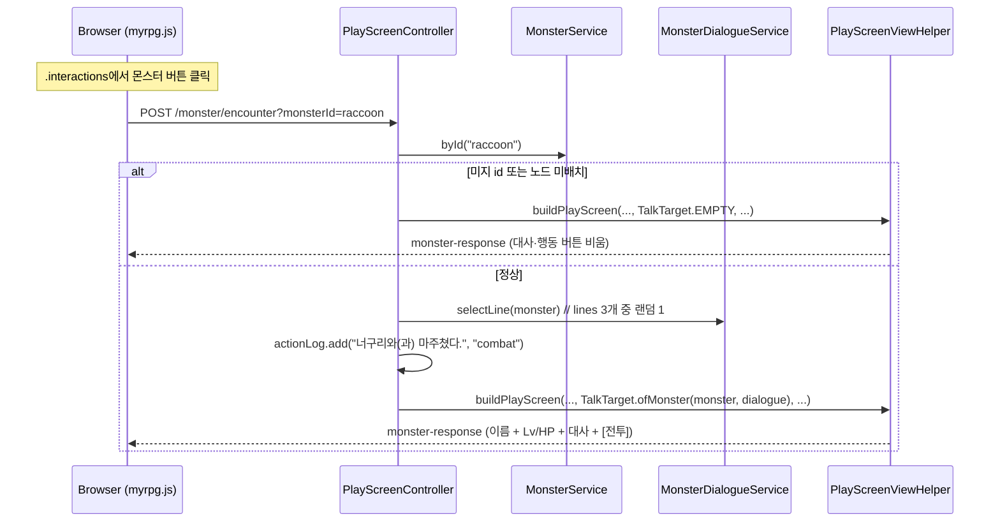
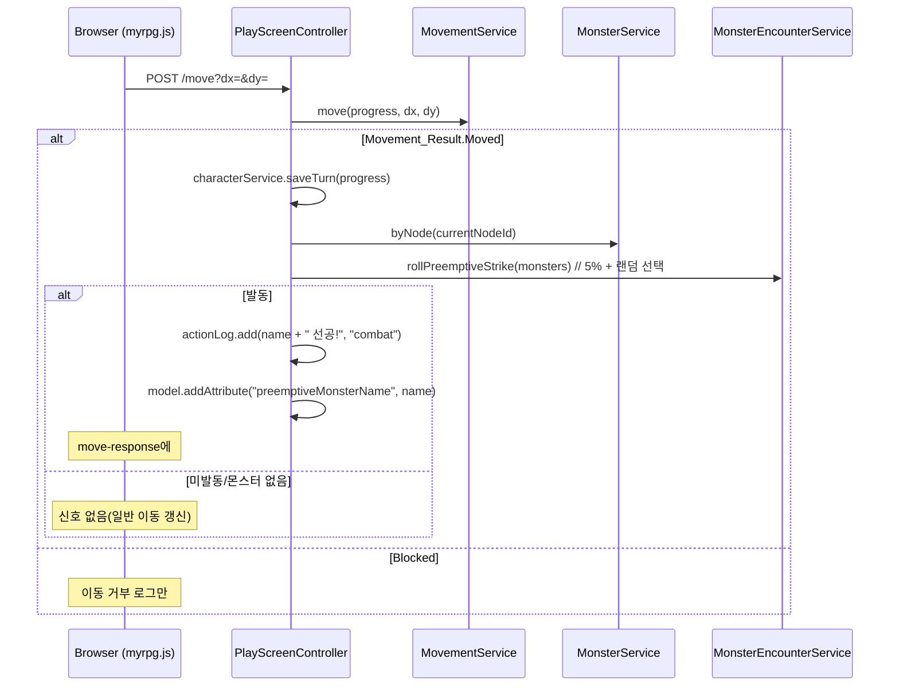

# Design Document

## Overview

본 설계는 `myrpg` Web 모듈(`com.myapps.web.myrpg`)에 **몬스터 시스템**을 추가한다(스펙 007). 004~006의 "계산형/저장형/카탈로그형 구분" 원칙을 따르되, 몬스터는 NPC 파이프라인의 완성 레퍼런스("맵별 배치 → 상호작용 버튼 → 클릭 시 대사 + 행동 버튼")를 복제·확장한다.

- **카탈로그형(JSON)**: 몬스터 정의(`monster.json` → `MonsterService`, `NpcService`/`SkillCatalogService` 선례). 맵별 출현 매핑은 `map.json` 노드의 `monsters` 배열(맵이 단일 진실).
- **코드형(enum/순수 정책 서비스)**: 타입(`MonsterType`), 대사 선택(`MonsterDialogueService`), 가위바위보 AI(`MonsterAiService`), 드랍 계산(`MonsterRewardService`), 선공 판정(`MonsterEncounterService`).
- **비영속**: 몬스터는 불변 record + 메모리 카탈로그다. 전투 중 현재 HP 등 상태는 6순위(전투)에서 관리한다.

몬스터는 스킬을 갖지 않으므로 `SkillType`(NORMAL/HEAVY/DEFENSE) 3항만 재사용하고, 스탯은 플레이어 `Stats`를 재사용하지 않고 `attackPower`/`defense`/`critical`만 플랫하게 둔다(DEX/INT·MP·스태미나 없음). 상호작용 목록은 NPC·몬스터를 한 리스트로 합치고, 대사 대상은 `TalkTarget`으로 묶어 `PlayScreenView`에 몬스터 슬롯(name/level/maxHp/dialogue/actions)을 더한다.

### 이번 스펙에서 구현 vs 이연

- **구현**: 카탈로그·교차검증, 맵 매핑(`MapNode` 확장·`byNode`), 조우 대사(3개 랜덤), 가위바위보 AI(34/33/33 정책+테스트), 드랍 계산(정책+테스트), 선공 판정(5% 서버 + alert 신호), 조우 UI(버튼·이름·레벨·HP·대사·`전투` 플레이스홀더).
- **이연**: 전투 턴·데미지·드랍 지급·HP 감소·선공 실전투 진입·크리티컬 배율·내구도 감소(6순위) / 보스 실데이터·인챈트 드랍(인챈트 스펙 후) / 던전 몬스터(10순위) / 보스 필드 랜덤 등장(추후).

## Architecture

### 모듈 추가/변경 (007)

004~006과 동일한 DDD 4계층에 아래를 추가/확장한다. **[신규]**는 새 파일, **[확장]**은 기존 산출물 수정, **[리네임]**은 기존 파일 개명이다.

```
myrpg/src/
├── main/java/com/myapps/web/myrpg/
│   ├── interfaces/api/
│   │   ├── PlayScreenController.java           # [확장] /monster/encounter, move() 선공 판정, 몬스터 서비스 3종 주입
│   │   └── PlayScreenViewHelper.java           # [확장] buildInteractions(npcs,monsters), TalkTarget 오버로드, buildMonsterActions
│   ├── application/
│   │   ├── service/
│   │   │   ├── MonsterService.java             # [신규] monster.json 로드·교차검증·all/byId/byNode
│   │   │   ├── MonsterDialogueService.java     # [신규] 조우 대사 랜덤 선택(시간대 분기 없음)
│   │   │   ├── MonsterAiService.java           # [신규] 가위바위보 34/33/33 (actionFor/nextAction)
│   │   │   ├── MonsterRewardService.java        # [신규] 드랍 계산 (goldFor/rollDrop)
│   │   │   ├── MonsterEncounterService.java     # [신규] 필드 진입 선공 판정 (triggers/rollPreemptiveStrike)
│   │   │   └── MapService.java                  # [확장] parseNode에 monsters optional 배열 파싱
│   │   ├── dto/
│   │   │   ├── ActionButton.java               # [리네임] NpcActionButton → ActionButton (NPC·몬스터 공용)
│   │   │   ├── PlayScreenView.java             # [확장] monsterName/monsterDialogue/monsterLevel/monsterMaxHp/monsterActions + 보조 생성자
│   │   │   ├── TalkTarget.java                 # [신규] (Npc, Monster, dialogue) 묶음
│   │   │   ├── DropResult.java                 # [신규] (long gold, List<DroppedItem>)
│   │   │   └── DroppedItem.java                # [신규] (String itemId, int quantity)
│   │   └── exception/
│   │       └── MonsterDataException.java       # [신규] 카탈로그 로드/검증 실패 (SkillDataException 선례)
│   └── domain/
│       └── model/
│           ├── MonsterType.java                # [신규] enum NORMAL/BOSS + badge/actionLabels/fromType
│           ├── Monster.java                    # [신규] record (스탯·드랍·대사 + buttonLabel)
│           ├── GoldDrop.java                   # [신규] record (min,max) 검증
│           ├── ItemDrop.java                   # [신규] record (itemId,chance,minQ,maxQ)
│           └── MapNode.java                    # [확장] monsters 컴포넌트 + 9인자 보조 생성자
└── main/resources/
    ├── data/
    │   ├── monster.json                        # [신규] 몬스터 카탈로그(너구리 1종)
    │   └── map.json                            # [확장] dugald-north에 monsters:["raccoon"]
    ├── templates/fragments/
    │   ├── center.html                         # [확장] 몬스터 대사·레벨·HP·행동 버튼, onInteractionClick
    │   ├── monster-response.html               # [신규] center 교체 프래그먼트
    │   └── move-response.html                  # [확장] 선공 신호 요소(#preemptiveSignal)
    └── static/
        ├── js/myrpg.js                         # [확장] swapCenter, onInteractionClick, encounterMonster, monsterAction, move() 선공 alert
        └── css/myrpg.css                       # [확장] .monster-name, .monster-meta, .monster-actions button
```

> `item.json`·상단바·사이드바·미니맵·인벤토리·은행은 **무변경**. `너구리`의 드랍 `hp_potion_50`은 이미 `item.json`에 존재한다.

### 몬스터 조우 흐름



### 필드 진입 선공 흐름



## Components and Interfaces

### MonsterType (domain/model) [신규]

```java
public enum MonsterType {
    NORMAL("normal", "일반", "", List.of("전투")),
    BOSS("boss", "보스", "👑", List.of("전투"));
    String typeString(); String label();
    String badge();                        // 버튼 접미 배지(일반="", 보스="👑")
    List<String> actionLabels();
    static Optional<MonsterType> fromType(String type);   // 미지/null → empty
}
```

### Monster / GoldDrop / ItemDrop (domain/model) [신규]

```java
public record Monster(String id, String name, MonsterType type,
                      int level, int maxHp, int attackPower, int defense, int critical,
                      long experience, GoldDrop goldDrop, List<ItemDrop> itemDrops,
                      List<String> lines) {
    /** 일반은 이름만("너구리"), 보스는 이름 뒤 배지("너구리왕 👑"). */
    public String buttonLabel() {
        return type.badge().isBlank() ? name : name + " " + type.badge();
    }
}

public record GoldDrop(int min, int max) {}   // 컴팩트 생성자: 0 ≤ min ≤ max 검증
public record ItemDrop(String itemId, int chancePercent, int minQuantity, int maxQuantity) {}
```

- 플랫 스탯(`attackPower`/`defense`/`critical`) — 플레이어 `Stats` 재사용 안 함. `critical`은 0.1% 단위 정수(플레이어 규약). MP·스태미나 없음.

### MapNode (domain/model) [확장]

```java
public record MapNode(String id, String name, String type, NodeType nodeType,
                      int x, int y, String dungeonId, String theme,
                      List<String> links, List<String> monsters) {
    /** 몬스터 없는 노드용(기존 9인자 호출부 호환). */
    public MapNode(String id, String name, String type, NodeType nodeType,
                   int x, int y, String dungeonId, String theme, List<String> links) {
        this(id, name, type, nodeType, x, y, dungeonId, theme, links, List.of());
    }
}
```

- 테스트 ~20곳이 9인자로 직접 생성하므로 보조 생성자로 무수정 유지.

### MonsterService (application/service) [신규]

```java
@Service
public class MonsterService {   // NpcService 선례
    public MonsterService(ObjectMapper objectMapper, MapService mapService, ItemCatalogService itemCatalogService);
    @PostConstruct void init();                          // classpath:data/monster.json 1회 로드 + 교차검증
    public List<Monster> loadFromStream(InputStream);    // 파싱·검증 분리(테스트 주입)
    public List<Monster> all();
    public Optional<Monster> byId(String monsterId);
    public List<Monster> byNode(String nodeId);          // map.json monsters 순서 보존, 미지/null → []
}
```

- 파싱: 필수 필드/타입(`MonsterType.fromType`)/`goldDrop`·수량·확률 범위/`lines` 개수(=3) 검증.
- 교차검증(기동 실패): ① `id` 중복 ② `map.json`의 모든 `monsters`가 카탈로그에 존재 ③ 노드별 `monsters` 중복 금지 ④ `itemDrops[].itemId`가 `ItemCatalogService.byId`에 존재.
- `MapService`·`ItemCatalogService`를 생성자 주입 → 두 빈의 `@PostConstruct` 완료 후 초기화된다.
- `byNode`는 `mapService.graph().byId(nodeId)`(Optional)로 관용 조회(예외 없음).

### MonsterDialogueService (application/service) [신규]

```java
@Service
public class MonsterDialogueService {
    public MonsterDialogueService(Random random);
    public String selectLine(Monster monster);   // lines 3개 중 random.nextInt(3), 폴백 없음
}
```

- 카탈로그 검증으로 `lines`가 항상 3개이므로 폴백 문구 불필요. 시간대(TimeOfDay) 분기 없음.

### MonsterAiService (application/service) [신규]

```java
@Service
public class MonsterAiService {
    private static final int NORMAL_WEIGHT = 34;
    private static final int HEAVY_WEIGHT = 33;
    private static final int DEFENSE_WEIGHT = 33;   // 합 100
    public MonsterAiService(Random random);
    public SkillType actionFor(int roll) {          // 순수 함수(테스트 진입점)
        if (roll < NORMAL_WEIGHT) return SkillType.NORMAL;                 // 0~33
        if (roll < NORMAL_WEIGHT + HEAVY_WEIGHT) return SkillType.HEAVY;   // 34~66
        return SkillType.DEFENSE;                                          // 67~99
    }
    public SkillType nextAction();                  // actionFor(random.nextInt(100))
}
```

- 몬스터는 스킬을 갖지 않고 `SkillType` 3항만 쓴다. 확률은 고정, 몬스터별 override 없음. 데미지 계산·턴 소비는 6순위.

### MonsterRewardService (application/service) [신규]

```java
@Service
public class MonsterRewardService {
    private static final int PERCENT_BOUND = 100;
    public MonsterRewardService(Random random);
    public long goldFor(GoldDrop goldDrop, int roll);   // min + roll % (max - min + 1)
    public DropResult rollDrop(Monster monster);        // 골드 필수 + 아이템 0개 이상
}
```

- `rollDrop`: 골드 산출 + 각 `ItemDrop`의 `chancePercent` 판정 통과 시 수량 범위 추첨. 실제 지급(골드 가산·인벤토리 적재)은 6순위(서술형 JavaDoc으로 seam 명시).

### MonsterEncounterService (application/service) [신규]

```java
@Service
public class MonsterEncounterService {
    private static final int PREEMPTIVE_STRIKE_PERCENT = 5;   // 전 맵 고정
    private static final int PERCENT_BOUND = 100;
    public MonsterEncounterService(Random random);
    public Optional<Monster> rollPreemptiveStrike(List<Monster> monsters) {
        if (monsters == null || monsters.isEmpty()) return Optional.empty();
        if (!triggers(random.nextInt(PERCENT_BOUND))) return Optional.empty();
        return Optional.of(monsters.get(random.nextInt(monsters.size())));
    }
    public boolean triggers(int roll) { return roll < PREEMPTIVE_STRIKE_PERCENT; }   // 순수 함수
}
```

- boolean이 아니라 **선택된 Monster**를 반환 → 6순위가 "누가 선공했는지"를 그대로 사용. 실제 전투 진입은 6순위(seam JavaDoc).

### PlayScreenViewHelper (interfaces/api) [확장]

```java
// 합류: NPC 먼저, 이어서 몬스터(각 정의 순서)
public List<InteractionItem> buildInteractions(List<Npc> npcs, List<Monster> monsters);
// 기존 buildInteractions(List<Npc>)는 buildInteractions(npcs, List.of())로 위임

// 신규 진입점: 대사 대상을 TalkTarget으로 묶어 파라미터 폭증 방지. 기존 오버로드는 EMPTY/ofNpc 위임
public PlayScreenView buildPlayScreen(CharacterProgress progress, MinimapView minimap,
        FullMapView fullMap, String ambience, List<InteractionItem> interactions,
        TalkTarget talkTarget, List<ActionLogEntry> logs, InfoPopupView info);

private InteractionItem toInteractionItem(Monster m) {
    return new InteractionItem(m.id(), m.buttonLabel(), false);   // npc=false
}
private List<ActionButton> buildMonsterActions(Monster m) {
    return m == null ? null : m.type().actionLabels().stream().map(ActionButton::new).toList();
}
```

- `talkTarget.monster()`가 있으면 `monsterName`(이름)·`monsterLevel`(level)·`monsterMaxHp`(maxHp)·`monsterDialogue`(대사)를 채운다. NPC 대상이거나 대상 없음이면 몬스터 슬롯 4개는 모두 null.

### PlayScreenController (interfaces/api) [확장]

```java
// 생성자에 MonsterService, MonsterDialogueService, MonsterEncounterService 추가
// COMBAT_TYPE = "combat"

@PostMapping("/monster/encounter")
public String encounterMonster(@RequestParam String monsterId, Model model);
// 1) 현재 노드 NPC+몬스터로 interactions 재구성
// 2) monsterService.byId → 없으면 TalkTarget.EMPTY (예외 없음)
// 3) monsterDialogueService.selectLine(monster)
// 4) actionLog.add(name + "와(과) 마주쳤다.", COMBAT_TYPE)
// 5) buildPlayScreen(..., TalkTarget.ofMonster(monster, dialogue), ...) → "fragments/monster-response"

// move(): Movement_Result.Moved 분기 내부
//   monstersOnNode = monsterService.byNode(currentNodeId)
//   ambusher = monsterEncounterService.rollPreemptiveStrike(monstersOnNode)
//   ambusher.ifPresent -> actionLog.add(name + " 선공!", COMBAT_TYPE) + model.addAttribute("preemptiveMonsterName", name)

// buildViewFromProgress(): interactions = buildInteractions(npcsOnNode, monsterService.byNode(nodeId))
```

### 뷰 모델 (application/dto)

```java
// [리네임] NpcActionButton → ActionButton (NPC·몬스터 공용)
public record ActionButton(String label) {}

// [신규] 대사 대상 묶음
public record TalkTarget(Npc npc, Monster monster, String dialogue) {
    static final TalkTarget EMPTY = new TalkTarget(null, null, null);
    static TalkTarget ofNpc(Npc npc, String dialogue);
    static TalkTarget ofMonster(Monster monster, String dialogue);
}

// [확장] 몬스터 슬롯 추가(몬스터 없으면 null), 보조 생성자로 하위 호환
public record PlayScreenView(
        TopBarView topBar, MinimapView minimap, FullMapView fullMap, String ambience,
        String npcName, String npcDialogue,
        String monsterName, String monsterDialogue,
        Integer monsterLevel, Integer monsterMaxHp,
        List<InteractionItem> interactions,
        List<ActionButton> npcActions, List<ActionButton> monsterActions,
        List<ActionLogEntry> logs, InfoPopupView info) { /* 10-인자 보조 생성자 존재 */ }

// [신규] 드랍 계산 결과
public record DropResult(long gold, List<DroppedItem> items) { static final DropResult EMPTY = ...; }
public record DroppedItem(String itemId, int quantity) {}
```

## Data Models

### monster.json 스키마 (최상위 배열)

```
필수: id(string), name(string), type("normal"|"boss"),
      level(int≥1), maxHp(int≥1), attackPower(int≥0), defense(int≥0),
      critical(int, 0.1%단위), experience(long), goldDrop{min,max}(0≤min≤max),
      lines(array, 정확히 3개)
optional: itemDrops[ { itemId(카탈로그 존재), chancePercent(1~100), minQuantity, maxQuantity(1≤min≤max) } ] (기본 [])
```

초기 1종 `너구리`:

```json
{
  "id": "raccoon", "name": "너구리", "type": "normal",
  "level": 1, "maxHp": 25, "attackPower": 4, "defense": 1, "critical": 10,
  "experience": 15, "goldDrop": { "min": 3, "max": 10 },
  "itemDrops": [ { "itemId": "hp_potion_50", "chancePercent": 15, "minQuantity": 1, "maxQuantity": 1 } ],
  "lines": [
    "크르릉… 쉭, 쉭!",
    "(너구리가 몸을 잔뜩 웅크린 채 경계 태세를 갖춘다.)",
    "(너구리가 이빨을 드러내며 앞발을 천천히 들어올린다.)"
  ]
}
```

> 제거된 필드: `emoji`(버튼 배지는 `MonsterType`이 관리)·`description`(현재 화면 미사용). `lines`는 1개 소리 + 2개 행동 묘사.

### map.json 변경 (노드 monsters)

```
nodes[].monsters(array of Monster_Id, optional, 기본 []) — dugald-north: ["raccoon"]
```

- `MapService.parseNode`: `parseLinks`를 `parseStringArray(node, fieldName)`로 일반화하여 `links`/`monsters` 공용 파싱. `theme`처럼 `has(...)`로 optional 처리.

### 비영속 카탈로그

- `Monster`/`GoldDrop`/`ItemDrop`은 JPA 엔티티가 아니라 불변 record다. `bank`·`owned_item` 같은 신규 테이블은 없다. 전투 중 현재 HP는 6순위에서 관리한다.

## Correctness Properties

*프로퍼티는 시스템의 모든 유효한 실행에서 참이어야 하는 특성이다.* 순수/결정적 로직(enum·record·카탈로그 검증·조회·대사·AI·드랍·선공·라벨 조립)을 대상으로 하며, 템플릿·JS·CSS(SMOKE)와 고정 초기값(EXAMPLE)은 제외한다.

### Property 1: 몬스터 타입 완전성

*For any* `MonsterType`에 대해, `label()`과 `actionLabels()`는 비어 있지 않고, `badge()`는 NORMAL에서 빈 문자열·BOSS에서 "👑"이며, `fromType(typeString())`은 자기 자신을 돌려주고 미지 코드/`null`은 empty이다.

**Validates: Requirements 3.1, 3.2, 3.3, 3.4**

### Property 2: 몬스터 버튼 라벨 포맷

*For any* `Monster`에 대해, `buttonLabel()`은 배지가 빈 타입(NORMAL)이면 이름과 정확히 같고, 배지가 있는 타입(BOSS)이면 `이름 + " " + 배지`이며, 상호작용 항목으로 변환하면 `Interaction_Item.npc == false`이다.

**Validates: Requirements 4.6, 10.3, 10.4**

### Property 3: 몬스터 카탈로그 파싱·필드 보존

*For any* 유효한 몬스터 배열 입력에 대해, `loadFromStream`은 항목 수만큼의 불변 목록을 반환하고 각 필드(스탯·`goldDrop`·`itemDrops`·`lines`)가 보존되며, `itemDrops` 미기재는 빈 목록이 된다.

**Validates: Requirements 1.2, 2.7, 4.1**

### Property 4: 몬스터 카탈로그 검증 실패

*For any* (a) 중복 `id`, (b) 미지 `type`, (c) 필수 필드 누락, (d) `goldDrop`/수량/확률 범위 위반, (e) 미존재 `itemDrops.itemId`, (f) `lines` 개수 ≠ 3 중 하나를 포함하는 입력에 대해, `loadFromStream`(또는 교차검증)은 `MonsterDataException`을 던진다.

**Validates: Requirements 2.1, 2.2, 2.3, 2.4, 2.5, 2.6**

### Property 5: 노드별 조회 순서·관용성

*For any* `map.json` 배치와 노드 id에 대해, `byNode`는 해당 노드 `monsters` 배열 순서를 보존한 목록을 반환하고, 미지 노드·`null`에는 빈 목록을 반환한다.

**Validates: Requirements 5.5, 5.6**

### Property 6: 조우 대사 선택

*For any* `Monster`(lines 3개)에 대해, `selectLine`은 항상 그 `lines`에 포함된 값을 반환하고, 고정 시드 `Random`에서 결정적이며, 폴백 문구를 사용하지 않는다.

**Validates: Requirements 6.2, 6.3, 6.5**

### Property 7: 가위바위보 분포

*For any* `roll ∈ [0, 99]`에 대해, `actionFor`는 `roll < 34`→NORMAL, `34 ≤ roll < 67`→HEAVY, `roll ≥ 67`→DEFENSE를 반환하여 정확히 34/33/33 개수로 분할되며, 경계값(33/34/66/67)이 규칙과 일치한다.

**Validates: Requirements 7.2, 7.3**

### Property 8: 드랍 골드 범위·아이템 확률

*For any* `Gold_Drop`과 `roll`에 대해, `goldFor`는 `[min, max]` 범위의 값을 반환한다(min=max이면 그 값). *For any* `Item_Drop`에 대해, `chancePercent=100`이면 항상 드랍·`chancePercent=0`이면 결코 드랍하지 않으며, 드랍 시 수량은 `[minQuantity, maxQuantity]` 범위이다.

**Validates: Requirements 8.2, 8.3, 8.4**

### Property 9: 선공 판정 경계·선택

*For any* `roll ∈ [0, 99]`에 대해, `triggers`는 `roll < 5`에서만 참이다(경계: 4→참, 5→거짓). *For any* 몬스터 목록에 대해, `rollPreemptiveStrike`는 빈 목록에서 빈 Optional을 반환하고, 발동 시 반환 몬스터는 항상 입력 목록에 포함되며 고정 시드에서 결정적이다.

**Validates: Requirements 9.1, 9.2, 9.3**

### Property 10: 몬스터 행동 버튼 조립

*For any* `Monster`에 대해, `buildMonsterActions`가 만든 `monsterActions`의 라벨 목록은 `MonsterType.actionLabels()`와 개수·순서·값이 정확히 일치한다(현재 `["전투"]`).

**Validates: Requirements 11.5, 13.2**

## Error Handling

| 상황 | 처리 |
|---|---|
| 카탈로그 로드/파싱/검증 실패(Req 1.5, 2.1~2.6) | `MonsterDataException` → 기동 실패(`SkillDataException`/`NpcDataException` 선례). 요청 핸들러 대상 아님 |
| `map.json` monsters가 카탈로그에 없음(Req 5.7) / 노드 내 중복(Req 5.8) | 기동 시 `MonsterDataException` |
| `itemDrops.itemId` 미존재(Req 2.5) | 기동 시 `MonsterDataException`(`ItemCatalogService.byId` 교차검증) |
| 미지 `monsterId`/노드 미배치 조우(Req 11.9) | 예외 없이 대사·행동 버튼 비운 채 정상 렌더(`talkToNpc` 관용 설계) |
| 미지 `nodeId` byNode(Req 5.6) | 빈 목록 반환(예외 없음) |
| 선공 미발동/몬스터 없음(Req 9.3) | 신호 없이 일반 이동 갱신 |

- 커스텀 예외는 `RuntimeException`을 직접 던지지 않고 `MonsterDataException`(생성자 2개)으로 처리한다(code-style).

## Testing Strategy

### 이중 테스트 접근

- **프로퍼티 테스트(jqwik)**: 위 Correctness Property 10개. `@Property(tries = 100)`, `@Mock` 금지(`Mockito.mock()` 직접), 태그 주석 `Feature: 007-monster-system, Property {번호}: {텍스트}`. 서비스는 `new MonsterService(objectMapper, ...)` 후 `loadFromStream` 결과를 리플렉션 주입하거나 인메모리 JSON(`objectMapper.createArrayNode()`)으로 검증(`NpcServiceByNodePropertyTest` 선례).
- **단위/예시 테스트**:
  - `MonsterType` 라벨·배지·`fromType` 미지값(`MonsterTypeTest`).
  - `Monster.buttonLabel` 예시(일반=이름만, 보스=이름+👑).
  - `GoldDrop` 생성자 검증(min>max 거부) 예시.
  - `MonsterDialogueService` 고정 시드 선택 예시, `MonsterAiService` 경계 예시.
- **컨트롤러 슬라이스**(`@WebMvcTest` + `@MockitoBean`):
  - `PlayScreenControllerMonsterTest`: 이동 후 몬스터 버튼 노출, `/monster/encounter` → `monster-response` + `monsterName`/`monsterLevel`/`monsterMaxHp`/`monsterDialogue`/`monsterActions`, 미지 id 관용, NPC·몬스터 슬롯 배타.
  - `PlayScreenControllerPreemptiveTest`: `/move`에서 `rollPreemptiveStrike`가 몬스터 반환 시 `preemptiveMonsterName` 모델 속성·`combat` 로그, 빈 Optional이면 신호 없음.
- **로드 통합**(`MonsterServiceLoadIntegrationTest`): 실제 `monster.json`·`map.json` 로드, 너구리 필드 값·`dugald-north` 배치 확인.
- **컨텍스트 로드 스모크**(`@SpringBootTest`): 몬스터 서비스 4종 빈 로딩 + 컨텍스트 기동.
- **정적 리소스 보존**(`VisualJsPreservationAndJsonLoadingIntegrationTest` 확장): `myrpg.js`·`center.html` 변경 기대값 갱신.

### 생성기(Arbitraries)

- 카탈로그 입력 생성기(P3/P4): 유효 몬스터 + 결함 주입(중복 id, 미지 type, 필드 누락, 범위 위반, 미존재 itemId, lines≠3).
- 노드 배치 생성기(P5): 노드별 monsters 순열 + 미지 노드.
- roll 생성기(P7/P9): `0..99` 전 구간.
- GoldDrop/ItemDrop 생성기(P8): `0≤min≤max`, chance 0/100 경계 포함.

### 빌드 검증

- 각 구현 Task 완료 전 `mvn test -pl myrpg` 통과 + `mvn clean install -pl myrpg -am` `BUILD SUCCESS` 확인(steering `task-build-validation.md`).

## Migration 영향 범위 (기존 산출물)

- **`MapNode`**: `monsters` 컴포넌트 + 9인자 보조 생성자. 기존 9인자 호출부(테스트 ~20곳) 무변경.
- **`MapService`**: `parseNode`에 `monsters` optional 파싱(`parseStringArray` 일반화). 기존 맵 테스트 무회귀.
- **`PlayScreenViewHelper`**: `buildInteractions(npcs, monsters)`·`buildMonsterActions`·`TalkTarget` 오버로드. 기존 `buildInteractions(List<Npc>)`·`buildPlayScreen` 오버로드는 위임으로 유지 → 기존 Mockito 스텁 무변경.
- **`PlayScreenView`**: 몬스터 슬롯 5필드 추가 + 기존 10-인자 보조 생성자. 기존 테스트(8곳) 무변경.
- **`NpcActionButton` → `ActionButton`**: 리네임. 참조 6곳(DTO·헬퍼·테스트 4) 기계적 갱신, `NpcActionButtonsPropertyTest` 클래스명 유지.
- **`PlayScreenController`**: 몬스터 서비스 3종 주입 + `/monster/encounter` + `move()` 선공 + `buildViewFromProgress` 갱신. 기존 `@WebMvcTest` 3곳에 `@MockitoBean` 3개 추가(`rollPreemptiveStrike` 기본 empty 스텁).
- **`center.html`/`move-response.html`/`myrpg.js`/`myrpg.css`**: 몬스터 대사·레벨·HP·행동 버튼, `onInteractionClick`, `#preemptiveSignal`, `swapCenter`/`encounterMonster`/`monsterAction`, `.monster-*` 스타일.
- **`item.json`·상단바·사이드바·미니맵·인벤토리·은행**: **무변경**.

### 이관 항목 (본 스펙은 정의·데이터·정책·신호까지)

- **6순위(전투)**: 전투 턴·데미지·선후공·사망, `MonsterAiService.nextAction()` 소비, `MonsterRewardService.rollDrop` 지급(골드 가산 + 인벤토리 획득 API 신설) + `CharacterProgress` HP 감소 메서드, `SkillService.onSkillKill` 호출, 선공 `alert` → `POST /battle/start` 교체, 크리티컬 배율 확정, 장착 장비 내구도 턴당 감소, 임시 골드 버튼 제거.
- **인챈트 스펙 후**: 보스 실데이터 + 보스 인챈트 아이템 드랍(`itemDrops`).
- **10순위(던전)**: 던전 내부 몬스터 출현.
- **추후 기능**: 보스 필드 랜덤 등장(랜덤 시간·필드) — 스폰 스케줄러+런타임 상태, `Monster` sealed 불필요.
- 각 seam(선공 신호·`전투` 버튼·`rollDrop`)은 담당 순위·교체 조건을 서술형 JavaDoc으로 명시한다(`docs/monster-system.md` 근거).
