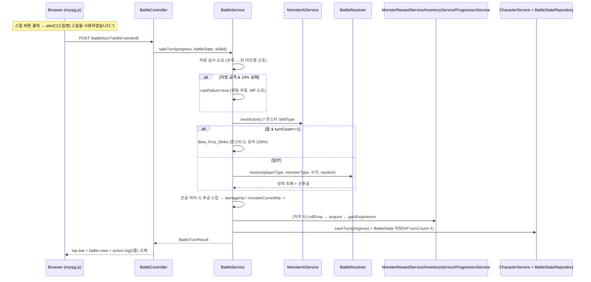
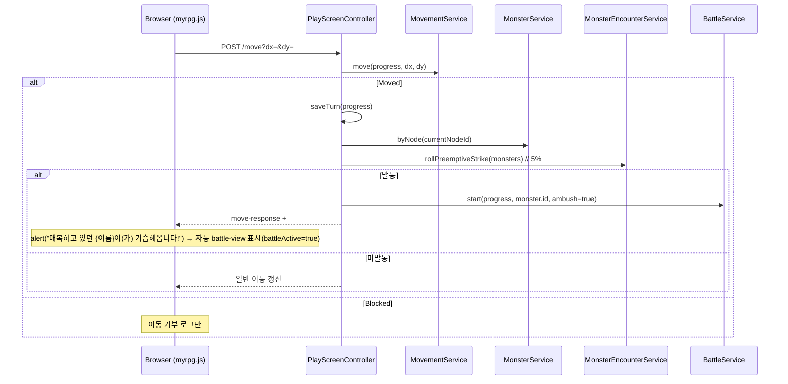

# Design Document

## Overview

본 설계는 `myrpg` Web 모듈(`com.myapps.web.myrpg`)에 **가위바위보 기반 턴제 전투 시스템**을 추가한다(스펙 008). 007이 열어둔 전투 seam(`MonsterAiService.nextAction`·`MonsterRewardService.rollDrop`·`MonsterEncounterService.rollPreemptiveStrike`)을 실제 전투 루프로 연결한다. 004~007의 "계산형/저장형/카탈로그형 구분" 원칙을 그대로 따른다.

- **순수 도메인 로직(`BattleResolver`/`RockPaperScissors`)**: 가위바위보 상성·감산형 데미지 공식·선후공을 순수 함수로 계산한다. 난수(크리티컬·편차·선후공 코인플립·도망·캐스팅 실패)는 주입 `Random`으로 분리해 시드 고정 테스트가 가능하다.
- **영속(`BattleState` @Entity)**: 전투 진행 상태(몬스터 현재 HP·턴 수·기습 여부·진행 플래그)를 매 턴 DB 저장하여 브라우저 종료 후 재개를 지원한다. `CharacterProgress`의 `currentNodeId`가 이미 영속되므로 전투 장소는 노드로 복원한다.
- **오케스트레이션(`BattleService`)**: 자원 소모·재능 특성·선후공·HP 감소·사망·보상·저장을 기존 서비스(`MonsterAiService`·`MonsterRewardService`·`InventoryService`·`ProgressionService`·`CharacterService`·`SkillService`)를 조립해 수행한다.
- **표현(`BattleController` + `battle-view.html`)**: 전용 프래그먼트로 `.center`를 교체하며, 포션·장비 교체는 인벤토리 탭에서 턴 소모 없이 실시간 반영된다(장비 교체 시 `#battleSkills` 재렌더).

전투는 몬스터 스킬 없이 `SkillType`(NORMAL/HEAVY/DEFENSE) 3항만 쓴다. 플레이어 공격력은 `Stats`(재사용)·`StatProgression`·`InventoryService.equippedBonus`·스킬 랭크 보너스를 조합해 착용 무기 재능별 주스탯 × 재능계수로 산출한다.

### 이번 스펙에서 구현 vs 이연

- **구현**: `BattleState`/리포지토리·영속·재개, `/battle/start`·`/turn`·`/flee`·`GET /battle/skills`, 9칸 매트릭스·감산형 공식·크리티컬·편차(순수+시드), 선후공, 활 1턴 선제·마법 캐스팅 실패, 자원 소모, HP 감소·사망·부활, 도망, 보상 지급(`acquire`)·내구도 0 자동 해제, 스킬 훅, 기습 자동 진입, 전투 UI(전용 프래그먼트·미니맵·이동 차단·포션/장비 실시간), 활동 로그 2줄, 몬스터 방어 상수, 임시 버튼 제거.
- **이연**: 던전 내부 전투(10순위) / 보스 실데이터·인챈트 드랍(인챈트 스펙 후) / 내구도 수리(7순위 대장간).

## Architecture

### 모듈 추가/변경 (008)

004~007과 동일한 DDD 4계층에 아래를 추가/확장한다. **[신규]**는 새 파일, **[확장]**은 기존 산출물 수정, **[제거]**는 임시 산출물 삭제다.

```
myrpg/src/
├── main/java/com/myapps/web/myrpg/
│   ├── interfaces/api/
│   │   ├── BattleController.java               # [신규] /battle/start, /battle/turn, /battle/flee, GET /battle/skills
│   │   ├── PlayScreenController.java           # [확장] 기습→자동 battle/start, GET / 전투 재개, /move 전투 중 거부, 임시 골드/경험치 버튼 제거
│   │   ├── PlayScreenViewHelper.java           # [확장] 전투 재개 시 battle-view 뷰 조립 보조
│   │   └── SkillController.java                # [제거] dev/fill-usage · dev/fill-kill 임시 드라이버
│   ├── application/
│   │   ├── service/
│   │   │   ├── BattleService.java              # [신규] start/takeTurn/flee/resumeIfActive/combatSkills 오케스트레이션
│   │   │   ├── InventoryService.java           # [확장] acquire(드랍 적재), 내구도 0 자동 해제, combatSkills(무기 재능+공통)
│   │   │   ├── ProgressionService.java         # [확장] 사망 처리(경험치 -10% + 풀 회복 + 티르코네일 리스폰)
│   │   │   ├── MonsterService.java             # [확장] defenseBlockRate/defenseCounterRate optional 파싱
│   │   │   └── (재사용) MonsterAiService/MonsterRewardService/MonsterEncounterService/SkillService/SkillDamagePolicy/CharacterService/StatProgression
│   │   ├── dto/
│   │   │   ├── BattleView.java                 # [신규] 전투 화면 뷰 모델 (몬스터 name/level/hp, 스킬 버튼, 도망)
│   │   │   └── BattleSkillButton.java          # [신규] 전투 스킬 버튼 뷰 (id/label/type/resourceKind/cost)
│   │   └── exception/
│   │       └── (사용) 안전 종료는 예외 없이 처리, 커스텀 예외 필요 시 BattleStateException 신설
│   └── domain/
│       ├── model/
│       │   ├── BattleState.java                # [신규] @Entity (캐릭터 1:1) monsterId/monsterCurrentHp/turnCount/ambush/active
│       │   ├── BattleTurnResult.java           # [신규] record 한 턴 결과
│       │   ├── AffinityResult.java             # [신규] enum WIN/LOSE/DRAW (또는 RockPaperScissors 내부)
│       │   ├── Monster.java                    # [확장] defenseBlockRate/defenseCounterRate + 보조 생성자(하위 호환)
│       │   └── CharacterProgress.java          # [확장] damageHp(int), isDead()
│       ├── repository/
│       │   └── BattleStateRepository.java      # [신규] Spring Data JPA (findByActiveTrue 등)
│       └── service/
│           ├── BattleResolver.java             # [신규] 순수 상성·데미지·선후공 계산
│           └── RockPaperScissors.java          # [신규] 순수 상성 승패 판정
└── main/resources/
    ├── data/
    │   └── monster.json                        # [확장] (옵션) defenseBlockRate/defenseCounterRate, (선택) 신규 몬스터
    ├── templates/fragments/
    │   ├── battle-view.html                    # [신규] battle-view(전체) + battle-skills(서브프래그먼트), 미니맵 포함
    │   ├── center.html                         # [확장] 조우 시 전투 버튼 → /battle/start
    │   ├── monster-response.html               # [확장] 전투 진입 배선
    │   ├── left-sidebar.html                   # [확장/제거] 임시 골드/경험치 버튼 제거
    │   └── (승급 모달 프래그먼트)                 # [제거] .rankup-temp-btn (횟수/처치수)
    └── static/
        ├── js/myrpg.js                         # [확장] battleActive, startBattle, battleTurn, flee, move 차단, 포션/장비 실시간, 임시 함수 제거
        └── css/myrpg.css                       # [확장] .battle-view, #battleSkills, .flee-btn, 몬스터 HP 바(기존 .bar 재사용)
```

> `top-bar`(구조)·은행·인벤토리 팝업 구조는 무변경. 플레이어 게이지는 `top-bar`에 있으며 턴 응답 시 함께 교체된다.

### 전투 상태 머신

```
[플레이] --조우/전투버튼--> POST /battle/start --> [전투(active)]
[플레이] --이동+기습5%----> 자동 battle/start ---> [전투(active)]
[전투] --POST /battle/turn--> (승리) 보상 --> [플레이 복원]
                           --(패배) 사망 --> [티르코네일 복원]
                           --(계속) --> [전투(active)]  (매 턴 saveTurn + BattleState 저장)
[전투] --POST /battle/flee--> (성공) --> [플레이 복원]
                           --(실패) 몬스터 1대 --> [전투(active) 또는 사망]
[재접속 GET /] --active?--> [전투(active) 복원]  else [플레이]
```

### 턴 진행 흐름



### 필드 진입 기습(강제 전투) 흐름



## Components and Interfaces

### RockPaperScissors / AffinityResult (domain) [신규]

```java
public enum AffinityResult { WIN, LOSE, DRAW }

public final class RockPaperScissors {
    /** 일반>강, 강>방어, 방어>일반. 동일 타입은 DRAW. */
    public static AffinityResult judge(SkillType mine, SkillType other);
}
```

### BattleResolver (domain/service) [신규]

```java
@Service
public class BattleResolver {
    private static final double CRITICAL_MULTIPLIER = 1.5;
    private static final double VARIANCE_MIN = 0.90;
    private static final double VARIANCE_MAX = 1.10;
    private static final int MONSTER_NORMAL_MULTIPLIER = 100;
    private static final int MONSTER_HEAVY_MULTIPLIER = 150;

    public BattleResolver(Random random);

    /** 감산 기본피해: max(1, floor(attackPower * skillMultiplier / 100) - targetDefense). 순수. */
    public int baseDamage(int attackPower, int skillMultiplierPercent, int targetDefense);

    /** 상성계수(승1.0/무0.5/방어당함(1-blockRate)/관통0.0). 순수. */
    public double affinityCoefficient(AffinityResult result, boolean penetrated, int blockRatePercent);

    /** 크리티컬 판정(random.nextInt(1000) < critical). */
    public boolean rollCritical(int critical);

    /** 최종피해 = max(1, round(base * coeff * (crit?1.5:1) * rand(0.9~1.1))). crit/편차는 주입 random. */
    public int finalDamage(int baseDamage, double affinityCoefficient, boolean critical);

    /** 9칸 매트릭스: 양측 피해·플래그를 담은 결과 반환(선후공 제외 순수 계산). */
    public ResolvedTurn resolve(TurnInput input);   // input: 타입·공격력·방어·배율·경감/반격율·critical
}
```

- `resolve`는 **결정적 부분(감산·상성·경감·반격)** 을 계산하고, **크리티컬·편차** 는 주입 `Random`으로 산출한다 → 시드 고정 시 완전 재현.
- 선후공(코인플립·선공 처치 무효)은 `BattleService`가 `resolve` 결과를 받아 순서 적용한다(동일 타입 50:50만 난수).

### BattleState (domain/model) [신규 @Entity]

```java
@Entity
public class BattleState {
    @Id @GeneratedValue Long id;
    long characterId;          // 캐릭터 1:1
    String monsterId;
    int monsterCurrentHp;
    int turnCount;             // 시작 시 1
    boolean ambush;
    boolean active;
    // JPA 기본 생성자 + 순수 생성자(생성자 주입 규약과 무관, 엔티티는 예외)
}
```

### BattleStateRepository (domain/repository) [신규]

```java
public interface BattleStateRepository extends JpaRepository<BattleState, Long> {
    Optional<BattleState> findByCharacterIdAndActiveTrue(long characterId);
}
```

### BattleTurnResult (domain/model) [신규]

```java
public record BattleTurnResult(
        SkillType playerAction, int playerDamage,
        SkillType monsterAction, int monsterDamage,
        boolean playerCritical, boolean monsterCritical,
        boolean blocked, boolean countered, boolean castFailure, boolean firstStrike,
        boolean resourceInsufficient, ResourceKind insufficientKind,
        boolean battleEnded, Outcome outcome,   // NONE/WIN/LOSE/FLED
        DropResult reward, long experienceGained,
        List<String> logLines) {
    public enum Outcome { NONE, WIN, LOSE, FLED }
}
```

### BattleService (application/service) [신규]

```java
@Service
public class BattleService {
    // 재능계수(튜닝값)
    private static final double MELEE_COEF = 1.0;
    private static final double ARCHERY_COEF = 0.85;
    private static final double MAGIC_COEF = 1.2;
    private static final int MAGIC_FAIL_PERCENT = 10;
    private static final int FLEE_SUCCESS_PERCENT = 50;
    private static final double DURABILITY_PER_ATTACK = 0.2;
    private static final String RESPAWN_NODE_ID = "tir-chonaill";

    public BattleService(BattleStateRepository battleStateRepository, BattleResolver resolver,
                         MonsterService monsterService, MonsterAiService monsterAiService,
                         MonsterRewardService monsterRewardService, SkillService skillService,
                         SkillDamagePolicy skillDamagePolicy, InventoryService inventoryService,
                         ProgressionService progressionService, CharacterService characterService,
                         StatProgression statProgression, ActionLog actionLog, Random random);

    public BattleState start(CharacterProgress progress, String monsterId, boolean ambush);
    public Optional<BattleState> resumeIfActive(CharacterProgress progress);
    public BattleTurnResult takeTurn(CharacterProgress progress, BattleState state, String skillId);
    public BattleTurnResult flee(CharacterProgress progress, BattleState state);
    public List<BattleSkillButton> combatSkills(CharacterProgress progress);   // 착용 무기 재능 + 공통

    /** 착용 무기 재능·주스탯·장비/스킬 보너스로 공격력 산출(재능계수 적용). */
    private int attackPower(CharacterProgress progress, Talent equippedTalent);
}
```

- `takeTurn` 순서(요구사항 10.2): 스킬 조회 → 자원 검사·소모(+마법 실패 판정) → 재능 분기(활 1턴 선제 / `resolver.resolve`) → 선후공 → `damageHp`/`monsterCurrentHp` → `onSkillUsed`(+처치 시 `onSkillKill`) → 공격 턴 `reduceDurability(0.2)`(내구도 0 자동 해제) → `saveTurn` + `BattleState` 저장(turnCount+1) → 승/패 종료 처리 → `BattleTurnResult`.
- 각 이연 seam(수리 등)·재능계수 튜닝값은 서술형 JavaDoc으로 명시.

### InventoryService (application/service) [확장]

```java
// [신규] 드랍 적재: 골드 항상 가산, 아이템은 용량 30 초과 시 소실+로그
public void acquire(CharacterProgress progress, DropResult drop);
// [신규] 전투 스킬 목록: 착용 무기 재능 스킬 + 공통(방어)
public List<BattleSkillButton> combatSkills(CharacterProgress progress);
// [확장] reduceDurability 결과가 0이면 자동 unequip + "내구도 0 — 장착 해제됨" 로그
```

### ProgressionService (application/service) [확장]

```java
// [확장] 사망 처리: applyDeathPenalty(경험치 -10%) + fullRecover + currentNodeId="tir-chonaill".
// 골드/아이템 불변. DeathResult(experienceLost) 재사용.
public DeathResult die(CharacterProgress progress);
```

### CharacterProgress (domain/model) [확장]

```java
public void damageHp(int amount) { this.hpCurrent = Math.max(0, this.hpCurrent - amount); }
public boolean isDead() { return this.hpCurrent == 0; }
```

### Monster (domain/model) [확장]

```java
// defenseBlockRate/defenseCounterRate optional. 미지정 시 전역 기본(40/30)을 반환하는 접근자.
public int defenseBlockRate();     // 기본 40
public int defenseCounterRate();   // 기본 30
// 기존 필드 순서 보존 + 보조 생성자(두 필드 미지정)로 하위 호환
```

### BattleController (interfaces/api) [신규]

```java
@Controller
@RequestMapping("/battle")
public class BattleController {
    public BattleController(BattleService battleService, CharacterService characterService, ... );

    @PostMapping("/start")  public String start(@RequestParam String monsterId, Model model);
    @PostMapping("/turn")   public String turn(@RequestParam String skillId, Model model);
    @PostMapping("/flee")   public String flee(Model model);
    @GetMapping("/skills")  public String skills(Model model);   // battle-view :: battle-skills
    // start/turn/flee → "fragments/battle-view" (top-bar/action-log 포함 교체용 조립)
}
```

### PlayScreenController (interfaces/api) [확장]

```java
// move(): Moved 분기에서 rollPreemptiveStrike 발동 시 battleService.start(...,ambush=true) + #ambushSignal
//         활성 전투가 있으면 이동 거부(방어적).
// GET /: battleService.resumeIfActive → 있으면 battle-view 복원(battleActive=true), 없으면 일반 플레이.
// [제거] /gold/gain·/gold/spend·/exp/up·/exp/down
```

### 뷰 모델 (application/dto) [신규]

```java
public record BattleView(String monsterName, int monsterLevel,
                         int monsterCurrentHp, int monsterMaxHp,
                         List<BattleSkillButton> skills, boolean fleeAvailable) {}

public record BattleSkillButton(String id, String label, SkillType type,
                                ResourceKind resourceKind, int resourceCost) {}
```

## Data Models

### BattleState (신규 테이블)

```
battle_state(id PK, character_id, monster_id, monster_current_hp, turn_count, ambush, active)
```

- 캐릭터당 활성 1건(단일 캐릭터 구조: `loadOrCreateDefault`). 매 턴 UPDATE(몬스터 HP·turnCount), 종료 시 `active=false`.
- 스키마 자동 생성(`spring.jpa.hibernate.ddl-auto`)으로 관리(기존 엔티티 관례).

### monster.json 확장 (optional 방어 상수)

```
optional: defenseBlockRate(int %, 기본 40), defenseCounterRate(int %, 기본 30)
```

- 미지정 시 전역 기본(40/30). 보스 권장 60/50. 기존 `너구리`는 미지정 유지 가능(전역 기본 사용).
- `MapService.parseNode` 관례처럼 `has(...)`로 optional 파싱.

### 데미지 공식 (감산형, `data-balance-guide.md` §0과 일치)

```
공격력   = round(주스탯 × 재능계수)                       // 근접 STR×1.0 / 활 DEX×0.85 / 마법 INT×1.2
기본피해 = max(1, floor(공격력 × 스킬배율% / 100) − 대상.defense)
보정피해 = 기본피해 × 상성계수 × (크리티컬 ? 1.5 : 1)
최종피해 = max(1, round(보정피해 × rand(0.90 ~ 1.10)))     // 마지막 ±10% 편차
```

| 항목 | 플레이어 | 몬스터 |
|---|---|---|
| 공격력 | 주스탯(무기 재능)×재능계수 | `Monster.attackPower` |
| 스킬배율% | `SkillDamagePolicy.multiplier` | 일반 100 / 강 150 |
| 방어 | `Stats.defense`(+장비/스킬) | `Monster.defense` |
| 경감률 | 디펜스 `blockRateByRank` | `defenseBlockRate`(기본 40) |
| 반격 | `counterMultiplier × 공격력` | `defenseCounterRate% × attackPower`(기본 30) |
| 크리티컬 | `Stats.critical`(0.1%) | `Monster.critical`(0.1%) |

### 9칸 매트릭스 (행=플레이어, 열=몬스터)

| 나 \ 상대 | 일반(N) | 강(H) | 방어(D) |
|---|---|---|---|
| **일반(N)** | 무: 내 50% / 상대 50% | 승: 내 100% / 상대 0 | 상대승: 내 (경감 후) / 상대 반격 |
| **강(H)** | 상대승: 내 0 / 상대 100% | 무: 내 50% / 상대 50% | 승: 내 100% / 상대 0(반격무효) |
| **방어(D)** | 승: 내 반격 / 상대 (경감 후) | 상대승: 내 0(반격무효) / 상대 100% | 무: 양쪽 0(교착) |

### 비영속 값

- `BattleTurnResult`·`BattleView`·`BattleSkillButton`·`AffinityResult`는 record/enum이다. `BattleState`만 엔티티다.

## Correctness Properties

*프로퍼티는 시스템의 모든 유효한 실행에서 참이어야 하는 특성이다.* 순수/결정적 로직(상성·감산 공식·상성계수·크리티컬(시드)·편차(시드)·선후공(시드)·활 선제·마법 실패(시드)·자원·HP·사망·도망(시드)·보상·내구도·전투 스킬 목록·기습·영속 왕복)을 대상으로 하며, 템플릿·JS·CSS(SMOKE)와 고정 초기값(EXAMPLE)은 제외한다.

### Property 1: 가위바위보 상성

*For any* 두 `SkillType`에 대해, `RockPaperScissors.judge`는 일반>강·강>방어·방어>일반에서 WIN, 그 역에서 LOSE, 동일 타입에서 DRAW를 반환하며, `judge(a,b)`와 `judge(b,a)`는 서로 역(WIN↔LOSE, DRAW↔DRAW)이다.

**Validates: Requirements 3.1, 3.2, 3.3**

### Property 2: 감산형 기본피해·최소 1

*For any* 공격력·스킬배율·방어 조합에 대해, `baseDamage`는 `max(1, floor(공격력×배율/100) − 방어)`와 같고 항상 1 이상이며, 방어가 공격력 산출을 초과해도 정확히 1이다.

**Validates: Requirements 4.2, 4.4**

### Property 3: 상성계수 매핑

*For any* `AffinityResult`·경감률에 대해, `affinityCoefficient`는 승 1.0·무승부 0.5·관통패 0.0·방어당함 `(1 − blockRate/100)`을 반환하며, `blockRate ∈ [0,100]`에서 `[0,1]` 범위이다.

**Validates: Requirements 3.4, 3.5, 3.6, 3.7, 3.8, 3.9**

### Property 4: 크리티컬 판정·배율

*For any* `critical ∈ [0,1000]`과 고정 시드 `Random`에 대해, `rollCritical`은 `random.nextInt(1000) < critical`과 정확히 일치하고, `finalDamage`는 크리티컬 시 비크리티컬 대비 ×1.5(편차 전) 값을 반영한다.

**Validates: Requirements 5.1, 5.2, 5.3, 5.4**

### Property 5: 데미지 편차 범위

*For any* 보정피해와 고정 시드 `Random`에 대해, `finalDamage`는 `round(보정피해 × r)`(`r ∈ [0.90, 1.10]`) 범위 안에 있고 최소 1이며, 동일 시드에서 결정적이다.

**Validates: Requirements 4.6, 4.8**

### Property 6: 9칸 매트릭스 피해 산출

*For any* (플레이어 타입, 몬스터 타입) 9조합에 대해, `resolve`는 매트릭스와 일치한다: 상성 승=자기 100%·상대 0, 무승부=양쪽 50%, 방어가 일반 이김=공격자 `(1−blockRate)` 경감+방어자 반격, 강이 방어 이김=강 100% 관통·반격 0, 방어↔방어=양쪽 0.

**Validates: Requirements 3.2, 3.3, 3.4, 3.5, 3.6, 3.7**

### Property 7: 선후공 규칙

*For any* 양쪽 피해가 있는 턴에 대해, 동일 타입 무승부는 고정 시드에서 50:50 분포로 선후공이 갈리고, 일반↔방어(방어 승)는 항상 공격자 경감피해 먼저→방어자 반격(결정론)이며, 선공이 후공을 처치하면 후공 피해는 0이다.

**Validates: Requirements 6.1, 6.2, 6.3, 6.4**

### Property 8: 활 1턴 선제

*For any* 활 장착·`turnCount == 1` 입력에 대해, 몬스터 피해·반격은 0, 유저 스킬은 상성계수 1.0으로 100% 적중(방어 스킬도 반격 100% 적중)하며, `turnCount != 1`이거나 비활 무기면 발동하지 않는다.

**Validates: Requirements 7.1, 7.2, 7.3, 7.4, 7.6**

### Property 9: 마법 캐스팅 실패

*For any* 공격 마법 스킬과 고정 시드 `Random`에 대해, 10% 판정 통과 시 플레이어 피해 0·MP는 소모·턴 소모이며, 몬스터 행동은 정상 처리되고, 방어(공통) 스킬은 실패하지 않는다.

**Validates: Requirements 8.1, 8.2, 8.3, 8.4, 8.5, 9.5**

### Property 10: 자원 소모·부족

*For any* 스킬과 자원 상태에 대해, 자원이 비용 미만이면 턴 미진행(자원 차감·데미지 없음, `insufficientKind` 표기)이고, 충분하면 정확히 `resourceCost`만큼 차감(근접/활=스태미나, 마법=MP)된다.

**Validates: Requirements 9.1, 9.2, 9.4**

### Property 11: HP 감소·사망 전이

*For any* `hpCurrent`와 `amount`에 대해, `damageHp`는 `max(0, hpCurrent − amount)`로 0을 바닥으로 하고, `isDead()`는 `hpCurrent == 0`과 동치이다.

**Validates: Requirements 11.1, 11.2**

### Property 12: 사망 처리 불변식

*For any* 사망 처리 입력에 대해, `die`는 경험치를 −10% 적용하고 HP/MP/스태미나를 풀 회복하며 `currentNodeId`를 `tir-chonaill`로 바꾸고, 골드·아이템 수량은 불변이다.

**Validates: Requirements 11.3, 11.4, 11.5**

### Property 13: 도망 판정

*For any* 고정 시드 `Random`에 대해, `flee`는 50% 성공 분포를 따르고, 성공 시 `active=false`(전투 종료)·실패 시 몬스터 1회 피해 적용 후 전투 유지이며, 실패로 HP 0이면 사망 처리로 이어진다.

**Validates: Requirements 12.3, 12.4, 12.5, 12.6**

### Property 14: 드랍 적재·용량 초과

*For any* `DropResult`와 인벤토리 상태에 대해, `acquire`는 골드를 항상 가산하고, 용량 30 이내면 아이템을 적재하며, 초과 시 해당 아이템을 소실(로그)시키되 나머지 아이템·골드 처리는 계속한다.

**Validates: Requirements 13.2, 13.3**

### Property 15: 내구도 0 자동 해제

*For any* 장비 내구도 감소열에 대해, `reduceDurability(0.2)` 누적이 0에 도달하면 해당 장비가 자동 장착 해제되어 `equippedBonus`에서 빠진다.

**Validates: Requirements 15.1, 15.2**

### Property 16: 전투 스킬 목록 = 무기 재능 + 공통

*For any* 착용 무기와 스킬 카탈로그에 대해, `combatSkills`는 착용 무기 재능 스킬 + 공통 스킬(방어)만 포함하고 다른 재능 스킬은 제외하며, 무기 변경 시 목록이 그에 맞게 바뀐다.

**Validates: Requirements 16.1, 16.2, 20.4**

### Property 17: 기습 판정 경계·선택

*For any* `roll ∈ [0,99]`에 대해 `rollPreemptiveStrike`는 `roll < 5`에서만 발동하고(경계 4→발동/5→미발동), 발동 시 반환 몬스터는 입력 노드 목록에 포함되며 고정 시드에서 결정적이고, 기습 여부는 첫 턴 선후공에 영향을 주지 않는다.

**Validates: Requirements 17.1, 17.3**

### Property 18: 전투 상태 영속 왕복

*For any* `BattleState`에 대해, 저장 후 재조회하면 `monsterCurrentHp`·`turnCount`·`ambush`·`active`가 보존되고, `findByCharacterIdAndActiveTrue`는 활성 전투가 있을 때만 값을 반환한다.

**Validates: Requirements 1.1, 1.2, 1.4, 1.6**

## Error Handling

| 상황 | 처리 |
|---|---|
| 저장된 `monsterId` 소실/노드 미배치(Req 1.7) | 예외 없이 전투 안전 종료(`active=false`) + 일반 플레이 복원 |
| 미지 `monsterId`로 `/battle/start`(Req 2.4) | 전투 미시작, 일반 플레이 화면 반환(관용) |
| 자원 부족(Req 9.2) | 턴 미진행 + 프런트 alert(MP/스태미나 부족), 서버 상태 불변 |
| 활성 전투 중 `/move`(Req 19.4) | 서버 이동 거부(방어적), 프런트는 alert로 1차 차단 |
| `/battle/turn`에 활성 전투 없음 | 전투 미진행, 일반 플레이 화면 반환 |
| 인벤토리 용량 초과 드랍(Req 13.3) | 해당 아이템 소실 + `획득 실패!` 로그, 골드·나머지 정상 |
| monster.json 방어 상수 파싱(Req 22) | optional, 미지정 시 전역 기본(40/30) |

- 커스텀 예외는 `RuntimeException`을 직접 던지지 않는다. 전투 진행 무결성 위반은 예외보다 **안전 종료**를 우선한다(플레이 흐름 보존).

## Testing Strategy

### 이중 테스트 접근

- **프로퍼티 테스트(jqwik)**: 위 Correctness Property 18개. `@Property(tries = 100)`, `@Mock` 금지(`Mockito.mock()` 직접), 태그 주석 `Feature: 008-battle-system, Property {번호}: {텍스트}`. 난수 의존 로직은 시드 고정 `Random`으로 결정성 검증.
- **단위/예시 테스트**:
  - `RockPaperScissorsTest`·`BattleResolverTest`: 9칸 예시, 감산 경계(방어≥공격→1), 크리티컬 on/off 예시.
  - `CharacterProgressDamageTest`: `damageHp` 0 바닥·`isDead` 예시.
  - `Monster` 방어 상수 기본값(미지정→40/30) 예시.
- **서비스 통합 테스트**(Mockito verify):
  - `BattleServiceTurnTest`: `onSkillUsed`/`onSkillKill` 호출, `reduceDurability(0.2)`, `saveTurn` + `BattleState` 저장 호출, 자원 차감.
  - `BattleServiceDeathTest`: HP 0 → `die`(경험치 -10%·풀 회복·티르코네일)·골드/아이템 불변.
  - `BattleServiceFleeTest`: 시드 고정 50% 분포, 실패 시 몬스터 1대·전투 유지.
  - `InventoryServiceAcquireTest`: 골드 가산·아이템 적재·용량 초과 소실+로그.
- **영속 테스트**(`@DataJpaTest`, `spring-boot-starter-data-jpa-test` + 신 패키지 `WebMvcTest`/`DataJpaTest`, `@TestConstructor`):
  - `BattleStateRepositoryTest`: 저장→재조회 필드 보존, `findByCharacterIdAndActiveTrue` 활성만.
- **컨트롤러 슬라이스**(`@WebMvcTest` + `@MockitoBean`):
  - `BattleControllerTest`: `/battle/start`→battle-view, `/battle/turn`→top-bar+battle-view+action-log, `/battle/flee`, `GET /battle/skills`→battle-skills 프래그먼트.
  - `PlayScreenControllerBattleTest`: `/move` 기습 발동 시 자동 start + `#ambushSignal`, `GET /` 재개, 활성 전투 중 이동 거부, 임시 골드/경험치 엔드포인트 제거 회귀.
- **컨텍스트 로드 스모크**(`@SpringBootTest`): `BattleService`·`BattleResolver`·`BattleStateRepository` 빈 로딩 + 컨텍스트 기동.
- **정적 리소스 보존**(`VisualJsPreservationAndJsonLoadingIntegrationTest` 확장): `myrpg.js`(battleActive/startBattle/battleTurn/flee/move 차단/포션·장비 실시간, 임시 함수 제거)·`battle-view.html`·`left-sidebar.html` 기대값 갱신.

### 생성기(Arbitraries)

- 타입쌍 생성기(P1/P6): `SkillType` × `SkillType` 9조합.
- 데미지 입력 생성기(P2/P3/P4/P5): 공격력·배율·방어·경감률·critical·시드.
- 자원 상태 생성기(P10): 비용 미만/충분 경계.
- HP 생성기(P11/P12): 0 근처 경계.
- roll 생성기(P17): `0..99`(기습 경계 4/5).
- DropResult·인벤토리 상태 생성기(P14): 용량 30 경계.

### 빌드 검증

- 각 구현 Task 완료 전 `mvn test -pl myrpg` 통과 + `mvn clean install -pl myrpg -am` `BUILD SUCCESS` 확인(steering `task-build-validation.md`). 소스 수정 Task는 미사용 import/변수 정리·메서드 분리 등 `code-style` 정리 항목을 완료 후 처리.

## Migration 영향 범위 (기존 산출물)

- **`CharacterProgress`**: `damageHp`/`isDead` 추가(순수 메서드). 기존 필드·생성자 무변경.
- **`Monster`**: `defenseBlockRate`/`defenseCounterRate` optional + 보조 생성자. 기존 `너구리`·테스트 무회귀.
- **`MonsterService`**: 방어 상수 optional 파싱. 기존 검증 무회귀.
- **`InventoryService`**: `acquire`·`combatSkills`·내구도 0 자동 해제 추가. 기존 `equip`/`unequip`/`usePotion` 시그니처 무변경.
- **`ProgressionService`**: 사망 처리(`die`) 추가. `applyDeathPenalty`/`gainExperience` 재사용.
- **`PlayScreenController`**: 기습 자동 전투·`GET /` 재개·이동 거부·임시 골드/경험치 버튼 제거. 기존 `@WebMvcTest`에 전투 서비스 `@MockitoBean` 추가(기본 비활성 스텁).
- **`SkillController`**: `dev/fill-usage`/`dev/fill-kill` 제거 + 참조 테스트 정리.
- **`SkillDamagePolicy`·`MonsterAiService` JavaDoc**: "7순위" 오기 → "6순위" 정정.
- **`center.html`/`monster-response.html`/`left-sidebar.html`/승급 모달/`myrpg.js`/`myrpg.css`**: 전투 버튼→`/battle/start`, battle-view·battle-skills, 이동 차단, 포션/장비 실시간, 임시 버튼·`.rankup-temp-btn` 제거.
- **`top-bar` 구조·은행·인벤토리 팝업 구조**: 무변경(게이지는 턴 응답 시 교체만).

### 이관 항목 (본 스펙은 전투 루프 완성까지)

- **10순위(던전)**: 던전 내부 전투.
- **인챈트 스펙 후**: 보스 실데이터·보스 인챈트 아이템 드랍.
- **7순위(대장간)**: 내구도 수리 — 본 스펙은 파손 시 자동 장착 해제까지만.
- 각 seam(내구도 수리·보스 데이터)은 담당 순위·조건을 서술형 JavaDoc으로 명시한다(`docs/battle-system.md` 근거, 밸런싱 튜닝값은 `data-balance-guide.md`).
