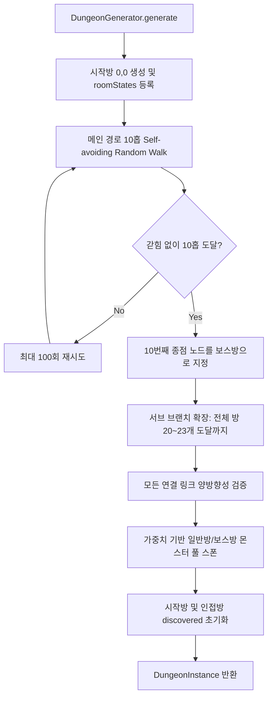
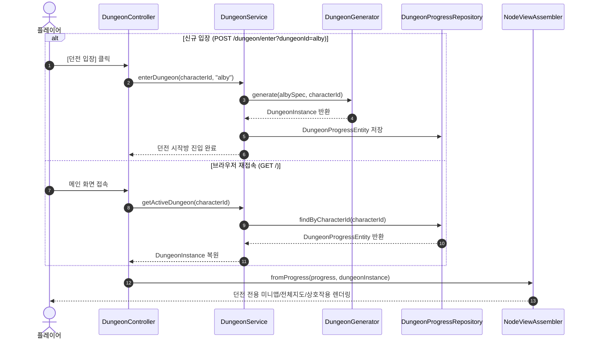
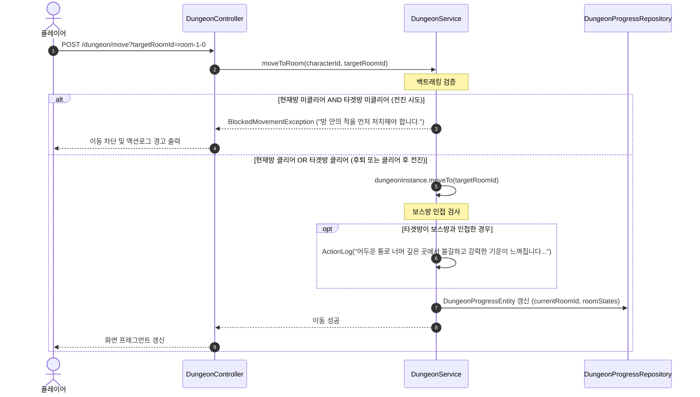
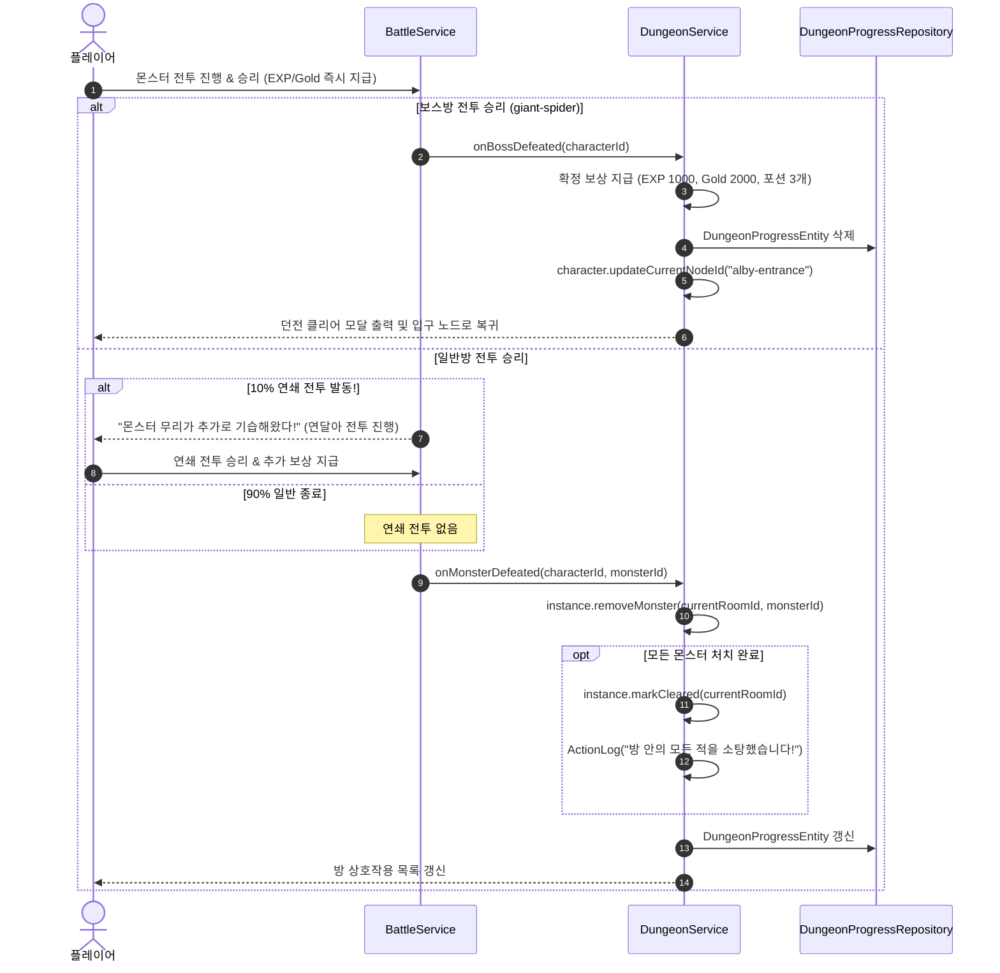

# Design Document

## Overview

본 설계는 `myrpg` Web 모듈(`com.myapps.web.myrpg`)에 **인스턴스 랜덤 던전 시스템 — 알비 던전(`alby`) 프로시저럴 맵 생성, 전장의 안개(Fog of War), 상호작용 기반 방 클리어 & 10% 연쇄 전투, 보스전 및 DB 영속 생명주기**를 구현한다(스펙 011).

단일 진실 공급원인 `docs/dungeon_design.md`와 `requirements.md`의 명세를 100% 반영하여, 기존 월드맵 이동/전투/아이템 파이프라인과 완벽히 연동되는 객체 지향 도메인 아키텍처를 수립한다.

### 핵심 설계 원칙

1. **프로시저럴 2D 격자 미로 생성기 (`DungeonGenerator`)**:
   - `(0, 0)` 시작방을 기준으로 동·서·남·북 4방향 비순환 랜덤 워크(Self-avoiding Random Walk)를 통해 보스방 최단거리 10개 고정 주 경로를 생성하고, 주 경로 노드들에서 서브 브랜치(깊이 1~3칸의 막다른 길)를 뻗어 총 20~23개 방 규모의 유효 격자 그래프(`MapGraph`)를 합성한다.
   - 모든 노드는 겹침 없는 고유 좌표 `(x, y)`를 가지며, 모든 통로는 `MapNode.links`에 양방향으로 기록된다.
2. **다중 던전 메타데이터 격리 (`DungeonSpec` & `dungeons.json`)**:
   - 각 던전마다 `generation` 파라미터(`minDistanceToBoss`, `maxDistanceToBoss`, `minTotalRooms`, `maxTotalRooms`, `branchProbability`, `maxBranchDepth`), 몬스터 풀, 보스, 보상이 독립적으로 정의된다. 알비 던전은 `implemented: true`로 활성화되며, 키아/라비는 확장용 템플릿(`implemented: false`)으로 보관된다.
3. **전장의 안개 (Fog of War) 및 보스방 인접 경고**:
   - 미탐색 방은 지도에서 숨김(투명 셀) 처리되며, 방문했거나 인접한 방만 노출된다 (`DISCOVERED && !CLEARED`: 회색 `#718096`, `CLEARED`: 흰색 `#FFFFFF`).
   - 플레이어가 보스방과 인접한 방에 진입하면 액션로그 및 상황 멘트에 *"어두운 통로 너머 깊은 곳에서 불길하고 강력한 기운이 느껴집니다..."* 경고 힌트를 출력한다.
4. **상호작용 방 클리어 및 연쇄 전투 (Chain Combat)**:
   - 방에 출현한 몬스터 버튼을 클릭하여 개별 전투를 진행하며, 일반 방에서는 격파 시 10% 확률로 연쇄 전투가 발동한다. 보스방(`giant-spider`)은 최종 결전이므로 연쇄 전투 확률을 배제하고 즉시 클리어 처리한다.
5. **백트래킹 이동 제약**:
   - 미클리어 방에서는 '이미 클리어한 이전 방'으로의 후퇴 이동만 허용되고, '새로운 미클리어 방'으로의 전진은 `BlockedMovementException`으로 차단된다.
6. **DB 완전 영속 저장 (`DungeonProgressEntity`)**:
   - 던전 맵 그래프 및 각 방의 클리어/발견 상태를 JPA 테이블(`dungeon_progress`)에 JSON 문자열로 영속 저장하여 브라우저 종료 및 수 시간 후 재접속 시에도 완벽히 복원한다. 시작방 `[던전 나가기]`나 전투 중 사망 시에만 인스턴스를 삭제한다.

---

## Architecture

### 모듈 구조 (DDD 4계층)

```
myrpg/src/
├── main/java/com/myapps/web/myrpg/
│   ├── interfaces/api/
│   │   ├── DungeonController.java              # [신규] POST /dungeon/enter, POST /dungeon/leave, POST /dungeon/move
│   │   ├── PlayScreenController.java           # [확장] 던전 활성 상태에 따른 뷰 모델 분기
│   │   ├── NodeViewAssembler.java              # [확장] 던전 맵/상호작용 버튼 조립 위임
│   │   ├── PlayScreenViewHelper.java           # [확장] 던전 입장/나가기 및 던전 몬스터 상호작용 버튼 조립
│   │   └── BattleController.java               # [확장] 연쇄 전투 뷰 반환 및 보스 승리 시 자동 복귀 처리
│   ├── application/
│   │   ├── service/
│   │   │   ├── DungeonService.java             # [신규] 던전 입장/퇴장, 방 이동, 몬스터 격파/보스 처치, DB 영속 오케스트레이션
│   │   │   ├── DungeonSpecRepository.java      # [신규] dungeons.json 파싱 및 조회
│   │   │   ├── BattleService.java              # [확장] 10% 연쇄 전투 판정 및 던전 몬스터 격파 이벤트 연동
│   │   │   ├── MonsterService.java             # [확장] 신규 몬스터 5종 로드 지원
│   │   │   └── MovementService.java            # [확장] 던전 백트래킹 검증 보조
│   │   └── dto/
│   │       ├── DungeonSpec.java                # [신규] 던전 메타데이터 DTO (record)
│   │       ├── DungeonGenerationSpec.java      # [신규] 맵 생성 파라미터 DTO (record)
│   │       ├── DungeonMonsterEntry.java        # [신규] 몬스터 풀 항목 DTO (record)
│   │       ├── DungeonBossSpec.java            # [신규] 보스 설정 DTO (record)
│   │       ├── DungeonRewardSpec.java          # [신규] 보상 설정 DTO (record)
│   │       └── DungeonClearResult.java         # [신규] 보스 처치 클리어 결과 DTO (record)
│   └── domain/
│       ├── model/
│       │   ├── DungeonInstance.java            # [신규] 활성 던전 런타임 도메인 모델 (MapGraph, RoomStates 포함)
│       │   ├── DungeonRoomState.java           # [신규] 방별 클리어/발견/잔여몬스터 상태 VO (record)
│       │   ├── DungeonProgressEntity.java      # [신규] 던전 진행상황 JPA 엔티티 (@Entity @Table(name="dungeon_progress"))
│       │   └── (재사용) MapGraph, MapNode, CharacterProgress, Monster, Item
│       ├── service/
│       │   ├── DungeonGenerator.java           # [신규] 2D 비선형 격자 맵 프로시저럴 생성 엔진 (순수 도메인 로직)
│       │   └── MapViewFactory.java             # [확장] 던전 안개(Fog of War) 및 방 클리어 색상 격자 렌더링 지원
│       └── repository/
│           ├── DungeonProgressRepository.java  # [신규] Spring Data JPA 리포지토리
│           └── (재사용) CharacterProgressRepository, OwnedItemRepository
└── main/resources/
    ├── data/
    │   ├── dungeons.json                       # [신규] 알비/키아/라비 던전 설정 데이터
    │   └── monster.json                        # [확장] 거미, 붉은거미, 고블린, 검은거미, 거대거미 5종 추가
    ├── templates/fragments/
    │   ├── center.html                         # [확장] 던전 입장/나가기 상호작용 버튼 렌더링
    │   └── play.html                           # [확장] 던전 클리어 모달 및 던전 액션 스크립트 include
    └── static/
        ├── css/myrpg.css                       # [확장] .node-dungeon-uncleared(회색), .node-dungeon-cleared(흰색)
        └── js/myrpg.js                         # [확장] enterDungeon, leaveDungeon, moveDungeonRoom, handleChainCombat
```

---

## Data Models (도메인 & 엔티티)

### 1. JPA 엔티티: `DungeonProgressEntity`

```java
@Entity
@Table(name = "dungeon_progress")
public class DungeonProgressEntity {

    @Id
    @GeneratedValue(strategy = GenerationType.IDENTITY)
    private Long id;

    @Column(name = "character_id", nullable = false, unique = true)
    private Long characterId;

    @Column(name = "dungeon_id", nullable = false)
    private String dungeonId;

    @Column(name = "entrance_node_id", nullable = false)
    private String entranceNodeId;

    @Column(name = "start_room_id", nullable = false)
    private String startRoomId;

    @Column(name = "boss_room_id", nullable = false)
    private String bossRoomId;

    @Column(name = "current_room_id", nullable = false)
    private String currentRoomId;

    @Lob
    @Column(name = "dungeon_graph_json", nullable = false, columnDefinition = "TEXT")
    private String dungeonGraphJson;

    @Lob
    @Column(name = "room_states_json", nullable = false, columnDefinition = "TEXT")
    private String roomStatesJson;

    @Column(name = "created_at", nullable = false)
    private LocalDateTime createdAt;

    @Column(name = "updated_at", nullable = false)
    private LocalDateTime updatedAt;

    // Constructors, Getters, Mutators, Helper methods
}
```

### 2. 도메인 모델: `DungeonInstance` & `DungeonRoomState`

```java
public class DungeonInstance {
    private final Long characterId;
    private final String dungeonId;
    private final String entranceNodeId;
    private final String startRoomId;
    private final String bossRoomId;
    private String currentRoomId;
    private final MapGraph dungeonGraph;
    private final Map<String, DungeonRoomState> roomStates;

    public DungeonInstance(
            Long characterId,
            String dungeonId,
            String entranceNodeId,
            String startRoomId,
            String bossRoomId,
            String currentRoomId,
            MapGraph dungeonGraph,
            Map<String, DungeonRoomState> roomStates) {
        this.characterId = characterId;
        this.dungeonId = dungeonId;
        this.entranceNodeId = entranceNodeId;
        this.startRoomId = startRoomId;
        this.bossRoomId = bossRoomId;
        this.currentRoomId = currentRoomId;
        this.dungeonGraph = dungeonGraph;
        this.roomStates = new HashMap<>(roomStates);
    }

    public boolean isRoomCleared(String roomId) {
        DungeonRoomState state = roomStates.get(roomId);
        return state != null && state.cleared();
    }

    public boolean isRoomDiscovered(String roomId) {
        DungeonRoomState state = roomStates.get(roomId);
        return state != null && state.discovered();
    }

    public boolean isAdjacentToBoss(String roomId) {
        MapNode node = dungeonGraph.byId(roomId).orElse(null);
        return node != null && node.links().contains(bossRoomId);
    }

    public void moveTo(String targetRoomId) {
        this.currentRoomId = targetRoomId;
        revealAdjacent(targetRoomId);
    }

    public void revealAdjacent(String roomId) {
        markDiscovered(roomId);
        dungeonGraph.byId(roomId).ifPresent(node -> {
            for (String neighborId : node.links()) {
                markDiscovered(neighborId);
            }
        });
    }

    public void markDiscovered(String roomId) {
        DungeonRoomState current = roomStates.get(roomId);
        if (current != null && !current.discovered()) {
            roomStates.put(roomId, current.withDiscovered(true));
        }
    }

    public void markCleared(String roomId) {
        DungeonRoomState current = roomStates.get(roomId);
        if (current != null) {
            roomStates.put(roomId, current.withCleared(true).withRemainingMonsters(List.of()));
        }
    }

    public void removeMonster(String roomId, String monsterId) {
        DungeonRoomState current = roomStates.get(roomId);
        if (current != null) {
            List<String> updated = new ArrayList<>(current.remainingMonsters());
            updated.remove(monsterId);
            boolean cleared = updated.isEmpty();
            roomStates.put(roomId, new DungeonRoomState(roomId, cleared, true, List.copyOf(updated)));
        }
    }
}

public record DungeonRoomState(
        String roomId,
        boolean cleared,
        boolean discovered,
        List<String> remainingMonsters) {

    public DungeonRoomState withDiscovered(boolean discovered) {
        return new DungeonRoomState(roomId, this.cleared, discovered, this.remainingMonsters);
    }

    public DungeonRoomState withCleared(boolean cleared) {
        return new DungeonRoomState(roomId, cleared, this.discovered, this.remainingMonsters);
    }

    public DungeonRoomState withRemainingMonsters(List<String> monsters) {
        return new DungeonRoomState(roomId, this.cleared, this.discovered, monsters);
    }
}
```

---

## Procedural Dungeon Generation Engine (`DungeonGenerator`)



### 1. 좌표계 및 방향 오프셋
- 2차원 격자: 동 `(1, 0)`, 서 `(-1, 0)`, 남 `(0, 1)`, 북 `(0, -1)`
- 좌표 키: `"x,y"` 형식 (`MapGraph.coordKey(x, y)`)
- 중복 방지: `Set<String> occupiedCoords`로 동일 좌표 중복 배치 차단

### 2. 주 경로 생성 알고리즘 (Main Path)
- 시작점 `(0, 0)` 고정
- 길이 $D = 10$ (알비 던전 기준) 도달할 때까지 4방향 중 아직 미점유된 인접 격자로 전진
- 사방이 막혀 $D$에 도달하지 못하면 롤백 후 재시도 (최대 100회)
- $D$번째 종점 노드의 ID를 `bossRoomId`로 지정

### 3. 서브 브랜치 생성 알고리즘 (Sub-Branches)
- 목표 방 개수 $T \in [20, 23]$ 무작위 결정
- 현재 생성된 노드 개수가 $T$에 도달할 때까지:
  1. 메인 경로 노드(시작방/보스방 제외) 중 하나를 무작위 선택
  2. 비어있는 인접 격자 방향으로 분기 경로를 깊이 1~3칸 생성
  3. 막다른 길(Dead-end) 형성 후 다음 브랜치 시도

### 4. 몬스터 스폰 가중치 선택기
- 일반 방: `DungeonSpec.monsterPool`의 가중치(`weight`) 누적합 룰렛 휠 방식으로 1~2개 몬스터 ID 무작위 선택
- 보스방: `DungeonSpec.boss.monsterId` 고정 스폰

---

## Detailed System Flows

### 1. 던전 입장 및 복원 흐름



### 2. 방 이동 및 백트래킹 제어 흐름



### 3. 일반방 전투, 10% 연쇄 전투 및 보스전 클리어 흐름



---

## 맵 뷰 모델 및 CSS 스타일 연동

### 1. `MapViewFactory` 확장 규칙
- `DungeonInstance` 활성 시:
  - `FullMapCell` 및 `MinimapCell`에 `isCleared`, `isDiscovered` 속성을 전달
  - `!discovered`: 격자에서 렌더링 제외 (빈 공간 유지)
  - `discovered && !cleared`: CSS 클래스 `node-dungeon-uncleared` 부여
  - `cleared`: CSS 클래스 `node-dungeon-cleared` 부여
  - `current`: 플레이어 위치 하이라이트 유지

### 2. CSS 스타일 정의 (`myrpg.css`)

```css
/* 던전 노드 스타일 */
.map-cell.node-dungeon-uncleared {
    background-color: #4a5568;
    border: 1px solid #718096;
    color: #cbd5e0;
}

.map-cell.node-dungeon-cleared {
    background-color: #edf2f7;
    border: 1px solid #e2e8f0;
    color: #1a202c;
    box-shadow: 0 0 6px rgba(255, 255, 255, 0.4);
}

/* 통로(Edge) 스타일 */
.map-cell.node-dungeon-cleared.link-right::after,
.map-cell.node-dungeon-cleared.link-down::after {
    background-color: #cbd5e0;
}
```

---

## Error Handling & Edge Cases

| 상황 | 원인 | 처리 및 사용자 피드백 |
|---|---|---|
| 미클리어 방에서 미클리어 방으로 이동 | 적 소탕 전 전진 시도 | `BlockedMovementException` 발생 $\rightarrow$ 액션로그에 *"앞으로 나아가려면 이 방의 적들을 모두 처치해야 합니다."* 출력 |
| 미클리어 방에서 이전 클리어 방으로 이동 | 위험 회피 후퇴 | 정상 이동 처리 $\rightarrow$ 이전 방으로 즉시 이동 |
| 미구현 던전 입장 시도 (`ciar`, `rabbie`) | `implemented == false` | `DungeonNotImplementedException` $\rightarrow$ Alert: *"해당 던전은 아직 준비 중입니다."* |
| 브라우저 강제 종료 후 재접속 | 세션 만료 또는 재기동 | `DungeonProgressRepository`에서 DB 로드 $\rightarrow$ 마지막 방 및 클리어 상태 100% 복원 |
| 던전 내부에서 전투 중 사망 | `hpCurrent == 0` | `DungeonProgressEntity` 삭제 $\rightarrow$ 티르코네일 마을 리스폰 & 바이탈 100% 회복 |
| 시작방 `[던전 나가기]` 클릭 | 자발적 포기/퇴장 | `DungeonProgressEntity` 삭제 $\rightarrow$ 던전 입구 노드로 이동 및 월드맵 전환 |
| 보스 처치 직후 새로고침 | 보스전 완료 상태 | 이미 삭제 및 입구 이동 완료되었으므로 던전 입구 노드 화면 렌더링 |
