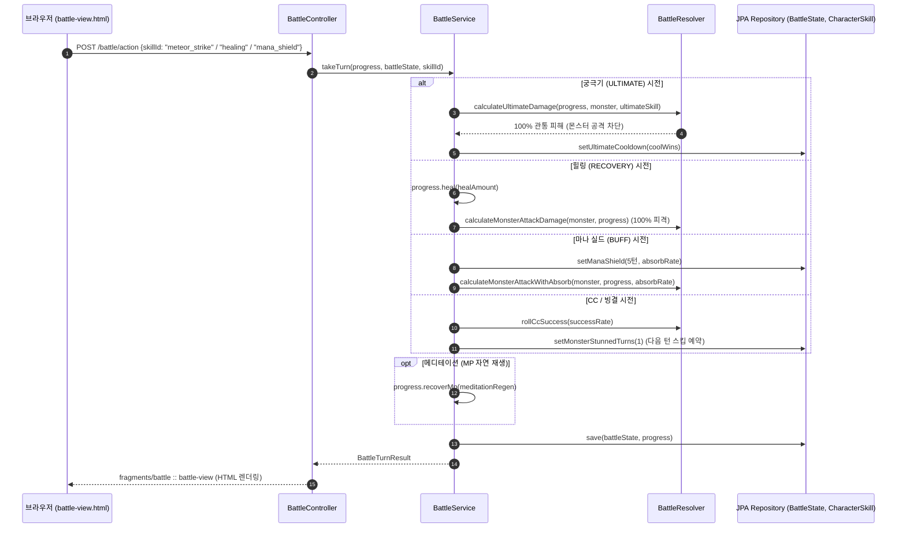
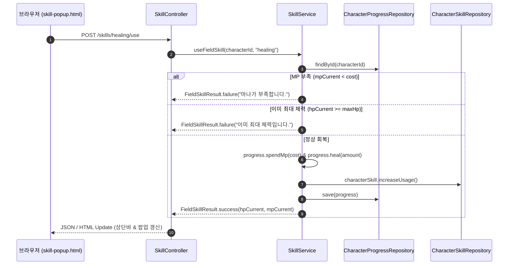

# Design Document: 014-skill-system-expansion

> **폴더 위치 가이드**: `.kiro/specs/myrpg/014-skill-system-expansion/design.md`  
> **관련 규칙**: `rules/coding/code-style.md`, `rules/workflow/codegraph-first.md`, `docs/skill-system-dev-guide.md`, `docs/todo.md` Section 4

---

## 1. Overview (개요)

본 설계는 `myrpg` 모듈(`com.myapps.web.myrpg`)에 29종 스킬 시스템(기존 11종 + 신규 18종) 확장, `Skill` Sealed Interface 8종 다형성 도메인 모델, 10종 `SkillType` 표준 체계, 전투 엔진 상성/특수 메커니즘, 4대 수련 체계 및 프론트엔드 UI를 구축하기 위한 상세 설계를 정의한다.

### 1.1. 핵심 설계 결정 및 트레이드오프

| 항목 / 대안 | 선택된 결정 | 근거 및 트레이드오프 | 관련 요구사항 |
|---|---|---|---|
| **도메인 모델 다형성** | Java 21 `sealed interface` + 8종 `record` | 컴파일 타임에 허용된 타입(`permits`)을 고정하여 패턴 매칭 `switch` exhaustiveness를 보장하고 결함을 사전 차단 | Req 1.1, 1.2 |
| **궁극기 (`ULTIMATE`) 상성** | 절대 우위 (Super-Priority) | 30~10승의 긴 쿨타임을 가진 결전기이므로 몬스터의 어떤 행동도 압도하여 100% 관통 및 적 공격을 차단하는 쾌감 부여 | Req 3.2 |
| **자가 시전 (`RECOVERY`, `BUFF`) 전투 처리** | 시전 턴 무방비 피격 + 효과 즉시 적용 | 방어 행동이 아니므로 적 공격에 100% 피격되나, 힐링 회복 및 마나 실드 MP 감쇄 흡수는 즉시 해당 턴부터 발동 | Req 4.1, 4.3 |
| **군중 제어 (`CC`, 빙결) 발동 타이밍** | 시전 턴 피격 후 **다음 턴 1턴 속박** | 1:1 턴제에서 즉시 적 턴을 삭제하는 불합리를 방지하고, 다음 턴 1턴간 안전한 프리딜 기회를 확보하는 명확한 턴 사이클 구현 | Req 5.1, 5.2 |
| **패시브 6종 UI 탭 관리** | **`공용(COMMON)` 탭에서 `디펜스`와 함께 관리** | 재능별 액티브 딜 스킬 탭을 간결하게 유지하고, 패시브 육성 요소를 공용 탭에 일원화하여 직관적인 UX 제공 | Req 6.1, 6.2 |
| **메디테이션 MP 자연 재생** | **전투 중 매 턴 종료 시점 발동** | 턴과 턴 사이(공방 해결 후 다음 턴 개시 전)에 안정적으로 MP를 공급하며, 필드 이동 시에는 미발동하여 포션/야영 가치 보존 | Req 6.4, 6.5 |
| **영속화 방식** | DB 가변 상태 (`BattleState`, `CharacterSkill`) vs JSON 고정 데이터 | 스킬 16키 랭크맵 및 계수는 `data/skill.json`에서 관리하고, 쿨타임/지속턴/스택 상태만 DB 엔티티 컬럼으로 영속화 | Req 3.1, 4.3, 5.4 |

---

## 2. Architecture (시스템 아키텍처 및 계층 구조)

### 2.1. DDD 4계층 패키지 구조

```
myrpg/src/main/java/com/myapps/web/myrpg/
├── interfaces/
│   └── api/
│       ├── SkillController.java             # 스킬 목록 팝업, 승급 모달, 필드 힐링(POST /skills/{id}/use)
│       └── BattleController.java            # 전투 턴 액션 처리 (궁극기, 힐링, 마나실드, CC 등)
├── application/
│   ├── service/
│   │   ├── SkillService.java                # 스킬 랭크업, 필드 사용 유효성 검증, 뷰 모델 조립
│   │   ├── SkillCatalogService.java         # data/skill.json 29종 로드 및 Sealed Record 파싱
│   │   └── BattleService.java               # 전투 오케스트레이션 (상성 분기, 쿨타임 차감, 상태효과 갱신)
│   └── dto/
│       ├── SkillRowView.java                # fieldUsable, cooldownBadgeText 포함 DTO
│       └── SkillRankUpView.java             # 승급 모달 DTO
└── domain/
    ├── model/
    │   ├── Skill.java                       # sealed interface permits 8종 record
    │   ├── DamageSkill.java                 # record (minHits, maxHits, defensePierce, freezeRate)
    │   ├── DefenseSkill.java                # record (blockRate, counterMultiplier)
    │   ├── RecoverySkill.java               # record (healAmountByRank, resourceCostByRank)
    │   ├── UltimateSkill.java               # record (multiplier, hitCountByRank, coolWinsByRank)
    │   ├── PassiveSkill.java                # record (totalStatBonus)
    │   ├── BuffSkill.java                   # record (durationTurns, absorbRateByRank)
    │   ├── CcSkill.java                     # record (successRateByRank)
    │   ├── DotSkill.java                    # record (initialMultiplier, dotPerTurn, dotTurns)
    │   ├── SkillType.java                   # enum 10종
    │   ├── SkillRankupBonus.java            # 패시브 6종 선형 누적 스탯 합산 정책
    │   ├── SkillRankPolicy.java             # AP 200 및 4대 수련 조건 정책
    │   ├── CharacterSkill.java              # JPA 엔티티 (ultimateCooldown 컬럼 추가)
    │   └── BattleState.java                 # JPA 엔티티 (버프/도트/CC/증폭 컬럼 6종 추가)
    └── service/
        ├── BattleResolver.java              # 순수 턴 데미지 산출 엔진 (방어 관통, 크리티컬, 다단히트)
        └── SkillDamagePolicy.java           # 스킬 랭크별 배율/수치 순수 조회 정책
```

---

### 2.2. 요청 흐름 및 시퀀스 다이어그램

#### 1) 전투 턴 시퀀스 (궁극기, 힐링, 마나 실드, CC, 메디테이션)



#### 2) 필드 힐링 시퀀스 (`POST /skills/{id}/use`)



---

## 3. Components and Interfaces (세부 컴포넌트 설계)

### 3.1. Controller Layer (`interfaces/api`)

#### `SkillController.java` 확장
- `GET /skills`: 스킬 목록 프래그먼트 반환 (`공용` 탭에 디펜스 + 패시브 6종 포함)
- `GET /skills/{id}/rankup-modal`: 승급 모달 프래그먼트 반환
- `POST /skills/{id}/rankup`: 승급 실행 및 갱신된 모달 반환
- `POST /skills/{id}/use` **[신규]**: 필드 스킬 사용 엔드포인트
  - 반환: `ResponseEntity<FieldSkillUseResponse>` 또는 UI 프래그먼트

### 3.2. Application Layer (`application/service`)

#### `SkillCatalogService.java` 확장
- `data/skill.json` 파싱 `switch (skillType)`을 8종 Sealed Record로 전면 분기:
  ```java
  return switch (skillType) {
      case DEFENSE -> parseDefenseSkill(node);
      case RECOVERY -> parseRecoverySkill(node);
      case ULTIMATE -> parseUltimateSkill(node);
      case PASSIVE -> parsePassiveSkill(node);
      case BUFF -> parseBuffSkill(node);
      case CC -> parseCcSkill(node);
      case DOT -> parseDotSkill(node);
      case NORMAL, HEAVY, DEBUFF -> parseDamageSkill(node);
  };
  ```

#### `SkillService.java` 확장
- `buildListView()`: `COMMON` 탭 선택 시 `catalog.talent() == SkillTalent.COMMON || catalog instanceof PassiveSkill` 매핑.
- `rankUp()`: 패시브 스킬(수련치 면제, AP만 검증), 지원/특수/궁극기(`killExempt = true`) 분기.
- `useFieldSkill()`: 필드 힐링 MP/HP 유효성 검증, 자원 차감 및 회복, `usageCount + 1` 처리.

#### `BattleService.java` 확장
- `takeTurn()`:
  - `UltimateSkill`: 몬스터 행동 무시, 100% 관통 타격, 몬스터 공격 0피격 차단, `ultimateCooldown` 설정.
  - `RecoverySkill`: 즉시 회복 후 몬스터 공격 100% 무방비 피격 적용.
  - `BuffSkill` (마나 실드): `manaShieldTurnsLeft = 5`, 해당 턴 피격부터 MP 감쇄 흡수 적용, MP 고갈 시 잔여 피해 HP 전가.
  - `CcSkill` (스파이더 샷) / `아이스 스피어`: 턴 피격/타격 후 성공 시 `monsterStunnedTurns = 1` 예약.
  - `DotSkill` (미라지 미사일): 즉발 30% + `dotDamagePerTurn`, `dotTurnsLeft` 등록.
  - **턴 종료 메디테이션**: 공방 완료 후 `progress.recoverMp(meditationRegen)` 호출.
  - **전투 승리 처리**: 몬스터 처치 시 보유한 모든 궁극기의 `ultimateCooldown` 1 차감.

#### `BattleLogFormatter.java` 확장 [신규 스킬 멘트 포맷팅]
- 신규 스킬 타입 및 상태이상 전용 로그 멘트 생성 분기 추가:
  - **궁극기 (`ULTIMATE`)**: `[⚡ {스킬}(궁극기)가 하늘을 가르며 낙하! {몬스터}에게 {피해} 피해!]` (다단히트 브레이크다운 지원)
  - **회복 (`RECOVERY`)**: `[✨ {스킬}(회복) 시전! 생명력을 {회복량} 회복했다! (+{회복량} HP)]`
  - **버프/마나 실드 (`BUFF`)**: `[🛡️ {스킬}(버프)를 전개했다! (피격 피해의 {R}%를 마나로 감쇄 흡수)]` 및 피격 흡수 분리 표기
  - **군중 제어/빙결 (`CC`)**: `[🕸️ {스킬}(제어) 적중! {몬스터}가 다음 턴 행동 불능!]` 및 턴 시작 `[{몬스터}이(가) 속박 상태로 행동하지 못했다!]`
  - **지속 피해 (`DOT`)**: `[🧪 {스킬}(지속피해) 적중! {즉발} 피해 + 맹독 중독 ({N}턴)]` 및 `[독 지속 피해! {몬스터}이(가) {도트} 피해를 입음]`
  - **방어 관통 (`defensePierce`)**: `[⚡ {스킬}(강)이 적의 방어력을 100% 관통하여 {피해} 피해!]`
  - **메디테이션 재생**: `[🧘 턴 종료: 메디테이션으로 마나가 자연 회복되었다. (+{N} MP)]`

---

### 3.3. Domain Layer (`domain/model`, `domain/service`)

#### `Skill.java` Sealed Interface 정의

```java
public sealed interface Skill permits
        DamageSkill, DefenseSkill,
        RecoverySkill, UltimateSkill, PassiveSkill,
        BuffSkill, CcSkill, DotSkill {
    String id();
    String label();
    SkillType type();
    SkillTalent talent();
    int resourceCost();
    String description();
}
```

#### 8종 Domain Records

1. **`DamageSkill`**:
   ```java
   public record DamageSkill(
           String id, String label, SkillType type, SkillTalent talent,
           int resourceCost, Map<SkillRank, Integer> multiplierByRank,
           String description, int hitCount, int minHits, int maxHits,
           int critBonus, boolean defensePierce, Map<SkillRank, Integer> freezeRateByRank
   ) implements Skill {}
   ```
2. **`DefenseSkill`**:
   ```java
   public record DefenseSkill(
           String id, String label, SkillType type, SkillTalent talent,
           int resourceCost, Map<SkillRank, Integer> blockRateByRank,
           Map<SkillRank, Integer> counterMultiplierByRank, String description,
           Map<SkillRank, Integer> resourceCostByRank, Map<SkillRank, Integer> critBonusByRank
   ) implements Skill {}
   ```
3. **`RecoverySkill`**:
   ```java
   public record RecoverySkill(
           String id, String label, SkillType type, SkillTalent talent,
           int resourceCost, Map<SkillRank, Integer> healAmountByRank,
           Map<SkillRank, Integer> resourceCostByRank, String description
   ) implements Skill {}
   ```
4. **`UltimateSkill`**:
   ```java
   public record UltimateSkill(
           String id, String label, SkillType type, SkillTalent talent,
           int resourceCost, Map<SkillRank, Integer> multiplierByRank,
           Map<SkillRank, Integer> hitCountByRank, int critBonus,
           Map<SkillRank, Integer> coolWinsByRank, String description
   ) implements Skill {}
   ```
5. **`PassiveSkill`**:
   ```java
   public record PassiveSkill(
           String id, String label, SkillType type, SkillTalent talent,
           int resourceCost, Map<BonusTarget, Integer> totalStatBonus,
           String description
   ) implements Skill {}
   ```
6. **`BuffSkill`**:
   ```java
   public record BuffSkill(
           String id, String label, SkillType type, SkillTalent talent,
           int resourceCost, int durationTurns,
           Map<SkillRank, Integer> absorbRateByRank, String description
   ) implements Skill {}
   ```
7. **`CcSkill`**:
   ```java
   public record CcSkill(
           String id, String label, SkillType type, SkillTalent talent,
           int resourceCost, Map<SkillRank, Integer> successRateByRank,
           String description
   ) implements Skill {}
   ```
8. **`DotSkill`**:
   ```java
   public record DotSkill(
           String id, String label, SkillType type, SkillTalent talent,
           int resourceCost, Map<SkillRank, Integer> initialMultiplierByRank,
           Map<SkillRank, Integer> dotPerTurnByRank,
           Map<SkillRank, Integer> dotTurnsByRank, String description
   ) implements Skill {}
   ```

#### `SkillRankupBonus.java` 리팩토링
- 패시브 6종에 대해 `rank.order() / 15.0` 선형 비율로 `totalStatBonus` 합산 계산:
  ```java
  for (CharacterSkill cs : owned) {
      Skill skill = lookup.apply(cs.getSkillId()).orElse(null);
      if (skill instanceof PassiveSkill ps) {
          int order = cs.getRank().order();
          ps.totalStatBonus().forEach((target, maxVal) -> {
              int rankBonus = Math.round((float) maxVal * order / 15.0f);
              // Stats / VitalMax 누적
          });
      }
  }
  ```

---

## 4. Data Models (데이터 모델 및 영속 스키마)

### 4.1. `BattleState` JPA Entity 확장

```java
@Entity
@Table(name = "battle_state")
public class BattleState {
    // ... 기존 필드 ...

    @Column(name = "next_attack_amp_percent", nullable = false)
    private int nextAttackAmpPercent = 0;

    @Column(name = "mana_shield_turns_left", nullable = false)
    private int manaShieldTurnsLeft = 0;

    @Column(name = "mana_shield_absorb_rate", nullable = false)
    private int manaShieldAbsorbRate = 0;

    @Column(name = "monster_stunned_turns", nullable = false)
    private int monsterStunnedTurns = 0;

    @Column(name = "dot_damage_per_turn", nullable = false)
    private int dotDamagePerTurn = 0;

    @Column(name = "dot_turns_left", nullable = false)
    private int dotTurnsLeft = 0;
}
```

### 4.2. `CharacterSkill` JPA Entity 확장

```java
@Entity
@Table(name = "character_skill")
public class CharacterSkill {
    // ... 기존 필드 ...

    @Column(name = "ultimate_cooldown", nullable = false)
    private int ultimateCooldown = 0;

    public void decrementUltimateCooldown() {
        if (this.ultimateCooldown > 0) {
            this.ultimateCooldown--;
        }
    }
}
```

---

## 5. Correctness Properties (jqwik 검증용 불변 속성 명세)

### Property 1: 29종 스킬 카탈로그 무결성 및 16키 단조성
*For any* `data/skill.json`에 정의된 29종 스킬에 대해, F부터 MASTER까지 16개 랭크 키가 모두 존재해야 하며 배율/경감률/회복량/스탯 수치는 단조 비감소(`rank[i] <= rank[i+1]`)해야 한다.
- **Validates: Requirement 1.3, 1.4**

### Property 2: 랜덤 타수 범위 제약 불변식
*For any* 랜덤 타수 스킬(`minHits`, `maxHits`) 실행 시 산출된 타격 횟수 $N$은 항상 `minHits <= N <= maxHits` 범위 내에 존재해야 한다.
- **Validates: Requirement 2.1**

### Property 3: 방어 관통 데미지 불변식
*For any* 방어 관통 스킬(`defensePierce = true`) 실행 시 산출된 기본 피해는 대상의 방어력(DEF) 수치와 무관하게 `floor(ATK * mult / 100)`과 동일해야 한다.
- **Validates: Requirement 2.2**

### Property 4: 궁극기 절대 우위 및 쿨타임 감소 불변식
*For any* 궁극기 시전 시 몬스터의 행동 타입과 무관하게 몬스터 공격 피해는 0이어야 하며, 전투 승리 1회마다 `ultimateCooldown`은 정확히 1씩 감소(하한 0)해야 한다.
- **Validates: Requirement 3.2, 3.4**

### Property 5: 마나 실드 감쇄 흡수 및 MP 고갈 전가 불변식
*For any* 피격 피해 $D$와 감쇄율 $R$, 보유 마나 $MP$에 대해, $MP \ge D \times R\%$이면 $HP$ 피해는 $D \times (100-R)\%$이어야 하고, $MP < D \times R\%$이면 남은 피해는 전액 $HP$로 전가되어 $TotalDamage = D$ 보존 법칙이 성립해야 한다.
- **Validates: Requirement 4.4**

### Property 6: 패시브 스탯 선형 누적 불변식
*For any* 패시브 스킬의 랭크 $r$ (order $0 \le k \le 15$)에 대해 합산된 스탯 보너스는 $\text{round}(Max \times k / 15)$이어야 한다.
- **Validates: Requirement 6.3**

### Property 7: 메디테이션 턴 종료 회복 및 필드 미회복 불변식
*For any* 전투 턴 완료 시 플레이어의 MP는 정확히 메디테이션 랭크당 회복량만큼 증가(상한 maxMp)해야 하며, 필드 이동 이벤트에서는 메디테이션으로 인한 MP 증가량이 0이어야 한다.
- **Validates: Requirement 6.4, 6.5**

---

## 6. Testing Strategy & Quality Guardrails (테스트 및 품질 검증 전략)

### 6.1. 테스트 계층
1. **단위 테스트 (Unit Tests)**:
   - `SkillCatalogServiceTest`: 29종 스킬 8개 record 파싱 완비 검증.
   - `SkillRankPolicyTest`: 4대 수련 조건(직접공격, 지원특수, 궁극기, 패시브) 및 AP 200 검증.
   - `SkillServiceFieldUseTest`: 필드 힐링 MP 부족/HP 최대치 예외 피드백 검증.
2. **프로퍼티 기반 테스트 (PBT)**:
   - `SkillCatalogDataConformancePropertyTest`: 29종 16키 완비 및 단조성 검증.
   - `BattleResolverDamagePiercePropertyTest`: 방어 관통 및 랜덤 타수 불변식 검증.
   - `ManaShieldAbsorbPropertyTest`: 마나 실드 흡수 및 MP 고갈 전가 검증.
   - `MeditationRegenPropertyTest`: 전투 턴 종료 재생 및 상한 검증.
3. **웹 슬라이스 테스트 (WebSlice Tests)**:
   - `SkillControllerTest`: `GET /skills` (`공용` 탭 패시브 노출) 및 `POST /skills/{id}/use` 검증.
   - `BattleControllerTest`: 궁극기 `disabled` 쿨타임 표기 검증.

### 6.2. 5대 품질 가드레일 파이프라인
```bash
mvn -B -q spotless:apply -pl myrpg && \
(mvn -B clean install -pl myrpg -am > /tmp/mvn.log 2>&1 || \
 (tail -n 30 /tmp/mvn.log && exit 1)) && \
tail -n 12 /tmp/mvn.log && \
codegraph sync
```
