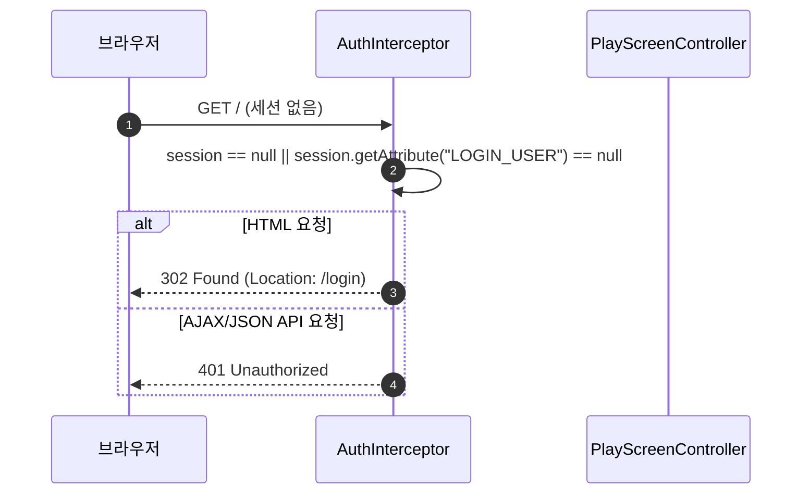
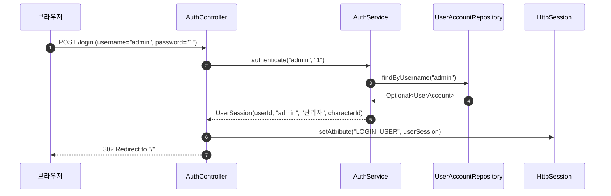

# Design Document: 015-user-authentication-and-login

> **폴더 위치**: `.kiro/specs/myrpg/015-user-authentication-and-login/design.md`  
> **관련 규칙**: `rules/coding/code-style.md`, `rules/workflow/codegraph-first.md`, `rules/project/tech-stack.md`

---

## 1. Overview (개요)

본 설계는 `myrpg` 모듈(`com.myapps.web.myrpg`)에 **간이 로그인 및 세션 기반 사용자 인증 시스템**을 구축하기 위한 상세 설계를 정의한다.

### 1.1. 핵심 설계 결정 및 트레이드오프

| 항목 / 대안 | 선택된 결정 | 근거 및 트레이드오프 | 관련 요구사항 |
|---|---|---|---|
| **인증 방식** | 서블릿 `HttpSession` 기반 세션 인증 | 간이 로그인 스펙에 최적화. Spring Security의 복잡성 없이 가볍고 직관적인 인터셉터로 충분히 구현 가능 | Req 3.1, 4.1 |
| **접근 제어 방식** | Spring MVC `HandlerInterceptor` (`AuthInterceptor`) | 컨트롤러 코드 수정 없이 일괄적으로 미인증 요청을 가로채 `/login` 리다이렉트 및 AJAX 401 처리 가능 | Req 4.1, 4.2 |
| **인벤토리 격리** | `OwnedItem`에 `characterId` 컬럼 추가 | `bbsk`(고니)와 `admin`(관리자)의 착용 장비 및 보유 아이템을 완벽히 분리하여 데이터 오염 방지 | Req 1.2, 1.3 |
| **초기 계정 시드** | `AuthService.initDefaultAccounts()` `@PostConstruct` / 이벤트 | 서버 기동 즉시 `bbsk`(기존 고니 캐릭터) 및 `admin`(전스킬 F+풀장비)이 준비되어 수동 DB 작업 없이 즉시 테스트 가능 | Req 2.1, 2.3 |
| **세션 주입 방식** | `UserSession` 세션 어트리뷰트 + 헬퍼 | 세션에 `UserSession(id, username, nickname, characterId)`를 보관하고 컨트롤러에서 `characterId`를 꺼내 사용 | Req 3.2, 5.1 |

---

## 2. Architecture (시스템 아키텍처 및 계층 구조)

### 2.1. DDD 4계층 패키지 구조

```
myrpg/src/main/java/com/myapps/web/myrpg/
├── interfaces/
│   └── api/
│       ├── AuthController.java              # [NEW] GET /login, POST /login, GET/POST /logout
│       └── PlayScreenController.java        # [MODIFY] 세션 characterId 기반 플레이 화면 처리
├── application/
│   ├── dto/
│   │   ├── UserSession.java                 # [NEW] 세션 저장용 불변 Record
│   │   └── LoginRequest.java                # [NEW] 로그인 폼 바인딩 Record
│   ├── service/
│   │   ├── AuthService.java                 # [NEW] 자격증명 검증, 초기 계정/캐릭터 자동 시드
│   │   ├── CharacterService.java            # [MODIFY] characterId 기반 캐릭터 로드
│   │   └── InventoryService.java            # [MODIFY] characterId 기반 인벤토리 시드/조회
│   └── exception/
│       └── AuthenticationException.java     # [NEW] 인증 실패 도메인 예외
├── infrastructure/
│   ├── config/
│   │   └── WebMvcConfig.java                # [NEW] AuthInterceptor 등록 및 화이트리스트 설정
│   └── interceptor/
│       └── AuthInterceptor.java             # [NEW] 세션 유무 검사 및 리다이렉트 인터셉터
└── domain/
    ├── model/
    │   ├── UserAccount.java                 # [NEW] 유저 계정 JPA 엔티티 (@Table(name = "user_account"))
    │   └── OwnedItem.java                   # [MODIFY] characterId 필드 추가
    └── repository/
        ├── UserAccountRepository.java       # [NEW] UserAccount JPA Repository
        └── OwnedItemRepository.java         # [MODIFY] characterId 파라미터 쿼리 메서드 확장
```

### 2.2. 요청 흐름 및 시퀀스 다이어그램

#### A. 비로그인 상태에서 보호된 페이지 접근 (리다이렉트 흐름)


#### B. 로그인 성공 및 세션 발급 흐름


---

## 3. Components and Interfaces (세부 컴포넌트 설계)

### 3.1. Controller Layer (`interfaces/api`)

#### `AuthController.java`
```java
@Controller
public class AuthController {
    private final AuthService authService;

    public AuthController(final AuthService authService) {
        this.authService = authService;
    }

    @GetMapping("/login")
    public String loginPage(final HttpSession session, final Model model) {
        if (session != null && session.getAttribute("LOGIN_USER") != null) {
            return "redirect:/";
        }
        return "login";
    }

    @PostMapping("/login")
    public String login(
            @RequestParam("username") final String username,
            @RequestParam("password") final String password,
            final HttpSession session,
            final Model model) {
        try {
            final UserSession userSession = authService.authenticate(username, password);
            session.setAttribute("LOGIN_USER", userSession);
            return "redirect:/";
        } catch (final AuthenticationException e) {
            model.addAttribute("error", e.getMessage());
            return "login";
        }
    }

    @GetMapping("/logout")
    public String logout(final HttpSession session) {
        if (session != null) {
            session.invalidate();
        }
        return "redirect:/login";
    }
}
```

### 3.2. Application Layer (`application/service`, `application/dto`)

#### `UserSession.java` (Record)
```java
public record UserSession(
        Long userId,
        String username,
        String nickname,
        Long characterId
) {}
```

#### `AuthService.java`
- `@Service`, `@Transactional`
- **`initDefaultAccounts()`**:
  - `@PostConstruct` 또는 `ApplicationReadyEvent` 리스너로 기동 시 실행.
  1. `bbsk` 계정:
     - `CharacterProgress` id 1 ("고니") 로드 또는 생성.
     - `userAccountRepository.findByUsername("bbsk")` 없으면 `UserAccount("bbsk", "1", "고니", goni.getId())` 저장.
  2. `admin` 계정:
     - `userAccountRepository.findByUsername("admin")` 없으면:
       - `CharacterProgress.createDefault()` 기반으로 `nickname="관리자"` 생성 및 저장.
       - `inventoryService.seedDefaultEquipment(adminChar.getId())`, `inventoryService.seedDefaultInventory(adminChar.getId())` 호출.
       - `skillCatalogService.all()` 순회하며 `characterSkillRepository.save(CharacterSkill.newSkill(adminChar.getId(), skill.id()))` 일괄 실행 (35종 F랭크).
       - `UserAccount("admin", "1", "관리자", adminChar.getId())` 저장.
- **`authenticate(username, password)`**:
  - `UserAccount user = userAccountRepository.findByUsername(username).orElseThrow(...)`
  - 비밀번호 대조 후 성공 시 `new UserSession(user.getId(), user.getUsername(), user.getNickname(), user.getCharacterId())` 반환.

### 3.3. Infrastructure Layer (`infrastructure/interceptor`, `infrastructure/config`)

#### `AuthInterceptor.java`
```java
@Component
public class AuthInterceptor implements HandlerInterceptor {
    @Override
    public boolean preHandle(
            final HttpServletRequest request,
            final HttpServletResponse response,
            final Object handler) throws Exception {
        final HttpSession session = request.getSession(false);
        if (session != null && session.getAttribute("LOGIN_USER") != null) {
            return true;
        }

        final String accept = request.getHeader("Accept");
        final String xRequestedWith = request.getHeader("X-Requested-With");
        final boolean isAjax = (accept != null && accept.contains("application/json"))
                || "XMLHttpRequest".equalsIgnoreCase(xRequestedWith);

        if (isAjax) {
            response.sendError(HttpServletResponse.SC_UNAUTHORIZED, "로그인이 필요합니다.");
        } else {
            response.sendRedirect("/login");
        }
        return false;
    }
}
```

#### `WebMvcConfig.java`
```java
@Configuration
public class WebMvcConfig implements WebMvcConfigurer {
    private final AuthInterceptor authInterceptor;

    public WebMvcConfig(final AuthInterceptor authInterceptor) {
        this.authInterceptor = authInterceptor;
    }

    @Override
    public void addInterceptors(final InterceptorRegistry registry) {
        registry.addInterceptor(authInterceptor)
                .addPathPatterns("/**")
                .excludePathPatterns(
                        "/login",
                        "/login/**",
                        "/logout",
                        "/css/**",
                        "/js/**",
                        "/images/**",
                        "/favicon.ico",
                        "/h2-console/**",
                        "/actuator/**"
                );
    }
}
```

---

## 4. Data Models (데이터 모델 설계)

### 4.1. `UserAccount.java` (Entity)
```java
@Entity
@Table(name = "user_account")
public class UserAccount {
    @Id
    @GeneratedValue(strategy = GenerationType.IDENTITY)
    private Long id;

    @Column(nullable = false, unique = true, length = 50)
    private String username;

    @Column(nullable = false, length = 100)
    private String password;

    @Column(nullable = false, length = 50)
    private String nickname;

    @Column(name = "character_id", nullable = false)
    private Long characterId;

    protected UserAccount() {}

    public UserAccount(final String username, final String password, final String nickname, final Long characterId) {
        this.username = username;
        this.password = password;
        this.nickname = nickname;
        this.characterId = characterId;
    }

    // Getters
}
```

### 4.2. `OwnedItem.java` (Entity Modification)
- `character_id` 컬럼 추가:
```java
    @Column(name = "character_id", nullable = false)
    private Long characterId;
```
- 생성자 및 `OwnedItemRepository`에 `characterId` 조건 매핑 추가:
  - `List<OwnedItem> findByCharacterIdAndStorage(Long characterId, StorageKind storage)`
  - `Optional<OwnedItem> findByIdAndCharacterId(Long id, Long characterId)`

---

## 5. UI/UX Design (`login.html` & `top-bar.html`)

### 5.1. `login.html`
- 배경: 은은한 룬 문자 파티클 및 다크 판타지 앰비언트 그라데이션.
- 카드: Glassmorphism (`backdrop-filter: blur(12px)`, `rgba(20, 20, 30, 0.85)`).
- 폼 요소:
  - 아이디(`username`), 비밀번호(`password`) 인풋.
  - `[⚔️ 게임 접속]` 로그인 버튼.
- **원클릭 프리셋 버튼**:
  - `[👤 bbsk (고니)]`: 클릭 시 아이디 `bbsk`, 비밀번호 `1` 자동 입력 후 즉시 제출.
  - `[👑 admin (전스킬+풀장비)]`: 클릭 시 아이디 `admin`, 비밀번호 `1` 자동 입력 후 즉시 제출.

### 5.2. `top-bar.html`
- 상단 행(`top-row`):
  - 좌측: `[닉네임]` `[Lv. N]` `[EXP 바]`
  - 우측: `[로그아웃]` 링크 버튼 (`<a href="/logout" class="btn-logout">로그아웃</a>`)

---

## 6. Correctness Properties for Testing (jqwik PBT)

### Property 1: 인증 자격증명 일치성 불변식
- 임의의 문자열 ID/PW 쌍에 대해, DB에 저장된 `UserAccount`와 정확히 일치할 때만 `UserSession`이 반환되고, 불일치할 경우 반드시 `AuthenticationException`이 발생해야 한다.

### Property 2: 어드민 프리셋 캐릭터 35종 스킬 무결성 불변식
- `admin` 계정으로 생성된 캐릭터의 `CharacterSkillRepository.findByCharacterId(adminCharId)` 조회 결과는 정확히 35개이며, 모든 스킬의 rank는 `F`여야 한다.

### Property 3: 계정별 인벤토리 격리 불변식
- `bbsk` 캐릭터와 `admin` 캐릭터의 `OwnedItem` 목록은 교집합이 없으며, 서로의 장비 착용/해제/아이템 변경이 상대 계정에 영향을 미치지 않아야 한다.
