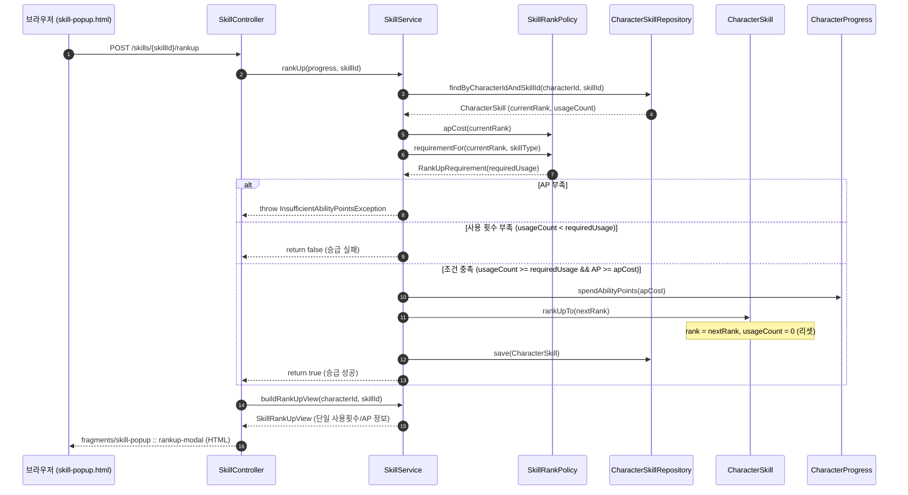

# Design Document: 스킬 승급 조건 단순화 (막타 처치 항목 전면 제거 & 사용 횟수 단일화)

> **폴더 위치 가이드**: `.kiro/specs/myrpg/016-skill-rank-requirement-simplification/design.md`  
> **관련 규칙**: `rules/coding/code-style.md`, `rules/workflow/codegraph-first.md`

---

## 1. Overview (개요)

본 설계는 `myrpg` Web 모듈(`com.myapps.web.myrpg`)에서 스킬 승급 조건 중 '막타 처치 수(requiredKills / killCount)'를 완전히 제거하고, 모든 액티브 스킬의 승급 조건을 **'스킬 사용 횟수(Usage Count) + AP 소모'** 단일 체계로 통합하는 리팩토링 상세 설계를 정의한다.

### 1.1. 핵심 설계 결정 및 트레이드오프
| 항목 / 대안 | 선택된 결정 | 근거 및 트레이드오프 | 관련 요구사항 |
|---|---|---|---|
| **막타 처치 조건 처리 방식** | **완전 제거 (Clean Purge)** | 호환용 기본값(0)을 남겨두는 대신 도메인/엔티티/DTO/UI 전반에서 막타 필드와 메서드를 완전히 삭제하여 코드베이스 복잡도와 기술 부채를 원천 차단함 | Req 1.1, 1.4, 3.2 |
| **RankUpRequirement 모델 구조** | `record RankUpRequirement(int requiredUsage)` | 불필요해진 `requiredKills`를 제거하고 단일 필드 불변 Record로 유지하여 향후 승급 조건 확장에 유연하게 대응 | Req 1.4 |
| **CharacterSkill 엔티티 필드 정제** | `killCount` 필드 및 getter/setter/increase 삭제 | JPA `@Column(name = "kill_count")`를 제거하여 불필요한 DB 쓰기/메모리 낭비 제거 (`ddl-auto: update` 호환) | Req 3.3 |
| **스킬 진행도(%) 계산식 단순화** | `(usageCount / requiredUsage) * 100` 단일 비례 | 기존 사용횟수 50% + 막타 50% 분기 합산식(`PROGRESS_DIVISOR = 2.0`)을 단일 비례식으로 통합하여 직관적 수치 제공 | Req 4.3 |
| **전투 이벤트 파이프라인 정제** | `BattleService`의 `onSkillKill` 호출부 제거 | 막타 시 추가 발생하던 서비스 호출을 제거하여 턴 연산 성능 최적화 및 결합도 감소 | Req 3.1, 3.2 |

---

## 2. Architecture (시스템 아키텍처 및 계층 구조)

### 2.1. DDD 4계층 변경 대상 패키지 구조
```
myrpg/src/main/java/com/myapps/web/myrpg/
├── interfaces/
│   └── api/
│       └── SkillController.java                 # 뷰 모델 조립 및 프래그먼트 반환 (기존 유지)
├── application/
│   ├── service/
│   │   ├── SkillService.java                    # [수정] rankUp, buildRankUpView 단순화 / onSkillKill 제거
│   │   └── BattleService.java                   # [수정] 전투 턴 내 onSkillKill 호출 제거
│   └── dto/
│       └── SkillRankUpView.java                 # [수정] killCurrent/killRequired/hasKillRequirement 제거
└── domain/
    ├── model/
    │   ├── CharacterSkill.java                  # [수정] killCount 및 관련 메서드 삭제
    │   ├── RankUpRequirement.java              # [수정] requiredKills 필드 삭제 (requiredUsage 단일화)
    │   ├── SkillRankPolicy.java                 # [수정] 막타 요구치 제거 및 단순화
    │   ├── SkillType.java                       # [수정] isKillExempt 삭제
    │   └── Skill.java                           # [수정] isKillExempt 삭제
    └── repository/
        └── CharacterSkillRepository.java        # 기존 유지
```

### 2.2. 요청 흐름 및 시퀀스 다이어그램



---

## 3. Components and Interfaces (세부 컴포넌트 설계)

### 3.1. Domain Layer (`domain/model`)

#### 3.1.1. `RankUpRequirement.java`
```java
package com.myapps.web.myrpg.domain.model;

/**
 * 스킬 랭크업에 필요한 사용 횟수 조건을 나타내는 불변 record.
 *
 * @param requiredUsage 다음 랭크로 승급하기 위한 필요 사용 횟수 (양수, 패시브는 0)
 */
public record RankUpRequirement(int requiredUsage) {}
```

#### 3.1.2. `SkillRankPolicy.java`
```java
public class SkillRankPolicy {

    private static final RankUpRequirement[] REQUIREMENTS = {
        new RankUpRequirement(5),    // F → E
        new RankUpRequirement(10),   // E → D
        new RankUpRequirement(20),   // D → C
        new RankUpRequirement(35),   // C → B
        new RankUpRequirement(60),   // B → A
        new RankUpRequirement(100),  // A → 9
        new RankUpRequirement(160),  // 9 → 8
        new RankUpRequirement(240),  // 8 → 7
        new RankUpRequirement(350),  // 7 → 6
        new RankUpRequirement(520),  // 6 → 5
        new RankUpRequirement(760),  // 5 → 4
        new RankUpRequirement(1100), // 4 → 3
        new RankUpRequirement(1600), // 3 → 2
        new RankUpRequirement(2500), // 2 → 1
        new RankUpRequirement(5000)  // 1 → Master
    };

    private static final RankUpRequirement[] ULTIMATE_REQUIREMENTS = {
        new RankUpRequirement(1),    // F → E
        new RankUpRequirement(2),    // E → D
        new RankUpRequirement(3),    // D → C
        new RankUpRequirement(4),    // C → B
        new RankUpRequirement(5),    // B → A
        new RankUpRequirement(6),    // A → 9
        new RankUpRequirement(7),    // 9 → 8
        new RankUpRequirement(8),    // 8 → 7
        new RankUpRequirement(9),    // 7 → 6
        new RankUpRequirement(10),   // 6 → 5
        new RankUpRequirement(12),   // 5 → 4
        new RankUpRequirement(14),   // 4 → 3
        new RankUpRequirement(16),   // 3 → 2
        new RankUpRequirement(18),   // 2 → 1
        new RankUpRequirement(20)    // 1 → Master
    };

    public Optional<RankUpRequirement> requirementFor(
            final SkillRank current, final SkillType type) {
        if (current.isMax()) {
            return Optional.empty();
        }
        if (type == SkillType.ULTIMATE) {
            return ultimateRequirement(current);
        }
        if (type == SkillType.PASSIVE) {
            return Optional.of(new RankUpRequirement(0));
        }
        return requirement(current);
    }
}
```

#### 3.1.3. `CharacterSkill.java`
```java
@Entity
@Table(name = "character_skill")
public class CharacterSkill {

    @Id
    @GeneratedValue(strategy = GenerationType.IDENTITY)
    private Long id;

    @Column(name = "character_id", nullable = false)
    private Long characterId;

    @Column(name = "skill_id", nullable = false)
    private String skillId;

    @Enumerated(EnumType.STRING)
    @Column(nullable = false)
    private SkillRank rank;

    @Column(name = "usage_count", nullable = false)
    private int usageCount;

    @Column(name = "ultimate_cooldown", nullable = false)
    private int ultimateCooldown;

    @Column(name = "slot_index")
    private Integer slotIndex;

    public CharacterSkill(
            final Long characterId,
            final String skillId,
            final SkillRank rank,
            final int usageCount,
            final int ultimateCooldown,
            final Integer slotIndex) {
        this.characterId = characterId;
        this.skillId = skillId;
        this.rank = rank;
        this.usageCount = usageCount;
        this.ultimateCooldown = ultimateCooldown;
        this.slotIndex = slotIndex;
    }

    public CharacterSkill(
            final Long characterId,
            final String skillId,
            final SkillRank rank,
            final int usageCount,
            final int ultimateCooldown) {
        this(characterId, skillId, rank, usageCount, ultimateCooldown, null);
    }

    public CharacterSkill(
            final Long characterId,
            final String skillId,
            final SkillRank rank,
            final int usageCount) {
        this(characterId, skillId, rank, usageCount, 0, null);
    }

    public static CharacterSkill newSkill(final Long characterId, final String skillId) {
        return new CharacterSkill(characterId, skillId, SkillRank.first(), 0);
    }

    public void rankUpTo(final SkillRank next) {
        this.rank = next;
        this.usageCount = 0;
    }
}
```

### 3.2. Application Layer (`application/service`, `application/dto`)

#### 3.2.1. `SkillRankUpView.java`
```java
public record SkillRankUpView(
        String id,
        String label,
        String description,
        String currentRankLabel,
        String nextRankLabel,
        String primaryStatLabel,
        int currentValue,
        int nextValue,
        Integer currentCounterValue,
        Integer nextCounterValue,
        String resourceKindLabel,
        int resourceCost,
        Integer nextResourceCost,
        Integer currentCritBonus,
        Integer nextCritBonus,
        String rankupBonusText,
        int usageCurrent,
        int usageRequired,
        int apCost,
        int apOwned,
        boolean rankable,
        boolean maxed,
        List<SkillEffectRowView> effectRows,
        boolean passive,
        boolean hasUsageRequirement) {}
```

#### 3.2.2. `SkillService.java` 주요 로직 간소화
```java
@Transactional
public boolean rankUp(final CharacterProgress progress, final String skillId) {
    final CharacterSkill skill = findSkill(progress.getId(), skillId);
    if (skill.getRank().isMax()) {
        return false;
    }

    final Skill catalog = skillCatalogService.byId(skillId).orElseThrow();
    final int apCost = skillRankPolicy.apCost(skill.getRank()).orElseThrow();

    if (progress.getAbilityPoints() < apCost) {
        throw new InsufficientAbilityPointsException(
                "AP 부족: 필요 " + apCost + ", 보유 " + progress.getAbilityPoints());
    }

    if (!catalog.isPassive()) {
        final RankUpRequirement requirement =
                skillRankPolicy.requirementFor(skill.getRank(), catalog.type()).orElseThrow();
        if (skill.getUsageCount() < requirement.requiredUsage()) {
            return false;
        }
    }

    progress.spendAbilityPoints(apCost);
    final SkillRank nextRank = skill.getRank().next().orElseThrow();
    skill.rankUpTo(nextRank);

    characterSkillRepository.save(skill);
    return true;
}

private int calculateProgressPercent(
        final CharacterSkill characterSkill,
        final Skill catalog,
        final SkillRank rank,
        final boolean maxed) {
    if (maxed || catalog.isPassive()) {
        return FULL_PROGRESS_PERCENT;
    }
    final RankUpRequirement requirement =
            skillRankPolicy.requirementFor(rank, catalog.type()).orElseThrow();
    final double usageRatio =
            Math.min((double) characterSkill.getUsageCount() / requirement.requiredUsage(), 1.0);
    return (int) (usageRatio * FULL_PROGRESS_PERCENT);
}
```

### 3.3. Presentation Layer (`resources/templates/fragments/skill-popup.html`)

```html
<!-- ④ 수련 방법 (미마스터 시) -->
<div class="rankup-section" th:if="${!rankUp.maxed()}">
    <h4 class="rankup-section-title">수련 방법</h4>

    <!-- 패시브 전용 안내 -->
    <div class="rankup-passive-notice" th:if="${rankUp.passive()}">
        <span class="passive-notice-icon">✨</span>
        <span>패시브 스킬은 수련 없이 AP로 즉시 승급할 수 있습니다.</span>
    </div>

    <!-- 액티브 스킬 수련 조건 (사용 횟수 단일) -->
    <div th:if="${!rankUp.passive()}">
        <div class="rankup-stat-row" th:if="${rankUp.hasUsageRequirement()}">
            <span class="rankup-stat-label">사용 횟수</span>
            <span class="rankup-stat-value"
                  th:classappend="${rankUp.usageCurrent() >= rankUp.usageRequired()} ? ' fulfilled' : ''"
                  th:text="${rankUp.usageCurrent()} + ' / ' + ${rankUp.usageRequired()}">0 / 5</span>
        </div>
    </div>
</div>
```

---

## 4. Correctness Properties (jqwik 검증용 불변 속성 명세)

### Property 1: 액티브 스킬 승급 판정 불변식 (Active Skill Rank-Up Gate)
*For any* 비-MASTER 랭크 $R$, 임의의 사용 횟수 $U \ge 0$, 임의의 보유 AP $A \ge 0$ 및 모든 액티브 스킬에 대해:
$$\text{rankUp}(U, A) = \text{true} \iff (U \ge \text{requiredUsage}(R) \land A \ge \text{apCost}(R))$$
- **Validates: Requirements 1.1, 1.2, 1.3**

### Property 2: 패시브 스킬 승급 판정 불변식 (Passive Skill AP-Only Gate)
*For any* 비-MASTER 랭크 $R$, 임의의 사용 횟수 $U \ge 0$, 임의의 보유 AP $A \ge 0$ 및 모든 패시브 스킬에 대해:
$$\text{rankUp}(U, A) = \text{true} \iff A \ge \text{apCost}(R) \quad (\text{사용 횟수 } U\text{에 무관})$$
- **Validates: Requirements 2.1, 2.2**

### Property 3: 진행률(Progress Percent) 단조 증가 및 범위 불변식
*For any* 유효한 $U \ge 0$ 및 요구치 $U_{req} > 0$에 대해:
$$0 \le \text{calculateProgressPercent}(U, U_{req}) \le 100$$
$$U_1 \le U_2 \implies \text{calculateProgressPercent}(U_1, U_{req}) \le \text{calculateProgressPercent}(U_2, U_{req})$$
- **Validates: Requirements 4.3**

### Property 4: 승급 후 상태 전이 및 불변식 (Post-Rank-Up State Transition)
*For any* 성공적인 승급 후, 스킬의 랭크는 정확히 $R_{next}$로 전이되고 사용 횟수는 $0$으로 초기화되며, 캐릭터의 AP는 정확히 $\text{apCost}(R)$만큼 차감되어야 한다.
- **Validates: Requirements 1.3**

---

## 5. Testing Strategy & Quality Guardrails (테스트 및 품질 검증 전략)

### 5.1. 테스트 수정 및 보강 목록
1. **`SkillRankPolicyTest.java`**:
   - `REQUIREMENTS`의 `requiredUsage` 수치 일치 검증.
   - 패시브 `RankUpRequirement(0)` 반환 검증.
2. **`SkillRankRequirementPropertyTest.java`**:
   - 랭크 상승에 따른 `requiredUsage` 단조 증가 검증.
3. **`SkillRankUpGatePropertyTest.java`**:
   - `usageCount >= required && AP >= apCost` 게이트 속성 검증.
4. **`SkillRankUpDefenseKillExemptPropertyTest.java` $\rightarrow$ `SkillRankUpActiveUsageOnlyPropertyTest.java`**:
   - 방어뿐만 아니라 모든 액티브 스킬이 오직 `usageCount`와 `AP`만으로 승급 가능함을 검증.
5. **`BattleServiceTurnIntegrationTest.java`**:
   - 몬스터 처치 시 `onSkillUsed`만 호출되고 `onSkillKill` 호출이 없음을 검증.

### 5.2. 5대 품질 가드레일 실행 명령어
```bash
mvn -B -q spotless:apply -pl myrpg && (mvn -B clean install -pl myrpg -am > /tmp/mvn.log 2>&1 || (tail -n 30 /tmp/mvn.log && exit 1)) && tail -n 12 /tmp/mvn.log && codegraph sync
```
