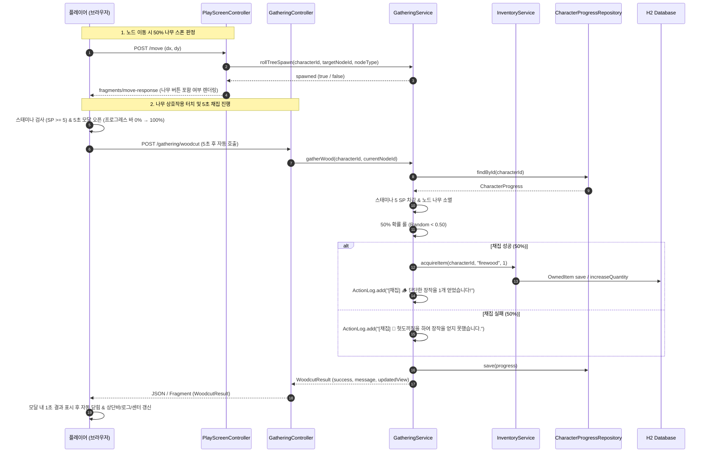

# Design Document: 신규 아이템 '장작' 및 나무 스폰 & 5초 채집 시스템

> **폴더 위치 가이드**: `.kiro/specs/myrpg/017-firewood-gathering/design.md`  
> **관련 규칙**: `rules/coding/code-style.md`, `rules/workflow/codegraph-first.md`, `rules/myrpg/ui-style-guide.md`  
> **요구사항 참조**: `.kiro/specs/myrpg/017-firewood-gathering/requirements.md`

---

## 1. Overview (개요)

본 설계는 MyRPG 모듈(`com.myapps.web.myrpg`)에 신규 아이템 '장작(Firewood)' 및 마을/필드 50% 나무 스폰과 5초 채집 연출 팝업을 구현하기 위한 상세 아키텍처를 정의합니다.

### 1.1. 핵심 설계 결정 및 트레이드오프
| 항목 / 대안 | 선택된 결정 | 근거 및 트레이드오프 | 관련 요구사항 |
|---|---|---|---|
| **아이템 타입 분류** | `ItemType.MATERIAL` 추가 및 `MaterialItem` 레코드 분리 | 기존 `PotionItem`에 억지로 끼워넣지 않고 재료 타입을 독립적으로 정의하여 도메인 응집도 향상 | Req 1.1, 1.2 |
| **나무 스폰 상태 관리** | 세션/메모리 기반 `GatheringService` 관리 (`ConcurrentHashMap<Long, String>`) | DB 스키마 변경 없이 캐릭터별 현재 노드의 나무 스폰/소멸 상태를 가볍게 관리하며, 노드 이동(`POST /move`) 시 50% 롤 수행으로 새로고침 어뷰징 완벽 차단 | Req 2.1, 2.3, 2.5 |
| **5초 채집 연출 방식** | 클라이언트 5초 게이지 애니메이션 + 서버 1회 트랜잭션 요청 (`POST /gathering/woodcut`) | 네트워크 지연 및 서버 부하를 최소화하면서도 5초간 화면 잠금 및 프로그레스 연출로 뛰어난 마비노기 손맛 전달 | Req 3.3, 3.4, 3.5 |
| **인벤토리 풀 처리** | 기존 장작 스택 누적 허용 / 신규 슬롯 부족 시 몬스터 드랍과 동일하게 바닥 버림 처리 | 몬스터 아이템 획득(`acquireSingleItem`)과 100% 일관된 사용자 경험 및 방어적 데이터 무결성 보장 | Req 1.4, 3.7 |

---

## 2. Architecture (시스템 아키텍처 및 계층 구조)

### 2.1. DDD 4계층 패키지 구조
```
myrpg/src/main/java/com/myapps/web/myrpg/
├── interfaces/
│   └── api/
│       ├── GatheringController.java         # POST /gathering/woodcut 채집 엔드포인트
│       ├── PlayScreenController.java        # 노드 이동 시 GatheringService 스폰 롤 연동
│       └── NodeViewAssembler.java           # 나무 스폰 시 '🌲 나무 (장작 패기)' 버튼 조립
├── application/
│   ├── service/
│   │   ├── GatheringService.java            # 나무 스폰 판정, 스태미나 차감, 50% 성공률 채집 오케스트레이션
│   │   ├── ItemCatalogService.java          # type="material" 파싱 및 MaterialItem 등록
│   │   └── InventoryService.java            # MATERIAL 스택 적재 및 은행/가방 이동 처리
│   └── dto/
│       ├── WoodcutResult.java               # 채집 결과 불변 Record (success, message, view)
│       └── InteractionItem.java             # 상호작용 버튼 DTO (기존 확장)
└── domain/
    └── model/
        ├── Item.java                        # sealed interface (permits MaterialItem 추가)
        ├── ItemType.java                    # MATERIAL("material", "재료") 및 isStackable() 추가
        └── MaterialItem.java                # 신규 재료 아이템 불변 Record (id, name, buyPrice)
```

### 2.2. 요청 흐름 및 시퀀스 다이어그램



---

## 3. Components and Interfaces (세부 컴포넌트 설계)

### 3.1. Controller Layer (`interfaces/api`)

#### `GatheringController.java`
```java
@Controller
public class GatheringController {

    private final GatheringService gatheringService;
    private final CharacterService characterService;
    private final PlayScreenViewHelper playScreenViewHelper;

    public GatheringController(
            final GatheringService gatheringService,
            final CharacterService characterService,
            final PlayScreenViewHelper playScreenViewHelper) {
        this.gatheringService = gatheringService;
        this.characterService = characterService;
        this.playScreenViewHelper = playScreenViewHelper;
    }

    @PostMapping("/gathering/woodcut")
    @ResponseBody
    public WoodcutResult woodcut(final HttpSession session) {
        final CharacterProgress progress = resolveCurrentCharacter(session);
        return gatheringService.gatherWood(progress);
    }
}
```

### 3.2. Application Layer (`application/service`, `application/dto`)

#### `GatheringService.java`
- **책임**:
  1. 노드별 나무 스폰 여부 관리 (캐릭터 ID 및 노드 ID 매핑).
  2. 노드 이동 시 50% 스폰 롤 (`town`, `field` 노드만).
  3. 스태미나 5 SP 차감 검증 및 실행.
  4. 50% 채집 성공/실패 판정 및 `InventoryService` 연동.
  5. 1회 채집 완료 시 해당 노드의 나무 상태 즉시 소멸.

#### `WoodcutResult.java` (Record)
```java
public record WoodcutResult(
        boolean success,
        String message,
        String itemId,
        PlayScreenView view) {}
```

#### `ItemCatalogService.java` 확장
- `parseItemNode`에서 `itemType == ItemType.MATERIAL`일 때 `parseMaterialItem(itemNode, id, name, buyPrice)` 호출.
- `MaterialItem` 인스턴스 반환.

#### `InventoryService.java` 확장
- `acquireItem`, `moveToBank`, `moveToInventory`에서 `ItemType.MATERIAL`을 `ItemType.POTION`과 동일하게 `isStackable()`로 취급하여 단일 슬롯 수량 누적 처리.

### 3.3. Domain Layer (`domain/model`)

#### `ItemType.java`
```java
public enum ItemType {
    POTION("potion", "포션"),
    WEAPON("weapon", "무기"),
    ARMOR("armor", "방어구"),
    MATERIAL("material", "재료");

    private final String code;
    private final String label;

    ItemType(final String code, final String label) {
        this.code = code;
        this.label = label;
    }

    public String code() { return code; }
    public String label() { return label; }
    public boolean isEquipment() { return this == WEAPON || this == ARMOR; }
    public boolean isStackable() { return this == POTION || this == MATERIAL; }

    public static Optional<ItemType> fromString(final String code) {
        return Arrays.stream(values()).filter(type -> type.code.equals(code)).findFirst();
    }
}
```

#### `MaterialItem.java`
```java
package com.myapps.web.myrpg.domain.model;

/**
 * 생활 채집 및 제작에 사용되는 재료 아이템 불변 레코드.
 */
public record MaterialItem(
        String id,
        String name,
        Integer buyPrice) implements Item {

    @Override
    public ItemType type() {
        return ItemType.MATERIAL;
    }
}
```

#### `Item.java` (sealed interface 수정)
```java
public sealed interface Item permits PotionItem, EquipmentItem, MaterialItem {
    String id();
    String name();
    ItemType type();
    Integer buyPrice();
}
```

### 3.4. Presentation Layer (`resources/templates`, `resources/static`)

#### `fragments/gathering-modal.html`
- 5초 카운트다운 게이지 바(`--progress-width`), 도끼질 펄스 애니메이션(`@keyframes axeSwing`), 다크 판타지 앤틱 골드 모달 패널.

#### `myrpg.js` 확장
- `onInteractionClick`: `actionType === 'gathering'`일 때 `startWoodcutting()` 호출.
- `startWoodcutting()`:
  1. 현재 SP >= 5 체크 (부족 시 `showToast("스태미나가 부족합니다 (필요: 5 SP)")`).
  2. `gatheringOverlay` 모달 표시 및 프로그레스 바 애니메이션 시작 (5초).
  3. `setTimeout(5000)` 후 `fetch('/gathering/woodcut', { method: 'POST' })` 실행.
  4. 응답 결과를 모달 내 결과 영역에 1초간 표시 (`🪵 장작 획득 성공!` 또는 `💨 채집 실패...`).
  5. 1초 후 모달 닫기 + `swapMoveResponse` / `refreshTopBar` 동기화.

---

## 4. Data Models & Static Data

### 4.1. `classpath:data/item.json` 추가 항목
```json
[
  {
    "id": "firewood",
    "name": "장작",
    "type": "material",
    "buyPrice": 20
  }
]
```

---

## 5. Correctness Properties (jqwik Property-Based Testing)

jqwik을 활용한 도메인/비즈니스 불변식 4종 검증 정의:

- **Property 1: 스태미나 차감 불변식 (Stamina Deduction Invariant)**  
  - *임의의 유효한 캐릭터와 스태미나($SP \ge 5$)에 대해*, 채집을 시도하면 정확히 $SP' = SP - 5$로 차감되며, $SP < 5$인 경우 채집이 거부되고 스태미나는 전혀 변경되지 않는다.
- **Property 2: 장작 스택 누적 불변식 (Stackable Material Invariant)**  
  - *임의의 수량 $N$개 보유 상태에서*, 장작 $M$개를 추가 획득하면 인벤토리 총 슬롯 수는 증가하지 않고 기존 장작 행의 $Quantity' = N + M$이 된다.
- **Property 3: 50% 확률 스폰 및 던전 격리 불변식 (Spawn Isolation Invariant)**  
  - *임의의 던전 노드(`type="dungeon"`)에 대해서는*, 난수 시드와 무관하게 나무 스폰 결과가 항상 `false`이며, `town`/`field` 노드에서만 시드에 따라 결정된다.
- **Property 4: 1회 채집 후 나무 소멸 불변식 (Single Use Depletion Invariant)**  
  - *임의의 노드에 나무가 스폰된 상태에서*, 채집 성공/실패 여부와 무관하게 1회 채집 완료 후 해당 노드의 나무 상태는 즉시 `false`가 된다.
