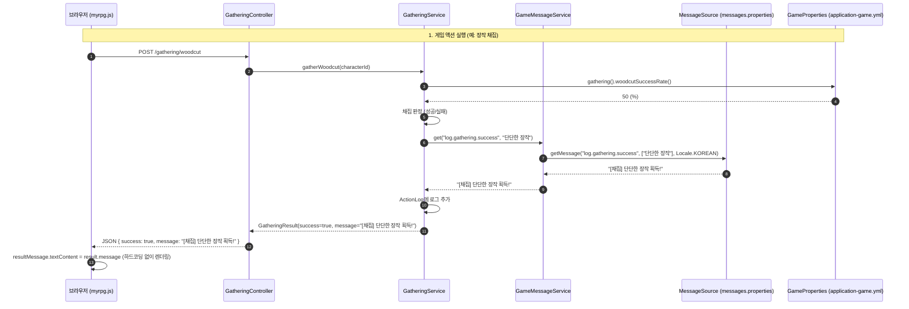

# Design Document: 메시지 및 게임 프로퍼티 외부화 리팩토링 (018-message-and-properties-externalization)

> **폴더 위치 가이드**: `.kiro/specs/myrpg/018-message-and-properties-externalization/design.md`  
> **관련 규칙**: `rules/coding/code-style.md`, `rules/workflow/codegraph-first.md`

---

## 1. Overview (개요)

본 설계는 `com.myapps.web.myrpg` 모듈 내에 잔존하는 하드코딩 문자열(활동 로그, 전투 로그, 비즈니스 예외, JS 알림창) 및 게임 밸런스 수치를 `messages.properties` 및 `application-game.yml`로 외부화하기 위한 상세 설계를 정의합니다.

### 1.1. 핵심 설계 결정 및 트레이드오프
| 항목 / 대안 | 선택된 결정 | 근거 및 트레이드오프 | 관련 요구사항 |
|---|---|---|---|
| **메시지 관리 방식** | Spring `MessageSource` + `messages.properties` | Spring Boot 표준 인프라 활용, Java `MessageFormat` 기반 `{0}`, `{1}` 치환 지원, 향후 다국어 확장 용이 | Req 1.1, 1.2 |
| **전투 턴 로그 템플릿** | 인자화 기반 공통 템플릿 통합 (~20종) | 40여 개로 분산된 유사 문장을 태그/아이콘 인자화(`{0}`)로 50% 슬림화하여 관리 복잡도 절감 | Req 2.2, 2.3 |
| **게임 밸런스 설정** | `@ConfigurationProperties(prefix = "game")` 불변 Record | 타입 세이프한 설정 주입, YAML 계층 구조와 도메인 6대 그룹 1:1 매핑, 테스트 시 Mock/생성자 주입 용이 | Req 4.1, 4.2 |
| **프론트엔드 연동** | Server-Driven `res.message` + View 전역 주입 | 비동기 응답은 서버 메시지를 그대로 출력하고, 즉시 검증은 Thymeleaf 주입 전역 객체(`window.GAME_MESSAGES`)로 처리하여 JS 하드코딩 100% 제거 | Req 5.1, 5.2 |
| **도메인 예외 외부화 범위** | 유저 노출 비즈니스 예외(8건)만 선별 외부화 | 내부 디버깅용 예외(40여건)를 제외하여 불필요한 프로퍼티 키 난립 및 코드 가독성 저하 방지 | Req 3.2, 3.3 |

---

## 2. Architecture (시스템 아키텍처 및 계층 구조)

### 2.1. 패키지 및 리소스 구조
```
myrpg/
├── src/main/java/com/myapps/web/myrpg/
│   ├── config/
│   │   ├── GameProperties.java               # [신규] 게임 밸런스 @ConfigurationProperties Record
│   │   └── GamePropertiesConfiguration.java  # [신규] @EnableConfigurationProperties 설정
│   ├── support/
│   │   └── GameMessageService.java           # [신규] MessageSource 래핑 메시지 리졸버
│   ├── application/
│   │   └── service/
│   │       ├── GatheringService.java         # [수정] GameMessageService & GameProperties 적용
│   │       ├── InventoryService.java         # [수정] GameMessageService & GameProperties 적용
│   │       ├── BattleService.java            # [수정] GameMessageService & GameProperties 적용
│   │       ├── ProgressionService.java       # [수정] GameMessageService & GameProperties 적용
│   │       └── DungeonService.java           # [수정] GameMessageService 적용
│   ├── domain/
│   │   └── service/
│   │       └── BattleLogFormatter.java       # [수정] GameMessageService 주입 및 템플릿 단일화
│   └── interfaces/
│       └── api/
│           ├── PlayScreenController.java     # [수정] 치트 로그 및 전역 메시지 맵 모델 주입
│           ├── HealController.java           # [수정] GameProperties 적용
│           └── RepairController.java         # [수정] GameProperties 적용
└── src/main/resources/
    ├── messages.properties                   # [신규] 인게임 메시지/로그 SSOT
    ├── application-game.yml                  # [신규] 게임 밸런스 설정값
    ├── application.yml                       # [수정] spring.config.import로 application-game.yml 로드
    └── static/js/
        └── myrpg.js                          # [수정] 하드코딩 멘트 제거 및 서버/전역 메시지 연동
```

### 2.2. 요청 흐름 및 시퀀스 다이어그램



---

## 3. Components and Interfaces (세부 컴포넌트 설계)

### 3.1. `GameMessageService.java` (`support` 패키지)
```java
package com.myapps.web.myrpg.support;

import java.util.Locale;
import org.springframework.context.MessageSource;
import org.springframework.context.NoSuchMessageException;
import org.springframework.stereotype.Service;

@Service
public class GameMessageService {

    private final MessageSource messageSource;

    public GameMessageService(final MessageSource messageSource) {
        this.messageSource = messageSource;
    }

    /**
     * 프로퍼티 키와 인자를 받아 한국어 로케일 메시지를 반환합니다.
     * 키가 존재하지 않을 경우 서버 에러 대신 키 이름을 안전하게 반환합니다.
     */
    public String get(final String code, final Object... args) {
        try {
            return messageSource.getMessage(code, args, Locale.KOREAN);
        } catch (final NoSuchMessageException ex) {
            return code;
        }
    }
}
```

### 3.2. `GameProperties.java` (`config` 패키지)
```java
package com.myapps.web.myrpg.config;

import org.springframework.boot.context.properties.ConfigurationProperties;

@ConfigurationProperties(prefix = "game")
public record GameProperties(
        GatheringProperties gathering,
        InventoryProperties inventory,
        TownProperties town,
        BattleProperties battle,
        ProgressionProperties progression,
        MovementProperties movement) {

    public record GatheringProperties(
            int woodcutSpawnRate,
            int woodcutSuccessRate,
            int woodcutStaminaCost) {}

    public record InventoryProperties(
            int maxSlots,
            int defaultPotionQty,
            int equipmentMaxDurability) {}

    public record TownProperties(
            int healCost,
            int repairSuccessRate,
            int repairAmount) {}

    public record BattleProperties(
            int fleeSuccessRate,
            int ambushRate,
            int magicFailRate,
            double durabilityPerAttack,
            double meleeCoef,
            double archeryCoef,
            double magicCoef,
            double criticalMultiplier,
            int monsterNormalMultiplier,
            int monsterHeavyMultiplier,
            int aiNormalWeight,
            int aiHeavyWeight,
            int aiDefenseWeight) {}

    public record ProgressionProperties(
            int maxLevel,
            double deathPenaltyRate) {}

    public record MovementProperties(
            int worldMoveMinutes,
            int dungeonMoveMinutes) {}
}
```

### 3.3. `BattleLogFormatter.java` 리팩토링
`GameMessageService`를 주입받아 하드코딩된 문자열을 외부 템플릿 키 호출로 치환합니다.
```java
@Component
public class BattleLogFormatter {

    private final GameMessageService msg;

    public BattleLogFormatter(final GameMessageService msg) {
        this.msg = msg;
    }

    public String formatMultiHit(final String tag, final String skillLabel, final List<Integer> hits, final int totalDmg) {
        return msg.get("battle.attack.multi", tag, skillLabel, hits.size(), formatHits(hits), totalDmg);
    }
    // ...
}
```

---

## 4. Data Models & Resource Schemas

### 4.1. `src/main/resources/application-game.yml`
```yaml
game:
  gathering:
    woodcut-spawn-rate: 50
    woodcut-success-rate: 50
    woodcut-stamina-cost: 5
  inventory:
    max-slots: 30
    default-potion-qty: 5
    equipment-max-durability: 20
  town:
    heal-cost: 100
    repair-success-rate: 95
    repair-amount: 1
  battle:
    flee-success-rate: 50
    ambush-rate: 5
    magic-fail-rate: 10
    durability-per-attack: 0.05
    melee-coef: 1.0
    archery-coef: 0.85
    magic-coef: 1.2
    critical-multiplier: 1.5
    monster-normal-multiplier: 100
    monster-heavy-multiplier: 150
    ai-normal-weight: 34
    ai-heavy-weight: 33
    ai-defense-weight: 33
  progression:
    max-level: 100
    death-penalty-rate: 0.10
  movement:
    world-move-minutes: 15
    dungeon-move-minutes: 5
```

### 4.2. `src/main/resources/messages.properties` (핵심 키 목록)
- `system.*`: 이동 불가, 자원 부족, 인벤토리 가득 참 등 공통 시스템 문구
- `log.gathering.*`, `log.shop.*`, `log.potion.*`, `log.dungeon.*`, `log.growth.*`: 활동 로그 문구
- `battle.attack.*`, `battle.turn.*`, `battle.monster.*`: 전투 턴 공방 템플릿
- `describe.equip.*`: 장비 정보 포맷팅
- `exception.*`: 비즈니스 예외 메시지

---

## 5. Correctness Properties (jqwik 검증용 불변 속성 명세)

### Property 1: 모든 정의된 메시지 키의 유효 포맷팅 불변식
*For any* `messages.properties`에 정의된 유효한 키와 임의의 유효한 문자열/숫자 인자에 대해, `GameMessageService.get(code, args)` 호출 결과는 `null`이 아니어야 하며, 전달된 인자가 결과 문자열 내에 정상적으로 치환되어 포함되어야 한다.
- **Validates: Requirements 1.1, 1.4, 2.1**

### Property 2: GameProperties의 수치 유효 범위 불변식
*For any* 로드된 `GameProperties` 인스턴스에 대해:
1. 모든 확률값(스폰율, 성공률, 실패율 등)은 `0 <= rate <= 100` 범위에 있어야 한다.
2. 모든 수량 및 비용(슬롯 수, 치료비 등)은 `value > 0` 이어야 한다.
3. 모든 전투 계수(근접/궁술/마법/크리티컬)는 `0.0 < coef <= 5.0` 범위에 있어야 한다.
- **Validates: Requirements 4.1, 4.2**

---

## 6. Testing Strategy & Quality Guardrails

### 6.1. 테스트 계층
1. **단위 테스트 (Unit Tests)**:
   - `GameMessageServiceTest.java`: 키 리졸브, 파라미터 치환, 알 수 없는 키 폴백 검증.
   - `GamePropertiesTest.java`: YAML 프로퍼티 바인딩 및 기본값 정합성 검증.
2. **프로퍼티 기반 테스트 (PBT, jqwik)**:
   - `GameMessagePropertyTest.java`: **Property 1** 검증 (임의 인자 치환 안정성).
   - `GamePropertiesPropertyTest.java`: **Property 2** 검증 (수치 불변식).
3. **통합 및 웹 슬라이스 테스트**:
   - `GatheringServiceTest`, `BattleServiceTest`, `InventoryServiceTest` 등 기존 테스트의 로그 검증부 갱신.
   - `VisualJsPreservationAndJsonLoadingIntegrationTest`: JS 하드코딩 제거 후 프론트엔드 연동 정상성 회귀 검증.

### 6.2. 5대 품질 가드레일 실행 명령어
```bash
mvn -B -q spotless:apply -pl myrpg && (mvn -B clean install -pl myrpg -am > /tmp/mvn.log 2>&1 || (tail -n 30 /tmp/mvn.log && exit 1)) && tail -n 12 /tmp/mvn.log && codegraph sync
```
