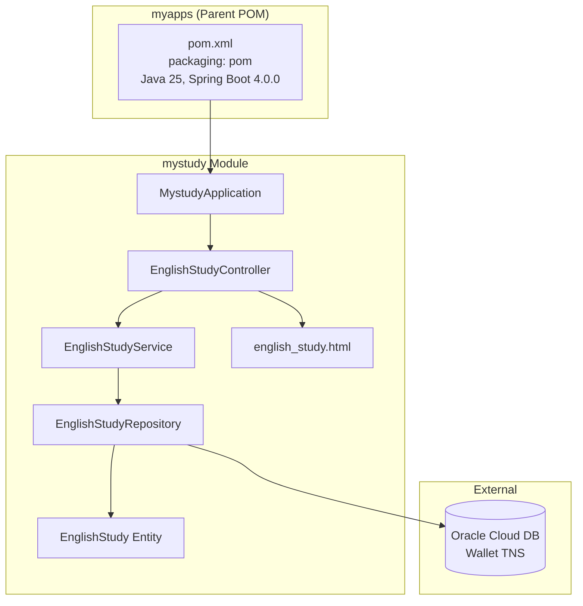
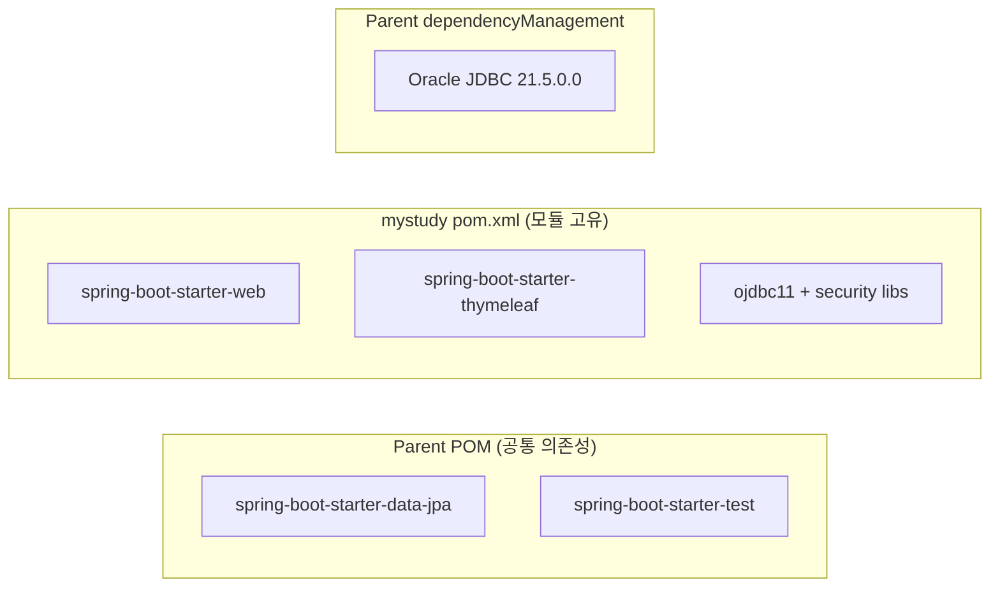
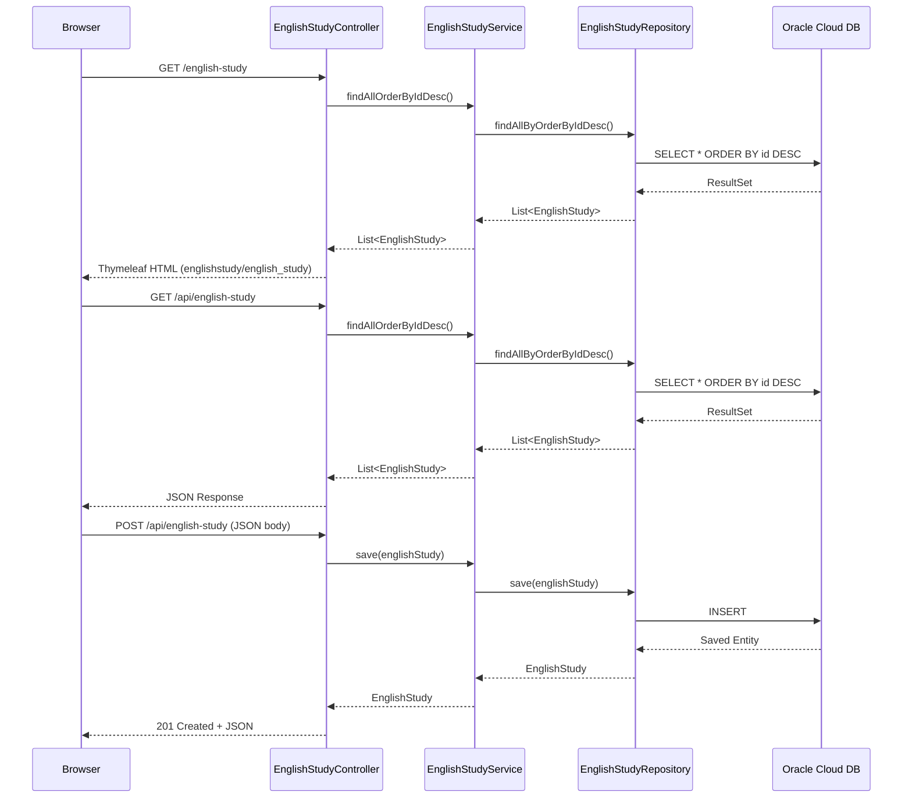
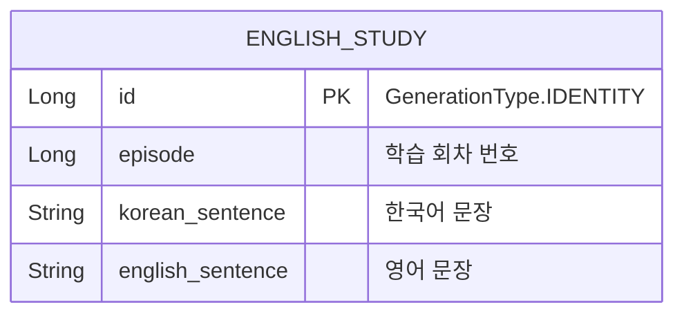

# Design Document

## Overview

demo 프로젝트(Gradle 기반, Java 17)의 영어 학습(englishstudy) 기능을 myapps Maven 멀티모듈 프로젝트의 mystudy 모듈로 마이그레이션합니다. 이 과정에서 빌드 시스템 전환, Java 버전 업그레이드, DDD 패키지 구조 재편성, 코드 스타일 적용을 수행하며, 동시에 사용하지 않는 mysender 모듈을 삭제합니다.

### 설계 결정 사항

| 결정 항목 | 선택 | 근거 |
|---|---|---|
| 빌드 시스템 | Maven (Parent POM 상속) | myapps 프로젝트 표준 |
| Java 버전 | 25 | 프로젝트 표준 (tech-stack.md) |
| 패키지 구조 | DDD 계층 구조 | 도메인 로직과 인프라 분리 |
| DTO 처리 | Entity 직접 노출 (demo 동일) | 단순 CRUD이므로 별도 DTO 불필요 |
| DB 접속 | Wallet 기반 TNS (기존 유지) | 기존 Oracle Cloud DB 재사용 |
| 템플릿 엔진 | Thymeleaf (기존 유지) | SSR + Fetch API 조합 유지 |

## Architecture

### 시스템 아키텍처 (Maven 멀티모듈)



### 모듈 의존성 구조



### 요청 흐름



## Components and Interfaces

### 디렉터리 구조

```
mystudy/
├── pom.xml
└── src/
    ├── main/
    │   ├── java/com/myapps/web/mystudy/
    │   │   ├── MystudyApplication.java
    │   │   ├── domain/
    │   │   │   ├── model/
    │   │   │   │   └── EnglishStudy.java
    │   │   │   └── repository/
    │   │   │       └── EnglishStudyRepository.java
    │   │   ├── application/
    │   │   │   └── service/
    │   │   │       └── EnglishStudyService.java
    │   │   └── interfaces/
    │   │       └── api/
    │   │           └── EnglishStudyController.java
    │   └── resources/
    │       ├── application.yml
    │       └── templates/
    │           └── englishstudy/
    │               └── english_study.html
    └── test/
        └── java/com/myapps/web/mystudy/
            └── MystudyApplicationTest.java
```

### 컴포넌트 상세

#### MystudyApplication

- **위치**: `com.myapps.web.mystudy`
- **역할**: Spring Boot 애플리케이션 진입점
- **어노테이션**: `@SpringBootApplication`

#### EnglishStudy (Entity)

- **위치**: `com.myapps.web.mystudy.domain.model`
- **역할**: 영어 학습 데이터 JPA 엔티티
- **어노테이션**: `@Entity`, `@Id`, `@GeneratedValue(strategy = GenerationType.IDENTITY)`
- **필드**: id(Long), episode(Long), koreanSentence(String), englishSentence(String)
- **메서드**: 모든 필드에 대한 명시적 getter/setter, no-arg 생성자

#### EnglishStudyRepository (Interface)

- **위치**: `com.myapps.web.mystudy.domain.repository`
- **역할**: EnglishStudy 엔티티 데이터 접근 인터페이스
- **상속**: `JpaRepository<EnglishStudy, Long>`
- **메서드**: `List<EnglishStudy> findAllByOrderByIdDesc()`
- **어노테이션**: 없음 (@Repository 불필요 — Spring Data JPA 자동 등록)

#### EnglishStudyService

- **위치**: `com.myapps.web.mystudy.application.service`
- **역할**: 영어 학습 데이터 비즈니스 로직 처리
- **어노테이션**: `@Service`
- **의존성**: EnglishStudyRepository (생성자 주입, private final)
- **메서드**:
  - `List<EnglishStudy> findAllOrderByIdDesc()` — 전체 조회 (ID 역순)
  - `EnglishStudy save(EnglishStudy englishStudy)` — 저장

#### EnglishStudyController

- **위치**: `com.myapps.web.mystudy.interfaces.api`
- **역할**: 웹 진입점 (Thymeleaf 뷰 + REST API)
- **어노테이션**: `@Controller`
- **의존성**: EnglishStudyService (생성자 주입, private final)
- **엔드포인트**:

| HTTP Method | Path | 응답 타입 | 설명 |
|---|---|---|---|
| GET | `/english-study` | Thymeleaf View | 학습 페이지 렌더링 |
| GET | `/api/english-study` | JSON (List) | 전체 학습 데이터 조회 |
| POST | `/api/english-study` | JSON (Entity) | 새 학습 데이터 저장 (201) |

### API 인터페이스 상세

#### GET /english-study

```
Request:  없음
Response: Thymeleaf 뷰 (englishstudy/english_study)
Model:    "englishStudies" → List<EnglishStudy> (ID 내림차순)
```

#### GET /api/english-study

```
Request:  없음
Response: 200 OK
Body:     [{"id":1,"episode":1,"koreanSentence":"...","englishSentence":"..."},...]
```

#### POST /api/english-study

```
Request Body: {"episode":1,"koreanSentence":"안녕하세요","englishSentence":"Hello"}
Response:     201 Created
Body:         {"id":10,"episode":1,"koreanSentence":"안녕하세요","englishSentence":"Hello"}
```

## Data Models

### EnglishStudy Entity



| 필드 | 타입 | JPA 어노테이션 | 설명 |
|---|---|---|---|
| id | Long | @Id, @GeneratedValue(IDENTITY) | 기본키 (자동 생성) |
| episode | Long | - | 학습 회차 번호 |
| koreanSentence | String | - | 한국어 문장 |
| englishSentence | String | - | 영어 문장 |

### 데이터베이스 설정

- **DB**: Oracle Cloud (Autonomous Database)
- **접속 방식**: Wallet 기반 TNS 연결
- **URL 형식**: `jdbc:oracle:thin:@{service_name}?TNS_ADMIN={wallet_path}`
- **스키마**: admin
- **DDL 전략**: `hibernate.ddl-auto=update` (기존 테이블 유지, 필요시 자동 변경)
- **커넥션 풀**: HikariCP, maximum-pool-size=10

### Maven POM 구조

#### Parent POM 변경 사항

```xml
<!-- modules 섹션: mysender 제거, mystudy 추가 -->
<modules>
    <module>mystudy</module>
</modules>

<!-- dependencyManagement: Oracle JDBC 버전 관리 추가 -->
<dependencyManagement>
    <dependencies>
        <dependency>
            <groupId>com.oracle.database.jdbc</groupId>
            <artifactId>ojdbc11</artifactId>
            <version>21.5.0.0</version>
        </dependency>
        <dependency>
            <groupId>com.oracle.database.security</groupId>
            <artifactId>oraclepki</artifactId>
            <version>21.5.0.0</version>
        </dependency>
        <dependency>
            <groupId>com.oracle.database.security</groupId>
            <artifactId>osdt_core</artifactId>
            <version>21.5.0.0</version>
        </dependency>
        <dependency>
            <groupId>com.oracle.database.security</groupId>
            <artifactId>osdt_cert</artifactId>
            <version>21.5.0.0</version>
        </dependency>
    </dependencies>
</dependencyManagement>
```

#### mystudy/pom.xml

```xml
<parent>
    <groupId>com.myapps</groupId>
    <artifactId>myapps</artifactId>
    <version>1.0.0-SNAPSHOT</version>
</parent>

<artifactId>mystudy</artifactId>
<packaging>jar</packaging>

<dependencies>
    <!-- 모듈 고유 의존성 (버전 없음) -->
    <dependency>
        <groupId>org.springframework.boot</groupId>
        <artifactId>spring-boot-starter-web</artifactId>
    </dependency>
    <dependency>
        <groupId>org.springframework.boot</groupId>
        <artifactId>spring-boot-starter-thymeleaf</artifactId>
    </dependency>
    <dependency>
        <groupId>com.oracle.database.jdbc</groupId>
        <artifactId>ojdbc11</artifactId>
    </dependency>
    <dependency>
        <groupId>com.oracle.database.security</groupId>
        <artifactId>oraclepki</artifactId>
    </dependency>
    <dependency>
        <groupId>com.oracle.database.security</groupId>
        <artifactId>osdt_core</artifactId>
    </dependency>
    <dependency>
        <groupId>com.oracle.database.security</groupId>
        <artifactId>osdt_cert</artifactId>
    </dependency>
</dependencies>
```

## Correctness Properties

*A property is a characteristic or behavior that should hold true across all valid executions of a system-essentially, a formal statement about what the system should do. Properties serve as the bridge between human-readable specifications and machine-verifiable correctness guarantees.*

이 기능은 Gradle 기반 demo 프로젝트의 단순 CRUD 기능을 Maven 멀티모듈 구조로 마이그레이션하는 작업입니다. 핵심 로직이 Spring Data JPA의 기본 메서드 위임으로 구성되어 있고, 순수 함수나 복잡한 입출력 변환이 없으므로 **Property-Based Testing은 적용하지 않습니다**.

PBT가 적합하지 않은 이유:
- 코드의 핵심 로직이 단순 CRUD (Spring Data JPA의 기본 메서드 위임)
- 순수 함수나 복잡한 입출력 변환 로직이 없음
- 대부분의 검증이 "올바른 구성" (correct wiring) 확인
- 인프라/설정 관련 검증이 주를 이룸

### Property 1: API 동작 동등성

*For any* 유효한 EnglishStudy 엔티티에 대해, 마이그레이션된 mystudy 모듈의 REST API (GET /api/english-study, POST /api/english-study)는 demo 프로젝트와 동일한 JSON 응답 구조와 HTTP 상태 코드를 반환해야 한다.

**Validates: Requirements 6.1, 6.2, 6.3**

> 참고: 이 속성은 단순 CRUD 위임이므로 형식적 PBT 대신 슬라이스 테스트(@WebMvcTest)로 검증합니다.

## Error Handling

### 현재 범위의 에러 처리

이번 마이그레이션은 기존 demo 프로젝트의 동작을 1:1로 재현하는 것이 목적이므로, 에러 처리도 기존과 동일하게 유지합니다.

| 계층 | 에러 상황 | 처리 방식 |
|---|---|---|
| Controller | 잘못된 JSON 요청 | Spring 기본 400 Bad Request |
| Service | Repository 예외 | Spring 기본 500 Internal Server Error |
| Client (JS) | fetch 실패 | alert()로 사용자 알림 |
| Client (JS) | 입력값 검증 실패 | alert()로 사용자 알림 (전송 차단) |
| DB 연결 | 커넥션 실패 | Spring Boot 기동 실패 (HikariCP 예외) |

### 향후 개선 사항 (이번 범위 외)

- `@ControllerAdvice` 기반 전역 예외 처리
- 입력값 `@Valid` 검증 (Bean Validation)
- 커스텀 비즈니스 예외 클래스

## Testing Strategy

### 테스트 전략 개요

이 기능은 인프라 구성(POM, 설정 파일)과 단순 CRUD 마이그레이션으로 구성되므로, **Property-Based Testing은 적용하지 않습니다**. 다음 이유에 해당합니다:

- 코드의 핵심 로직이 단순 CRUD (Spring Data JPA의 기본 메서드 위임)
- 순수 함수나 복잡한 입출력 변환 로직이 없음
- 대부분의 검증이 "올바른 구성" (correct wiring) 확인
- 인프라/설정 관련 검증이 주를 이룸

대신 **단위 테스트** 와 **슬라이스 테스트** 를 활용합니다.

### 테스트 구성

| 대상 | 테스트 유형 | 어노테이션 | 검증 내용 |
|---|---|---|---|
| MystudyApplication | 통합 테스트 | `@SpringBootTest` | Spring 컨텍스트 로딩 성공 |
| EnglishStudyService | 단위 테스트 | `@ExtendWith(MockitoExtension.class)` | 메서드 호출 위임 확인 |
| EnglishStudyController | 슬라이스 테스트 | `@WebMvcTest` | 엔드포인트 응답 검증 |

### 테스트 클래스 목록

1. **MystudyApplicationTest** — 컨텍스트 로딩 확인 (`@SpringBootTest`)
2. **EnglishStudyServiceTest** — Repository mock을 이용한 서비스 로직 검증
3. **EnglishStudyControllerTest** — MockMvc를 이용한 HTTP 엔드포인트 검증

### 빌드 검증 기준

- `mvn clean install -pl mystudy -am` → BUILD SUCCESS
- `mvn test -pl mystudy` → failures 0, errors 0
- 프로젝트 루트 `mvn clean install` → 전체 멀티모듈 BUILD SUCCESS

### 마이그레이션 검증 체크리스트

- [ ] Parent POM에 mystudy 모듈 등록 확인
- [ ] Parent POM에서 mysender 모듈 제거 확인
- [ ] mysender/ 디렉터리 삭제 확인
- [ ] mystudy 모듈 독립 빌드 성공
- [ ] 전체 프로젝트 빌드 성공
- [ ] Spring Boot 애플리케이션 컨텍스트 로딩 성공 (테스트)
