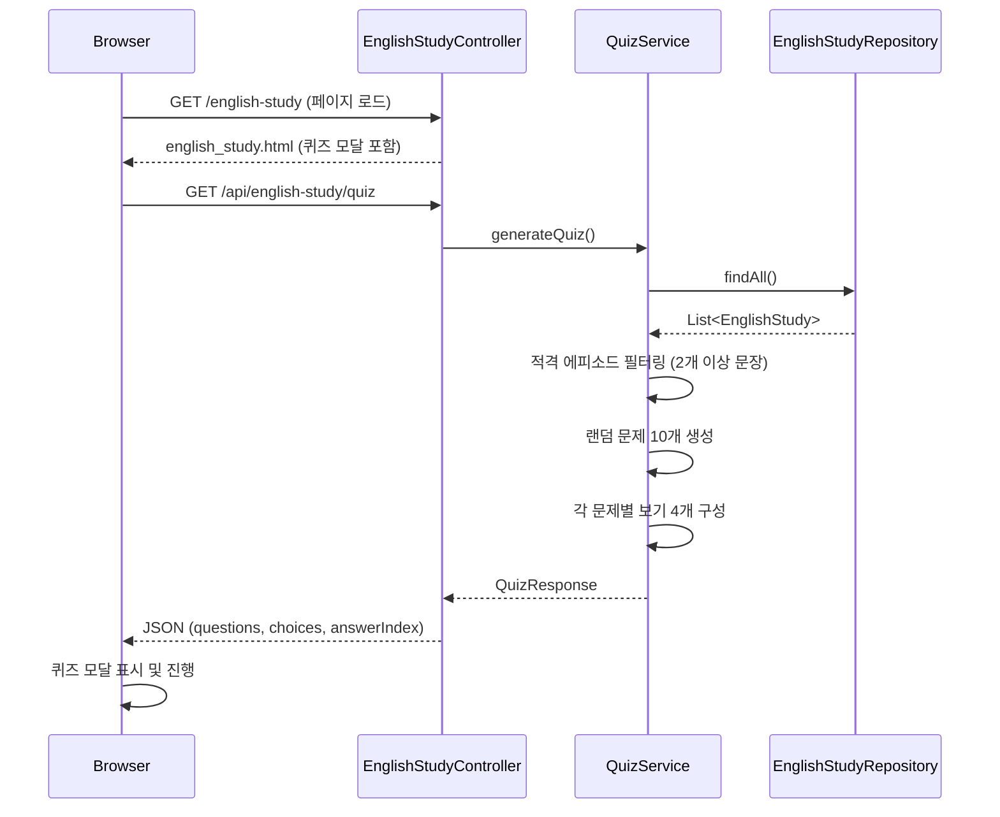
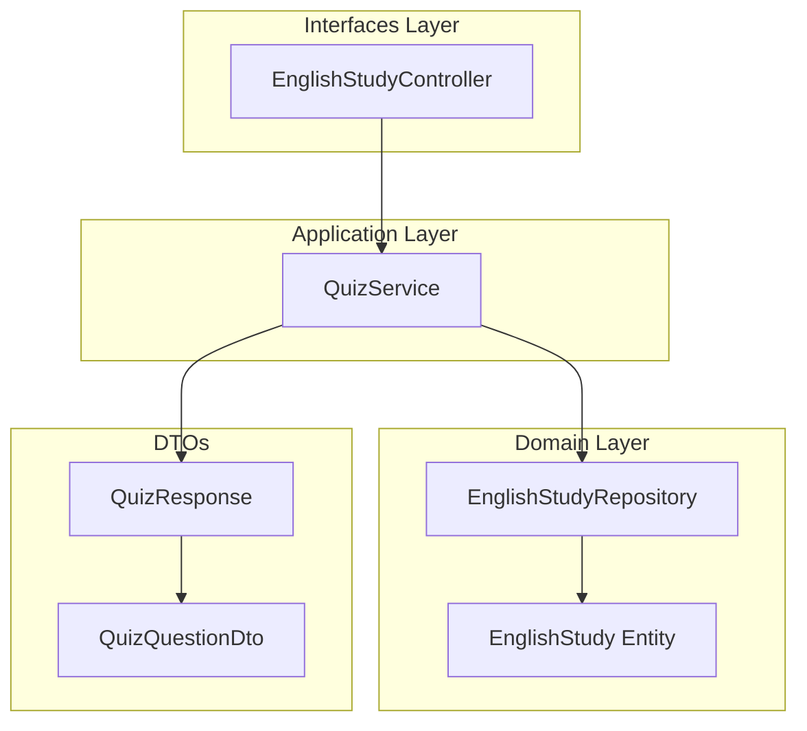

# Design Document: Random Quiz Show

## Overview

영어 학습 페이지(`/english-study`)에 랜덤 퀴즈쇼 기능을 추가합니다. 기존 `EnglishStudy` 테이블의 데이터만을 활용하여, 페이지 접속 시 Modal 형태로 10개의 객관식 퀴즈를 자동 출제합니다.

### 핵심 설계 원칙

1. **기존 테이블 활용**: 추가 DB 테이블 없이 `EnglishStudy` 데이터만 사용
2. **서버 사이드 퀴즈 생성**: 퀴즈 로직은 백엔드 서비스에서 처리하여 정답 조작 방지
3. **DDD 계층 준수**: 기존 아키텍처(domain/application/interfaces)를 따름
4. **Stateless API**: 서버에 퀴즈 상태를 저장하지 않고, 매 요청 시 새로 생성

## Architecture

### 시스템 아키텍처 다이어그램



### 컴포넌트 레이어 다이어그램



## Components and Interfaces

### Backend Components

#### 1. QuizService (Application Layer)

퀴즈 생성 핵심 비즈니스 로직을 담당합니다.

**패키지**: `com.myapps.web.mystudy.application.service`

```java
/**
 * 영어 학습 퀴즈 생성 서비스.
 *
 * <p>EnglishStudy 데이터를 기반으로 랜덤 객관식 퀴즈를 생성합니다.
 */
@Service
public class QuizService {

    private static final int QUIZ_QUESTION_COUNT = 10;
    private static final int CHOICE_COUNT = 4;
    private static final int MIN_SENTENCES_PER_EPISODE = 2;

    private final EnglishStudyRepository englishStudyRepository;
    private final Random random;

    /**
     * QuizService를 생성합니다.
     *
     * @param englishStudyRepository 영어 학습 데이터 저장소
     */
    public QuizService(final EnglishStudyRepository englishStudyRepository) { ... }

    /**
     * 랜덤 퀴즈를 생성합니다.
     *
     * <p>적격 에피소드(문장 2개 이상)에서 랜덤으로 문제를 선택하고,
     * 동일 에피소드 내 문장으로 객관식 보기를 구성합니다.
     *
     * @return 퀴즈 응답 DTO (문제 목록 포함)
     */
    public QuizResponse generateQuiz() { ... }
}
```

**알고리즘 (Low-Level Design)**:

```
generateQuiz():
  1. englishStudyRepository.findAll()로 전체 데이터 조회
  2. episode별로 그룹핑 (Map<Long, List<EnglishStudy>>)
  3. 문장 수가 MIN_SENTENCES_PER_EPISODE(2) 미만인 에피소드 제거 → eligibleEpisodes
  4. eligibleEpisodes가 비어있으면 빈 QuizResponse 반환
  5. eligibleEpisodes의 모든 문장을 하나의 풀로 수집 → candidateSentences
  6. candidateSentences를 랜덤 셔플
  7. 셔플된 목록에서 최대 QUIZ_QUESTION_COUNT(10)개 선택 (중복 방지됨)
  8. 각 선택된 문장에 대해:
     a. 랜덤으로 출제 방향 결정 (ENGLISH_TO_KOREAN or KOREAN_TO_ENGLISH)
     b. 해당 문장의 episode에 속한 다른 문장들에서 오답 보기 수집
     c. 오답 보기를 최대 CHOICE_COUNT-1(3)개 랜덤 선택
     d. 정답 + 오답 보기를 합쳐서 셔플
     e. 셔플된 목록에서 정답 인덱스 찾기
     f. QuizQuestionDto 생성
  9. QuizResponse 반환
```

#### 2. EnglishStudyController 확장 (Interfaces Layer)

기존 컨트롤러에 퀴즈 API 엔드포인트를 추가합니다.

```java
/**
 * 랜덤 퀴즈 데이터를 생성하여 JSON으로 반환합니다.
 *
 * @return 퀴즈 문제 목록을 포함한 응답
 */
@GetMapping("/api/english-study/quiz")
@ResponseBody
public QuizResponse getQuiz() {
    return quizService.generateQuiz();
}
```

#### 3. EnglishStudyRepository 확장 (Domain Layer)

기존 리포지토리에 전체 조회 메서드는 이미 `JpaRepository`의 `findAll()`로 제공되므로 추가 메서드 불필요.

### Frontend Components

#### 4. 퀴즈 모달 UI (english_study.html 내 JavaScript)

기존 Thymeleaf 템플릿에 퀴즈 모달 HTML/CSS/JS를 추가합니다.

**주요 함수**:

```javascript
// 퀴즈 데이터 fetch 및 모달 표시
async function loadQuiz() { ... }

// 현재 문제 렌더링
function renderQuestion(questionIndex) { ... }

// 보기 선택 시 정답 피드백 표시
function selectChoice(choiceIndex) { ... }

// 다음 문제로 이동
function nextQuestion() { ... }

// 퀴즈 종료 (모달 닫기)
function closeQuizModal() { ... }
```

## Data Models

### DTO Records

#### QuizResponse

```java
/**
 * 퀴즈 API 응답을 나타내는 DTO.
 *
 * @param questions 퀴즈 문제 목록
 */
public record QuizResponse(
    List<QuizQuestionDto> questions
) {}
```

#### QuizQuestionDto

```java
/**
 * 개별 퀴즈 문제를 나타내는 DTO.
 *
 * @param question    문제 텍스트 (영어 또는 한국어 문장)
 * @param choices     객관식 보기 목록
 * @param answerIndex 정답 보기의 인덱스 (0-based)
 */
public record QuizQuestionDto(
    String question,
    List<String> choices,
    int answerIndex
) {}
```

#### QuestionType (enum)

```java
/**
 * 퀴즈 문제의 출제 방향을 나타내는 열거형.
 */
public enum QuestionType {
    /** 영어 문장을 보여주고 한국어 정답을 선택 */
    ENGLISH_TO_KOREAN,
    /** 한국어 문장을 보여주고 영어 정답을 선택 */
    KOREAN_TO_ENGLISH
}
```

### API Response JSON 구조

```json
{
  "questions": [
    {
      "question": "Good morning",
      "choices": ["좋은 아침입니다", "안녕하세요", "감사합니다", "잘자요"],
      "answerIndex": 0
    },
    {
      "question": "감사합니다",
      "choices": ["Thank you", "Good bye", "Hello", "Sorry"],
      "answerIndex": 0
    }
  ]
}
```

### 기존 Entity 활용 (변경 없음)

```java
@Entity
public class EnglishStudy {
    @Id @GeneratedValue(strategy = GenerationType.IDENTITY)
    private Long id;
    private Long episode;
    private String koreanSentence;
    private String englishSentence;
}
```

## Correctness Properties

*A property is a characteristic or behavior that should hold true across all valid executions of a system — essentially, a formal statement about what the system should do. Properties serve as the bridge between human-readable specifications and machine-verifiable correctness guarantees.*

### Property 1: Episode Eligibility

*For any* generated quiz from any dataset, every question in the quiz must originate from an episode that contains at least 2 sentences in the source data.

**Validates: Requirements 2.1, 2.2**

### Property 2: Question Count Invariant

*For any* dataset of EnglishStudy records, the number of questions generated equals `min(10, totalEligibleSentences)` where `totalEligibleSentences` is the count of sentences belonging to episodes with 2 or more sentences.

**Validates: Requirements 2.3**

### Property 3: Direction Mapping Correctness

*For any* generated quiz question, if the question text equals an English sentence from the source record, then the correct answer (at `answerIndex`) must equal that record's Korean sentence, and vice versa.

**Validates: Requirements 2.4, 2.5, 2.6**

### Property 4: No Duplicate Questions

*For any* generated quiz, all questions must reference distinct source sentences — no single EnglishStudy record is used as the basis for more than one question.

**Validates: Requirements 2.8**

### Property 5: Choices From Same Episode

*For any* generated quiz question, all choices must be sentences from the same episode as the question's source sentence, and they must be in the answer's language direction (Korean if direction is ENGLISH_TO_KOREAN, English if KOREAN_TO_ENGLISH).

**Validates: Requirements 3.1**

### Property 6: Choice Count Invariant

*For any* generated quiz question from an episode with `n` sentences, the number of choices equals `min(4, n)` and is always at least 2.

**Validates: Requirements 3.2, 3.3**

### Property 7: Answer Inclusion

*For any* generated quiz question, the correct answer text must appear in the choices list at the position specified by `answerIndex`, and `answerIndex` must be a valid index (0 ≤ answerIndex < choices.size()).

**Validates: Requirements 3.4**

### Property 8: No Duplicate Choices

*For any* generated quiz question, all strings in the choices list must be distinct (no two choices are identical).

**Validates: Requirements 3.5**

## Error Handling

### Backend Error Scenarios

| 시나리오 | 처리 방식 |
|---------|----------|
| EnglishStudy 테이블이 비어있음 | 빈 `QuizResponse(List.of())` 반환, HTTP 200 |
| 적격 에피소드가 없음 (모든 에피소드가 1개 이하 문장) | 빈 `QuizResponse(List.of())` 반환, HTTP 200 |
| DB 연결 실패 | Spring 기본 예외 처리 (500 Internal Server Error) |
| 적격 문장 수가 10개 미만 | 가용한 문장 수만큼만 문제 생성 |

### Frontend Error Scenarios

| 시나리오 | 처리 방식 |
|---------|----------|
| Quiz API 호출 실패 (네트워크 오류, 5xx) | 모달 표시하지 않음, 콘솔에 에러 로그 |
| Quiz API 응답의 questions 배열이 비어있음 | 모달 표시하지 않음 |
| Quiz API 응답 JSON 파싱 실패 | 모달 표시하지 않음, 콘솔에 에러 로그 |

## Testing Strategy

### 테스트 계층 구조

```mermaid
graph TD
    A[Property-Based Tests] -->|QuizService 핵심 로직| B[100+ iterations per property]
    C[Unit Tests] -->|Example/Edge Cases| D[QuizService 경계 조건]
    E[Slice Tests] -->|@WebMvcTest| F[Controller 엔드포인트]
```

### Property-Based Tests (QuizService)

**라이브러리**: [jqwik](https://jqwik.net/) (Java property-based testing framework)

- pom.xml에 `net.jqwik:jqwik` test dependency 추가 필요
- 최소 100회 반복 실행 (`@Property(tries = 100)`)
- 각 property test에 설계 문서의 property 번호를 태그로 명시

**Tag 형식**: `Feature: random-quiz-show, Property {number}: {description}`

**구현 접근**:
- `@Provide` 어노테이션으로 EnglishStudy 데이터셋 생성기(Arbitrary) 구현
- 다양한 에피소드 수, 에피소드당 문장 수를 랜덤 생성
- 생성된 데이터셋으로 `QuizService.generateQuiz()` 호출 후 property 검증

### Unit Tests (Example-based)

| 대상 | 테스트 항목 |
|-----|-----------|
| QuizService | 빈 데이터셋 → 빈 응답 |
| QuizService | 모든 에피소드가 1개 문장 → 빈 응답 |
| QuizService | 정확히 2개 문장인 에피소드 → 2개 보기 생성 |
| QuizService | 10개 초과 적격 문장 → 정확히 10개 문제 |

### Controller Slice Tests (@WebMvcTest)

| 테스트 항목 | 검증 내용 |
|-----------|----------|
| GET /api/english-study/quiz 성공 | HTTP 200, JSON 구조 |
| GET /api/english-study/quiz 빈 결과 | HTTP 200, 빈 questions 배열 |
| 응답 JSON 필드 검증 | question, choices, answerIndex 존재 |

### Frontend Tests (수동/E2E)

프론트엔드는 Thymeleaf 템플릿 내 vanilla JavaScript로 구현되므로, 별도의 JS 테스트 프레임워크 없이 수동 테스트 및 브라우저 개발자 도구로 검증합니다.

| 검증 항목 | 확인 방법 |
|----------|----------|
| 모달 자동 표시 | 페이지 로드 후 모달 렌더링 확인 |
| 닫기 버튼 / ESC 키 | 클릭/키 입력 후 모달 사라짐 확인 |
| 배경 클릭 차단 | 배경 클릭 시 모달 유지 확인 |
| 정답/오답 피드백 색상 | 보기 선택 후 초록/빨강 배경색 확인 |
| 문제 진행 (순방향) | 다음 버튼으로만 이동 가능 확인 |
| 스크롤 차단/복원 | 모달 표시/닫기 시 스크롤 상태 확인 |

