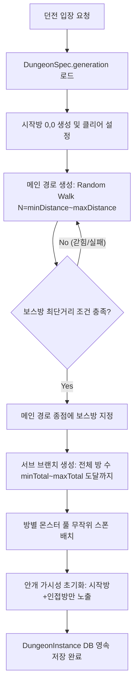
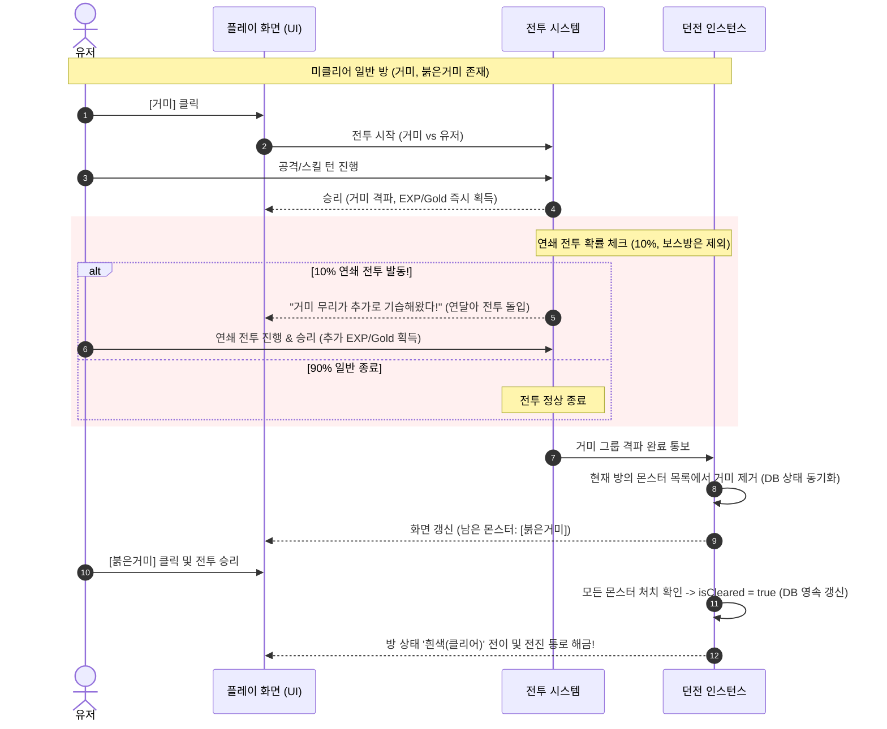
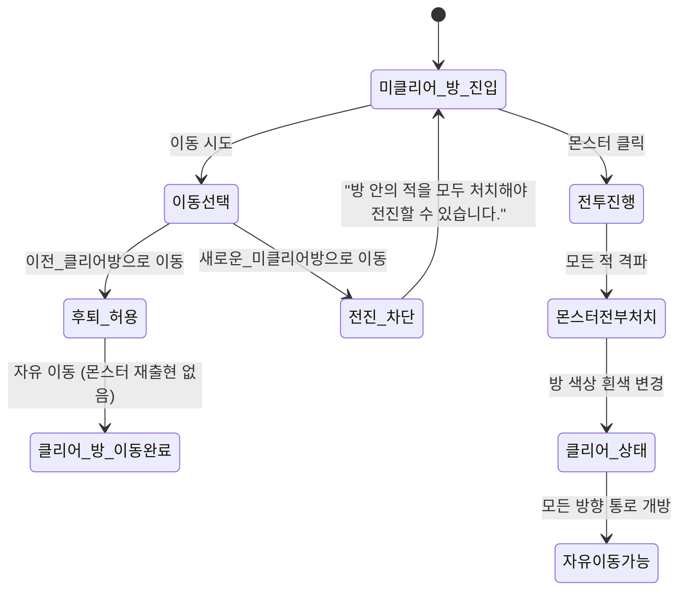
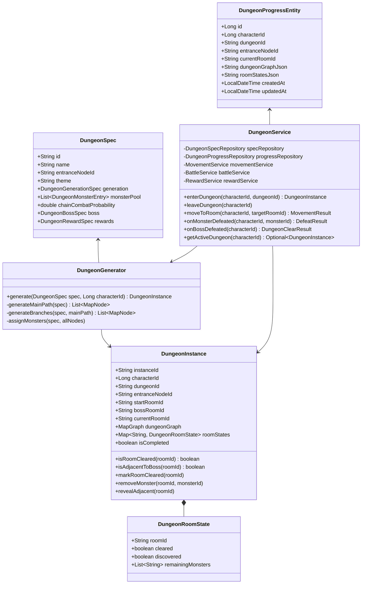

# MyRPG 던전 시스템 상세 설계 문서 (Dungeon System Design)

> **문서 버전**: 1.0.0  
> **작성일**: 2026-08-22  
> **상태**: Draft / Confirmed Architecture  
> **대상 모듈**: `myrpg`

---

## 1. 개요 및 기획 의도

### 1.1. 배경 및 목적
- 기존 `myrpg`의 고정 그래프 맵(마을, 필드, 던전 입구) 위에 **반복 플레이와 탐색의 긴장감을 제공하는 인스턴스 던전 시스템**을 구축합니다.
- 고정 맵의 던전 입구 노드(예: 알비 던전 입구, 키아 던전 입구 등)에서 입장 시, 플레이어마다 매번 다른 구조의 **프로시저럴(Procedural) 랜덤 던전 맵**이 생성됩니다.
- 유저는 안개 속에 가려진 미로를 탐색하며 몬스터를 격파하고, 갈림길과 막다른 길을 헤쳐나가 최종 보스방을 찾아 처치하는 로그라이크 던전 크롤러 경험을 즐깁니다.

### 1.2. 핵심 요구사항 요약
1. **던전 입장/퇴장 상호작용**:
   - 던전 입구 노드 진입 시 상호작용 영역에 `[던전 입장]` 버튼 노출
   - 던전 내부 시작방에서는 `[던전 나가기]` 버튼을 통해 안전하게 필드로 복귀 가능
2. **던전별 개별 규모 설정**:
   - 던전(알비, 키아, 라비 등)마다 시작방~보스방 최단 거리(알비: 10개 고정)와 전체 방 개수(알비: 20~23개)를 개별 데이터로 구성
3. **탐색 기반 전장의 안개 (Fog of War)**:
   - 미방문 방은 숨김 처리되며, 방문했거나 인접한 방만 맵에 노출 (미클리어: 회색, 클리어: 흰색, 보스방 인접 시 경고 힌트)
   - 보스방의 위치는 직접 도달하거나 인접하기 전까지 알 수 없음
4. **상호작용 기반 방 클리어 & 연쇄 전투(Chain Combat)**:
   - 방에 입장하면 출현 몬스터가 상호작용 버튼으로 출력
   - 유저가 선택하여 전투를 치르고 승리 시, **10% 확률로 연쇄 전투(기습/추가 전투)** 발생 (보스방은 제외)
   - 방 안의 모든 몬스터를 격파해야 해당 방이 '클리어' 상태로 전환
5. **이동 및 백트래킹(Backtracking) 제어**:
   - 미클리어 방에서는 '이미 클리어한 이전 방'으로의 후퇴만 가능하며, '새로운 미클리어 방'으로의 전진은 방을 클리어해야만 해금
   - 클리어된 방은 몬스터가 재스폰되지 않으며 자유롭게 통행 가능
6. **보스 처치 및 던전 생명주기**:
   - 보스 처치 즉시 결과 모달과 보상(골드, 경험치, 포션)이 지급되고 던전 입구 노드로 자동 복귀
   - 웹 브라우저 종료/재접속 시에는 **DB 영속 저장**으로 진행 상태를 유지하며, 시작방에서 [던전 나가기]나 사망 시에만 인스턴스 초기화

---

## 2. 던전 메타데이터 및 설정 구조 (`dungeons.json`)

모든 던전은 **독립된 개별 맵 생성 파라미터(`generation`)**, 테마, 몬스터 풀, 보스 및 보상을 JSON 데이터로 관리합니다. 각 던전마다 **시작방~보스방 최단 거리(`minDistanceToBoss`, `maxDistanceToBoss`)**와 **전체 방 개수 범위(`minTotalRooms`, `maxTotalRooms`)**를 자유롭게 다르게 설정할 수 있습니다.

### 2.1. 던전별 다중 데이터 스펙 정의 (`dungeons.json`)

```json
{
  "dungeons": [
    {
      "id": "alby",
      "name": "알비 던전",
      "entranceNodeId": "alby-entrance",
      "theme": "dungeon-alby",
      "implemented": true,
      "generation": {
        "minDistanceToBoss": 10,
        "maxDistanceToBoss": 10,
        "minTotalRooms": 20,
        "maxTotalRooms": 23,
        "branchProbability": 0.40,
        "maxBranchDepth": 3
      },
      "monsterPool": [
        { "monsterId": "spider", "minCount": 1, "maxCount": 2, "weight": 40 },
        { "monsterId": "red-spider", "minCount": 1, "maxCount": 2, "weight": 25 },
        { "monsterId": "goblin", "minCount": 1, "maxCount": 2, "weight": 25 },
        { "monsterId": "black-spider", "minCount": 1, "maxCount": 1, "weight": 10 }
      ],
      "chainCombatProbability": 0.10,
      "boss": {
        "monsterId": "giant-spider",
        "name": "거대거미",
        "dialogue": "쿠구구궁…! 던전 깊은 곳에서 거대한 거미가 천천히 내려앉는다."
      },
      "rewards": {
        "exp": 1000,
        "gold": 2000,
        "items": [
          { "itemId": "hp_potion_30", "quantity": 3 }
        ]
      }
    },
    {
      "id": "ciar",
      "name": "키아 던전 (예시/확장용)",
      "entranceNodeId": "ciar-entrance",
      "theme": "dungeon-ciar",
      "implemented": false,
      "generation": {
        "minDistanceToBoss": 12,
        "maxDistanceToBoss": 14,
        "minTotalRooms": 24,
        "maxTotalRooms": 28,
        "branchProbability": 0.45,
        "maxBranchDepth": 4
      },
      "monsterPool": [],
      "chainCombatProbability": 0.10,
      "boss": { "monsterId": "golem", "name": "골렘" },
      "rewards": { "exp": 2500, "gold": 5000, "items": [] }
    },
    {
      "id": "rabbie",
      "name": "라비 던전 (예시/확장용)",
      "entranceNodeId": "rabbie-entrance",
      "theme": "dungeon-rabbie",
      "implemented": false,
      "generation": {
        "minDistanceToBoss": 14,
        "maxDistanceToBoss": 17,
        "minTotalRooms": 28,
        "maxTotalRooms": 34,
        "branchProbability": 0.50,
        "maxBranchDepth": 4
      },
      "monsterPool": [],
      "chainCombatProbability": 0.10,
      "boss": { "monsterId": "succubus", "name": "서큐버스" },
      "rewards": { "exp": 5000, "gold": 10000, "items": [] }
    }
  ]
}
```

### 2.2. 던전별 생성 파라미터 비교 및 상세
| 던전 ID | 던전명 | 보스방 최단거리 (`min~max`) | 전체 방 개수 범위 (`min~max`) | 갈림길 분기 확률 / 최대 깊이 | 구현 상태 |
|---|---|---|---|---|---|
| **`alby`** | **알비 던전** | **10개 고정** (`10 ~ 10`) | **20 ~ 23개** | 40% / 최대 3칸 | **구현 대상 (Active)** |
| `ciar` | 키아 던전 | 12 ~ 14개 | 24 ~ 28개 | 45% / 최대 4칸 | 향후 확장 (Backlog) |
| `rabbie` | 라비 던전 | 14 ~ 17개 | 28 ~ 34개 | 50% / 최대 4칸 | 향후 확장 (Backlog) |

---

## 3. 알비 던전 몬스터 카탈로그 및 `monster.json` 데이터

### 3.1. 몬스터 밸런스 및 강함 티어 요약
사용자 요구 강함 순서: **거미(Lv2) < 붉은거미(Lv3) ≈ 고블린(Lv3) < 검은거미(Lv4) < 거대거미(Lv7 보스)**  
모든 일반 몬스터는 동레벨 기준 난이도비 1.1~1.2 수준의 **대등(정면 접전)** 밴드로 튜닝되었습니다.

| 몬스터 ID | 이름 | 레벨/타입 | HP | ATK | DEF | Crit | CP (난이도비) | 특징 및 위치 |
|---|---|---|---|---|---|---|---|---|
| `spider` | 거미 | Lv2 일반 | 65 | 48 | 4 | 3.0% | **57.4** (1.12 대등) | 최약체 기본 거미, 높은 스폰율 (40%) |
| `red-spider` | 붉은거미 | Lv3 일반 | 80 | 50 | 5 | 3.0% | **65.4** (1.12 대등) | 방어적 거미 (방어력 특화), 스폰율 25% |
| `goblin` | 고블린 | Lv3 일반 | 70 | 54 | 3 | 3.0% | **62.9** (1.08 대등) | 공격적 아인종 (공격 특화/유리대포), 스폰율 25% |
| `black-spider` | 검은거미 | Lv4 일반 | 100 | 56 | 6 | 4.0% | **78.0** (1.19 대등) | 일반 몬스터 중 최상위 티어, 스폰율 10% |
| `giant-spider` | 거대거미 | Lv7 보스 | 380 | 72 | 12 | 7.0% | **179.4** (2.06 보스급) | 알비 던전 최종 보스, 방어 경감60/반격50 |

### 3.2. `monster.json` 실제 추가 데이터

```json
[
  {
    "id": "spider",
    "name": "거미",
    "type": "normal",
    "level": 2,
    "maxHp": 65,
    "attackPower": 48,
    "defense": 4,
    "critical": 30,
    "experience": 30,
    "goldDrop": {
      "min": 8,
      "max": 20
    },
    "itemDrops": [
      {
        "itemId": "hp_potion_30",
        "chancePercent": 10,
        "minQuantity": 1,
        "maxQuantity": 1
      }
    ],
    "lines": [
      "샤아악-! (거미가 거미줄을 뿜으며 다가온다.)",
      "(거미의 날카로운 다리가 바닥을 긁는 소리가 난다.)"
    ]
  },
  {
    "id": "red-spider",
    "name": "붉은거미",
    "type": "normal",
    "level": 3,
    "maxHp": 80,
    "attackPower": 50,
    "defense": 5,
    "critical": 30,
    "experience": 40,
    "goldDrop": {
      "min": 12,
      "max": 25
    },
    "itemDrops": [
      {
        "itemId": "hp_potion_30",
        "chancePercent": 15,
        "minQuantity": 1,
        "maxQuantity": 1
      }
    ],
    "lines": [
      "쉭쉭! (붉은빛을 띤 거미가 사납게 턱을 움직인다.)",
      "(붉은거미가 빠르게 기어와 공격 자세를 취한다.)"
    ]
  },
  {
    "id": "goblin",
    "name": "고블린",
    "type": "normal",
    "level": 3,
    "maxHp": 70,
    "attackPower": 54,
    "defense": 3,
    "critical": 30,
    "experience": 42,
    "goldDrop": {
      "min": 15,
      "max": 30
    },
    "itemDrops": [
      {
        "itemId": "hp_potion_30",
        "chancePercent": 20,
        "minQuantity": 1,
        "maxQuantity": 1
      }
    ],
    "lines": [
      "키에엑! 침입자다, 키엑!",
      "(고블린이 몽둥이를 휘두르며 위협한다.)"
    ]
  },
  {
    "id": "black-spider",
    "name": "검은거미",
    "type": "normal",
    "level": 4,
    "maxHp": 100,
    "attackPower": 56,
    "defense": 6,
    "critical": 40,
    "experience": 55,
    "goldDrop": {
      "min": 20,
      "max": 45
    },
    "itemDrops": [
      {
        "itemId": "hp_potion_30",
        "chancePercent": 25,
        "minQuantity": 1,
        "maxQuantity": 1
      }
    ],
    "lines": [
      "샤아아악! (거대한 검은 다리로 바닥을 내리찍는다.)",
      "(검은거미의 붉은 눈 여러 개가 어둠 속에서 번뜩인다.)"
    ]
  },
  {
    "id": "giant-spider",
    "name": "거대거미",
    "type": "boss",
    "level": 7,
    "maxHp": 380,
    "attackPower": 72,
    "defense": 12,
    "critical": 70,
    "defenseBlockRate": 60,
    "defenseCounterRate": 50,
    "experience": 350,
    "goldDrop": {
      "min": 150,
      "max": 300
    },
    "itemDrops": [
      {
        "itemId": "hp_potion_30",
        "chancePercent": 100,
        "minQuantity": 2,
        "maxQuantity": 3
      }
    ],
    "lines": [
      "쿠구구궁…! (던전 깊은 곳을 울리는 거대한 진동과 함께 거대거미가 내려앉는다.)",
      "키에에에엑! (거대거미의 위압적인 포효가 울려 퍼진다.)"
    ]
  }
]
```

---

## 4. 프로시저럴 던전 맵 생성 알고리즘 (Procedural Map Generation)

2차원 4방향 격자(Grid: North, South, East, West) 상에서 꺾임과 회전이 포함된 **구불구불한 2D 비선형 미로**를 생성합니다 (일직선 통로가 아님).

```
[2차원 격자 던전 맵 생성 예시 (2D Non-linear Winding Grid)]

                      [막다른길1] - [막다른길2]
                           |
[시작방(0,0)] - [방1] - [방2]
                 |         |
             [막다른길]  [방3] - [방4] - [방5]
                                    |       |
                                [막다른길] [방6] - [방7]
                                                    |
                                                [보스방(BOSS)] - [막다른길]
```
> ※ 시작방에서 보스방까지의 주 경로는 동·서·남·북 4방향으로 무작위 꺾이며(Self-avoiding Random Walk), 주 경로 중간중간에 1~3칸 깊이의 막다른 갈림길들이 뻗어나와 각 던전의 `generation` 설정에 맞춘 미로를 형성합니다 (알비 던전: 보스방 최단거리 10개 고정, 전체 20~23개 방).

### 4.1. 생성 단계 (Generation Pipeline)



1. **시작점 고정**:
   - `(x: 0, y: 0)` 위치에 시작방(`room-0-0`) 생성. 시작방은 몬스터가 없으며 `isCleared = true`, `isDiscovered = true`.
2. **주 경로(Main Path) 생성**:
   - 던전 스펙의 목표 거리 $D \in [\text{minDistanceToBoss}, \text{maxDistanceToBoss}]$ 결정 (알비 던전: 10 고정)
   - 4방향(동/서/남/북) 중 미사용 인접 격자로 이동하며 길이 $D$의 비순환 경로 생성 (Self-avoiding Random Walk)
   - 경로의 최종 종점 노드를 **보스방(Boss Room)**으로 지정
3. **서브 브랜치(Branch / Dead-End) 생성**:
   - 던전 스펙의 목표 전체 방 수 $T \in [\text{minTotalRooms}, \text{maxTotalRooms}]$ 결정 (알비 던전: 20~23 중 무작위)
   - 현재 방 개수가 $T$에 도달할 때까지, 기존 방들(시작방/보스방 제외)에서 빈 격자로 분기 경로(깊이 1~3)를 확장
   - 막다른 길(Dead-end)은 자연스럽게 형성되며, 끝에 도달하면 더 이상 이어지지 않음
4. **링크(Links) 및 양방향성 보장**:
   - 격자상 연결된 모든 통로는 `MapNode.links`에 양방향으로 기록
5. **몬스터 스폰 배치**:
   - 시작방: 몬스터 0마리
   - 일반방/갈림길방: 던전 몬스터 풀에서 1~2종류 무작위 선택 배치
   - 보스방: `boss.monsterId` 고정 배치

---

## 5. 탐색 및 안개 시스템 (Fog of War & Map View)

### 5.1. 방 상태 머신 (Room States)

| 상태 (State) | 가시성 (Visibility) | 맵 표기 색상 | 설명 |
|---|---|---|---|
| **`UNVISITED`** | 미공개 (Hidden) | 표시 안 됨 (빈 칸) | 아직 도달하거나 인접하지 않아 존재조차 모르는 방 |
| **`DISCOVERED`** | 공개 (Revealed) | **회색 (`#718096`)** | 인접하여 길은 보이나 아직 몬스터를 소탕하지 않은 미클리어 방 |
| **`CLEARED`** | 클리어 (Cleared) | **흰색 (`#FFFFFF`)** | 몬스터가 모두 처치되어 안전한 방 |
| **`CURRENT`** | 현재 위치 (Player) | **금색/청록 하이라이트** | 플레이어가 현재 위치한 방 |

### 5.2. 안개 해제(FOW Reveal) 및 보스방 경고 규칙
- 플레이어가 특정 방 $R$에 진입하면:
  1. $R$의 상태를 `DISCOVERED`로 전환 (이미 `CLEARED`인 경우는 유지)
  2. $R$과 연결된 모든 이웃 방 $N \in R.\text{links}$를 `DISCOVERED`로 전환
  3. 미니맵과 전체맵에는 `DISCOVERED` 또는 `CLEARED` 상태인 방과 그 사이의 통로(Edge)만 렌더링 (아직 인접하지 않은 미탐색 방은 빈 칸 숨김)
  4. **보스방 인접 경고 힌트**:
     - 플레이어가 보스방과 직접 연결된 방에 진입하면, 하단 액션로그 및 상황 멘트에 *"어두운 통로 너머 깊은 곳에서 불길하고 강력한 기운이 느껴집니다..."* 경고 힌트가 출력됩니다. (일반 방의 몬스터 정보는 진입 전까지 비공개)

```
[전체맵 / 미니맵 렌더링 예시]

  (미탐색)      [회색: 방3 (보스방 인접! 경고 출력)]
                  |
[흰색: 시작방] - [흰색: 방1] - [회색: 방2 (현재위치★)]
                  |
             [회색: 갈림길]
```

---

## 6. 방 상호작용 및 전투 / 이동 메커니즘

### 6.1. 상호작용 UI 구성
던전 내부에서 플레이 화면의 상호작용 버튼 영역은 다음과 같이 동작합니다:

```
+---------------------------------------------------------+
| [상황 멘트] 어둡고 습한 알비 던전의 복도이다.             |
|                                                         |
| [상호작용 버튼 영역]                                      |
| - 시작방일 때:                                           |
|   [던전 나가기]                                          |
| - 미클리어 방일 때:                                      |
|   [거미 (Lv.2)]  [붉은거미 (Lv.3)]                       |
| - 클리어 방일 때:                                        |
|   (몬스터 없음 - 안전함)                                 |
| - 보스방일 때:                                           |
|   [거대거미 (BOSS Lv.7)]                                 |
+---------------------------------------------------------+
```

### 6.2. 몬스터 처치 및 연쇄 전투(Chain Combat) 상세 흐름



> **단서 규칙**:
> 1. **보스방 연쇄 전투 제외**: 보스(`giant-spider`)는 최종 결전이므로 처치 시 10% 연쇄 전투가 발생하지 않고 즉시 던전 승리로 완료됩니다.
> 2. **전투 건별 즉시 보상 지급**: 전투에서 승리할 때마다 경험치와 골드가 즉시 캐릭터 진행상황(`CharacterProgress`)에 반영됩니다.

### 6.3. 이동 및 백트래킹(Backtracking) 제어 규칙



1. **미클리어 방**:
   - `클리어된 인접 방`으로의 이동(후퇴): **허용** (언제든지 도망쳐 되돌아갈 수 있음)
   - `미클리어 인접 방`으로의 이동(전진): **차단** (액션 로그 메시지: *"앞으로 나아가려면 이 방의 적들을 모두 처치해야 합니다."*)
2. **클리어된 방**:
   - 연결된 모든 인접 방으로 자유롭게 이동 가능
   - 이미 처치된 몬스터는 재스폰되지 않음

---

## 7. 보스 처치, 보상 및 던전 생명주기

### 7.1. 보스방 승리 흐름
1. 보스방에서 보스 몬스터(`BOSS`)를 클릭하여 전투 돌입
2. 전투 승리 시 (연쇄 전투 없이 즉시 승리 처리):
   - 던전 클리어 모달 출력: *"알비 던전을 완전히 정복했습니다!"*
   - 클리어 보상 일괄 지급:
     - 대량의 경험치 (`exp`) 및 골드 (`gold`)
     - 던전 특수 전리품/장비 아이템 (인벤토리 자동 지급)
   - 던전 영속 인스턴스 삭제 및 플레이어 위치를 던전 입구 노드(`alby-entrance`)로 복귀
   - 월드맵 뷰로 정상 전환

### 7.2. 중도 퇴장 및 사망, 재접속 생명주기
- **브라우저 종료 및 N시간 후 재접속 (영속성)**:
  - 던전 인스턴스(생성된 맵, 방 클리어 상태, 잔여 몬스터, 현재 위치)가 **DB JPA 엔티티에 영속 저장**되어 있으므로, 3시간 뒤에 재접속해도 마지막에 머물던 방에서 그대로 이어서 플레이 가능
- **시작방 [던전 나가기] 클릭**:
  - 유저의 자발적인 던전 포기/퇴장이므로 DB의 던전 인스턴스를 소멸/삭제하고 던전 입구 노드로 복귀 (추후 재입장 시 새 랜덤 던전 생성)
- **던전 내 전투 중 사망 (HP = 0)**:
  - 던전 인스턴스 즉시 삭제/초기화
  - 플레이어는 기존 규칙대로 마을(티르코네일 등)로 부활 및 바이탈 100% 회복 (단, 사망 전 처치한 몬스터로부터 얻은 EXP/골드는 유지)

---

## 8. 시스템 아키텍처 및 구현 설계

### 8.1. 클래스 다이어그램 (Domain, Entity & Service)



### 8.2. 맵 뷰 모델 연동 (`MapViewFactory`)
- 던전 진입 시 `MapViewFactory.createMinimap()` 및 `createFullMap()`은 월드맵 `MapGraph` 대신 `DungeonInstance.dungeonGraph`를 사용합니다.
- `FullMapCell` 및 `MinimapCell`에 방의 상태(`isCleared`, `isDiscovered`)를 전달하여 CSS 클래스를 부여합니다:
  - `cell.discovered && !cell.cleared` $\rightarrow$ `class="node-dungeon-uncleared"` (회색)
  - `cell.cleared` $\rightarrow$ `class="node-dungeon-cleared"` (흰색)
  - `!cell.discovered` $\rightarrow$ 렌더링 생략 (빈 투명 셀)

---

## 9. 예외 처리 및 엣지 케이스

| 시나리오 | 처리 방식 |
|---|---|
| **미클리어 방에서 새로운 미클리어 방으로 이동 시도** | `BlockedMovementException` 발생 및 액션로그에 *"방 안의 적을 먼저 처치해야 합니다."* 출력 |
| **미클리어 방에서 클리어된 이전 방으로 후퇴 시도** | 정상 이동 처리 (후퇴 허용) |
| **연쇄 전투 발생 시 (일반방 10%)** | 전투 종료 화면 대신 즉시 다음 턴의 연쇄 전투 화면 갱신 및 액션로그에 *"추가 적이 기습해왔습니다!"* 출력 |
| **보스방 몬스터 처치 시** | 연쇄 전투 확률 검사를 건너뛰고 즉시 던전 클리어 모달 및 보상 지급 후 입구 복귀 |
| **보스방 인접 방 진입 시** | 액션로그 및 상황 멘트에 *"어두운 통로 너머 깊은 곳에서 불길하고 강력한 기운이 느껴집니다..."* 경고 힌트 출력 |
| **던전 도중 브라우저 닫기 및 재접속** | `DungeonProgressEntity` (DB)에서 던전 상태를 불러와 마지막 클리어/위치 그대로 복원 |
| **시작방에서 [던전 나가기] 클릭** | `DungeonProgressEntity` 삭제 후 던전 입구 노드로 이동 (재입장 시 새로운 던전 생성) |
| **던전 내 전투 중 사망 (HP=0)** | 패배 처리 $\rightarrow$ DB 던전 인스턴스 삭제 $\rightarrow$ 마을 리스폰 (사망 전 획득한 보상은 유지) |

---

## 10. 향후 확장 고려사항 (Backlog)
- **방 기믹 확장**: 보물상자 방(열쇠 필요), 함정 방, 회복의 샘 방
- **던전 난이도 등급**: 초급 / 중급 / 상급 통행증에 따른 던전 스케일 및 몬스터 강화
- **미니맵 안개 개선**: 파티 플레이 시 시야 공유
- **키아/라비 던전 추가**: 알비 던전 완료 후 키아/라비 등 후속 던전 순차 개방

