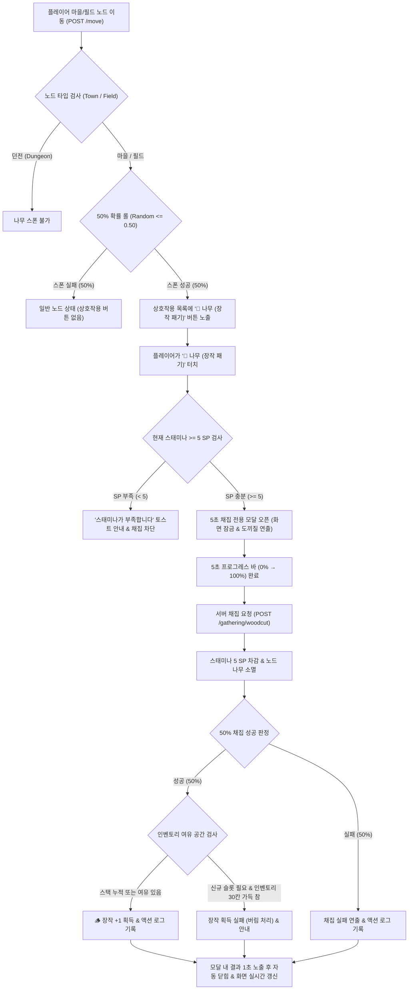

# 🎮 [기획서] 장작(Firewood) 및 생활 채집 시스템 상세 기획서 (GDD)

> **문서 상태**: 기획 확정 (승인 완료)  
> **작성일**: 2026-08-29  
> **대상 모듈**: MyRPG (`myrpg`)  
> **연계 시스템**: [백로그 1] 캠프파이어 & 야간 위험도 시스템, [백로그 2] 마을 아르바이트 시스템

---

## 1. 기획 의도 및 핵심 가치 (Design Intent & Core Fantasy)

### 1.1. 배경 및 문제점
- 현재 MyRPG는 9칸 상성 턴제 전투, 알비 던전, 장비/스킬 육성 등 **전투 중심의 플레이 루프**가 탄탄하게 완성되어 있으나, 마을과 필드에서 느낄 수 있는 **생활·휴식·채집(Fantasy Life)의 낭만 요소가 부재**했습니다.
- 향후 예정된 **캠프파이어 & 야간 위험도 시스템**(밤 시간 야영, 기습 방지, 바이탈 완충)을 도입하기 위해 가장 기초적인 소모 재료인 **'장작'의 자연스러운 수급처**가 필요합니다.

### 1.2. 핵심 재미 요소
1. **소소한 탐험의 발견과 기대감**: 필드와 마을을 이동할 때마다 50% 확률로 발견되는 나무 오브젝트.
2. **리드미컬한 5초 채집 연출**: 마비노기 감성의 도끼질(`🪓`) 펄스 애니메이션과 5초 프로그레스 바를 통한 몰입감.
3. **위험 부담 없는 초반 생활 재화**: 맨손으로도 5 SP만으로 채집 가능하며, 10G 판매를 통한 초반 골드 수급 및 향후 캠프파이어 원료 비축.

---

## 2. 코어 게임 루프 & 플로우차트 (Core Loop & Flow)



---

## 3. 상세 게임 규칙 & 상태 전이 (System Mechanics)

### 3.1. 나무 오브젝트 스폰 및 상태 관리
- **스폰 대상 노드**: `MapNode.type`이 `town`(마을) 또는 `field`(자유 필드)인 노드 (던전 내부 및 입구 제외).
- **스폰 판정 시점**: 실제 노드 이동(`POST /move`) 시점에 50% 확률로 스폰 여부 롤.
- **리롤 방지(Anti-Abuse)**: 브라우저 새로고침(F5) 시에는 기존 노드의 스폰 상태가 유지되며, 다른 노드로 이동해야만 새로운 롤이 수행됨.
- **오브젝트 수명**: 1회 채집 시도(성공/실패/인벤풀 무관) 완료 시 즉시 소멸.

### 3.2. 채집 조건 및 비용
- **스태미나(SP) 소모**: 채집 1회당 **5 SP** 고정 소모.
- **도구/무기 조건**: 맨손, 한손검, 양손검, 활, 지팡이 등 **무기 장착 여부와 무관하게 누구나 채집 가능**.
- **안전장치**: 스태미나가 5 미만일 경우 버튼 터치 시 즉시 `"스태미나가 부족합니다 (필요: 5 SP)"` 토스트 알림을 띄우고 모달 진입을 차단.

### 3.3. 5초 채집 진행 및 결과 연출
- **화면 잠금**: 채집 모달이 활성화된 5초 동안은 다른 화면 조작(이동, 인벤토리, 스킬창 등)이 차단되어 채집에 집중.
- **타이머 연출**: 앤틱 골드 프로그레스 바가 5초 동안 0%에서 100%까지 부드럽게 채워짐.
- **결과 노출**: 5초 도달 직후 모달 내부에서 성공(`🪵 단단한 장작 획득!`) 또는 실패(`💨 채집 실패...`) 메시지를 약 1초간 보여준 뒤 모달이 자동으로 닫힘.
- **실시간 동기화**: 모달이 닫히면서 상단바(SP 수치), 하단 행동 로그, 센터 상호작용 목록(나무 버튼 제거)이 비동기로 즉시 갱신.

---

## 4. 데이터 스키마 & 모델링 (Data-Driven Schema)

### 4.1. `ItemType` 확장 & `MaterialItem` 레코드
```java
public enum ItemType {
    POTION("potion", "포션"),
    WEAPON("weapon", "무기"),
    ARMOR("armor", "방어구"),
    MATERIAL("material", "재료"); // 신규 추가
    ...
    public boolean isStackable() {
        return this == POTION || this == MATERIAL;
    }
}
```

```java
public record MaterialItem(String id, String name, Integer buyPrice) implements Item {
    @Override
    public ItemType type() {
        return ItemType.MATERIAL;
    }
}
```

### 4.2. `item.json` 정의
```json
{
  "id": "firewood",
  "name": "장작",
  "type": "material",
  "buyPrice": 20
}
```

---

## 5. 경제 모델 & 밸런스 수식 (Economy & Math Modeling)

| 항목 | 수치 / 설정 | 기획 의도 및 밸런스 근거 |
|---|---|---|
| **채집 성공률** | **50%** | 마비노기 초반 채집의 적절한 난이도와 긴장감 제공 |
| **스태미나 소모** | **5 SP** | 1레벨 기본 스태미나(약 30~50) 기준 연속 6~10회 채집 가능, 휴식 유도 |
| **장작 구매가** | **20 Gold** | 상점 구매 시 소폭의 프리미엄 부여 (추후 상점 품목 지정) |
| **장작 판매가** | **10 Gold** | 상점에 판매 시 50% 회수율 적용, 초반 노가다 골드 수급 밸런스 방어 |
| **스택 제한** | **단일 슬롯 누적** | 인벤토리 압박을 최소화하고 장작 수집의 편의성 제공 |

---

## 6. UI/UX 와이어프레임 & 인터랙션 (`rules/myrpg/ui-style-guide.md` 준수)

### 6.1. 상호작용 버튼 (`center.html`)
- 상호작용 3단 영역에 골드/그린 톤의 `🌲 나무 (장작 패기)` 버튼 노출 (`data-action-type="gathering"`).

### 6.2. 5초 채집 모달 (`fragments/gathering-modal.html`)
```html
<div class="overlay gathering-overlay" id="gatheringOverlay">
    <div class="gathering-modal-panel">
        <div class="gathering-header">
            <span class="gathering-icon pulse-anim">🪓</span>
            <h3 id="gatheringTitle">장작 패는 중...</h3>
        </div>
        <div class="gathering-body">
            <div class="gathering-visual">
                <span class="gathering-tree">🌲</span>
                <span class="gathering-axe-motion">🪓</span>
            </div>
            <p class="gathering-status" id="gatheringStatus">나무를 힘껏 패고 있습니다 (5초)</p>
            <div class="gathering-progress-track">
                <div class="gathering-progress-bar" id="gatheringProgressBar"></div>
            </div>
        </div>
        <div class="gathering-result" id="gatheringResult" style="display:none;">
            <!-- 결과 메시지 영역 -->
        </div>
    </div>
</div>
```

---

## 7. 예외 케이스 및 방어 로직 (Edge Cases & Safety)

1. **스태미나 5 미만 상태에서 채집 시도**:
   - 프론트엔드 및 백엔드 양측에서 5 SP 검증. 부족 시 `InsufficientStaminaException` 또는 에러 응답 반환 및 토스트 안내.
2. **동시에 여러 번 클릭 (다중 요청 방지)**:
   - 버튼 클릭 즉시 비활성화(`disabled`) 및 모달 오버레이로 전체 터치 차단.
3. **인벤토리 30칸 가득 찬 상태에서 성공 시**:
   - 이미 보유 중인 장작 스택이 있으면 정상 적재.
   - 기존 장작이 없고 30칸이 꽉 찬 경우: 몬스터 드랍과 동일하게 바닥 버림 처리 및 `[장작 획득 실패! 가방이 가득 찼습니다]` 로그 기록.
4. **채집 도중 페이지 이탈 / 새로고침**:
   - 세션에 채집 완료 상태가 기록되지 않았으므로 스태미나 미차감 및 나무 상태 보존.

---

## 8. SDD 이관 참고사항 (SDD Implementation Roadmap)

- **권장 모듈 순번**: `.kiro/specs/myrpg/017-firewood-gathering/`
- **구현 단계**:
  1. `ItemType.MATERIAL` 및 `MaterialItem` 도메인 / `item.json` / `ItemCatalogService`
  2. `InventoryService`의 재료 스택 처리 (`acquireItem`, `moveToBank`, `moveToInventory`)
  3. `GatheringService` & `GatheringController` (`POST /gathering/woodcut`)
  4. `NodeViewAssembler` 및 `fragments/gathering-modal.html`, `myrpg.js`, `myrpg.css`
  5. 단위/통합 테스트 및 5대 품질 가드레일 검증
