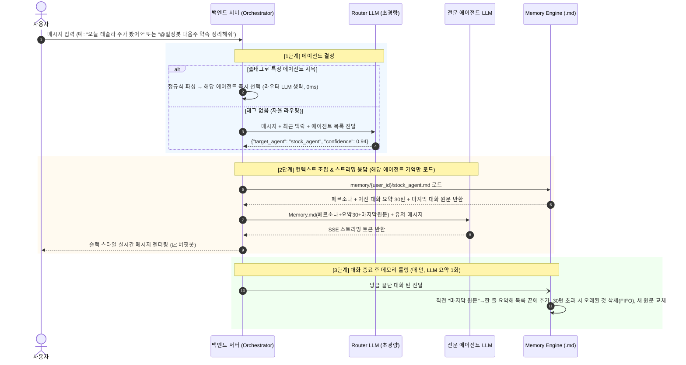

# 🤖 Multi-Agent Slack-like Chat System 설계 문서

> **문서 버전:** v0.6.0
> **작성일:** 2026-09-01
> **최종 수정:** 2026-09-02 (v0.6.0: 구조 대전환 — 커플/공용방/발언자 태깅 전면 폐기, "사용자 1인당 단일 채널 + 전체 에이전트" 모델로 재설계, 메모리 키를 `(사용자, 에이전트)`로 변경, 멀티유저·인증은 향후 확장으로 보류)
> **상태:** Draft (초기 설계 단계)
> **목적:** OpenRouter API와 Markdown 기반 맥락 기억(Memory)을 활용한 슬랙 스타일 다중 에이전트 웹 채팅 시스템 설계

---

## 0. 사용자 및 채널 모델 (User & Channel Model)

본 시스템은 **한 명의 사용자가 여러 에이전트와 함께 있는 단일 채널**을 전제로 한다. 사용자는 이 채널 하나에서 모든 에이전트와 대화하며, **에이전트별 기억**을 각각 가진다.

| 구분 | 내용 |
|---|---|
| **채널** | 사용자당 **1개** (모든 에이전트가 상주하는 단일 채널) |
| **참여자** | 사용자 본인 + 전체 에이전트(주식봇·영화봇·일정봇 …) |
| **호출 방식** | ① `@태그`로 특정 에이전트 직접 호출, ② 태그 없으면 라우터가 자동 판별 |
| **발언자 태깅** | 불필요 (채널 내 사람은 항상 1명) |
| **사용자 간 공유** | **없음** — 사용자끼리 완전 격리, 서로의 대화·기억에 접근 불가 |

### 0.1. 현 단계 범위 (MVP)

* **지금은 단일 사용자(운영자 본인)만 사용**한다. 로그인·회원가입·인증은 **의도적으로 보류**하며, 향후 확장 과제로 둔다(6.1 참조).
* 다만 **데이터 경로는 처음부터 사용자 네임스페이스를 예약**해, 나중에 멀티유저로 확장할 때 구조 변경 없이 사용자만 추가하면 되도록 한다.
* 메모리 키 = **`(사용자, 에이전트)`**. 경로는 `memory/{user_id}/{agent_id}.md`. MVP에서는 `user_id`를 고정값(예: `owner`) 하나로 사용한다.

> **왜 사용자 네임스페이스를 미리 예약하나?** 멀티유저 확장 시 가장 위험한 부분이 "다른 사용자의 기억이 새는 것"이다. 폴더를 처음부터 `memory/{user_id}/`로 나눠두면, 사용자 간 격리가 **구조 자체로 보장**되어 나중에 인증만 얹으면 된다.

---

## 1. 프로젝트 개요 (Overview)

### 1.1. 기획 배경 및 비전
단일 챗봇이 모든 도메인을 처리할 때 발생하는 **프롬프트 오염(Prompt Pollution)**과 **페르소나 희석** 문제를 해결하고, 슬랙(Slack) 워크스페이스처럼 **각 분야의 전문 페르소나를 가진 에이전트들이 상주하는 지능형 멀티 에이전트 단톡방**을 구축한다.

### 1.2. 핵심 차별점
1. **스마트 라우팅 (Smart Routing)**: 사용자가 말하는 주제(주식, 영화, 일정 등)에 따라 적합한 에이전트가 자연스럽게 대화에 개입. `@태그`로 특정 에이전트를 직접 지목할 수도 있다.
2. **에이전트별로 격리된 기억 (Agent-scoped Memory)**: 같은 채널 안이라도 에이전트마다 **독립된 기억**을 가진다. 각 에이전트는 자신과 사용자가 나눈 최근 대화 맥락만 기억해 자연스럽게 이어간다. (기억은 **최근 30턴 슬라이딩 윈도우**로 관리하며, 장기 성향·관점 추적은 향후 확장 과제로 둔다 — 6장 참조)
3. **Markdown(.md) 기반 파일 메모리**: 기억을 `memory/{사용자}/{에이전트}.md` 파일로 관리하여 사람이 직접 검토/수정 가능하고 투명한 관리 지원.
4. **OpenRouter 모델 티어링**: 작업 목적(라우팅, 대화, 메모리 요약)에 따라 최적의 모델(속도/비용/추론력)을 유연하게 분기 사용.

---

## 2. 시스템 아키텍처 및 대화 흐름 (Architecture & Flow)

### 2.1. 전체 대화 처리 파이프라인



> **에이전트 격리**: 로드/갱신 모두 **응답한 에이전트의 `memory/{user_id}/{agent}.md`에만** 작용한다. 각 에이전트는 자신의 기억만 보고, 다른 에이전트의 기억은 참조하지 않는다.

> **봇→봇 무한루프 차단**: 라우터는 **사람 메시지에만** 트리거된다. 에이전트의 발언은 라우터를 재호출하지 않으며, 한 "사람 턴"당 에이전트 발언 횟수에 상한(예: 3회)을 둔다.

---

## 3. 핵심 모듈 상세 설계

### 3.1. 스마트 라우터 (Message Router)
사용자의 입력을 분석하여 응답할 에이전트를 판별한다.

* **동작 모드**:
  1. **수동 멘션 모드 (`@영화봇`)**: 정규식 파싱으로 라우터 LLM 호출을 건너뛰고 해당 에이전트에 즉시 전달 (지연 시간 0ms). **사용자가 특정 에이전트에게 직접 말을 걸고 싶을 때 사용.**
  2. **자율 라우팅 모드**: 태그가 없으면 초경량 고속 LLM을 통해 어떤 에이전트가 응답할지 판별.
* **라우터 입출력 스키마**:
  ```json
  // Request Prompt에 전달되는 에이전트 메타데이터
  {
    "agents": [
      {"id": "stock_agent", "name": "버핏봇", "domain": "주식, 코인, 거시경제, 기업 재무"},
      {"id": "movie_agent", "name": "씨네봇", "domain": "영화, OTT 드라마, 영화제, 영화 평점"},
      {"id": "schedule_agent", "name": "일정봇", "domain": "일정, 약속, 기념일, 할 일 플랜"}
    ]
  }
  ```
  ```json
  // Router LLM Response
  {
    "target_agent": "stock_agent",
    "confidence": 0.94,
    "reason": "사용자가 특정 종목의 주가 및 투자 관련 질문을 함",
    "co_agents": ["movie_agent"] // (선택, Phase 3 티키타카용) 부가 코멘트 가능한 에이전트
  }
  ```

---

### 3.2. 에이전트 정의 및 페르소나 (Agent Profiles)

에이전트 목록은 설정 파일(`config/agents.json`)로 유연하게 추가/관리한다. 에이전트 정의는 사용자와 무관하게 하나이며, **실제 메모리 파일 경로는 런타임에 현재 사용자를 붙여 결정**한다: `memory/{user_id}/{agent_id}.md`.

```json
[
  {
    "id": "stock_agent",
    "name": "버핏봇",
    "avatar": "/avatars/stock.png",
    "badge": "📈 금융/투자",
    "mention": "@버핏봇",
    "model": "anthropic/claude-3.5-sonnet",
    "system_prompt": "당신은 냉철하면서도 친근한 주식/투자 어드바이저입니다. 최근 대화 맥락을 바탕으로 자연스럽게 이어서 대화합니다.",
    "memory_template": "memory/{user_id}/stock_agent.md"
  },
  {
    "id": "movie_agent",
    "name": "씨네봇",
    "avatar": "/avatars/movie.png",
    "badge": "🎬 영화/콘텐츠",
    "mention": "@씨네봇",
    "model": "openai/gpt-4o",
    "system_prompt": "당신은 감성적인 영화 평론가이자 덕후입니다. 최근 대화 맥락을 바탕으로 맞춤형 추천과 감상을 나눕니다.",
    "memory_template": "memory/{user_id}/movie_agent.md"
  },
  {
    "id": "schedule_agent",
    "name": "일정봇",
    "avatar": "/avatars/schedule.png",
    "badge": "📅 일정 비서",
    "mention": "@일정봇",
    "model": "openai/gpt-4o-mini",
    "system_prompt": "당신은 사용자의 일정·약속·기념일을 챙기는 비서입니다. 최근 대화 맥락을 바탕으로 일정을 정리하고 제안합니다.",
    "memory_template": "memory/{user_id}/schedule_agent.md"
  }
]
```

> `{user_id}`는 런타임에 현재 사용자로 치환된다. **MVP에서는 고정값 `owner` 하나만 사용**하며, 멀티유저 확장 시 실제 사용자 식별자로 대체된다. `system_prompt`는 각 사용자의 에이전트 파일이 처음 생성될 때 **"1. 페르소나" 섹션의 초기값**으로 복사된다(3.3.2).

---

### 3.3. Markdown 기반 기억 시스템 (Memory Engine)

기억은 **사용자×에이전트 매트릭스**로 분리되어, 사용자마다·에이전트마다 완전히 다른 기억을 가진다. 각 기억 파일은 **딱 3부분(페르소나 + 이전 대화 요약 + 마지막 대화 원문)**으로만 구성되는 **최소 구조**를 채택한다. (성향·관점 추적 같은 심화 기억은 6장 "향후 확장"으로 미룬다.)

#### 📁 파일 구조 원칙 — "사용자 폴더 × 에이전트 파일" (메모리 키 = 사용자 + 에이전트)

사용자마다 폴더를 두고, 그 안에 에이전트별 `.md` 파일을 둔다. 사용자 간 파일이 물리적으로 분리되므로 **사용자 격리가 구조 자체로 보장**된다. (MVP에서는 `owner/` 폴더 하나만 존재한다.)

```
memory/
└── owner/               # 현재 사용자 (MVP는 이 하나만)
    ├── stock_agent.md
    ├── movie_agent.md
    └── schedule_agent.md

# (향후 멀티유저 확장 시)
# memory/
# ├── owner/
# ├── alice/
# └── bob/
#     ├── stock_agent.md
#     └── ...
```

#### 🔒 3.3.1. 사용자 간 기억 완전 격리 정책

**한 사용자의 기억은 다른 어떤 사용자에게도 흐르지 않는다.**

* **로드 격리**: 봇 응답 시 오직 **현재 사용자의 파일 하나만** 읽는다.
* **갱신 격리**: 롤링 갱신은 대화가 발생한 **그 사용자의 파일에만** 쓴다.
* **경로 기반 강제**: 모든 메모리 접근은 `memory/{현재 인증된 user_id}/…` 하위로만 허용하고, 경로 조작(`../` 등)을 차단한다. (멀티유저 도입 시 인증된 세션의 `user_id`만 사용하도록 강제.)

> **MVP 참고**: 지금은 사용자가 1명이라 실질적 격리 대상이 없지만, 폴더 구조와 접근 규칙을 처음부터 지켜 두면 멀티유저 확장 시 격리 로직을 새로 짜지 않아도 된다.

#### 📄 3.3.2. 메모리 마크다운 구조 (3부분 고정)

모든 `memory/{사용자}/{에이전트}.md`는 아래 3개 섹션만 가진다. 채널 내 사람이 항상 1명이므로 **발언자 태그는 사용하지 않는다.**

```markdown
# stock_agent · user: owner
- Last Updated: 2026-09-02 21:31:00

## 1. 페르소나
당신은 냉철하면서도 친근한 주식/투자 어드바이저입니다.
사용자의 과거 대화 맥락을 바탕으로 자연스럽게 이어서 대화합니다.

## 2. 이전 대화 요약 (최근 30턴, 오래된 순서 → 초과 시 맨 위부터 삭제)
1. [08-30] 엔비디아 실적 긍정 평가, 장기 보유 의향
2. [08-31] 비트코인 조정장 문의, 분할 매수 조언
3. [09-01] 테슬라 FSD 지연 실망, 비중 축소 언급
   ... (최대 30줄)

## 3. 마지막 대화 원문 (직전 1턴 전체)
[user] 테슬라 급락하면 살까 고민돼.
[stock_agent] 지지선이 $200 부근이라 거기서 분할 매수 관점이 좋아 보여요.
```

* **① 페르소나**: 에이전트 정체성/말투. `config/agents.json`의 `system_prompt`를 사용자 파일에 복사해 시작하며, 대화 중에는 바뀌지 않는다.
* **② 이전 대화 요약**: 1턴 = "사용자 메시지 1개 + 봇 응답 1개". 각 턴을 **한 줄**로 요약해 시간순으로 쌓고, **30턴을 넘으면 가장 오래된 줄부터 삭제(FIFO)**한다. → 파일 크기 상한 고정.
* **③ 마지막 대화 원문**: 직전 1턴의 **전체 원문**. 최신 맥락을 세부까지 정확히 기억하기 위함.

#### 🧩 3.3.3. 프롬프트 조립

봇 호출 시 **응답 에이전트의 파일 하나**를 그대로 읽어 `[페르소나 + 이전 요약 30턴 + 마지막 원문] + 방금 유저 메시지`로 조립한다. 추가 가공이 없어 단순하고, 사용자·에이전트 격리도 자동으로 지켜진다.

---

### 3.4. 메모리 롤링(갱신) 전략

성향 추출·귀속 판별 같은 복잡한 로직 없이, **매 턴 끝날 때 "요약 한 줄 추가 + FIFO 삭제 + 마지막 원문 교체"**만 수행한다.

#### 3.4.1. 롤링 메커니즘 (매 턴)

```
새 대화 턴 종료 (유저 메시지 + 봇 응답)
   ↓
① 직전 "3. 마지막 대화 원문" → 한 줄로 요약 → "2. 이전 대화 요약" 목록 끝에 추가
   ↓
② 요약이 30턴을 초과하면 → 가장 오래된 1줄 삭제 (FIFO, 그냥 버림)
   ↓
③ 방금 끝난 턴을 새 "3. 마지막 대화 원문"으로 교체
```

* **요약 대상은 밀려나는 1턴뿐**: 매 턴 요약 LLM 호출 ≤ 1회. 30줄 전체를 다시 요약하지 않는다.
* **페르소나 섹션은 건드리지 않는다.** 롤링은 ②·③ 섹션에만 작용.
* **비동기 백그라운드**: 요약·파일 쓰기는 응답 스트리밍이 끝난 뒤 뒤에서 처리 → 사용자 응답 지연 없음.

#### 3.4.2. 동시성 & 안전장치

* **(사용자, 에이전트) 파일 단위 락**: 같은 에이전트에게 연달아 말해도 턴이 서버에서 직렬화되어 파일 쓰기가 순차 처리된다. 에이전트가 다르면 파일이 달라 애초에 경쟁하지 않는다.
* **수동 편집 존중**: UI Inspector에서 사람이 편집 중이면 롤링 쓰기를 대기시킨다.
* **(선택) 스냅샷**: 쓰기 전 파일을 `memory/.history/{user_id}/{agent}/{ts}.md`로 백업하면 되돌리기가 쉽다. MVP에선 생략 가능.

#### 3.4.3. 비용(토큰) — "파일 수정은 공짜, 요약 LLM만 과금"

* **파일 쓰기 자체는 토큰 0** (디스크 I/O). 토큰은 요약 LLM 호출에서만 발생.
* 매 턴 요약 1회: 입력 ≈ 마지막 원문(~500토큰) + 요약 지시, 출력 ≈ 한 줄(~30토큰). **가성비 모델(gpt-4o-mini/deepseek)** 사용 시 **메시지당 1원 미만**.
* 프롬프트 읽기 쪽도 상한 고정: 페르소나(~300) + 요약 30줄(~600) + 마지막 원문(~500) ≈ **1,500토큰 내외**로 항상 일정. → **토큰 폭발 없음.**

---

### 3.5. OpenRouter 모델 티어링 전략

비용과 속도, 응답 품질을 최적화하기 위해 파이프라인 단계별로 모델을 분리한다.

```
┌─────────────────────────────────────────────────────────────────┐
│                       OpenRouter API Router                     │
├───────────────────┬─────────────────────────────────────────────┤
│ 1. Routing Engine │ google/gemini-2.0-flash-001 (초고속, 저비용) │
├───────────────────┼─────────────────────────────────────────────┤
│ 2. Chat Personas  │ anthropic/claude-3.5-sonnet                 │
│                   │ openai/gpt-4o                               │
│                   │ deepseek/deepseek-chat                      │
├───────────────────┼─────────────────────────────────────────────┤
│ 3. Memory Worker  │ openai/gpt-4o-mini / deepseek-chat (가성비)  │
└───────────────────┴─────────────────────────────────────────────┘
```

---

## 4. UI/UX 디자인 사양 (Slack-like)

```
┌─────────────────┬───────────────────────────────────────────────┬────────────────────────┐
│ Agents           │ # my-agents (단일 채널)                        │ 🧠 Memory Inspector      │
├─────────────────┼───────────────────────────────────────────────┼────────────────────────┤
│ 상주 에이전트    │ 👤 [나] 21:30                                 │ [📈 버핏봇]             │
│ • 📈 버핏봇      │   "테슬라 이번 분기 실적 어떨 것 같아?"       │                        │
│ • 🎬 씨네봇      │                                               │ ① 페르소나              │
│ • 📅 일정봇      │ 📈 [버핏봇] 21:31                            │  냉철+친근 투자 어드바이저│
│                 │   "가이던스가 관건이에요. 최근에 비중 줄이신  │ ② 이전 요약 (최근 30턴) │
│ (클릭 시 해당    │    걸 감안하면 실적 확인 후 판단이..."        │  1. 엔비디아 긍정 평가  │
│  봇 기억 검사)   │                                               │  2. 비트코인 분할 매수  │
│                 │ 👤 [나] 21:33                                 │  ... (최대 30줄)        │
│ 💡 @태그로 특정  │   "@일정봇 다음주 데이트 일정 정리해줘"        │ ③ 마지막 원문           │
│  봇 직접 호출    │                                               │  직전 1턴 전체          │
│                 │ 📅 [일정봇] 21:33                            │ [✏️ 이 기억 수정]       │
│                 │   "다음주 일정 정리해드릴게요! ..."           │                        │
├─────────────────┼───────────────────────────────────────────────┴────────────────────────┤
│ Status: Active  │ 💬 메시지를 입력하세요... (@버핏봇 으로 특정 봇 호출 가능)            │
└─────────────────┴────────────────────────────────────────────────────────────────────────┘
```

* **채널 구성**: 채널은 **하나**(`# my-agents`)이며, 모든 에이전트가 이 채널에 상주한다. 좌측 사이드바는 상주 에이전트 목록으로, 클릭하면 해당 봇의 기억을 우측 Inspector에서 확인한다.
* **호출 방식**: 그냥 말하면 라우터가 적합한 봇을 골라 응답하고, `@버핏봇`처럼 태그하면 그 봇에게 직접 전달된다.
* **메인 특징**:
  * **에이전트별 비주얼 아이덴티티**: 고유 아바타, 닉네임 색상, 도메인 뱃지.
  * **타이핑 인디케이터**: *"버핏봇이 재무제표와 과거 대화를 회상하는 중..."*
  * **실시간 토큰 스트리밍 (SSE/WebSocket)**: 부드러운 타자 효과.
  * **Memory Inspector 사이드바**: 우측 패널에서 선택한 에이전트의 `.md`를 실시간 확인/수정.

---

## 5. 단계별 개발 로드맵 (Roadmap)

### Phase 1: MVP 코어 파이프라인 검증 (단일 사용자)
- [ ] OpenRouter API 클라이언트 연동
- [ ] **단일 사용자(`owner`) 고정** + 단일 채널 채팅 로그
- [ ] 기본 라우터 구현 (Gemini Flash 기반 자율 라우팅, 사람 메시지에만 트리거)
- [ ] `@에이전트` 수동 멘션 파싱 (라우터 생략, 직접 호출)
- [ ] **사용자×에이전트 메모리** 읽기: `memory/{user_id}/{에이전트}.md` 로드 → 프롬프트 조립
- [ ] 간단한 웹 채팅 인터페이스 (스트리밍 지원)

### Phase 2: 슬랙 스타일 고도화 & 비동기 메모리 갱신
- [ ] 슬랙 스타일 UI 컴포넌트 (에이전트 목록, 아바타, 멘션, 타이핑 인디케이터)
- [ ] **메모리 롤링 워커**: 매 턴 "요약 한 줄 추가 + 30턴 FIFO 삭제 + 마지막 원문 교체" (3.4.1)
- [ ] **동시성 제어**: (사용자, 에이전트) 파일 단위 락, (선택) 쓰기 전 스냅샷
- [ ] 우측 사이드바 "Memory Inspector" (직접 편집 기능, 편집-워커 충돌 방지)
- [ ] 봇 발언 상한(사람 턴당 N회) 및 봇→봇 루프 차단

### Phase 3: 인터랙션 확장 & 편의 기능
- [ ] 에이전트 간 티키타카 (Multi-agent Turn-taking)
- [ ] 외부 툴 연동 (주식 현재가 실시간 조회, 영화 예고편 링크 등 Tool Calling)

### Phase 4: 멀티유저 확장 (향후)
- [ ] 인증/회원 관리 (로그인, 세션)
- [ ] `user_id` 동적 바인딩 + 사용자별 `memory/{user_id}/` 자동 프로비저닝
- [ ] 경로 기반 접근 제어 강제 (인증된 세션의 `user_id` 하위만 접근 허용)

---

## 6. 결론 및 기대 효과

본 아키텍처는 **Markdown 기반의 투명한 기억 관리**, **경량 라우터 기반의 페르소나 분리**, 그리고 **사용자×에이전트 기억 격리**를 결합하여, 단순 질의응답을 넘어 **"나를 최근 맥락까지 기억하고 관심사를 공유하는 AI 동료들과의 단톡방"** 경험을 제공한다. 단일 채널에 여러 전문 에이전트를 상주시키되, `@태그`로 원하는 봇을 직접 지목할 수 있어 자연스러움과 정밀함을 모두 확보한다.

### 6.1. 향후 확장 과제 (현 버전에서 의도적으로 제외)

MVP 단순성을 위해 아래 기능은 **최소 구조(3.3.2)로는 다루지 않고** 후순위로 둔다. 필요해질 때 3부분 구조/단일 사용자 구조 위에 얹는 방식으로 도입한다.

* **멀티유저 & 인증 (최우선 확장)**: 현재는 단일 사용자(`owner`) 고정. 로그인·세션·회원 관리를 도입하고, `user_id`를 동적으로 바인딩한다. 메모리 폴더가 이미 `memory/{user_id}/`로 분리되어 있어 격리 로직 재작성 없이 인증만 얹으면 된다(Phase 4).
* **장기 성향/관점 추적**: 30턴을 넘어가면 잊는 현재 구조의 한계. "몇 달 전 발언"을 기억하려면 별도의 프로필/견해 섹션(Upsert + append-only)과 추출 워커가 필요하다.
* **요약 아카이브**: FIFO로 버리는 오래된 요약을 삭제 대신 별도 아카이브 파일로 압축 보관.
* **대화 원문 로그 분리 저장**: 프롬프트 미포함 원문 전체를 DB/파일에 보관(감사·재추출용).
* **모델 ID 현행화**: 3.5의 모델 목록을 OpenRouter 최신 모델로 주기적으로 갱신.
