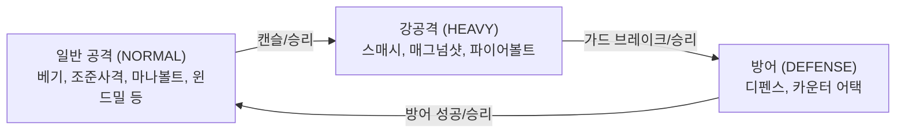
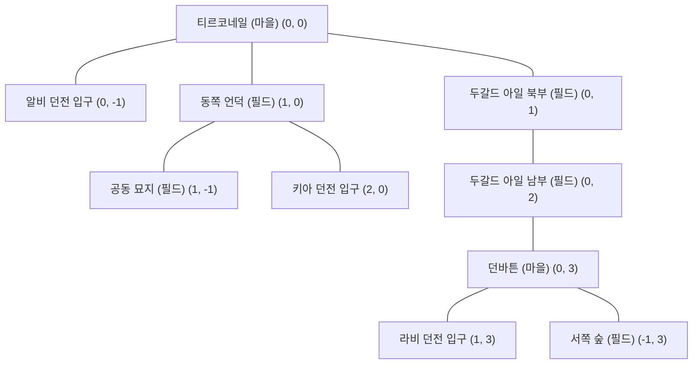

# ⚔️ MyRPG — 종합 게임 시스템 가이드 (Game System Guide)

> **이 문서는 MyRPG의 전체 게임 시스템, 수식, 밸런스 공식, 데이터 테이블을 정리한 개발자 및 사용자용 종합 가이드입니다.**  
> 모든 수치는 현재 Java 소스코드 및 `src/main/resources/data/*.json` 데이터에 기반하여 작성되었습니다.

---

## 📌 목차
1. [게임 개요 및 아키텍처](#1-게임-개요-및-아키텍처)
2. [캐릭터 & 스탯 성장 시스템](#2-캐릭터--스탯-성장-시스템)
3. [전투 시스템 & 데미지 메커니즘](#3-전투-시스템--데미지-메커니즘)
4. [스킬 시스템 & 승급 규칙](#4-스킬-시스템--승급-규칙)
5. [아이템, 장비 & 내구도 시스템](#5-아이템-장비--내구도-시스템)
6. [경제 & 마을 편의시설](#6-경제--마을-편의시설)
7. [월드 맵 & NPC 시스템](#7-월드-맵--npc-시스템)
8. [몬스터 & 전리품 도감](#8-몬스터--전리품-도감)
9. [프로시저럴 던전 시스템](#9-프로시저럴-던전-시스템)

---

## 1. 게임 개요 및 아키텍처

MyRPG는 **마비노기(Mabinogi)의 클래식한 감성과 시스템(가위바위보 전투, 스킬 랭크업, 장비 내구도, 24시간 환생, 던전 탐색 등)**을 웹 환경에 맞춰 턴제로 재해석한 RPG 게임입니다.

- **백엔드**: Java 21, Spring Boot 4.0, Spring Data JPA, H2 Database (File-based: `data/myrpg`)
- **프론트엔드/UI**: Thymeleaf Fragment 스왑, Vanilla CSS/JS, Lucide Icons, SPA 느낌의 실시간 DOM 부분 갱신
- **핵심 철학**:
  - **결정적 도메인 로직**: 전투 데미지, 상성 판정, 스탯 성장 등 순수 도메인 엔진 분리
  - **데이터 주도 설계 (Data-Driven)**: 아이템, 스킬, 몬스터, 맵, NPC, 던전 정보의 JSON 외부화 (`src/main/resources/data/`)

---

## 2. 캐릭터 & 스탯 성장 시스템

### 2.1. 바이탈 (Vital) & 5대 스탯 (Stats)
캐릭터는 3가지 기본 바이탈과 5가지 스탯을 가집니다.

| 항목 | 구분 | 설명 |
|---|---|---|
| **HP (생명력)** | Vital | 0이 되면 사망 상태가 되며 티르코네일로 리스폰 |
| **MP (마나)** | Vital | 마법 스킬(마나 볼트, 아이스볼트, 파이어볼트) 사용 시 소모 |
| **Stamina (스태미나)** | Vital | 근접/활/방어 스킬(베기, 조준사격, 디펜스 등) 사용 시 소모 |
| **STR (근력)** | Stat | 근접 무기 착용 시 공격력 결정의 기본 스탯 |
| **DEX (솜씨)** | Stat | 활 무기 착용 시 공격력 결정의 기본 스탯 |
| **INT (지력)** | Stat | 완드/스태프 착용 시 마법 공격력 결정의 기본 스탯 |
| **DEF (방어력)** | Stat | 피격 시 정액 감산(Subtractive)으로 데미지를 경감 |
| **Critical (치명타)** | Stat | 공격/반격 시 1.5배 치명타 발동 확률 (`0.1%` 단위 정수, 예: 50 = 5.0%) |

---

### 2.2. 3대 재능 (Talent Type)
신규 캐릭터 생성 또는 환생 시 3가지 재능 중 하나를 선택할 수 있습니다.

| 재능 (`TalentType`) | 주 스탯 성장 | 보조 성장 | 재능 데미지 보너스 | 공격력 재능 계수 | 고유 특성 |
|---|---|---|---|---|---|
| **근접전투 (`MELEE`)** | STR +2 / Lv | HP +5 / Lv | 근접 스킬 +10% | **1.00** | 균형 잡힌 안정적인 근접 전투 |
| **활 (`ARCHERY`)** | DEX +2 / Lv | 치명타 +0.1%p / Lv | 원거리 스킬 +10% | **0.85** | **전투 1턴 무조건 선제공격 (1st Strike)** |
| **마법 (`MAGIC`)** | INT +2 / Lv | MP +5 / Lv | 마법 스킬 +10% | **1.20** | 높은 깡뎀 배율, **10% 캐스팅 실패 확률** |

---

### 2.3. 레벨별 스탯 성장 공식 (`StatProgression`)
캐릭터의 기본 스탯은 저장되지 않고 레벨과 재능으로부터 매번 계산됩니다 (장비 및 스킬 랭크업 보너스 별도 가산).

$$\text{STR} = 10 + 3 \times (\text{Lv} - 1) + (\text{MELEE 선택 시 } 2 \times (\text{Lv} - 1))$$
$$\text{DEX} = 10 + 3 \times (\text{Lv} - 1) + (\text{ARCHERY 선택 시 } 2 \times (\text{Lv} - 1))$$
$$\text{INT} = 10 + 3 \times (\text{Lv} - 1) + (\text{MAGIC 선택 시 } 2 \times (\text{Lv} - 1))$$
$$\text{DEF} = 5 + 1 \times (\text{Lv} - 1)$$
$$\text{Critical} = 50 + 3 \times (\text{Lv} - 1) + (\text{ARCHERY 선택 시 } 1 \times (\text{Lv} - 1)) \quad [0.1\% \text{ 단위}]$$
$$\text{HP Max} = 100 + 10 \times (\text{Lv} - 1) + (\text{MELEE 선택 시 } 5 \times (\text{Lv} - 1))$$
$$\text{MP Max} = 100 + 10 \times (\text{Lv} - 1) + (\text{MAGIC 선택 시 } 5 \times (\text{Lv} - 1))$$
$$\text{Stamina Max} = 100 + 10 \times (\text{Lv} - 1)$$

#### 레벨별 기본 스탯 기준표 (재능/장비/스킬 보너스 제외 순수 기저값)
| 레벨 (Lv) | 주스탯 (STR/DEX/INT) | 방어력 (DEF) | 바이탈 기본 (HP/MP/Stamina) | 치명타 (Critical) |
|---|---|---|---|---|
| **Lv 1** | 10 | 5 | 100 | 5.0% (50) |
| **Lv 10** | 37 | 14 | 190 | 7.7% (77) |
| **Lv 30** | 97 | 34 | 390 | 13.7% (137) |
| **Lv 50** | 157 | 54 | 590 | 19.7% (197) |
| **Lv 100 (최대)** | 307 | 104 | 1090 | 34.7% (347) |

---

### 2.4. 경험치 곡선, 사망 패널티 및 환생
- **경험치 곡선 (`ExperiencePolicy`)**:
  $$\text{다음 레벨 필요 경험치} = 100 \times \text{현재 레벨}^2$$
  *(예: Lv 1 $\rightarrow$ Lv 2: 100 EXP, Lv 10 $\rightarrow$ Lv 11: 10,000 EXP, Lv 50 $\rightarrow$ Lv 51: 250,000 EXP)*
- **레벨업 보상**: 레벨당 **AP (어빌리티 포인트) +1** 지급 및 바이탈(HP/MP/Stamina) 100% 풀 회복
- **사망 패널티 (`die`)**:
  - 현재 레벨 다음 필요 경험치의 **10% 차감** (0 미만으로 내려가지 않음, 레벨 다운 없음)
  - 소지 골드 및 보유 아이템은 **100% 보존**
  - HP/MP/Stamina 100% 풀 회복 후 시작 마을인 **티르코네일로 강제 귀환(리스폰)**
- **환생 시스템 (`Rebirth`)**:
  - **쿨다운**: 마지막 환생 시점 기준 **24시간** (첫 환생은 제한 없음)
  - **효과**: 현재 레벨 Lv 1 / 현재 EXP 0으로 리셋, **누적 레벨 +1, AP +1 지급**, 재능 재선택 가능
  - **보존**: 스킬 랭크 및 수련치, 인벤토리/은행 골드/장비는 그대로 유지

---

### 2.5. 신규 캐릭터 기본 세팅 및 지급품 (`CharacterService`, `InventoryService`)
새로운 캐릭터를 생성할 때 다음 아이템과 스킬이 기본 지급됩니다:

1. **기본 스킬 4종 (F랭크)**:
   - 근접: `베기(slash)` F랭크
   - 원거리: `조준 사격(aimed_shot)` F랭크
   - 마법: `마나 볼트(mana_bolt)` F랭크
   - 공용: `디펜스(defense)` F랭크
2. **기본 착용 장비 6종 (내구도 20/20)**:
   - `초보자용 한손검`, `초보자용 방패`, `초보자용 갑옷`, `초보자용 투구`, `초보자용 장갑`, `초보자용 부츠`
3. **인벤토리 보유(미장착) 무기 4종 (내구도 20/20)**:
   - `초보자용 양손검`, `초보자용 활`, `초보자용 완드`, `초보자용 스태프`
4. **기본 소비 포션 3종 (각 5개씩)**:
   - `생명력 30 포션` 5개, `마나 30 포션` 5개, `스태미나 30 포션` 5개
5. **초기 상태**:
   - 레벨: Lv 1, 누적 레벨: 1, 경험치: 0, 골드: 0G, 시작 위치: 티르코네일 (`tir-chonaill`)

---

## 3. 전투 시스템 & 데미지 메커니즘

### 3.1. 가위바위보 상성 (RPS: Rock-Paper-Scissors)
MyRPG의 전투는 턴마다 플레이어와 몬스터가 행동을 선택하여 맞부딪히는 상성 턴제 구조입니다.



### 3.2. 9칸 상성 매트릭스 상세 규칙 (`BattleResolver`)

| 플레이어 행동 | 몬스터 행동 | 상성 결과 | 플레이어 피해 (몬스터 $\rightarrow$ 플레이어) | 몬스터 피해 (플레이어 $\rightarrow$ 몬스터) | 상세 판정 규칙 |
|---|---|---|---|---|---|
| **일반 (NORMAL)** | **일반 (NORMAL)** | DRAW (무승부) | 몬스터 공격력의 **50%** | 플레이어 스킬 배율의 **50%** (멀티히트 분할) | 서로 맞부딪혀 50% 피해 |
| **일반 (NORMAL)** | **강공격 (HEAVY)** | **WIN (승리)** | **0 (피해 없음)** | 플레이어 스킬 배율의 **100%** | 일반 공격이 강공격 준비 동작을 캔슬 |
| **일반 (NORMAL)** | **방어 (DEFENSE)** | **LOSE (패배)** | 몬스터 반격 피해 (일반 30%, 보스 50%) | 경감률 적용 후 잔여 피해 (일반 60%, 보스 40%) | 몬스터 방어에 막혀 피해 경감 + 몬스터 반격 피격 |
| **강공격 (HEAVY)** | **일반 (NORMAL)** | **LOSE (패배)** | 몬스터 공격력의 **100%** | **0 (피해 없음)** | 일반 공격에 캔슬당해 공격 실패 |
| **강공격 (HEAVY)** | **강공격 (HEAVY)** | DRAW (무승부) | 몬스터 강공격(150%)의 **50%** | 플레이어 스킬 배율의 **50%** | 서로 강하게 맞부딪힘 |
| **강공격 (HEAVY)** | **방어 (DEFENSE)** | **WIN (승리)** | **0 (반격 무효)** | 플레이어 스킬 배율의 **100% (완전 관통)** | 방어를 통째로 부수고 관통 데미지 |
| **디펜스 (DEFENSE)** | **일반 (NORMAL)** | **WIN (승리)** | **0 (100% 완전 방어)** | **0 (반격 없음)** | 일반 공격을 완벽히 방어 (스태미나 소모 5$\rightarrow$1) |
| **디펜스 (DEFENSE)** | **강공격 (HEAVY)** | **LOSE (패배)** | 몬스터 강공격(150%) **100% 관통 피격** | **0 (반격 없음)** | 디펜스가 깨지며 강공격 피해를 전부 받음 |
| **디펜스 (DEFENSE)** | **방어 (DEFENSE)** | DRAW (교착) | **0** | **0** | 서로 방어 자세로 대치 (0 피해) |
| **카운터 (`counter_attack`)** | **일반 (NORMAL)** | **WIN (승리)** | **0 (100% 완전 회피)** | **상대 공격력의 100%~200% 반격** | 상대 공격을 흘려내며 적 공격력 비례 반격 |
| **카운터 (`counter_attack`)** | **강공격 (HEAVY)** | **WIN (승리)** | **0 (100% 완전 회피)** | **상대 공격력의 100%~200% 반격** | 몬스터 스매시도 완벽히 흘려내어 카운터 |
| **카운터 (`counter_attack`)** | **방어 (DEFENSE)** | DRAW (교착) | **0** | **0** | 서로 대치 상태 (헛방 교착) |

---

### 3.3. 데미지 계산 공식 (Subtractive Damage Formula)

전투 데미지는 **감산형(방어력 차감) + 최소 1 보장 + 독립 다단 히트** 방식을 따릅니다.

#### 1단계: 플레이어 공격력 산출 (`BattleService.attackPower`)
$$\text{공격력} = \text{round}(\text{주스탯} \times \text{재능계수})$$
- **주스탯** = 레벨 기본 스탯 + 장착 장비 보너스 + 스킬 랭크업 누적 보너스
  - 근접 스킬 또는 무기 미착용 시: **STR** 기반
  - 활 스킬 착용 시: **DEX** 기반
  - 마법 스킬 착용 시: **INT** 기반
- **재능계수**: 근접(MELEE) 1.00 / 활(ARCHERY) 0.85 / 마법(MAGIC) 1.20 (무기 미착용/공용은 1.00)

#### 2단계: 히트(Hit)별 기본 피해
$$\text{기본 피해(히트)} = \max\left(1, \left\lfloor \frac{\text{공격력} \times \text{히트당 배율\%}}{100} \right\rfloor - \text{대상 방어력(DEF)}\right)$$

#### 3단계: 상성 및 크리티컬 보정
$$\text{보정 피해(히트)} = \text{기본 피해} \times \text{상성계수} \times (\text{크리티컬 발동 ? } 1.5 : 1.0)$$
- **상성계수**: 승리 1.0 / 무승부 0.5 / 패배 0.0 (또는 방어 경감률 잔여분 `1 - blockRate%`)
- **재능 일치 보너스**: 사용하는 스킬의 재능 계열(`SkillTalent`)이 현재 캐릭터의 선택 재능(`TalentType`)과 일치할 경우 **데미지 +10% 가산**
- **크리티컬 판정**: `0 ~ 999` 난수 < `(캐릭터 Critical + 스킬 CritBonus)` 일 때 발동 $\rightarrow$ **1.5배**

#### 4단계: 최종 난수 편차 (Variance) 및 합산
$$\text{히트 피해} = \max(1, \text{round}(\text{보정 피해} \times \text{rand}(0.90 \sim 1.10)))$$
$$\text{최종 피해} = \sum_{i=1}^{\text{hitCount}} \text{히트 피해}_i$$

> **다단 히트 (`hitCount` $\ge$ 2)의 특성**:  
> 대상 방어력이 **히트마다 매번 차감**되므로, 방어력이 높은 몬스터에게는 단타(스매시 등)가 유리하고, 방어력이 낮은 몬스터에게는 다단 히트(윈드밀 3타, 애로우 리볼버 4타 등)가 안정적이고 높은 총합 데미지를 냅니다.

---

### 3.4. 전투 특수 룰 & AI

1. **몬스터 AI 행동 결정 알고리즘 (`MonsterAiService`)**:
   - 몬스터는 매 턴 `0 ~ 99` 난수를 굴려 다음 고정 가중치 분포로 행동을 결정합니다:
     - **일반 공격 (`NORMAL`)**: **34%** (난수 0 ~ 33)
     - **강공격 (`HEAVY`)**: **33%** (난수 34 ~ 66)
     - **방어 (`DEFENSE`)**: **33%** (난수 67 ~ 99)
2. **활 1턴 선제 공격 (1st Strike)**: 활 장착 시 첫 번째 턴은 몬스터 상성과 무관하게 100% 무조건 먼저 명중합니다.
3. **마법 10% 캐스팅 실패**: 마법 공격 스킬은 10% 확률로 캐스팅에 실패하여 0 피해를 입히고 몬스터에게 일방 피격당합니다.
4. **무기 내구도 소모**: 공격 스킬(방어 스킬 제외)을 사용할 때마다 장착 무기 내구도가 **0.05** 감소합니다 (20턴 사용 시 내구도 1 감소). 내구도가 0이 되면 전투 중 자동으로 장착 해제됩니다.
5. **선후공 및 동시 타격**: 동일 상성(무승부) 시 50:50 확률로 선후공이 결정되며, 선공 공격으로 상대가 사망하면 후공 공격은 취소됩니다.
6. **도망 (`Flee`)**: 50% 확률로 성공하여 전투에서 이탈합니다. 실패 시 몬스터에게 일방 공격을 1회 받습니다.
7. **기습 전투 (`Ambush`)**:
   - 던전의 연쇄 전투(10% 확률) 또는 필드 기습 조우 시 `BattleState.ambush = true`로 설정되어 전투가 시작됩니다.

---

## 4. 스킬 시스템 & 승급 규칙

### 4.1. 스킬 랭크 체계 (16단계, 승급 15구간)
스킬은 `F` 랭크에서 시작하여 `MASTER`까지 총 **16개 랭크**(F → E → D → C → B → A → 9 → 8 → 7 → 6 → 5 → 4 → 3 → 2 → 1 → MASTER)로 승급합니다.

$$\text{F} \rightarrow \text{E} \rightarrow \text{D} \rightarrow \text{C} \rightarrow \text{B} \rightarrow \text{A} \rightarrow \text{9} \rightarrow \text{8} \rightarrow \text{7} \rightarrow \text{6} \rightarrow \text{5} \rightarrow \text{4} \rightarrow \text{3} \rightarrow \text{2} \rightarrow \text{1} \rightarrow \text{MASTER}$$

---

### 4.2. 랭크업 요구치 및 AP 비용 테이블 (`SkillRankPolicy`)
다음 랭크로 승급하려면 **사용 횟수**, **막타 처치 횟수**, **소모 AP**를 모두 만족해야 합니다.  
*(단, 디펜스와 카운터 어택 등 방어 스킬은 처치 횟수 조건이 영구 면제됩니다.)*

| 승급 구간 | 필요 사용 횟수 | 필요 처치 횟수 (딜스킬) | 소모 AP | 누적 소모 AP |
|---|---|---|---|---|
| **F $\rightarrow$ E** | 5회 | 1회 | **1 AP** | 1 AP |
| **E $\rightarrow$ D** | 10회 | 3회 | **2 AP** | 3 AP |
| **D $\rightarrow$ C** | 20회 | 6회 | **3 AP** | 6 AP |
| **C $\rightarrow$ B** | 35회 | 10회 | **4 AP** | 10 AP |
| **B $\rightarrow$ A** | 60회 | 18회 | **5 AP** | 15 AP |
| **A $\rightarrow$ 9** | 100회 | 30회 | **7 AP** | 22 AP |
| **9 $\rightarrow$ 8** | 160회 | 48회 | **9 AP** | 31 AP |
| **8 $\rightarrow$ 7** | 240회 | 72회 | **11 AP** | 42 AP |
| **7 $\rightarrow$ 6** | 350회 | 105회 | **13 AP** | 55 AP |
| **6 $\rightarrow$ 5** | 520회 | 155회 | **15 AP** | 70 AP |
| **5 $\rightarrow$ 4** | 760회 | 230회 | **18 AP** | 88 AP |
| **4 $\rightarrow$ 3** | 1,100회 | 340회 | **22 AP** | 110 AP |
| **3 $\rightarrow$ 2** | 1,600회 | 500회 | **26 AP** | 136 AP |
| **2 $\rightarrow$ 1** | 2,500회 | 750회 | **30 AP** | 166 AP |
| **1 $\rightarrow$ MASTER** | 5,000회 | 1,500회 | **34 AP** | **200 AP** |

---

### 4.3. 스킬 랭크업 영구 패시브 스탯 (`SkillRankupBonus`)
스킬 랭크가 오를 때마다 캐릭터에게 **영구적인 기본 스탯 및 바이탈**이 누적 지급됩니다.

- **디펜스 (`defense`)**: 랭크당 **DEF +1, HP +5** (MASTER 달성 시 누적 **DEF +15, HP +75**)
- **카운터 어택 (`counter_attack`)**: 영구 스탯 보너스 없음 (0)
- **근접 스킬 (베기, 스매시, 윈드밀)**: 랭크당 **STR +1** (각 스킬 MASTER 시 STR +15)
- **활 스킬 (조준사격, 매그넘샷, 애로우 리볼버)**: 랭크당 **DEX +1** (각 스킬 MASTER 시 DEX +15)
- **마법 스킬 (마나볼트, 파이어볼트, 아이스볼트)**: 랭크당 **INT +1** (각 스킬 MASTER 시 INT +15)

---

### 4.4. 전체 11종 스킬 상세 카탈로그 (`skill.json`)

| 스킬명 (ID) | 재능 | 타입 | 타수 | 자원 소모 | F랭크 수치 | MASTER 수치 | 크리 보너스 | 설명 및 특징 |
|---|---|---|---|---|---|---|---|---|
| **베기** (`slash`) | 근접 | NORMAL | 1타 | 스태미나 7 | 90% | **170%** | +0% | 근접 기본 단일 베기 공격 |
| **스매시** (`smash`) | 근접 | HEAVY | 1타 | 스태미나 10 | 130% | **250%** | **+8.0%p** (+80) | 디펜스를 뚫는 강력한 근접 강공격 |
| **윈드밀** (`windmill`) | 근접 | NORMAL | **3타** | 스태미나 7 | 타당 35% (총105%) | 타당 65% (**총195%**) | +0% | 3연속 회전 베기 공격 |
| **조준 사격** (`aimed_shot`) | 활 | NORMAL | 1타 | 스태미나 7 | 90% | **170%** | +0% | 원거리 기본 단일 사격 |
| **매그넘 샷** (`magnum_shot`) | 활 | HEAVY | 1타 | 스태미나 10 | 140% | **260%** | **+10.0%p** (+100) | 전 스킬 중 최고 단일 배율의 관통 사격 |
| **애로우 리볼버** (`arrow_revolver`) | 활 | NORMAL | **4타** | 스태미나 7 | 타당 27% (총108%) | 타당 50% (**총200%**) | +0% | 4연속 화살 속사 공격 |
| **마나 볼트** (`mana_bolt`) | 마법 | NORMAL | 1타 | 마나 7 | 90% | **170%** | +0% | 무속성 기본 마법 탄환 발사 |
| **파이어볼트** (`firebolt`) | 마법 | HEAVY | 1타 | 마나 10 | 130% | **250%** | +0% | 폭발하는 강력한 단일 화염구 |
| **아이스볼트** (`icebolt`) | 마법 | NORMAL | **3타** | 마나 7 | 타당 35% (총105%) | 타당 65% (**총195%**) | +0% | 3연속 냉기 얼음 화살 발사 |
| **디펜스** (`defense`) | 공용 | DEFENSE | - | **5 $\rightarrow$ 1 (감소)** | 100% 방어 / 0 반격 | **100% 방어 / 0 반격** | - | 일반 공격 100% 방어, 스태미나 소모 감소, 영구 DEF/HP 상승 |
| **카운터 어택** (`counter_attack`) | 공용 | DEFENSE | - | 스태미나 8 | 100% 회피 / **100% 반격** | 100% 회피 / **200% 반격** | **0 $\rightarrow$ +20%p** | 상대 공격 100% 회피 후 적 공격력 비례 치명적 반격 |

---

### 4.5. 스킬 습득 및 확장 체계
- **기본 지급 스킬 (4종)**:
  - 캐릭터 생성 시 기본 공격/방어기인 `베기(slash)`, `조준 사격(aimed_shot)`, `마나 볼트(mana_bolt)`, `디펜스(defense)` 4종이 **F랭크** 상태로 기본 지급됩니다.
- **추가 스킬 습득 (미구현 / 확장 예정)**:
  - 기본 4종을 제외한 나머지 스킬(`스매시`, `윈드밀`, `매그넘 샷`, `애로우 리볼버`, `파이어볼트`, `아이스볼트`, `카운터 어택`)은 추후 **스킬북(Skill Book)** 아이템을 획득/사용하여 습득하는 시스템으로 구현될 예정입니다.

---

## 5. 아이템, 장비 & 내구도 시스템

### 5.1. 장비 슬롯 6종 및 착용 규칙
캐릭터는 6개의 장비 슬롯을 보유합니다:
1. `MAIN_HAND` (주무기)
2. `OFF_HAND` (보조무기 / 방패)
3. `ARMOR_BODY` (갑옷)
4. `HELMET` (투구)
5. `GLOVES` (장갑)
6. `BOOTS` (부츠)

- **양손 무기 규칙**: 양손검(`two_handed_sword`), 활(`bow`), 스태프(`staff`)는 `MAIN_HAND`와 `OFF_HAND`를 동시에 점유하므로 **방패와 함께 착용할 수 없습니다.**
- **한손 무기 규칙**: 한손검(`one_handed_sword`), 완드(`wand`)는 `MAIN_HAND`만 점유하므로 `OFF_HAND`에 방패(`shield`)를 병용 착용할 수 있습니다.
- **인벤토리 및 은행 용량**: 인벤토리 최대 **30칸**, 은행 보관함 최대 **30칸** (포션류는 동일 아이템 ID끼리 1개 슬롯에 무제한 스택 누적)

---

### 5.2. 전체 아이템 카탈로그 (`item.json`)

#### 소비형 아이템 (포션)
| 아이템명 (ID) | 타입 | 회복량 | 상점 구매가 (`buyPrice`) | 판매가 |
|---|---|---|---|---|
| **생명력 30 포션** (`hp_potion_30`) | Potion | HP +30 | 50 골드 | 25 골드 |
| **마나 30 포션** (`mp_potion_30`) | Potion | MP +30 | 50 골드 | 25 골드 |
| **스태미나 30 포션** (`stamina_potion_30`) | Potion | Stamina +30 | 50 골드 | 25 골드 |

#### 무기류 (Weapon)
| 아이템명 (ID) | 무기 종류 (`kind`) | 슬롯 점유 | 스탯 보너스 | 최대 내구도 | 구매가 | 판매가 / 수리비 |
|---|---|---|---|---|---|---|
| **초보자용 한손검** (`beginner_one_hand_sword`) | 한손검 | 주손 | STR +5 | 20 | 드랍/지급 | 50 골드 |
| **초보자용 양손검** (`beginner_two_hand_sword`) | 양손검 | 주손+보조손 | STR +10 | 20 | 드랍/지급 | 100 골드 |
| **초보자용 활** (`beginner_bow`) | 활 | 주손+보조손 | DEX +10, 치명타 +1.0%p (10) | 20 | 드랍/지급 | 110 골드 |
| **초보자용 완드** (`beginner_wand`) | 완드 | 주손 | INT +5 | 20 | 드랍/지급 | 50 골드 |
| **초보자용 스태프** (`beginner_staff`) | 스태프 | 주손+보조손 | INT +10 | 20 | 드랍/지급 | 100 골드 |
| **숏소드** (`short_sword`) | 한손검 | 주손 | STR +8 | 15 | 300 골드 | **150 골드** |
| **롱소드** (`long_sword`) | 한손검 | 주손 | STR +12 | 15 | 700 골드 | **350 골드** |

#### 방어구류 (Armor)
| 아이템명 (ID) | 방어구 종류 (`kind`) | 슬롯 | 스탯 보너스 | 최대 내구도 | 구매가 | 판매가 / 수리비 |
|---|---|---|---|---|---|---|
| **초보자용 방패** (`beginner_shield`) | 방패 | 보조손 | DEF +5 | 20 | 드랍/지급 | 50 골드 |
| **초보자용 갑옷** (`beginner_armor`) | 갑옷 | 몸체 | DEF +5 | 20 | 드랍/지급 | 50 골드 |
| **초보자용 투구** (`beginner_helmet`) | 투구 | 머리 | DEF +3 | 20 | 드랍/지급 | 30 골드 |
| **초보자용 장갑** (`beginner_gloves`) | 장갑 | 손 | DEF +2 | 20 | 드랍/지급 | 20 골드 |
| **초보자용 부츠** (`beginner_boots`) | 부츠 | 발 | DEF +2 | 20 | 드랍/지급 | 20 골드 |

---

## 6. 경제 & 마을 편의시설

### 6.1. 상점 판매가 공식 (`ShopService`)
아이템 판매가는 구매가(`buyPrice`) 유무에 따라 배타적으로 계산됩니다:

1. **상점 판매 아이템 (`buyPrice` 존재 시)**:
   $$\text{판매가} = \text{round}(\text{buyPrice} \times 0.5)$$
   - *예시*: 숏소드(300G) $\rightarrow$ 150G / 롱소드(700G) $\rightarrow$ 350G / 포션 3종(50G) $\rightarrow$ 25G
2. **드랍 전용 장비 (`buyPrice` 부재 시)**:
   $$\text{판매가} = \sum (\text{스탯 보너스 수치} \times \text{가중치})$$
   - 가중치: 치명타(`CRITICAL`) = **1**, 그 외 스탯(`STR`, `DEX`, `INT`, `DEF`, `HP`, `MP`, `STAMINA`) = **10**
   - *예시*:
     - 초보자용 한손검 (`STR +5`): $5 \times 10 = \mathbf{50\text{G}}$
     - 초보자용 활 (`DEX +10`, `CRITICAL +10`): $10 \times 10 + 10 \times 1 = \mathbf{110\text{G}}$
     - 초보자용 투구 (`DEF +3`): $3 \times 10 = \mathbf{30\text{G}}$

---

### 6.2. 대장간 수리 시스템 (`RepairController`)
- **수리비**: **1포인트당 수리비 = 해당 아이템의 판매가 (100%)**
  *(예: 판매가 150G인 숏소드는 1포인트 수리할 때마다 150G 소모)*
- **수리 성공률**: **95%**
- **수리 실패 페널티**: 5% 확률로 실패("퍼거스가 손을 삐끗했다... 수리 실패!")하며, 골드만 소모되고 내구도는 오르지 않습니다.

---

### 6.3. 은행 (`BankService`)
- **기능**: 소지금 $\leftrightarrow$ 은행 금고 간 자유로운 입금 및 출금 (수수료 0%, 최소 1G, 한도 없음)
- **보관함**: 인벤토리와 별개로 최대 **30칸**의 아이템을 안전하게 보관 가능

---

### 6.4. 힐러집 치료 (`HealController`)
- **비용**: **100 골드** 고정
- **효과**: 캐릭터의 **HP, MP, Stamina를 100% 풀 회복**

---

## 7. 월드 맵 & NPC 시스템

### 7.1. 월드 맵 노드 그래프 (`map.json`)
MyRPG의 세계는 티르코네일과 던바튼을 중심으로 연결된 노드 그래프 형태입니다.



---

### 7.2. 마을 NPC 10인 도감 (`npc.json`)

| 마을 | NPC 이름 | 직업/역할 | 판매/제공 기능 | 성격 및 특징 |
|---|---|---|---|---|
| **티르코네일** | **던컨** | 촌장 | 마을 안내, 환생 상담 | 인자하고 현명한 마을의 지도자이자 전직 영웅 |
| **티르코네일** | **퍼거스** | 대장장이 | 숏소드 판매, 장비 수리 | 호탕한 대장장이. 가끔 5% 확률로 손이 미끄러짐 |
| **티르코네일** | **라사** | 마법학교 교사 | 마법 스킬 전수 | 소심하고 내성적이지만 성실한 마법 교사 |
| **티르코네일** | **레이널드** | 학교 검술선생 | 근접 스킬 전수 | 과장된 몸짓과 낭만을 즐기는 열정적인 검사 |
| **티르코네일** | **딜리스** | 힐러 | 포션 3종 판매, 100G 치료 | 새침하지만 속정이 깊은 힐러 |
| **던바튼** | **네리스** | 대장장이 | 롱소드 판매, 장비 수리 | 시크하고 쿨한 던바튼 무기점 주인 |
| **던바튼** | **마누스** | 힐러 | 포션 3종 판매, 100G 치료 | 건강과 활력을 최우선으로 외치는 유쾌한 힐러 |
| **던바튼** | **스튜어트** | 마법학교 교사 | 마법 연구 | 지적이지만 덤벙대는 학구파 마법 연구원 |
| **던바튼** | **아란웬** | 학교 무술교사 | 무술 훈련 | 군인 출신의 엄격하고 강직한 무술 교관 |
| **던바튼** | **오스틴** | 은행원 | 골드 입출금, 창고 보관 | 1골드의 오차도 용납하지 않는 철저한 은행원 |

---

### 7.3. 6개 시간대 시스템 (`TimeOfDay`)
인게임 시간대에 따라 NPC 대사와 마을/필드의 분위기 텍스트(`ambience.json`)가 동적으로 변화합니다:
1. `LATE_NIGHT` (심야, 00:00~05:00)
2. `DAWN` (새벽, 05:00~08:00)
3. `MORNING` (아침, 08:00~12:00)
4. `AFTERNOON` (낮/오후, 12:00~16:00)
5. `LATE_AFTERNOON` (늦은 오후/노을, 16:00~19:00)
6. `NIGHT` (밤, 19:00~24:00)

---

## 8. 몬스터 & 전리품 도감

### 8.1. 몬스터 7종 데이터 테이블 (`monster.json`)

| 몬스터명 (ID) | 타입 | 레벨 | HP | 공격력 | 방어력 | 치명타 | 처치 경험치 | 드랍 골드 | 드랍 아이템 |
|---|---|---|---|---|---|---|---|---|---|
| **너구리** (`raccoon`) | 일반 | Lv 1 | 38 | 36 | 2 | 2.0% (20) | 16 EXP | 4 ~ 12 G | 포션 3종(HP/MP/스태미나 30) 각 15% |
| **붉은 여우** (`red-fox`) | 일반 | Lv 2 | 44 | 38 | 2 | 2.0% (20) | 20 EXP | 5 ~ 13 G | 포션 3종(HP/MP/스태미나 30) 각 10% |
| **흰 거미** (`spider`) | 일반 | Lv 2 | 50 | 40 | 2 | 2.0% (20) | 24 EXP | 6 ~ 15 G | 포션 3종(HP/MP/스태미나 30) 각 10% |
| **붉은거미** (`red-spider`) | 일반 | Lv 3 | 80 | 50 | 5 | 3.0% (30) | 40 EXP | 12 ~ 25 G | 없음 (골드 전용) |
| **고블린** (`goblin`) | 일반 | Lv 3 | 70 | 54 | 3 | 3.0% (30) | 42 EXP | 15 ~ 30 G | 없음 (골드 전용) |
| **검은거미** (`black-spider`) | 일반 | Lv 4 | 100 | 56 | 6 | 4.0% (40) | 55 EXP | 20 ~ 45 G | 없음 (골드 전용) |
| **거대거미** (`giant-spider`) | **보스** | **Lv 7** | **380** | **72** | **12** | **7.0% (70)** | **350 EXP** | **150 ~ 300 G** | **생명력 30 포션 2~3개 (100%)** |

---

### 8.2. 몬스터 AI 행동 및 방어 상수
- **몬스터 행동 패턴**: 일반 공격(100% 위력), 강공격(150% 위력), 방어 자세 중 하나를 AI가 매 턴 선택
- **몬스터 방어 규칙**:
  - 몬스터가 방어(DEFENSE) 행동을 선택했을 때, 플레이어의 일반 공격(NORMAL)은 **100% 완전 방어(0 피격 / 칼 튕김)**되며, **반격 피해도 0 (반격 없음)**입니다.
  - 플레이어의 강공격(HEAVY / 스매시)에는 디펜스가 깨지며 **100% 관통 피해**를 입습니다.

---

## 9. 프로시저럴 던전 시스템

### 9.1. 절차적 던전 생성 엔진 (`DungeonGenerator`)
MyRPG의 던전은 입장할 때마다 완전히 새로운 격자형 미로가 절차적으로 생성(Procedural Generation)됩니다.

- **주 경로 생성**: (0,0) 시작방에서부터 4방향(동/서/남/북) **비순환 무작위 행보 (Self-avoiding Random Walk)**로 보스방까지의 최단 경로 합성
- **서브 브랜치 확장**: 주 경로의 방들에서 갈림길(Dead-end Branch)을 확률적으로 생성하여 탐험 요소 부여
- **알비 던전 생성 파라미터 (`dungeons.json`)**:
  - 시작방 $\leftrightarrow$ 보스방 거리: **정확히 10룸**
  - 총 방 개수: **20 ~ 23룸**
  - 갈림길 분기 확률: **40%** (최대 깊이 3룸)

```
[입장] (0,0) 시작방 ───→ [미로 탐색/전투] ───→ [10칸 거리] 거대거미 보스방 ───→ [클리어 보상]
```

---

### 9.2. 던전 탐험 메커니즘 (`DungeonService`)
1. **안개 탐색 (Fog of War)**: 현재 방과 인접한 방만 미니맵에 밝혀지며, 미답사 방은 안개로 숨겨집니다.
2. **이동 및 백트래킹 제어**:
   - 현재 방에 몬스터가 있으면 **앞으로 전진할 수 없습니다** (적 전멸 시 통로 개방).
   - 위험할 경우 **이미 클리어한 이전 방으로의 후퇴(Backtracking)는 항상 허용**됩니다.
3. **연쇄 전투 (Chain Combat)**: 던전 일반 몬스터 처치 시 **10% 확률**로 *"OO 무리가 추가로 기습해왔다!"* 라는 알림과 함께 동일 몬스터가 최대 HP로 즉시 충원되어 쉬지 않고 **연속 전투**로 이어집니다.
4. **자발적 퇴장**: 시작방((0,0))으로 돌아오면 언제든지 던전 밖(알비 던전 입구)으로 안전하게 퇴장할 수 있습니다.

---

### 9.3. 알비 던전 클리어 보상
보스 거대거미를 격파하고 던전을 정복하면 즉시 정산 보상이 인벤토리로 지급됩니다:

- **경험치**: **1,000 EXP**
- **골드**: **2,000 Gold**
- **아이템 드랍**:
  - **숏소드**: **20%** 확률로 1개 드랍
  - **생명력 30 포션**: **50%** 확률로 1~3개 드랍
  - **마나 30 포션**: **50%** 확률로 1~3개 드랍
  - **스태미나 30 포션**: **50%** 확률로 1~3개 드랍

