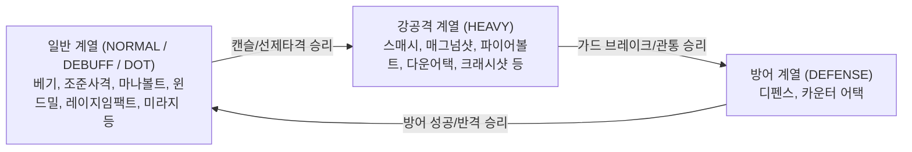
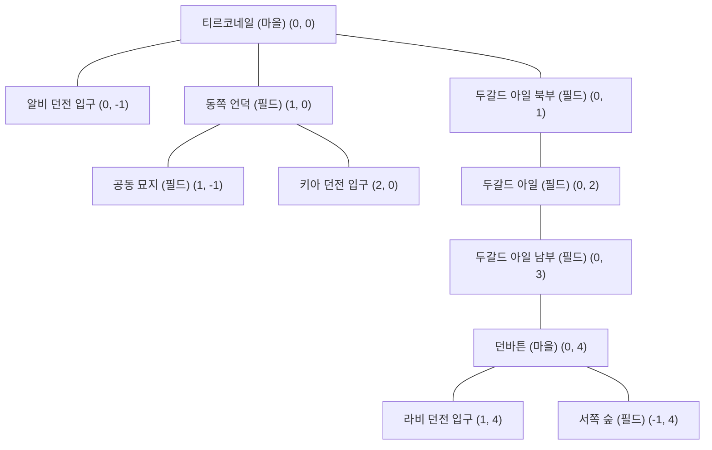

# ⚔️ MyRPG — 종합 게임 시스템 가이드 (Game System Guide)

> **이 문서는 MyRPG의 전체 게임 시스템, 수식, 밸런스 공식, 데이터 테이블을 정리한 개발자 및 사용자용 종합 게임 가이드입니다.**  
> 모든 수치와 규칙은 현재 Java 소스코드 및 `src/main/resources/data/*.json` 데이터에 기반하여 현행화되었습니다.

---

## 📌 목차
1. [게임 개요 및 아키텍처](#1-게임-개요-및-아키텍처)
2. [계정 & 캐릭터 성장 시스템](#2-계정--캐릭터-성장-시스템)
3. [전투 시스템 & 데미지 메커니즘](#3-전투-시스템--데미지-메커니즘)
4. [스킬 시스템 & 승급 체계 (28종 전체)](#4-스킬-시스템--승급-체계-28종-전체)
5. [아이템, 장비 & 무기 세트 스왑 시스템](#5-아이템-장비--무기-세트-스왑-시스템)
6. [경제 & 마을 편의시설](#6-경제--마을-편의시설)
7. [월드 맵 & NPC 도감](#7-월드-맵--npc-도감)
8. [몬스터 & 전리품 도감](#8-몬스터--전리품-도감)
9. [프로시저럴 던전 탐험 시스템](#9-프로시저럴-던전-탐험-시스템)

---

## 1. 게임 개요 및 아키텍처

MyRPG는 **마비노기(Mabinogi)의 클래식한 감성과 시스템(가위바위보 심리전 전투, 스킬 랭크업, 장비 내구도 및 수리, 24시간 환생, 무기 세트 I/II 스왑, 절차적 던전 탐험 등)**을 웹 환경에 맞춰 턴제로 재해석한 RPG 게임입니다.

- **백엔드**: Java 21, Spring Boot 4.0, Spring Data JPA, H2 Database (File-based: `data/myrpg`)
- **프론트엔드/UI**: 모바일 세로모드(360~480px) 100% 최적화, 앤틱 골드 다크 판타지 테마, Thymeleaf Fragment 스왑, Vanilla CSS/JS, Lucide Icons, SPA 형태의 실시간 DOM 부분 갱신
- **핵심 아키텍처 철학**:
  - **계정 기반 데이터 격리**: 다중 사용자 계정(`UserAccount`) 및 세션 기반 캐릭터/인벤토리/전투/던전 데이터 완벽 분리
  - **결정적 도메인 로직**: 전투 데미지 계산, 상성 판정, 스탯 성장 등 순수 도메인 엔진(`BattleResolver`, `StatProgression`, `SkillRankPolicy`) 분리
  - **데이터 주도 설계 (Data-Driven)**: 아이템, 스킬, 몬스터, 맵, NPC, 던전 정보의 JSON 외부화 (`src/main/resources/data/*.json`)

---

## 2. 계정 & 캐릭터 성장 시스템

### 2.1. 계정 및 캐릭터 생성
- **계정 시스템 (`UserAccount`, `AuthService`)**: 사용자별 고유 아이디/비밀번호로 로그인하며, 계정당 독립된 캐릭터 진행 데이터(`CharacterProgress`)와 인벤토리(`OwnedItem`), 전투 상태(`BattleState`), 던전 인스턴스(`DungeonProgressEntity`)가 보장됩니다.
- **신규 캐릭터 기본 지급품**:
  1. **기본 스킬 4종 (F랭크)**:
     - 근접: `베기(slash)` F랭크
     - 원거리: `조준 사격(aimed_shot)` F랭크
     - 마법: `마나 볼트(mana_bolt)` F랭크
     - 공용: `디펜스(defense)` F랭크
  2. **기본 착용 장비 6종 (내구도 20/20)**:
     - `초보자용 한손검`, `초보자용 방패`, `초보자용 갑옷`, `초보자용 투구`, `초보자용 장갑`, `초보자용 부츠`
  3. **인벤토리 보유(미장착) 무기 4종 (내구도 20/20)**:
     - `초보자용 양손검`, `초보자용 활`, `초보자용 완드`, `초보자용 스태프`
  4. **기본 소비 포션 3종 (각 5개씩)**:
     - `생명력 30 포션` 5개, `마나 30 포션` 5개, `스태미나 30 포션` 5개
  5. **초기 상태**:
     - 레벨: Lv 1, 누적 레벨: 1, 경험치: 0, 소지금: 0G, 시작 위치: 티르코네일 (`tir-chonaill`)

---

### 2.2. 바이탈 (Vital) & 5대 스탯 (Stats)
캐릭터는 3가지 기본 바이탈과 5가지 스탯을 보유합니다.

| 항목 | 구분 | 설명 |
|---|---|---|
| **HP (생명력)** | Vital | 0이 되면 사망하며 티르코네일로 리스폰 |
| **MP (마나)** | Vital | 마법 스킬(마나 볼트, 파이어볼트, 힐링, 마나 실드 등) 사용 시 소모 |
| **Stamina (스태미나)** | Vital | 근접/활/방어 스킬(베기, 스매시, 조준사격, 디펜스 등) 사용 시 소모 |
| **STR (근력)** | Stat | 근접 무기 착용 시 공격력 결정의 기본 스탯 |
| **DEX (솜씨)** | Stat | 활 무기 착용 시 공격력 결정의 기본 스탯 |
| **INT (지력)** | Stat | 완드/스태프 착용 시 마법 공격력 결정의 기본 스탯 |
| **DEF (방어력)** | Stat | 피격 시 정액 감산(Subtractive)으로 데미지를 경감 |
| **Critical (치명타)** | Stat | 공격/반격 시 1.5배 치명타 발동 확률 (`0.1%` 단위 정수, 예: 50 = 5.0%) |

---

### 2.3. 3대 재능 (Talent Type)
캐릭터 생성 및 환생 시 3가지 재능 중 하나를 선택할 수 있습니다.

| 재능 (`TalentType`) | 주 스탯 성장 | 보조 성장 | 재능 일치 보너스 | 공격력 계수 | 고유 특성 |
|---|---|---|---|---|---|
| **근접전투 (`MELEE`)** | STR +2 / Lv | HP +5 / Lv | 근접 스킬 데미지 +10% | **1.00** | 균형 잡힌 안정적인 근접 전투 |
| **활 (`ARCHERY`)** | DEX +2 / Lv | 치명타 +0.1%p / Lv | 원거리 스킬 데미지 +10% | **0.85** | **전투 1턴 무조건 100% 선제공격 (1st Strike)** |
| **마법 (`MAGIC`)** | INT +2 / Lv | MP +5 / Lv | 마법 스킬 데미지 +10% | **1.20** | 강력한 깡뎀 배율, **10% 캐스팅 실패 확률** |

---

### 2.4. 레벨별 스탯 성장 공식 (`StatProgression`)
캐릭터의 기본 기저 스탯은 저장되지 않고 레벨과 재능으로부터 매번 실시간 계산됩니다 (장비 및 스킬 랭크업 누적 보너스 별도 가산).

$$\text{STR} = 10 + 3 \times (\text{Lv} - 1) + (\text{MELEE 선택 시 } 2 \times (\text{Lv} - 1))$$
$$\text{DEX} = 10 + 3 \times (\text{Lv} - 1) + (\text{ARCHERY 선택 시 } 2 \times (\text{Lv} - 1))$$
$$\text{INT} = 10 + 3 \times (\text{Lv} - 1) + (\text{MAGIC 선택 시 } 2 \times (\text{Lv} - 1))$$
$$\text{DEF} = 5 + 1 \times (\text{Lv} - 1)$$
$$\text{Critical} = 50 + 3 \times (\text{Lv} - 1) + (\text{ARCHERY 선택 시 } 1 \times (\text{Lv} - 1)) \quad [0.1\% \text{ 단위}]$$
$$\text{HP Max} = 100 + 10 \times (\text{Lv} - 1) + (\text{MELEE 선택 시 } 5 \times (\text{Lv} - 1))$$
$$\text{MP Max} = 100 + 10 \times (\text{Lv} - 1) + (\text{MAGIC 선택 시 } 5 \times (\text{Lv} - 1))$$
$$\text{Stamina Max} = 100 + 10 \times (\text{Lv} - 1)$$

#### 레벨별 기저 스탯 기준표 (재능/장비/스킬 보너스 제외 순수 기저값)
| 레벨 (Lv) | 주스탯 (STR/DEX/INT) | 방어력 (DEF) | 바이탈 기본 (HP/MP/Stamina) | 치명타 (Critical) |
|---|---|---|---|---|
| **Lv 1** | 10 | 5 | 100 | 5.0% (50) |
| **Lv 10** | 37 | 14 | 190 | 7.7% (77) |
| **Lv 30** | 97 | 34 | 390 | 13.7% (137) |
| **Lv 50** | 157 | 54 | 590 | 19.7% (197) |
| **Lv 100 (최대)** | 307 | 104 | 1090 | 34.7% (347) |

---

### 2.5. 경험치 곡선, 사망 및 24시간 환생 시스템
- **경험치 곡선 (`ExperiencePolicy`)**:
  $$\text{다음 레벨 필요 경험치} = 100 \times \text{현재 레벨}^2$$
  *(예: Lv 1 $\rightarrow$ Lv 2: 100 EXP, Lv 10 $\rightarrow$ Lv 11: 10,000 EXP, Lv 50 $\rightarrow$ Lv 51: 250,000 EXP)*
- **레벨업 보상**: 레벨당 **AP (어빌리티 포인트) +1** 지급 및 바이탈(HP/MP/Stamina) 100% 완전 회복
- **사망 패널티 (`die`)**:
  - 현재 레벨 다음 필요 경험치의 **10% 차감** (0 미만으로 내려가지 않음, 레벨 다운 없음)
  - 소지 골드 및 보유 아이템 **100% 보존**
  - 바이탈(HP/MP/Stamina) 100% 풀 회복 후 시작 마을인 **티르코네일로 강제 귀환(리스폰)**
- **환생 시스템 (`Rebirth`)**:
  - **쿨다운**: 마지막 환생 시점 기준 **24시간** (첫 환생은 즉시 가능)
  - **효과**: 현재 레벨 Lv 1 / 현재 EXP 0으로 리셋, **누적 레벨 +1, AP +1 지급**, 재능(Talent) 재선택 가능
  - **보존**: 스킬 랭크 및 수련치, 인벤토리/은행 골드/장비는 영구 유지

---

## 3. 전투 시스템 & 데미지 메커니즘

### 3.1. 확장 가위바위보 상성 (RPS: Rock-Paper-Scissors)
MyRPG의 전투는 매 턴 플레이어와 몬스터가 행동을 선택하여 맞부딪히는 상성 턴제 구조입니다.



---

### 3.2. 9칸 상성 매트릭스 상세 판정 규칙 (`BattleResolver`)

| 플레이어 행동 | 몬스터 행동 | 상성 결과 | 플레이어 피해 (몬스터 $\rightarrow$ 플레이어) | 몬스터 피해 (플레이어 $\rightarrow$ 몬스터) | 상세 판정 규칙 |
|---|---|---|---|---|---|
| **일반 계열** | **일반 계열** | DRAW (무승부) | 몬스터 공격력의 **50%** | 플레이어 스킬 배율의 **50%** (멀티히트 분할) | 서로 맞부딪혀 50% 피해 교환 |
| **일반 계열** | **강공격 (HEAVY)** | **WIN (승리)** | **0 (피해 없음)** | 플레이어 스킬 배율의 **100%** | 일반 공격이 강공격 준비 동작을 캔슬 |
| **일반 계열** | **방어 (DEFENSE)** | **LOSE (패배)** | 몬스터 반격 피해 (일반 30%, 보스 50%) | 경감률 적용 후 잔여 피해 (일반 60%, 보스 40%) | 몬스터 방어에 막혀 피해 경감 + 적 반격 피격 (다음 턴 몬스터 선제권) |
| **강공격 (HEAVY)** | **일반 계열** | **LOSE (패배)** | 몬스터 공격력의 **100%** | **0 (피해 없음)** | 일반 공격에 캔슬당해 공격 실패 |
| **강공격 (HEAVY)** | **강공격 (HEAVY)** | DRAW (무승부) | 몬스터 강공격(150%)의 **50%** | 플레이어 스킬 배율의 **50%** | 서로 강하게 맞부딪힘 |
| **강공격 (HEAVY)** | **방어 (DEFENSE)** | **WIN (승리)** | **0 (반격 무효)** | 플레이어 스킬 배율의 **100% (완전 관통)** | 방어를 통째로 부수고 100% 관통 데미지 |
| **디펜스 (`defense`)** | **일반 계열** | **WIN (승리)** | **0 (100% 완전 방어)** | **0 (반격 없음)** | 일반 공격을 완벽히 방어 (스태미나 소모 5$\rightarrow$1, 다음 턴 플레이어 선제권 획득) |
| **디펜스 (`defense`)** | **강공격 (HEAVY)** | **LOSE (패배)** | 몬스터 강공격(150%) **100% 관통 피격** | **0 (반격 없음)** | 디펜스가 깨지며 강공격 피해를 전부 받음 |
| **디펜스 (`defense`)** | **방어 (DEFENSE)** | DRAW (교착) | **0** | **0** | 서로 방어 자세로 대치 (0 피해) |
| **카운터 (`counter_attack`)** | **일반 계열** | **WIN (승리)** | **0 (100% 완전 회피)** | **상대 공격력의 90%~160% 반격** | 상대 공격을 흘려내며 적 공격력 비례 반격 (치명타 보너스 최대 +100%p) |
| **카운터 (`counter_attack`)** | **강공격 (HEAVY)** | **WIN (승리)** | **0 (100% 완전 회피)** | **상대 공격력의 90%~160% 반격** | 몬스터 스매시도 완벽히 흘려내어 카운터 반격 |
| **카운터 (`counter_attack`)** | **방어 (DEFENSE)** | DRAW (교착) | **0** | **0** | 서로 대치 상태 (헛방 교착) |

---

### 3.3. 데미지 계산 공식 (Subtractive Damage Formula)

전투 데미지는 **감산형(방어력 차감) + 최소 1 보장 + 독립 다단 히트** 방식을 따릅니다.

#### 1단계: 플레이어 공격력 산출 (`BattleService`)
$$\text{공격력} = \text{round}(\text{주스탯} \times \text{재능계수})$$
- **주스탯** = 레벨 기본 스탯 + 장착 장비 보너스 + 스킬 랭크업 영구 누적 보너스 + 패시브 스킬 보너스
  - 근접 스킬 / 무기 미착용: **STR** 기반
  - 활 스킬 착용: **DEX** 기반
  - 마법 스킬 착용: **INT** 기반
- **재능계수**: 근접(MELEE) 1.00 / 활(ARCHERY) 0.85 / 마법(MAGIC) 1.20 (공용 스킬은 1.00)

#### 2단계: 히트(Hit)별 기본 피해
$$\text{기본 피해(히트)} = \max\left(1, \left\lfloor \frac{\text{공격력} \times \text{히트당 배율\%}}{100} \right\rfloor - \text{대상 방어력(DEF)}\right)$$
*(단, `defensePierce`가 적용된 스킬(라이트닝 로드 등)은 대상 방어력을 0으로 계산합니다.)*

#### 3단계: 상성 및 크리티컬 보정
$$\text{보정 피해(히트)} = \text{기본 피해} \times \text{상성계수} \times (\text{크리티컬 발동 ? } 1.5 : 1.0)$$
- **상성계수**: 승리 1.0 / 무승부 0.5 / 패배 0.0 (또는 방어 경감률 잔여분 `1 - blockRate%`)
- **재능 일치 보너스**: 사용하는 스킬의 계열(`SkillTalent`)이 캐릭터의 선택 재능(`TalentType`)과 일치할 경우 **최종 데미지 +10% 가산**
- **크리티컬 판정**: `0 ~ 999` 난수 < `(캐릭터 Critical + 스킬 CritBonus)` 일 때 발동 $\rightarrow$ **1.5배 (💥)**

#### 4단계: 최종 난수 편차 (Variance) 및 합산
$$\text{히트 피해} = \max(1, \text{round}(\text{보정 피해} \times \text{rand}(0.90 \sim 1.10)))$$
$$\text{최종 피해} = \sum_{i=1}^{\text{hitCount}} \text{히트 피해}_i$$

> **다단 히트 (`hitCount` $\ge$ 2)의 특성**:  
> 대상 방어력이 **히트마다 매번 차감**되므로, 방어력이 높은 몬스터에게는 단타 강공격(스매시, 매그넘샷 등)이 유리하고, 방어력이 낮은 몬스터에게는 다단 히트(윈드밀 3타, 애로우 리볼버 4타, 헤일스톰 8타 등)가 안정적이고 높은 총합 데미지를 냅니다.

---

### 3.4. 특수 스킬 메커니즘 & 전투 전조 시스템
MyRPG는 단순 공격/방어 외에 6가지 특수 전투 메커니즘을 지원합니다:

1. **전조(Intent) 시스템 & 대기(Standby) 페이즈**:
   - 몬스터는 매 턴 행동(일반 34%, 강공격 33%, 방어 33%)을 준비하며, 플레이어 화면에 몬스터의 의도/전조가 표시되어 전략적 대응이 가능합니다.
2. **선제권 (Preemptive Party)**:
   - **디펜스 성공**: 일반 공격을 디펜스로 막아내면 다음 턴 플레이어가 100% 선제 공격권을 획득합니다.
   - **방어에 막힘**: 플레이어의 일반 공격이 몬스터 방어에 막히면 다음 턴 몬스터가 선제 공격권을 가져갑니다.
   - **활 1턴 선제 타격 (1st Strike)**: 활을 장착한 캐릭터는 첫 1턴 상성과 무관하게 100% 무조건 먼저 명중합니다.
3. **피해 증폭 디버프 (`DEBUFF`) — 레이지 임팩트**:
   - 적중 시 다음 턴 플레이어의 근접/원거리 공격 피해가 **30% 증폭**됩니다.
4. **군중 제어 (`CC`) — 스파이더 샷, 아이스 스피어**:
   - 성공 시 적을 1턴간 **속박/빙결** 상태로 만들어 적의 행동을 무력화시킵니다.
5. **지속 피해 (`DOT`) — 미라지 미사일**:
   - 공격력 비례 즉발 피해(30%)를 준 뒤, **3턴 동안 매 턴 공격력 비례 트루 데미지(16%~40%)**를 지속적으로 입힙니다.
6. **마나 보호막 (`BUFF`) — 마나 실드**:
   - 시전 후 5턴 동안 피격 피해의 **50%~85%를 생명력 대신 마나로 흡수**합니다.
7. **결전 궁극기 (`ULTIMATE`) — 파이널 히트 / 파이널 샷 / 메테오 스트라이크**:
   - 전투 승리를 누적(F랭크 30승 $\rightarrow$ MASTER 10승)하여 게이지를 채운 뒤 시전하며, **100% 선제 발동 및 압도적 피해**를 입힙니다.
8. **마법 캐스팅 실패 & 무기 내구도 소모**:
   - 마법 공격 스킬은 10% 확률로 캐스팅에 실패하여 0 피해를 입히고 일방 피격당합니다.
   - 공격 스킬을 사용할 때마다 무기 내구도가 **0.05** 감소하며, 내구도가 0이 되면 전투 중 자동으로 장착 해제됩니다.
9. **전투 중 무기 스왑 & 도망 (`Flee`)**:
   - 전투 대기 페이즈 중 **무기 슬롯 I / II 스왑 버튼**으로 즉시 무기/방패 세트를 교체할 수 있습니다.
   - 도망은 50% 확률로 성공하며 실패 시 몬스터에게 1회 일방 공격을 받습니다.

---

## 4. 스킬 시스템 & 승급 체계 (28종 전체)

### 4.1. 스킬 랭크 체계 (16단계, 승급 15구간)
모든 스킬은 `F` 랭크에서 시작하여 `MASTER`까지 총 **16개 랭크**로 승급합니다.

$$\text{F} \rightarrow \text{E} \rightarrow \text{D} \rightarrow \text{C} \rightarrow \text{B} \rightarrow \text{A} \rightarrow \text{9} \rightarrow \text{8} \rightarrow \text{7} \rightarrow \text{6} \rightarrow \text{5} \rightarrow \text{4} \rightarrow \text{3} \rightarrow \text{2} \rightarrow \text{1} \rightarrow \text{MASTER}$$

---

### 4.2. 랭크업 요구치 및 AP 비용 테이블 (`SkillRankPolicy`)
다음 랭크로 승급하려면 **사용 횟수**, **막타 처치 횟수**, **소모 AP**를 만족해야 합니다.  
*(단, DEFENSE, RECOVERY, ULTIMATE, BUFF, CC, DOT, PASSIVE 스킬은 처치 횟수 조건이 영구 면제됩니다.)*

| 승급 구간 | 필요 사용 횟수 | 필요 처치 횟수 (직접 타격기) | 소모 AP | 누적 소모 AP |
|---|---|---|---|---|
| **F $\rightarrow$ E** | 5회 | 1회 | **1 AP** | 1 AP |
| **E $\rightarrow$ D** | 10회 | 3회 | **2 AP** | 3 AP |
| **D $\rightarrow$ C** | 20회 | 6회 | **3 AP** | 6 AP |
| **C $\rightarrow$ B** | 35회 | 10회 | **4 AP** | 10 AP |
| **B $\rightarrow$ A** | 60회 | 18회 | **5 AP** | 15 AP |
| **A $\rightarrow$ 9** | 100회 | 30회 | **7 AP** | 22 AP |
| **9 $\rightarrow$ 8** | 160회 | 48회 | **9 AP** | 31 AP |
| **8 $\rightarrow$ 7** | 240회 | 72회 | **11 AP** | 42 AP |
| **7 $\rightarrow$ 6** | 350회 | 105회 | **13 AP** | 55 AP |
| **6 $\rightarrow$ 5** | 520회 | 155회 | **15 AP** | 70 AP |
| **5 $\rightarrow$ 4** | 760회 | 230회 | **18 AP** | 88 AP |
| **4 $\rightarrow$ 3** | 1,100회 | 340회 | **22 AP** | 110 AP |
| **3 $\rightarrow$ 2** | 1,600회 | 500회 | **26 AP** | 136 AP |
| **2 $\rightarrow$ 1** | 2,500회 | 750회 | **30 AP** | 166 AP |
| **1 $\rightarrow$ MASTER** | 5,000회 | 1,500회 | **34 AP** | **200 AP** |

---

### 4.3. 스킬 랭크업 영구 패시브 보너스 (`SkillRankupBonus`)
스킬 랭크가 오를 때마다 캐릭터에게 영구적인 스탯 보너스가 누적 지급됩니다.

- **디펜스 (`defense`)**: 랭크당 **DEF +1, HP +5** (MASTER 달성 시 누적 **DEF +15, HP +75**)
- **근접 공격 스킬 (베기, 스매시, 윈드밀, 배쉬, 다운어택, 레이지임팩트, 파이널히트)**: 랭크당 **STR +1** (MASTER 시 각 STR +15)
- **원거리 공격 스킬 (조준사격, 매그넘샷, 애로우 리볼버, 서포트샷, 크래시샷, 스파이더샷, 미라지미사일, 파이널샷)**: 랭크당 **DEX +1** (MASTER 시 각 DEX +15)
- **마법 공격 스킬 (마나볼트, 파이어볼트, 아이스볼트, 라이트닝볼트, 파이어볼, 썬더, 아이스스피어, 메테오, 헤일스톰, 라이트닝로드, 힐링, 마나실드)**: 랭크당 **INT +1** (MASTER 시 각 INT +15)

---

### 4.4. 전체 28종 스킬 상세 카탈로그 (`skill.json`)

#### 1. 근접전투 스킬 (7종)
| 스킬명 (ID) | 타입 | 타수 | 자원 소모 | F랭크 수치 | MASTER 수치 | 크리/특수 효과 |
|---|---|---|---|---|---|---|
| **베기** (`slash`) | NORMAL | 1타 | Stamina 7 | 90% | **170%** | 기본 근접 베기 |
| **윈드밀** (`windmill`) | NORMAL | 3타 | Stamina 7 | 타당 35% (총105%) | 타당 65% (**총195%**) | 3연속 광역 회전 베기 |
| **배쉬** (`bash`) | NORMAL | 3~5타 | Stamina 8 | 타당 25% (총75~125%) | 타당 45% (**총135~225%**) | 3~5회 연속 연타 공격 |
| **스매시** (`smash`) | HEAVY | 1타 | Stamina 10 | 130% | **250%** | **크리 +8.0%p**, 디펜스 관통 일격 |
| **다운 어택** (`down_attack`) | HEAVY | 1타 | Stamina 12 | 140% | **260%** | **크리 +10.0%p**, 도약 강타 |
| **레이지 임팩트** (`rage_impact`) | DEBUFF | 1타 | Stamina 10 | 60% | **120%** | **다음 공격 피해 30% 증폭** |
| **파이널 히트** (`final_hit`) | ULTIMATE | 6타 | Stamina 20 | 타당 40% (총240%) | 타당 70% (**총420%**) | **결전 궁극기**, 쿨다운 승리 30$\rightarrow$10회, 크리 +10.0%p |

#### 2. 궁술(원거리) 스킬 (8종)
| 스킬명 (ID) | 타입 | 타수 | 자원 소모 | F랭크 수치 | MASTER 수치 | 크리/특수 효과 |
|---|---|---|---|---|---|---|
| **조준 사격** (`aimed_shot`) | NORMAL | 1타 | Stamina 7 | 90% | **170%** | 기본 원거리 저격 사격 |
| **애로우 리볼버** (`arrow_revolver`) | NORMAL | 4타 | Stamina 7 | 타당 27% (총108%) | 타당 50% (**총200%**) | 4연속 화살 속사 |
| **서포트 샷** (`support_shot`) | NORMAL | 1타 | Stamina 4 | 70% | **130%** | **크리 +6.0%p**, 저비용 견제 사격 |
| **매그넘 샷** (`magnum_shot`) | HEAVY | 1타 | Stamina 10 | 140% | **260%** | **크리 +10.0%p**, 최고 배율 관통 사격 |
| **크래시 샷** (`crash_shot`) | HEAVY | 3~5타 | Stamina 10 | 타당 40% (총120~200%) | 타당 65% (**총195~325%**) | **크리 +2.0%p**, 3~5회 연쇄 파편 폭발 |
| **스파이더 샷** (`spider_shot`) | CC | 0타 | Stamina 8 | 성공률 20% | **성공률 50%** | **1턴간 적 행동불능 (속박)** |
| **미라지 미사일** (`mirage_missile`) | DOT | 1타+DoT | Stamina 10 | 직격 30% + 턴당 16% (3턴) | 직격 30% + **턴당 40% (3턴)** | **총합 150% 독 지속 피해** (공격력 비례 트루뎀) |
| **파이널 샷** (`final_shot`) | ULTIMATE | 7타 | Stamina 20 | 타당 35% (총245%) | 타당 60% (**총420%**) | **결전 궁극기**, 쿨다운 승리 30$\rightarrow$10회, 크리 +10.0%p |

#### 3. 마법 스킬 (11종)
| 스킬명 (ID) | 타입 | 타수 | 자원 소모 | F랭크 수치 | MASTER 수치 | 크리/특수 효과 |
|---|---|---|---|---|---|---|
| **마나 볼트** (`mana_bolt`) | NORMAL | 1타 | MP 7 | 90% | **170%** | 기본 무속성 마법 탄환 |
| **아이스볼트** (`icebolt`) | NORMAL | 3타 | MP 7 | 타당 35% (총105%) | 타당 65% (**총195%**) | 3연속 냉기 얼음 화살 |
| **라이트닝볼트** (`lightningbolt`) | NORMAL | 4타 | MP 8 | 타당 28% (총112%) | 타당 52% (**총208%**) | 4연속 전격 방전 |
| **파이어볼트** (`firebolt`) | HEAVY | 1타 | MP 10 | 130% | **250%** | 단일 강공격 화염구 |
| **파이어볼** (`fireball`) | HEAVY | 1타 | MP 20 | 200% | **350%** | 압도적 위력의 중급 화염 대폭발 |
| **썬더** (`thunder`) | HEAVY | 3~5타 | MP 20 | 타당 50% (총150~250%) | 타당 75% (**총225~375%**) | 3~5줄기 중급 벼락 낙하 |
| **아이스 스피어** (`ice_spear`) | HEAVY | 2타 | MP 20 | 타당 80% (총160%) | 타당 140% (**총280%**) | **1턴간 적 완전 빙결 (행동불능)** |
| **헤일스톰** (`hailstorm`) | HEAVY | 8타 | MP 30 | 타당 35% (총280%) | 타당 55% (**총440%**) | 거대 우박 8발 기관총 난사 |
| **라이트닝 로드** (`lightning_rod`) | HEAVY | 1타 | MP 30 | 220% | **400%** | **적 방어력 100% 관통 (DEF 무시)** |
| **힐링** (`healing`) | RECOVERY | - | MP 12$\rightarrow$6 | HP +30 회복 | **HP +240 회복** | 생명력 즉시 회복 (처치수련 면제) |
| **마나 실드** (`mana_shield`) | BUFF | - | MP 15 | 피해 50% MP 흡수 | **피해 85% MP 흡수** | 5턴간 피격 피해 마나 전환 (처치수련 면제) |
| **메테오 스트라이크** (`meteor_strike`) | ULTIMATE | 1타 | MP 40 | 300% | **550%** | **결전 궁극기**, 쿨다운 승리 30$\rightarrow$10회, 크리 +10.0%p |

#### 4. 공용 및 방어 스킬 (2종)
| 스킬명 (ID) | 타입 | 자원 소모 | F랭크 수치 | MASTER 수치 | 크리/특수 효과 |
|---|---|---|---|---|---|
| **디펜스** (`defense`) | DEFENSE | Stamina 5$\rightarrow$1 | 70% 방어 / 0 반격 | **95% 방어 / 0 반격** | 일반 공격 방어 성공 시 다음 턴 선제권 획득, 영구 DEF/HP 상승 |
| **카운터 어택** (`counter_attack`) | DEFENSE | Stamina 8 | 100% 회피 / **90% 반격** | 100% 회피 / **160% 반격** | 적 공격력 비례 반격, 크리 보너스 +0%p $\rightarrow$ **+10.0%p** |

#### 5. 영구 패시브 스킬 (6종)
| 스킬명 (ID) | 계열 | 영구 스탯 총합 보너스 | 설명 |
|---|---|---|---|
| **컴뱃 마스터리** (`combat_mastery`) | 근접 | **STR +20, HP +50** | 근접 전투 기본기 연마 |
| **레인지 컴뱃 마스터리** (`range_combat_mastery`) | 궁술 | **DEX +20, Stamina +50** | 원거리 궁술 숙달 |
| **매직 마스터리** (`magic_mastery`) | 마법 | **INT +20, MP +50** | 마나 흐름 이해 및 최대 마나 상승 |
| **실드 마스터리** (`shield_mastery`) | 공용 | **DEF +15, HP +60** | 방패 및 방어구 활용 극대화 |
| **메디테이션** (`meditation`) | 마법 | **MP +30, MP 자연회복 +5 / 턴** | 깊은 명상으로 매 턴 마나 자연 회복 |
| **크리티컬 히트** (`critical_hit`) | 공용 | **치명타 +10.0%p (+100)** | 모든 공격의 치명타 확률 영구 상승 |

---

## 5. 아이템, 장비 & 무기 세트 스왑 시스템

### 5.1. 장비 슬롯 6종 및 무기 세트 I / II 스왑 시스템
캐릭터는 6개의 장착 슬롯과 **무기 세트 I / II 페어 스왑 시스템**을 지원합니다:

```
[무기 슬롯 I]  주손: 숏소드         +  보조손: 라운드 실드
      ↕ (원터치 스왑)
[무기 슬롯 II] 주손: 숏보우         +  보조손: (빈손)
```

1. `MAIN_HAND` (주무기)
2. `OFF_HAND` (보조무기 / 방패)
3. `ARMOR_BODY` (갑옷)
4. `HELMET` (투구)
5. `GLOVES` (장갑)
6. `BOOTS` (부츠)

- **무기 세트 I / II 페어 스왑 (`CharacterProgress`, `InventoryService`)**:
  - `CharacterProgress`에 `activeWeaponSet(1 or 2)`, `weapon1MainId`, `weapon1OffId`, `weapon2MainId`, `weapon2OffId`가 영속 저장됩니다.
  - 인벤토리 장비창 탭 전환 및 전투 UI 스왑 버튼 클릭 시, **주무기와 보조무기(방패)가 한 세트로 동시에 스왑/복원**됩니다.
  - 빈손(맨손) 상태로의 스왑도 정상 지원되며, 장비 장착 픽커(Picker) 모달에서는 타 세트에 이미 배정된 무기는 후보에서 자동 제외되어 충돌을 방지합니다.
- **양손 무기 규칙**: 양손검, 활, 스태프는 `MAIN_HAND`와 `OFF_HAND`를 동시에 점유하므로 방패를 함께 장착할 수 없습니다.
- **한손 무기 규칙**: 한손검, 단검, 완드는 `MAIN_HAND`만 점유하여 `OFF_HAND`에 방패(`shield`)를 병용할 수 있습니다.
- **보관함 용량**: 인벤토리 최대 **30칸**, 은행 금고 최대 **30칸** (포션류는 무제한 스택 누적)

---

### 5.2. 전체 장비 & 소비 아이템 도감 (`item.json`)

#### 소비형 포션
| 아이템명 (ID) | 타입 | 회복 효과 | 상점 구매가 | 판매가 |
|---|---|---|---|---|
| **생명력 30 포션** (`hp_potion_30`) | Potion | HP +30 회복 | 50 Gold | 25 Gold |
| **마나 30 포션** (`mp_potion_30`) | Potion | MP +30 회복 | 50 Gold | 25 Gold |
| **스태미나 30 포션** (`stamina_potion_30`) | Potion | Stamina +30 회복 | 50 Gold | 25 Gold |

#### 무기류 (Weapon)
| 아이템명 (ID) | 종류 | 슬롯 점유 | 스탯 보너스 | 내구도 | 구매가 | 판매가 / 수리비 |
|---|---|---|---|---|---|---|
| **초보자용 한손검** (`beginner_one_hand_sword`) | 한손검 | 주손 | STR +5 | 20 | 지급/드랍 | 50 Gold |
| **목검** (`wooden_blade`) | 한손검 | 주손 | STR +3 | 10 | 80 Gold | 40 Gold |
| **단검** (`dagger`) | 한손검 | 주손 | STR +4, 치명타 +6.0%p | 25 | 150 Gold | 75 Gold |
| **숏소드** (`short_sword`) | 한손검 | 주손 | STR +8 | 15 | 300 Gold | 150 Gold |
| **롱소드** (`long_sword`) | 한손검 | 주손 | STR +12 | 15 | 700 Gold | 350 Gold |
| **브로드소드** (`broadsword`) | 한손검 | 주손 | STR +14, 치명타 +5.0%p | 15 | 1,000 Gold | 500 Gold |
| **바스타드 소드** (`bastard_sword`) | 한손검 | 주손 | STR +18 | 14 | 1,100 Gold | 550 Gold |
| **배틀 소드** (`battle_sword`) | 한손검 | 주손 | STR +20, 치명타 +3.0%p | 18 | 1,500 Gold | 750 Gold |
| **초보자용 양손검** (`beginner_two_hand_sword`) | 양손검 | 양손 | STR +10 | 20 | 지급/드랍 | 100 Gold |
| **초보자용 활** (`beginner_bow`) | 활 | 양손 | DEX +10, 치명타 +1.0%p | 20 | 지급/드랍 | 110 Gold |
| **숏보우** (`short_bow`) | 활 | 양손 | DEX +8, 치명타 +3.0%p | 15 | 350 Gold | 175 Gold |
| **롱보우** (`long_bow`) | 활 | 양손 | DEX +16, 치명타 +5.0%p | 15 | 1,200 Gold | 600 Gold |
| **콤포짓 보우** (`composite_bow`) | 활 | 양손 | DEX +14, 치명타 +8.0%p | 16 | 1,100 Gold | 550 Gold |
| **크로스보우** (`crossbow`) | 활 | 양손 | DEX +15, 치명타 +10.0%p | 15 | 1,300 Gold | 650 Gold |
| **초보자용 완드** (`beginner_wand`) | 완드 | 주손 | INT +5 | 20 | 지급/드랍 | 50 Gold |
| **파이어 완드** (`fire_wand`) | 완드 | 주손 | INT +8 | 15 | 400 Gold | 200 Gold |
| **아이스 완드** (`ice_wand`) | 완드 | 주손 | INT +6, MP +15 | 15 | 400 Gold | 200 Gold |
| **라이트닝 완드** (`lightning_wand`) | 완드 | 주손 | INT +6, 치명타 +4.0%p | 15 | 400 Gold | 200 Gold |
| **피닉스 파이어 완드** (`phoenix_fire_wand`) | 완드 | 주손 | INT +16 | 15 | 1,200 Gold | 600 Gold |
| **크라운 아이스 완드** (`crown_ice_wand`) | 완드 | 주손 | INT +13, MP +30 | 15 | 1,200 Gold | 600 Gold |
| **크리스탈 라이트닝 완드** (`crystal_lightning_wand`) | 완드 | 주손 | INT +13, 치명타 +7.0%p | 15 | 1,200 Gold | 600 Gold |
| **초보자용 스태프** (`beginner_staff`) | 스태프 | 양손 | INT +10 | 20 | 지급/드랍 | 100 Gold |
| **트리니티 스태프** (`trinity_staff`) | 스태프 | 양손 | INT +22, MP +40 | 20 | 2,000 Gold | 1,000 Gold |

#### 방어구류 (Armor)
| 아이템명 (ID) | 부위 | 스탯 보너스 | 내구도 | 구매가 | 판매가 / 수리비 |
|---|---|---|---|---|---|
| **초보자용 방패** (`beginner_shield`) | 보조손 | DEF +5 | 20 | 지급/드랍 | 50 Gold |
| **라운드 실드** (`round_shield`) | 보조손 | DEF +6 | 18 | 300 Gold | 150 Gold |
| **카이트 실드** (`kite_shield`) | 보조손 | DEF +10, HP +20 | 18 | 900 Gold | 450 Gold |
| **초보자용 갑옷** (`beginner_armor`) | 몸체 | DEF +5 | 20 | 지급/드랍 | 50 Gold |
| **라이트 레더 메일** (`light_leather_mail`) | 몸체 | DEF +7 | 18 | 450 Gold | 225 Gold |
| **스터디드 퀴러시어** (`studded_cuirassier`) | 몸체 | DEF +9 | 18 | 600 Gold | 300 Gold |
| **드란도스 레더 메일** (`drandos_leather_mail`) | 몸체 | DEF +12, DEX +6 | 16 | 1,300 Gold | 650 Gold |
| **쓰리 벨트 레더 메일** (`three_belt_leather_mail`) | 몸체 | DEF +12, Stamina +25 | 16 | 1,200 Gold | 600 Gold |
| **멜카 체인 메일** (`melka_chain_mail`) | 몸체 | DEF +14 | 16 | 1,400 Gold | 700 Gold |
| **서코트 체인 메일** (`surcoat_chain_mail`) | 몸체 | DEF +16, HP +30 | 16 | 1,700 Gold | 850 Gold |
| **초보자용 투구** (`beginner_helmet`) | 머리 | DEF +3 | 20 | 지급/드랍 | 30 Gold |
| **퀴러시어 헬름** (`cuirassier_helm`) | 머리 | DEF +4 | 18 | 250 Gold | 125 Gold |
| **링메일 헬름** (`ring_mail_helm`) | 머리 | DEF +6 | 16 | 600 Gold | 300 Gold |
| **크로스 풀 헬름** (`cross_full_helm`) | 머리 | DEF +9 | 16 | 950 Gold | 475 Gold |
| **윙 하프 헬름** (`wing_half_helm`) | 머리 | DEF +7, 치명타 +3.0%p | 16 | 850 Gold | 425 Gold |
| **본 헬름** (`bone_helm`) | 머리 | DEF +7, STR +4 | 16 | 850 Gold | 425 Gold |
| **스파이크 헬름** (`spiked_helm`) | 머리 | DEF +7, Stamina +15 | 16 | 800 Gold | 400 Gold |
| **초보자용 장갑** (`beginner_gloves`) | 손 | DEF +2 | 20 | 지급/드랍 | 20 Gold |
| **가죽 장갑** (`leather_gloves`) | 손 | DEF +3 | 18 | 150 Gold | 75 Gold |
| **코레스 시프 글러브** (`cores_thief_gloves`) | 손 | DEF +2, DEX +3 | 18 | 220 Gold | 110 Gold |
| **로리카 장갑** (`lorica_gloves`) | 손 | DEF +2, Stamina +10 | 18 | 200 Gold | 100 Gold |
| **카운터 건틀렛** (`counter_gauntlet`) | 손 | DEF +5, STR +4 | 16 | 650 Gold | 325 Gold |
| **토크 헌터 글러브** (`tork_hunter_gloves`) | 손 | DEF +4, DEX +5 | 16 | 650 Gold | 325 Gold |
| **울나 프로텍터 글러브** (`ulna_protector_gloves`) | 손 | DEF +4, Stamina +15 | 16 | 600 Gold | 300 Gold |
| **초보자용 부츠** (`beginner_boots`) | 발 | DEF +2 | 20 | 지급/드랍 | 20 Gold |
| **가죽 신발** (`leather_shoes`) | 발 | DEF +3 | 18 | 150 Gold | 75 Gold |
| **헌터 부츠** (`hunter_boots`) | 발 | DEF +2, DEX +3 | 18 | 220 Gold | 110 Gold |
| **컴뱃 슈즈** (`combat_shoes`) | 발 | DEF +3, HP +10 | 18 | 250 Gold | 125 Gold |
| **시프 슈즈** (`thief_shoes`) | 발 | DEF +2, 치명타 +3.0%p | 18 | 250 Gold | 125 Gold |
| **롱 그레이브** (`long_greaves`) | 발 | DEF +6, HP +15 | 16 | 750 Gold | 375 Gold |
| **레더 프로텍터** (`leather_protector`) | 발 | DEF +5, DEX +4 | 16 | 650 Gold | 325 Gold |

---

## 6. 경제 & 마을 편의시설

### 6.1. 상점 판매가 공식 (`ShopService`)
아이템 판매가는 상점 구매가(`buyPrice`) 유무에 따라 결정됩니다:

1. **상점 판매 아이템 (`buyPrice` 존재 시)**:
   $$\text{판매가} = \text{round}(\text{buyPrice} \times 0.5)$$
2. **드랍/초보자 전용 장비 (`buyPrice` 부재 시)**:
   $$\text{판매가} = \sum (\text{스탯 보너스 수치} \times \text{가중치})$$
   *(가중치: 치명타 `CRITICAL` = 1, 그 외 스탯 `STR, DEX, INT, DEF, HP, MP, STAMINA` = 10)*

---

### 6.2. 대장간 수리 시스템 (`RepairController`)
- **수리비**: **1포인트당 수리비 = 해당 아이템의 판매가 (100%)**
- **수리 성공률**: **95%**
- **수리 실패**: 5% 확률로 실패("퍼거스가 손을 삐끗했다... 수리 실패!")하며, 골드만 소모되고 내구도는 증가하지 않습니다.

---

### 6.3. 은행 (`BankService`) & 힐러집 치료 (`HealController`)
- **은행 (던바튼 오스틴)**:
  - 소지금 $\leftrightarrow$ 은행 금고 간 입출금 자유 (수수료 0%, 최소 1G, 한도 무제한)
  - 인벤토리와 별개로 최대 **30칸**의 아이템 보관 금고 지원
- **힐러집 치료 (티르코네일 딜리스 / 던바튼 마누스)**:
  - **비용**: **100 Gold** 고정
  - **효과**: 캐릭터의 **HP, MP, Stamina를 100% 즉시 풀 회복**

---

## 7. 월드 맵 & NPC 도감

### 7.1. 월드 맵 노드 그래프 (`map.json`)



---

### 7.2. 6개 시간대 시스템 (`TimeOfDay`)
인게임 시간대에 따라 NPC 대사와 상황 멘트, 이모지가 동적으로 변화합니다:
1. `🌌 LATE_NIGHT` (심야, 00:00~05:00)
2. `🌅 DAWN` (새벽, 05:00~08:00)
3. `🌄 MORNING` (오전, 08:00~12:00)
4. `☀️ AFTERNOON` (오후, 12:00~16:00)
5. `🌇 LATE_AFTERNOON` (늦은 오후/노을, 16:00~19:00)
6. `🌙 NIGHT` (밤, 19:00~24:00)

---

### 7.3. 마을 NPC 10인 도감 (`npc.json`)

| 마을 | NPC 이름 | 역할 | 취급 물품 / 제공 기능 | 성격 및 특징 |
|---|---|---|---|---|
| **티르코네일** | **던컨** | 촌장 | 마을 안내, 24시간 환생 | 인자하고 현명한 마을의 지도자이자 전직 영웅 |
| **티르코네일** | **퍼거스** | 대장장이 | 초급 무기/방어구 15종 판매, 장비 수리 | 호탕한 대장장이. 가끔 5% 확률로 손이 미끄러짐 |
| **티르코네일** | **라사** | 마법교사 | 기본 속성 완드 3종 판매 | 소심하고 내성적이지만 성실한 마법 교사 |
| **티르코네일** | **레이널드** | 검술교사 | 근접 전투 가이드 | 과장된 몸짓과 낭만을 즐기는 열정적인 검사 |
| **티르코네일** | **딜리스** | 힐러 | 포션 3종 판매, 100G 전액 치료 | 새침하지만 속정이 깊은 치료소 힐러 |
| **던바튼** | **네리스** | 대장장이 | 고급 무기/방어구 22종 판매, 장비 수리 | 시크하고 쿨한 던바튼 명품 무기점 주인 |
| **던바튼** | **마누스** | 힐러 | 포션 3종 판매, 100G 전액 치료 | 건강과 활력을 최우선으로 외치는 유쾌한 힐러 |
| **던바튼** | **스튜어트** | 마법교사 | 고급 완드 3종, 트리니티 스태프 판매 | 지적이지만 덤벙대는 학구파 마법 연구원 |
| **던바튼** | **아란웬** | 무술교사 | 무술 훈련 가이드 | 군인 출신의 엄격하고 강직한 무술 교관 |
| **던바튼** | **오스틴** | 은행원 | 골드 입출금, 30칸 창고 보관함 | 1골드의 오차도 용납하지 않는 철저한 은행원 |

---

## 8. 몬스터 & 전리품 도감

### 8.1. 몬스터 7종 상세 스펙 테이블 (`monster.json`)

| 몬스터명 (ID) | 구분 | 레벨 | HP | 공격력 | 방어력 | 치명타 | 처치 EXP | 드랍 골드 | 드랍 아이템 |
|---|---|---|---|---|---|---|---|---|---|
| **너구리** (`raccoon`) | 일반 | Lv 1 | 38 | 36 | 2 | 2.0% (20) | 16 EXP | 4 ~ 12 Gold | 포션 3종(HP/MP/Stamina 30) 각 15% |
| **붉은 여우** (`red-fox`) | 일반 | Lv 2 | 44 | 38 | 2 | 2.0% (20) | 20 EXP | 5 ~ 13 Gold | 포션 3종(HP/MP/Stamina 30) 각 10% |
| **흰 거미** (`spider`) | 일반 | Lv 2 | 50 | 40 | 2 | 2.0% (20) | 24 EXP | 6 ~ 15 Gold | 포션 3종(HP/MP/Stamina 30) 각 10% |
| **붉은거미** (`red-spider`) | 일반 | Lv 3 | 80 | 50 | 5 | 3.0% (30) | 40 EXP | 12 ~ 25 Gold | 없음 (골드 전용) |
| **고블린** (`goblin`) | 일반 | Lv 3 | 70 | 54 | 3 | 3.0% (30) | 42 EXP | 15 ~ 30 Gold | 없음 (골드 전용) |
| **검은거미** (`black-spider`) | 일반 | Lv 4 | 100 | 56 | 6 | 4.0% (40) | 55 EXP | 20 ~ 45 Gold | 없음 (골드 전용) |
| **👑 거대거미** (`giant-spider`) | **보스** | **Lv 7** | **380** | **72** | **12** | **7.0% (70)** | **350 EXP** | **150 ~ 300 Gold** | **생명력 30 포션 2~3개 (100%)** |

---

## 9. 프로시저럴 던전 탐험 시스템

### 9.1. 절차적 던전 생성 엔진 (`DungeonGenerator`)
MyRPG의 던전은 입장할 때마다 완전히 새로운 격자형 미로가 절차적 알고리즘으로 합성됩니다.

- **주 경로 생성**: (0,0) 시작방에서부터 4방향 **비순환 무작위 행보 (Self-avoiding Random Walk)**로 보스방까지의 최단 경로 생성
- **서브 브랜치 분기**: 주 경로의 방들에서 갈림길(Dead-end Branch)을 확률적으로 뻗어나가 미로 형성
- **알비 던전 생성 파라미터 (`dungeons.json`)**:
  - 시작방 $\leftrightarrow$ 보스방 거리: **정확히 10룸**
  - 총 방 개수: **20 ~ 23룸**
  - 갈림길 분기 확률: **40%** (최대 깊이 3룸)
  - 몬스터 풀: 흰 거미(40%), 붉은거미(25%), 고블린(25%), 검은거미(10%)

```
[입장] (0,0) 시작방 ───→ [안개 미로 탐색 / 턴제 전투] ───→ [10칸 거리] 👑 거대거미 보스방 ───→ [던전 클리어 보상]
```

---

### 9.2. 던전 탐험 & 연쇄 전투 메커니즘 (`DungeonService`)
1. **전장의 안개 (Fog of War)**: 현재 머무는 방과 인접한 방만 미니맵에 밝혀지며 미답사 구역은 어둠에 가려집니다.
2. **이동 제어**:
   - 현재 방에 몬스터가 남아있으면 통로가 봉쇄되어 **앞으로 전진할 수 없습니다** (적 전멸 시 개방).
   - 위험할 경우 **이미 클리어한 이전 방으로의 후퇴(Backtracking)는 언제든 허용**됩니다.
3. **연쇄 전투 (Chain Combat)**:
   - 일반 몬스터 격파 시 **10% 확률**로 *"OO 무리가 추가로 기습해왔다!"* 알림과 함께 즉시 후속 몬스터가 소환되어 **연속 전투**가 이어집니다.
4. **자발적 퇴장**: 시작방((0,0))으로 돌아오면 언제든지 던전 밖(알비 던전 입구)으로 안전하게 퇴장할 수 있습니다.

---

### 9.3. 알비 던전 클리어 보상
보스 👑 거대거미를 토벌하고 던전을 정복하면 즉시 정산 보상이 인벤토리로 지급됩니다:

- **경험치**: **1,000 EXP**
- **골드**: **2,000 Gold**
- **아이템 드랍**:
  - **숏소드**: **20%** 확률로 1개 드랍
  - **생명력 30 포션**: **50%** 확률로 1~3개 드랍
  - **마나 30 포션**: **50%** 확률로 1~3개 드랍
  - **스태미나 30 포션**: **50%** 확률로 1~3개 드랍
